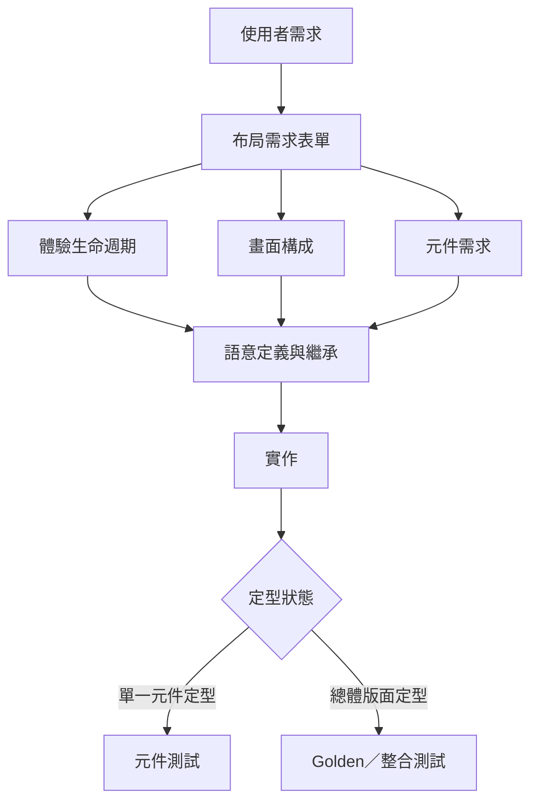

# 設計知識唯一真相來源

`kallopis-design-contract/` 是 Kallopis 與其消費端 UI 工作的語意唯一真相來源。本目錄記錄會影響設計決策的結構化事實；原始碼與截圖是實作證據，不可反向覆蓋尚未確認的需求。

## 權威順序

1. 使用者在當次任務明確確認的內容。
2. 本目錄與 `user-layout-contract.md` 中狀態為 `confirmed` 或已定型的紀錄。
3. Kallopis decision、元件架構文件與實際原始碼，只作為現況與實作脈絡。
4. 截圖、常見慣例與 agent 判斷，只能提出問題，不可建立需求。

當次指示與既有紀錄不同時，先請使用者確認修訂，再同步更新本目錄。目錄外文件若包含新的設計事實，必須先整理進本目錄，不能直接當作驗收依據。

## 知識樹

```text
kallopis-design-contract/
├─ SKILL.md
└─ references/
   ├─ style-preflight.md
   ├─ user-layout-contract.md
   └─ design-knowledge/
      ├─ README.md
      ├─ frontend-architecture.md
      ├─ layout-requirements-form.md
      ├─ experience-lifecycle.md
      ├─ component-requirements.md
      ├─ screen-composition.md
      └─ semantic-inheritance.md
```

## 讀寫路由

| 任務 | 實作前必讀與更新 |
|---|---|
| 任何 Kallopis 前端修改 | `frontend-architecture.md` 與受影響的知識文件 |
| 新 screen、新區域或重大重排 | `layout-requirements-form.md`、`experience-lifecycle.md`、`screen-composition.md`、`semantic-inheritance.md` |
| 新元件或修改元件呈現 | `component-requirements.md`、`semantic-inheritance.md` |
| 修改互動、空狀態、錯誤或完成狀態 | `experience-lifecycle.md`、`component-requirements.md` |
| 修改 token、風格或注入邏輯 | `semantic-inheritance.md`、`style-preflight.md` |
| 使用者建立長期規則 | `user-layout-contract.md` 與受影響的知識文件 |

## 狀態

- `proposed`：已提出但尚未由使用者確認，不可作為實作依據。
- `observed-current`：已由目前原始碼或生成清單查證，但不代表目標設計已定型。
- `architecture-debt`：已查證的分層、API 或文件漂移；只記錄問題，不自動授權重構。
- `confirmed`：使用者已明確確認，可作為實作與驗收依據。
- `frozen-component`：單一元件已定型，允許撰寫該元件測試。
- `frozen-screen`：完整 screen 與體驗流程已定型，允許 golden 與整合測試。
- `superseded`：已由新決策取代，保留來源與替代項目。

沒有紀錄等於未定義。遇到未定義或不同文件互相衝突時，停止實作並向使用者確認。

完整 screen 只有在生命週期所有狀態、畫面樹所有節點、節點使用的全部元件，以及所有引用語意都已登錄且確認後，才能標記為 `frozen-screen`。

## 文件關係


