# 元件需求與繼承

所有新增或被修改的元件，實作前必須先登錄。複雜元件必須列出底層組成；「自訂 Widget」不是足夠的繼承說明。

每個 confirmed screen tree 可到達的全部元件都必須有需求列，包含未在本次修改但會參與體驗的元件。任一節點缺少需求列時，該 screen 不得定型。既有 `docs/architecture/components/` 可協助盤點現況，但不能取代本表的需求與語意。

## Form Input Types 元件登錄

| 元件 ID | 責任 | 輸入 | 輸出／事件 | 狀態 | 幾何 | 語意 | 底層組成 | 所有權 | 定型狀態 |
|---|---|---|---|---|---|---|---|---|---|
| KLP-QUANTITY-FIELD | 以減少／增加按鈕調整受界線約束的數量 | label、value、step、minimum、maximum、enabled、readOnly、error | onChanged | rest／hover／focus／filled／disabled／read-only／error | MD field 40px；兩側 action slot 與 field 等高；高階組裝不直接使用 Flutter UI | SEM-FORM-INPUT-FRAME、SEM-FORM-INPUT-RECIPE-COMPOSITION | KlpInputFrame、KlpRow、KlpExpanded、KlpCenter、KlpText、input action／divider primitives | Kallopis | confirmed |
| KLP-DATE-RANGE-FIELD | 在單一欄位中編輯起訖日期 | label、start／end value、placeholder、enabled、readOnly、error | onStartChanged、onEndChanged、onCalendarPressed | 同上 | MD field 40px；兩個彈性 segment 與固定 separator／action；高階組裝不直接使用 Flutter UI | SEM-FORM-INPUT-FRAME、SEM-FORM-INPUT-RECIPE-COMPOSITION | KlpInputFrame、KlpRow、KlpExpanded、KlpText、input editor／action／divider primitives | Kallopis | confirmed |
| KLP-DATE-FIELD | 呈現可編輯日期文字，或以受控月曆設定切換日期挑選面板 | label、value、placeholder、KlpDateFieldCalendar | onChanged、onDateSelected、previous／next month | text-only／calendar-enabled；collapsed／expanded；selected／disabled date | 欄位沿用 KlpTextField；月曆與欄位間距解析 tight；觸發區使用 KlpGestureRegion 與 KlpPointerBlocker；不接收 raw 外觀值 | SEM-DATE-FIELD-COMPOSITION、SEM-FORM-INPUT-FRAME | KlpColumn、KlpGap、KlpGestureRegion、KlpPointerBlocker、KlpTextField、KlpCalendar | Kallopis | confirmed |
| KLP-AFFIXED-TEXT-FIELD | 在文字輸入旁提供不可編輯前綴與尾端動作 | label、value、prefix、suffix action、enabled、readOnly、error | onChanged、onAction | 同上 | MD field 40px；affix／action 為固定 segment；前綴內距解析 controlInset | SEM-FORM-INPUT-FRAME、SEM-FORM-INPUT-RECIPE-COMPOSITION | KlpInputFrame、KlpRow、KlpBox、KlpExpanded、KlpText、input editor／action／divider primitives | Kallopis | confirmed |
| KLP-COMPOUND-FIELD | 在同一控制框中組合主要文字與受控尾端選項 | label、value、options、selected option、enabled、readOnly、error | onChanged、onOptionSelected | rest／expanded／disabled／readOnly／error；option enabled／disabled | MD field 40px；主 segment 彈性、option segment 依內容；trigger／option 水平內距解析 controlInset，展開間距與 panel padding 解析 tight；不接收 raw 外觀值 | SEM-FORM-INPUT-FRAME、SEM-COMPOUND-FIELD-COMPOSITION | KlpColumn、KlpRow、KlpExpanded、KlpGap、KlpInputFrame、KlpInputEditor、KlpText、Compound trigger／option／panel primitives | Kallopis | confirmed |
| KLP-SELECT-FIELD | 顯示單選值並以就地展開清單選取一個 option | label、valueLabel、options、enabled、readOnly、error | onSelected | rest／hover／focus／expanded／disabled／readOnly／error；option enabled／disabled | trigger 高度、水平內距與 radius 解析 fieldHeight／fieldPaddingX／fieldRadius；清單與錯誤間距解析 tight，option 水平內距解析 controlInset；不接收 raw 外觀值 | SEM-FORM-INPUT-FRAME、SEM-SELECT-FIELD-COMPOSITION | KlpColumn、KlpRow、KlpBox、KlpSurface、KlpExpanded、KlpGap、KlpConstrainedBox、KlpGestureRegion、KlpText、Select trigger primitive | Kallopis | confirmed |
| KLP-MULTI-SELECT-FIELD | 以受控集合呈現可切換的通用選項 | label、KlpChoiceOption、selectedIds、enabled、readOnly、error、onChanged | 點擊可用選項時回傳下一個 Set；停用與唯讀不派送 | selected／unselected；enabled／disabled；editable／readOnly；normal／error | field fill、最小高度、圓角、chip pill、selection 與文字色完整解析 context.klp；高階層只使用 KlpColumn、KlpWrap、KlpGap、KlpText；原生欄位與 chip frame 僅限 form/selection/primitives | SEM-FORM-INPUT-FRAME、SEM-FORM-SELECTION-COMPOSITION | KlpColumn、KlpWrap、KlpGap、KlpText、private multi-select frames | Kallopis | confirmed |
| KLP-PASSWORD-FIELD | 輸入敏感值並切換顯示狀態 | label、value、placeholder、error、enabled、readOnly、required、requirements | onChanged、show／hide | obscured／visible；enabled／disabled；read-only；error；requirement satisfied／pending | 完整沿用 KlpTextField 的 field geometry；label、requirements 與 error 只使用 tight／base typed spacing；不接收 raw 外觀值 | SEM-FORM-INPUT-FRAME、SEM-PASSWORD-FIELD-COMPOSITION | KlpTextField、KlpColumn、KlpRow、KlpWrap、KlpGap、KlpText | Kallopis | confirmed |

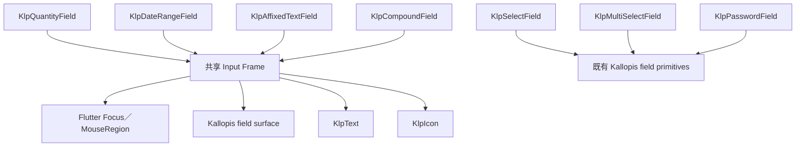

## 元件需求表

| 元件 ID | 責任 | 輸入 | 輸出／事件 | 狀態 | 幾何 | 語意 | 底層組成 | 所有權 | 定型狀態 |
|---|---|---|---|---|---|---|---|---|---|
| KLP-APP | 提供 MaterialApp、theme、locale、router 與桌面視窗接入 | home／router、style、theme mode、window header | theme 與 window lifecycle | theme mode、brightness、maximized | AppFrame 鋪 app background，以 appFrameInset 包住 Window Header 與 Panel Tree；Header 自身使用 windowHeaderMargin | SEM-SCOPED-SPACING | MaterialApp、Padding、KlpWindowHeader、KlpRouterScope | Kallopis | confirmed |
| KLP-THEME-RUNTIME | 將完整 ThemeExtension 解析成元件可讀值 | BuildContext、KlpVisualStyle | context.klp／context.klpColors | 完整風格、fallback、局部色彩 override | semantic／component resolver | theme runtime | Theme、ThemeExtension、KlpTokenOverride | Kallopis | confirmed |
| KLP-WORKBENCH-SHELL | 提供固定三欄相容模式，或以 Dock 模式組合固定 Stage 周圍的可停駐 Areas | 固定模式的 panes／寬度／事件；Dock 模式的 stage、panels、layout、Area constraints | 固定模式 resize／collapse；Dock 模式 onLayoutChanged | 固定三欄或 Dock Area／Group 狀態 | 固定模式沿用既有 pane geometry；Dock 模式完整委派 SEM-DOCK-LAYOUT | workbench region、SEM-DOCK-LAYOUT | Kallopis layout primitives、KlpDockLayout | Kallopis | confirmed |
| IST-WORKBENCH-SCREEN | 為 IST 系列子產品固定 AppScreen、Rail 與 Dock 的基礎畫面 | window header、rail leading／children／reorder、stage、panel registry、受控 layout、Area constraints | Rail item 事件、onRailReorder、onLayoutChanged | Rail 固定顯示；Dock 狀態完全由子產品控制 | workbenchContentInset 預設 4px；Rail 48px；Rail 與 Dock 間 chromeGap 預設 8px；Dock 填滿剩餘空間 | SEM-IST-WORKBENCH-SCREEN-COMPOSITION、SEM-SCOPED-SPACING | Padding、Row、KlpNavigationRailFrame、KlpNavigationRail、Expanded、KlpDockLayout | Kallopis IST 產品族配方；子產品擁有資料與狀態 | confirmed |
| KLP-NOTE-VISUAL-STYLE | 套用可共享的筆記工作台密度與視覺節奏 | 基礎 KlpVisualStyle | 完整 Note visual style | 無產品狀態 | 只覆寫 spacing 與 layout geometry | note visual recipe | KlpVisualStyle、KlpSpacingTheme、KlpGeometryTheme | Kallopis | confirmed |
| KLP-NOTE-BLOCK | 呈現筆記區塊選取底色、六點 handle 與內容插槽 | child、selected／hovered、authority 提供的 geometry、callbacks | handle anchor、selected、content pressed | rest／hover／selected | 不自行推導內容 layout | note block chrome | KlpPressable、KlpStateHighlight、Stack | Kallopis 視覺；Krepis authority | confirmed |
| KLP-NOTE-WORKBENCH | 組合筆記側欄、檔案樹與單一 Stage 的視覺節奏 | primary、stage、consumer-owned navigation／files／events | resize 與所有子元件事件原樣回傳 | primary 顯示／收合 | Note visual style 的外距、pane gap、列高與 section rhythm | note workbench chrome | KlpWorkbenchShell、KlpPrimarySidebarFrame、KlpFileExplorer | Kallopis 視覺；Notist 組合 | confirmed |
| KLP-PRIMARY-SIDEBAR-FRAME | 以固定 Sidebar surface 組合可選 header、navigation、Explorer 與 footer／status | header、navigation、explorer、footer、status、KlpSidebarInset、KlpPrimarySidebarHeaderInset、KlpSpaceSize gap | 所有子元件事件原樣回傳 | 有無 header／navigation／footer／status | content 內縮只接受 KlpSidebarInset；header 內縮只接受 KlpPrimarySidebarHeaderInset；header 與 navigation 間距只接受 KlpSpaceSize | SEM-PRIMARY-SIDEBAR-COMPOSITION、SEM-WORKBENCH-CONTEXT-SIDEBAR | KlpSidebarFrame、KlpColumn、KlpBox、KlpGap、KlpExpanded、KlpStatusIndicator | Kallopis | confirmed |
| KLP-FILE-EXPLORER | 呈現可折疊分類、巢狀資料夾與可選取檔案節點 | sections、受控展開／選取集合、KlpFileExplorerSpacing、scroll controller | section toggle、item toggle、item selection | 受控或非受控展開與選取、hover | standard／relaxed／flush 三種 typed spacing 配方；縮排與所有 padding 由 context.klp 解析，不接收 raw double 或 EdgeInsetsGeometry | SEM-FILE-EXPLORER-COMPOSITION | KlpColumn、KlpRow、KlpBox、KlpExpanded、KlpGestureRegion、Explorer primitives | Kallopis | confirmed |
| KLP-STEPPER | 依目前索引呈現已完成、目前與未開始的流程步驟 | steps、currentIndex、KlpStepperDirection | 無；純顯示 | completed／current／upcoming；horizontal／vertical | marker 與水平 label 寬度解析 geometry.data.stepperMarkerSize／stepperLabelWidth；間距、線寬與字體由 context.klp 解析，不接受 raw Axis、double 或 Color | SEM-STEPPER-COMPOSITION | KlpRow、KlpColumn、KlpBox、KlpExpanded、KlpCenter、KlpText、Stepper primitives | Kallopis | confirmed |
| KLP-CALENDAR | 以受控月份與日期狀態呈現七欄月曆 | month、月份與星期文字、selection mode、selected date／range、today、disabled predicate、可選 day content slot | previous／next month、date selected | single／range；today／selected／in-range／disabled／hover；純日期／內容格 | 日期格高解析 controlHeightSmall 或 calendarContentCell；所有間距、圓角、邊線與狀態色由 context.klp 解析，不接受 raw 外觀值 | SEM-CALENDAR-COMPOSITION | KlpColumn、KlpRow、KlpBox、KlpExpanded、KlpCenter、KlpIconButton、KlpStateHighlight、Calendar primitives | Kallopis | confirmed |
| KLP-FIELD | 組合單一欄位的標籤、說明、控制項與回饋列 | label、child、可選 description／requirement／error／errorCode／status／counter、required | 無；驗證與輸入事件由 child 及呼叫端擁有 | required；error 優先於 status；可選診斷代碼與計數 | 標籤、說明、child 與回饋列沿用既有排列；垂直與 required 間距解析 space.tight，診斷代碼與計數解析 space.contentInlineGap；不接收 raw 外觀值 | SEM-FIELD-COMPOSITION | KlpColumn、KlpRow、KlpExpanded、KlpSpacer、KlpGap、KlpFieldLabel、KlpFieldDescription、KlpText | Kallopis | confirmed |
| KLP-CARD | 在中性表面上組合標題、標籤、前後插槽、內容與頁尾 | title、child、可選 label／leading／trailing／footer、selected、KlpCardTone | 插槽事件原樣由呼叫端擁有 | component／surface／muted／raised；selected | 背景只能以 KlpCardTone 選擇；radius／padding／selection wash 與 inline gap 由 context.klp 解析；不接受 raw Color、double 或 EdgeInsetsGeometry | SEM-CARD-COMPOSITION | KlpColumn、KlpRow、KlpBox、KlpExpanded、KlpGap、KlpText、Card frame primitive | Kallopis | confirmed |
| KLP-METRIC-CARD | 呈現標籤、核心數值、單位、趨勢、說明與自訂內容 | label、可選 value／unit／trend／subtitle／child、KlpFeedbackTone | child 事件原樣由呼叫端擁有 | neutral／danger；有無數值、內容與說明 | component 背景、card radius、hairline border、comfortable padding 與 contentStack／tight 間距由 context.klp 解析；數值與說明只使用 KlpTextTone | SEM-CARD-COMPOSITION | KlpColumn、KlpRow、KlpGap、KlpText、Metric card frame／value-fit primitives | Kallopis | confirmed |
| KLP-TIMELINE | 依呼叫端順序呈現事件標記、標題、時間與內容 | items；每項 title、可選 time／content／marker、highlighted | marker／content 事件原樣由呼叫端擁有 | 首項／中間項／末項；預設或自訂 marker；highlighted | markerSize 解析 indicatorDotLarge，連線解析 shape.hairline／color.divider，首行垂直對齊由 bodyStrong typography 推導；內容底距、inline 與 stack 間距由 context.klp 解析；不接收 raw 外觀值 | SEM-TIMELINE-COMPOSITION | KlpColumn、KlpRow、KlpBox、KlpExpanded、KlpGap、KlpText、Timeline rail／intrinsic primitives | Kallopis | confirmed |
| KLP-PROGRESS | 呈現呼叫端控制的連續進度或無法估算的進行狀態 | value、label、trailing、detail、state、cancelLabel、onCancel；segments 僅保留為已棄用的來源相容欄位且不影響呈現 | cancel 事件原樣回傳；進度與文案 authority 留在呼叫端 | determinate／indeterminate；normal／warning／success／error；有無 label、detail、trailing 與 cancel | 軌道高度解析 space.progressTrack，無法估算的填充比例解析 geometry.data.progressIndeterminateFraction；stack／inline 間距與文字角色由 context.klp 解析；公開介面不接收 raw 外觀值；高階內容只使用 Kallopis layout、gesture 與 typography，原生軌道只存在 `data/progress/primitives` | SEM-PROGRESS-COMPOSITION | KlpColumn、KlpRow、KlpExpanded、KlpSpacer、KlpGap、KlpGestureRegion、KlpText、Progress track primitive | Kallopis | confirmed |
| KLP-LIST-TILE | 以一致節奏呈現可選取的單列資料或動作 | title、subtitle、icon、trailing、selected、onPressed、compact、tone | press 事件原樣回傳 | static／actionable；rest／hover／focus／selected；neutral／feedback tone；compact／regular | compact 高度解析 controlHeightSmall；水平與垂直內距、icon 與文字間距、subtitle 間距、控制項圓角與狀態透明度皆由 context.klp 解析；公開介面不接收 raw Color、double 或 EdgeInsetsGeometry；高階內容只使用 Kallopis layout、icon 與 typography，原生 Semantics／Material／InkWell／frame 只存在 `data/list_tile/primitives` | SEM-LIST-TILE-COMPOSITION | KlpRow、KlpColumn、KlpExpanded、KlpGap、KlpIcon、KlpText、ListTile frame primitive | Kallopis | confirmed |
| KLP-DOCK-LAYOUT | 以固定 Stage 組合左、下、右可停駐 Area | panel registry（含 allowBottom／allowSide／actions）、layout、Area constraints | onLayoutChanged | Area 顯示／關閉／同一手勢邊界重開、雙軸 resize、active tab、合法目的區域判定、空 Area 建立、拖曳合併／拆分／排序 | Panel Frame 外距解析 dockMargin，AppFrame 解析 appFrameInset；Area resize hit target 解析 resizeHandleExtent；Area 與 Group 使用像素 extent；每個 Area 分隔線是持續掛載的 root overlay；Area 與 Group separator 皆由滑鼠絕對位置解析，min／max 截止後需追上實際分隔線才繼續；Area 越過 closeThreshold 收合後可在同一手勢反向越過門檻並以 minExtent 展開；拖曳來源透明度解析 surface.dragSourceOpacity，預設 35% | SEM-DOCK-LAYOUT、SEM-SCOPED-SPACING | KlpSurface、KlpLayoutBuilder、KlpStack、KlpPositioned、KlpPanelFrame、KlpDockHeader、Dock primitives | Kallopis | confirmed |
| KLP-DOCK-HEADER | 提供 Dock Group 專用的緊湊標題、tabs 與產品 actions | leading、結構化 actions、可選 drag region builder | action callback；tabs 事件由 leading 回傳 | 單標題／多 tabs、水平捲動、actions 逐個 overflow | 固定 32px；至少保留一個 32px leading slot；action 以 32px inline icon button 排列 | SEM-DOCK-HEADER | KlpBox、KlpLayoutBuilder、KlpIconButton、KlpContextMenu、Dock viewport primitive | Kallopis | confirmed |
| KLP-WORKBENCH-HEADER | 依 pane 狀態配置 identity、Stage top bar、toggle 與視窗控制 | pane width／visible、產品標題與動作 | pane toggle、window actions | primary／secondary 展開收合 | KlpGeometryTheme.layout | workbench chrome | KlpWindowHeader、KlpStageTopBar、KlpIconButton | Kallopis | confirmed |
| KLP-STAGE-TOP-BAR | 在 Workbench header 的 Stage 區域配置單一分頁與可選動作 | tab、actions | 子元件事件原樣回傳 | 有無 actions | tab 固定於 start 並填滿垂直範圍；actions 固定於 end，列高取 chromeTab 與 controlHeightXSmall 較大者；動作間距解析 KlpSpaceSize.tight；高階層只使用 KlpStack、KlpDirectionalPositioned、KlpRow、KlpGap | SEM-STAGE-TOP-BAR-COMPOSITION | KlpStack、KlpDirectionalPositioned、KlpRow、KlpGap | Kallopis | confirmed |
| KLP-STAGE-TAB | 呈現連接 Stage surface 的單一分頁標籤 | label | 無 | 單行／ellipsis | 高度、水平內距、頂端與連接端圓角、stage surface 與 foreground 全由 context.klp 解析；高階層只投影 KlpText；原生 directional border frame 僅限 shell/stage/primitives | SEM-STAGE-TOP-BAR-COMPOSITION | KlpText、private stage tab frame | Kallopis | confirmed |
| KLP-WINDOW-HEADER | 呈現 App identity、產品動作與平台視窗控制，並提供全表面視窗拖動 | title、leading、titleTrailing、actions、trailing、window callbacks | 子元件事件、平台 drag、非互動區雙擊 maximize | Windows／Linux、macOS；一般點擊／拖動／雙擊 | 高度包含可視 windowHeaderHeight 與 Header 自身四周 windowHeaderMargin；外層由 AppFrame 的 appFrameInset 包住 | SEM-WINDOW-HEADER-DRAG、SEM-SCOPED-SPACING | KlpGestureRegion、KlpBox、KlpSurface、KlpAdaptive、KlpWindowControls、Klp layout primitives | Kallopis | confirmed |
| KLP-ACTION-REGION | 集中按鈕語意、hover、focus 與可點擊表面，讓高階元件不直接建立 Flutter 互動 Widget | label、onPressed、tone、shape、content builder；builder 只接收 `KlpActionRegionStyle` | press、hover、focus | enabled／disabled、rest／active、selected、neutral／destructive | 不擁有內容幾何；圓角依 `KlpActionRegionShape` 解析 shape.card 或 shape.control；解析後 foreground 透過 typed style 傳給內容，不傳 raw Color；Semantics／Material／InkWell／StatefulBuilder 僅存在 `interaction/primitives` | ARCH-006、通用動作互動 | KlpActionRegionStyle、KlpActionRegionShape、KlpActionRegionTone、context.klp | Kallopis 基礎互動原語 | confirmed |
| KLP-COMMAND-MENU | 呈現可完全以鍵盤操作的分組命令清單 | sections、framed、autofocus、onEscape；寬度不接受 raw double | item press；Arrow Up／Down、Home／End、Enter／Space、Escape | enabled／disabled、selected、keyboard-highlighted、danger、caption、shortcut、framed | 標準寬度由 `geometry.layout.commandMenuWidth` 經 `KlpSpaceSize.commandMenuWidth` 解析，預設維持 300px；內容以 KlpBox／KlpColumn／KlpRow／KlpExpanded／KlpText 組裝；selected 與 keyboard highlight 維持 surfaceMuted；原生 Focus、Semantics、Material、InkWell 與 surface decoration 只存在 `editor/command_menu/primitives` | SEM-COMMAND-MENU | KlpRovingIndex、KlpBox、KlpColumn、KlpRow、KlpExpanded、KlpText、private command primitives | Kallopis | confirmed |
| KLP-EDITOR-ACTION-BARS | 呈現一般編輯動作、批次動作與搜尋結果導覽 | KlpEditorActionData、toolbar actions、bulk label、query、current／total、callbacks | action、query changed、previous、next、close | selected／unselected；danger／neutral；enabled／disabled；toolbar／bulk／search | 共用 component surface 與 contentInset；Toolbar 間距解析 tight；Bulk 行內間距解析 action、換行解析 tight；Search 使用 contentInline／tight 與 typed half turn；高階層只使用 KlpBox、KlpWrap、KlpRow、KlpExpanded、KlpGap、KlpRotate、KlpTextField、KlpIconButton、KlpText；原生 action frame 僅限 editor/action_bars/primitives | SEM-EDITOR-ACTION-BARS-COMPOSITION | KlpBox、KlpWrap、KlpRow、KlpExpanded、KlpGap、KlpRotate、KlpTextField、KlpIconButton、KlpText、private action frame | Kallopis | confirmed |
| KLP-FILTER-COMPOSITION | 統一篩選條件、批次選取、在線狀態與快捷鍵提示的通用視覺 | filters、selectedId、批次 actions、presence active、shortcut label 與產品 callbacks；不接受 raw 外觀值 | select／remove／add／clear／batch action | filter selected／removable；toolbar dashed／plain；presence active／inactive | FilterBar 以 typed wrap、gap、box 與 action region 組裝；chip 維持 controlHeightSmall、controlInset、hairline、selection／surfaceInset；值文字使用 `monoCaptionStrong`，保留 caption 尺寸、bold 與 mono family；SelectionToolbar、PresenceIndicator、ShortcutHint 的原生 frame 只存在 `interaction/filter/primitives` | SEM-FILTER-COMPOSITION | KlpWrap、KlpRow、KlpBox、KlpGap、KlpSpacer、KlpActionRegion、KlpText、filter private primitives | Kallopis | confirmed |
| KLP-FEEDBACK-COMPOSITION | 以一致的 Kallopis 原語組裝 loading、empty、error、permission、toast、status、workflow 與 placeholder | 呈現文字、狀態 enum、typed constraints、action callback 與內容 | 動作事件原樣回傳；live-region 與焦點事件由原語接線 | loading／empty／error／permission／progress／status／workflow／placeholder | 保留既有 context.klp spacing、shape、geometry、surface 與 typography 解析，不接收 raw width、height、color 或 spinner size | ARCH-006、SEM-FEEDBACK-COMPOSITION | KlpBox、KlpColumn、KlpRow、KlpGap、KlpSurface、KlpActionRegion、KlpLiveRegion、KlpSemanticRegion | Kallopis | confirmed |
| KLP-FEEDBACK-ACCESSIBILITY-PRIMITIVES | 將一般語意群組、live-region 與純裝飾排除集中於基礎原語 | label、child、explicit child policy | 輔助技術公告與語意樹投影 | 一般群組／明確訊息公告／由 descendants 公告／排除裝飾 | 不擁有視覺幾何與產品文案；只建立 Flutter Semantics 邊界 | ARCH-006、accessibility boundary | KlpSemanticRegion、KlpLiveRegion、KlpExcludeSemantics、Flutter Semantics | Kallopis 基礎互動／feedback 原語 | confirmed |
| KLP-FEEDBACK-FRAME-PRIMITIVES | 將 feedback 特有的 Flutter paint、clip、veil 與微型狀態字形限制在明確 primitive 邊界 | 已解析 theme 顏色、幾何與 child | 無產品事件 | hatch／flat、pending／neutral、light／dark veil | 所有值由高階元件的 context.klp 解析後注入；primitive 不決定產品狀態 | ARCH-006、SEM-FEEDBACK-COMPOSITION | KlpPlaceholderFrame、KlpPlaceholderFillPainter、KlpPlaceholderMarkerGlyph、KlpStatusDot、KlpVeil | Kallopis 基礎 feedback／surface 原語 | confirmed |
| KLP-DIRECTIONAL-POSITIONED | 以型別化定位資料提供方向感知的絕對定位 | KlpDirectionalPosition、child | 無 | start／end／top／bottom 可選 | 數值由上層已解析幾何注入，元件本身不設計尺寸 | ARCH-006、方向感知定位 | PositionedDirectional | Kallopis 基礎排版原語 | confirmed |
| KLP-TRANSLATE | 以型別化平移資料移動內容 | KlpTranslation、child | 無 | 水平／垂直位移 | 位移由上層已解析幾何注入，預設零位移 | ARCH-006、平移定位 | Transform.translate | Kallopis 基礎排版原語 | confirmed |
| KLP-STAGE-FRAME | 組合 Stage surface、header、content 與 status | 產品語意文字、content、status | 內容事件由產品處理 | header／status 可選 | spacing、shape、surface semantic | stage region | KlpTokenOverride、KlpStageHeader、KlpStatusBar | Kallopis | confirmed |
| KLP-PANEL-FRAME | 組合通用 panel 的 header、content 與可選 footer | header、content、footer、height、background、padding、可選 contentScrollController | 子元件事件與內容捲動原樣回傳 | header／footer 可選；背景可覆寫；有／無受控內容捲動 | 外圓角解析 shape.card（預設 8px）；內層 clip 解析 card - stroke（預設 6px）；內容保持 panel padding，受控 Scrollbar 置中於尾側 8px padding 槽 | SEM-COMPACT-PANEL-RADIUS、SEM-PANEL-SCROLLBAR-GUTTER | DecoratedBox、ClipRRect、KlpTokenOverride、Padding、Column、ScrollbarTheme、Scrollbar、ScrollConfiguration | Kallopis | confirmed |
| KLP-STAGE-HEADER | 呈現 Stage 的專案、區域、標題、類型與可選動作 | projectName、sectionLabel、title、typeLabel、actions | 動作事件由傳入元件處理 | 標題依可用寬度自動換行；actions 可省略 | chromePanelInset、tight 與 typed chromeToolbar spacing；不接收 raw 外觀值 | SEM-STAGE-HEADER-COMPOSITION | KlpBox、KlpRow、KlpColumn、KlpExpanded、KlpFlexible、KlpGap、KlpText、actions slot | Kallopis | confirmed |
| DESIGNIST-INSPECTOR-CONTENT | 呈現 Designist 檢查內容；未來可能注入左側 Sidebar | 產品或 AI 回傳資料 | 套用、拒絕或其他待確認事件 | 依未來需求確認 | 未確認 | inspector content | 既有 Inspector blocks | Designist 資料＋Kallopis 呈現 | proposed |
| KLP-NAVIGATION-RAIL | 垂直排列只有圖示的主要入口，固定由 Top、Center、Bottom 三個 Group 組成 | topGroup、centerGroup、bottomGroup；各組 `List<KlpRailEntry>`、isReorderable 與可選 reorder callback | Button／Menu entry 輸出事件；可排序組內拖曳接受後回傳 old/new index；跨組與不可排序組拒絕 | hover、focus、selected、badge、menu-open、dragging、drop-before、drop-after、center-overflow | item 32px；內距與 item gap 由 theme space 解析，item gap 透過 `KlpSpaceSize.navigationRailItem`，item extent 透過 `KlpSpaceSize.navigationRailControl`；Top 貼上、Bottom 貼下；Center 取得剩餘高度且內容置頂，溢出時無 Scrollbar 捲動；Top 下方與 Bottom 上方依內容加入低對比 hairline KlpRailDivider；水平插入線粗細由 `shape.stroke` 解析；高階組裝使用 KlpBox／KlpColumn／KlpExpanded／KlpGap，原生拖曳、捲動、anchored tooltip、badge dot 與 pointer tracking 機制只存在 rail private primitives | SEM-WORKBENCH-RAIL | KlpNavigationRail、KlpRailItemGroup、KlpRailEntry、KlpRailButtonEntry、KlpRailMenuEntry、KlpRailDivider、KlpRailItem、KlpActionRegion、KlpBox、KlpColumn、KlpExpanded、KlpGap、KlpDropIndicator | Kallopis | confirmed |
| KLP-ACTION-GROUP | 以一致節奏排列可換行的通用動作 | children | 子元件事件原樣回傳 | 單列／換行／空清單 | 行內與換行間距都解析 KlpSpaceSize.tight；高階層只使用 KlpWrap | SEM-NAVIGATION-CONTROLS-COMPOSITION | KlpWrap | Kallopis | confirmed |
| KLP-PAGINATION | 呈現目前頁碼與受控前後翻頁 | page、pageCount、previousLabel、nextLabel、onPageChanged | 僅在 1..pageCount 範圍內回傳新頁碼 | 首頁／中間頁／末頁／non-interactive | 按鈕與頁碼間距解析 KlpSpaceSize.action；頁碼使用 code typography；高階層只使用 KlpRow、KlpGap、KlpButton、KlpText | SEM-NAVIGATION-CONTROLS-COMPOSITION | KlpRow、KlpGap、KlpButton、KlpText | Kallopis | confirmed |
| KLP-VIEW-SWITCHER | 以輕量分段表面切換同層級檢視 | options（id、label、可選 KlpIconData）、selectedId、onSelected | press 回傳 option id，選取 authority 留在呼叫端 | selected／unselected／non-interactive／有無 icon | 外框 inset surface＋control radius＋hairline padding；選項高度與水平內距由 theme 解析；icon 固定由 KlpIcon 以 iconSmall 渲染；高階組裝只使用 KlpGestureRegion、KlpRow、KlpGap、KlpIcon、KlpText 與 private frames，原生 surface frame 僅限 navigation/controls/primitives | SEM-NAVIGATION-CONTROLS-COMPOSITION | KlpGestureRegion、KlpRow、KlpGap、KlpIcon、KlpText、private frames | Kallopis | confirmed |
| KLP-RAIL-ENTRY | 限制 Rail 可注入內容並分離資料與單項視覺 | 穩定 id；Button／Menu／Divider 具體型別 | 由具體 Entry 定義 | 可拖曳／固定 | 不直接擁有幾何 | primary navigation entry contract | Dart abstract base class | Kallopis | confirmed |
| KLP-RAIL-ITEM | 呈現單一 Rail 圖示動作 | icon、label、onPressed、selected、可選 badge | onPressed；hover 顯示 tooltip | resting、hover、focus、selected、badge、tooltip-open | 互動委派 KlpActionRegion；方形 extent 由 `KlpSpaceSize.navigationRailControl` 解析 railItem；圖示置中，selected foreground 解析 selectionForeground；tooltip surface 使用 KlpTooltipSurface；原生 overlay anchor 與 badge dot 只在 rail private primitives | SEM-WORKBENCH-RAIL | KlpActionRegion、KlpBox、KlpStack、KlpCenter、KlpIcon、KlpTooltipSurface | Kallopis | confirmed |
| KLP-RAIL-BUTTON-ENTRY | 描述一般 Rail 動作 | id、icon、label、onPressed、selected、badge | onPressed | selected／badge | 委派 KlpRailItem | SEM-WORKBENCH-RAIL | KlpRailEntry、KlpRailItem | Kallopis | confirmed |
| KLP-RAIL-MENU-ENTRY | 描述由 Rail 開啟的既有 Kallopis 選單 | id、icon、label、menu items、selected、badge | menu item callbacks | selected／badge／menu-open | item 委派 KlpRailItem；浮層委派 KlpContextMenu；pointer tracking 只存在 rail private primitive | SEM-WORKBENCH-RAIL | KlpRailEntry、KlpRailItem、KlpContextMenu、KlpMenuItemData | Kallopis | confirmed |
| KLP-RAIL-DIVIDER | 在 Rail 中提供不可拖曳、無事件的語意分隔 | id | 無 | 靜態 | 使用 KlpDashedDivider；粗細解析 shape.hairline，低對比色解析 color.guide＋shape.dashedOpacity | SEM-WORKBENCH-RAIL | KlpRailEntry、KlpDashedDivider | Kallopis | confirmed |
| KLP-NAVIGATION-RAIL-FRAME | 為主要導覽 Rail 提供獨立 surface | child | 子元件事件 | 內容狀態由 child 擁有 | 48px width；KlpPanelFrame surface 與 radius | navigation rail surface | KlpPanelFrame | Kallopis | confirmed |
| KLP-WORKBENCH-NAVIGATION-REGION | 將獨立 Rail 與 Sidebar 並排成共同收合區域 | rail、sidebar | 子元件事件 | 由外層控制顯示與 resize | Rail 48px；兩 surface 間 compact 8px；Sidebar 填滿剩餘寬度 | workbench primary navigation region | Row、SizedBox、Expanded | Kallopis | confirmed |
| KLP-PRIMARY-SIDEBAR-FRAME | 組合上下文 Sidebar 的 header、navigation、content 與 footer | header、navigation、content、footer | 子元件事件 | 內容 destination | 使用傳入的 Sidebar 寬度；水平 padding 使用 compact 8px | context sidebar surface | KlpSidebarFrame | Kallopis | confirmed |
| KLP-NAVIGATOR | 以單一 Sidebar 導覽表面組合分類、元素與任意元件 | `List<KlpNavigatorItem>`，具體型別只允許 Category／Element／Component；受控 expanded／selected IDs、callbacks 與可選 ScrollController | category toggle、element toggle、element selected；Component 保留自身事件；捲動由共用 controller 回傳 | Category 展開／收合；Element 展開／選取／hover；根層或分類內；空清單 | Category header 與 Element row 完整沿用 Catalog 目錄既有高度；縮排固定由 space.tight 解析，不提供 raw double；Component 不套固定高度；放入 KlpPanelFrame 時共用 controller，使 Scrollbar 留在 panel padding 槽 | SEM-NAVIGATOR-COMPOSITION、SEM-PANEL-SCROLLBAR-GUTTER | KlpSurface、KlpColumn、KlpRow、KlpBox、KlpExpanded、KlpPressable、KlpGestureRegion、KlpStateHighlight、Navigator primitives、任意 child slot | Kallopis | confirmed |
| KLP-MESSAGE-BUBBLE | 呈現作者、時間與貼合正文寬度的訊息 surface | author、timestamp、child、alignment、background、dense | child 事件原樣由呼叫端擁有 | leading／trailing；有／無背景 | dense 時 surface padding 解析 contentInset，regular 解析 base；metadata 與 body 間距解析 contentInline／contentStack；啟用背景時使用 muted surface；高階內容只使用 Kallopis layout、surface 與 typography，不接收 raw 外觀值 | SEM-READABLE-MESSAGE-BUBBLE、SEM-MESSAGE-THREAD-COMPOSITION | KlpAlign、KlpColumn、KlpRow、KlpBox、KlpGap、KlpText、KlpSurface | Kallopis | confirmed |
| KLP-MESSAGE-THREAD | 依序排列訊息並提供可選的載入較早內容動作 | messages、loadOlderLabel、onLoadOlder、dense | 載入較早內容事件原樣回傳；message 事件由各 child 擁有 | 有無 load older；一般／dense；空／多筆訊息 | dense 訊息間距解析 contentStack，regular 解析 comfortable；load older 底距解析 base；高階內容只使用 Kallopis layout 與 button，不接收 raw 外觀值 | SEM-MESSAGE-THREAD-COMPOSITION | KlpColumn、KlpAlign、KlpGap、KlpButton、呼叫端 message widgets | Kallopis | confirmed |
| KLP-PREVIEW-CARD | 在虛線預覽區下方呈現標題與可選中繼資訊 | title、preview、metadata、KlpPreviewCardSize | preview 內容事件原樣由呼叫端擁有 | compact／standard／large；有無 metadata | 三種預覽高度分別解析 geometry.data.previewCardCompactHeight／previewCardStandardHeight／previewCardLargeHeight；預設 large 保留既有 192px；控制項 surface、內容內距與 metadata 間距由 context.klp 解析；公開介面不接收 raw double；原生固定高度只存在 `data/preview_card/primitives` | SEM-PREVIEW-CARD-COMPOSITION | KlpSurface、KlpColumn、KlpBox、KlpGap、KlpWrap、KlpDashedBorder、KlpText、PreviewCard viewport primitive | Kallopis | confirmed |
| KLP-SORT-CONTROL | 呈現目前排序欄位與受控升降方向 | label、ascending、onPressed、可選 KlpIconData override | press 事件原樣回傳，方向由呼叫端更新 | ascending／descending；enabled／non-interactive；預設或覆寫 icon | ascending 預設 chevronUp，descending 預設 chevronDown；icon 間距解析 tight，圖示尺寸解析 iconSmall；高階內容只使用 KlpGestureRegion、KlpRow、KlpGap、KlpText 與 KlpIcon，不接收 raw 外觀值 | SEM-SORT-CONTROL-COMPOSITION | KlpGestureRegion、KlpRow、KlpGap、KlpText、KlpIcon | Kallopis | confirmed |
| KLP-MESSAGE-COMPOSER | 以標籤、輸入與動作組成訊息輸入器 | tags、value、actions、dense、inlineActions、outlined、minLines／maxLines | changed／attach／send | stacked／inline；有限／無限行；有限高度內部捲動 | padding 解析 contentInset 或 base；muted surface；inline／stack gap 與 tag run gap 解析 contentInline／contentStack／tight；不接收 raw 外觀值 | message composition | KlpSurface、KlpBox、KlpLayoutBuilder、KlpColumn、KlpRow、KlpFlexible、KlpExpanded、KlpWrap、KlpGap、KlpSpacer、KlpBadge、KlpTextArea、KlpIconButton、KlpButton | Kallopis | confirmed |
| KLP-MESSAGE-CONVERSATION | 在有限內容區組合訊息列表與 Composer | content、composer | 子元件事件 | 訊息列表剩餘空間、Composer 增長／內部捲動 | 內容上／左右解析 contentInset；Composer 上／左右解析 space0_5、下解析 space1；Composer 最大高度沿用可用內容高度；不接收 raw 外觀值 | conversation region | KlpBox、KlpBoxInsets、KlpLayoutBuilder、KlpColumn、KlpExpanded、KlpConstrainedBox、KlpBoxConstraints | Kallopis | confirmed |
| KLP-OUTLINED-TEXT-FIELD | 以明確邊框呈現可聚焦文字輸入 | KlpTextField／KlpTextArea outlined、unboundedLines | change／submit／focus | idle／focused／disabled／error；有限／無限行 | outlined 寬度至少 shape.stroke 2px；focused 使用 interaction，其餘使用 border；radius 使用 resolved fieldRadius；unboundedLines 在有限高度內交由 TextFormField 捲動 | outlined input | Container、Focus、TextFormField | Kallopis | confirmed |
| KLP-BADGE | 以可清楚掃讀且低於操作控制項的尺寸呈現短狀態、分類或數量 | label、tone、variant、dot | 無 | filled／outline／solid；neutral／feedback tone；可選 dot | caption 12px／16px；水平內距解析 badgePaddingX、垂直內距解析 space.xxs；pill 圓角；最終高度約 20px；高階內容只用 KlpRow／KlpFlexible／KlpGap／KlpText，原生 frame 與 dot 只存在 `data/badge/primitives` | SEM-READABLE-STATUS-BADGE | KlpRow、KlpFlexible、KlpGap、KlpText、Badge frame／dot primitives | Kallopis | confirmed |
| KLP-TAG | 呈現可選前綴與移除動作的中性分類標籤 | label、prefix、onRemove | remove | 有／無 prefix；可移除／靜態 | surfaceInset、control radius、hairline divider、controlInset／tight 內距；prefix gap 透過 `KlpSpaceSize.xxs` 精確解析；高階內容只用 Kallopis 排版、文字與手勢原語 | SEM-TAG-COMPOSITION | KlpRow、KlpFlexible、KlpGap、KlpGestureRegion、KlpText、Tag frame primitive | Kallopis | confirmed |
| KLP-SCHEDULE-LIST | 以固定時間欄、標題與選填標籤呈現排程 | items（time、title、tag） | 無 | 空清單／有資料；有／無 tag | 時間欄最小寬度解析 space.sectionLarge；時間 maxLines = 1 且 overflow = ellipsis，不因欄寬不足換行 | SEM-SCHEDULE-TIME-COLUMN | Column、KlpSurface、Row、SizedBox、KlpText、KlpBadge | Kallopis | confirmed |
| KLP-DATE-GRID | 以固定七欄呈現日期、內容與選取狀態 | items（label、lines、selected）、onSelected | selected index | 一般日／週末／選取；空清單／多列 | cell 高度由 geometry.data.dateGridCellHeight 解析（預設 128）；內容間距使用 tight，邊線使用 shape.hairline；第 1、7 欄使用 muted surface，selected 使用 component surface 並優先；高階內容只使用 KlpGestureRegion、KlpColumn、KlpGap、KlpText 與私有 frame／viewport，不接收 raw 外觀值；GridView 與 Border 僅限 data/date_grid/primitives | SEM-DATE-GRID-WEEKEND | KlpGestureRegion、KlpColumn、KlpGap、KlpText、KlpSurface、private viewport | Kallopis | confirmed |
| KLP-ACCORDION | 以單開或多開模式呈現可摺疊的中性內容清單 | items、multiple、initialExpandedIds | onExpandedChanged | collapsed／expanded；rest／hover／focus；有無 subtitle | panel 間距與 subtitle 間距解析 tight，header padding 解析 controlInset，chevron 間距解析 contentInline；highlight、radius、motion、icon 與 body inset 全由 context.klp 解析；不接收 raw 外觀值 | SEM-ACCORDION-COMPOSITION | KlpColumn、KlpRow、KlpExpanded、KlpGap、KlpText、Accordion header／chevron／body primitives | Kallopis | confirmed |
| KLP-ARTIFACT-WORKSPACE-COMPOSITION | 以產品中立元件呈現文件章節、token 表格、元件預覽與可及性合約 | document labels／slots、token rows、component definitions、state labels、accessibility items | edit／save／cancel／reference／component／state events | stale／current；editing／viewing；valid／invalid；selected state | 所有間距解析 tight／base／contentStack／contentInline；surface、badge、button、table、tabs 與文字只使用 Kallopis 語意 API；不接收 raw 外觀值 | SEM-ARTIFACT-WORKSPACE-COMPOSITION | KlpRow、KlpColumn、KlpWrap、KlpGap、KlpBox、KlpExpanded、KlpFlexible、KlpGestureRegion、KlpButton、KlpDataTable、KlpPreviewCard、KlpTabs、KlpText、私有 semantics primitives | Kallopis | confirmed |
| KLP-CANVAS-WORKSPACE-COMPOSITION | 呈現可平移縮放 viewport、選取覆層、drop intent、診斷、flow node、驗證與 minimap | child slots、TransformationController、pan／scale flags、diagnostics、issues、labels、selected | toolbar／node／recovery／minimap events | selected／unselected；handles shown／hidden；valid／warning／danger | viewport boundary、selection border／handles、surface／border／padding、spacing 與 motion 全由 context.klp 解析；一般組裝不直接使用 Flutter UI；不接收 raw 外觀值 | SEM-CANVAS-WORKSPACE-COMPOSITION | KlpColumn、KlpRow、KlpWrap、KlpGap、KlpBox、KlpExpanded、KlpBadge、KlpInlineNotice、KlpText、Canvas viewport／selection／drop／flow／minimap primitives | Kallopis | confirmed |
| KLP-PAGE-CHROME-COMPOSITION | 呈現頁面識別、保存狀態與屬性摘要等中性編輯器周邊 | breadcrumb、title、status、collaborator、savedAt、messages、badges、tags、metadata | 無；資料與動作 authority 留在呼叫端 | optional status／collaborator；neutral／feedback messages；empty／populated badges 與 tags | component surface、comfortable／base padding、tight wrap 與 contentStack 節奏全由 context.klp 解析；公開資料只接受語意 tone；組裝層不直接使用 Flutter UI | SEM-PAGE-CHROME-COMPOSITION | KlpBox、KlpColumn、KlpWrap、KlpGap、KlpBadge、KlpTag、KlpText | Kallopis | confirmed |
| KLP-ENTITY-PICKER-COMPOSITION | 呈現呼叫端提供的實體搜尋結果與清除／套用動作 | title、initialQuery、results、kind、label、trailing、selected | query changed、result index selected、clear、apply | selected／unselected；optional trailing；enabled／disabled result action | component surface、base padding、contentStack／contentInline／tight 節奏與 result radius／selected color 全由 context.klp 解析；組裝層不直接使用 Flutter UI；不接收 raw 外觀值 | SEM-ENTITY-PICKER-COMPOSITION | KlpBox、KlpColumn、KlpRow、KlpExpanded、KlpGap、KlpTextField、KlpBadge、KlpText、KlpButton、Entity result frame primitive | Kallopis | confirmed |
| KLP-REFERENCE-PICKER | 以查詢與結果列投影呼叫端提供的通用參照候選 | title、query、queryPlaceholder、results（id、label、kind、metadata、disabled）、loading | query changed、可用 result id selected | loading／results；enabled／disabled；有無 kind／metadata | component surface 與 base padding、contentStack／tight 節奏、controlHeight 與水平內距全由 context.klp 解析；高階層只使用 KlpColumn、KlpCenter、KlpRow、KlpExpanded、KlpGap、KlpTextField、KlpBadge、KlpText、KlpGestureRegion 與 private frames；原生 frame 僅限 form/picker/primitives | SEM-REFERENCE-PICKER-COMPOSITION | KlpColumn、KlpCenter、KlpRow、KlpExpanded、KlpGap、KlpTextField、KlpBadge、KlpText、KlpGestureRegion、private frames | Kallopis | confirmed |
| KLP-KEY-VALUE | 以固定標籤欄與彈性內容欄呈現中性鍵值資料 | rows、可選 title、KlpKeyValueLabelWidth、empty state | copy row id | table／list；compact／standard label；empty／populated；plain／verbatim／copyable | compact／standard label width 分別解析 geometry.data.keyValueLabelWidthCompact／Standard；row padding、table surface、字體與 copy icon 皆由 context.klp 解析；不接受 raw 外觀值 | SEM-KEY-VALUE-COMPOSITION | KlpColumn、KlpRow、KlpExpanded、KlpGap、KlpBox、KlpGestureRegion、KlpText、Key value frame／slot／text-style primitives | Kallopis | confirmed |
| KLP-OKLCH-COLOR-EDITOR | 以 OKLCH 四軸編輯一個色彩值 | value、onChanged、KlpOklchChromaRange | Lightness／Chroma／Hue／Alpha slider change | enabled／disabled；寬版橫排／窄版換行 | 控制寬度解析 control.colorPlaneExtent；間距、字體與 slider 皆取自 context.klp | color channel controls、SEM-COLOR-CONTROL-COMPOSITION | KlpLayoutBuilder、KlpColumn、KlpWrap、KlpSemanticRegion、KlpSlider、私有 control slot primitive | Kallopis | frozen-component |
| KLP-OKLCH-COLOR-PICKER | 以三個二維色盤、四軸控制與雙預覽編輯 OKLCH | value、onChanged、KlpOklchChromaRange | pointer drag、keyboard arrows、slider change | focused／unfocused；in-gamut／out-of-gamut；wide wrap／narrow stack | plane extent 解析 control.colorPlaneExtent；paint→border→cursor；clip 同時限制 paint 與 hit-test | OKLCH color picker、SEM-COLOR-CONTROL-COMPOSITION | KlpLayoutBuilder、KlpColumn、KlpWrap、KlpGap、KlpText、KlpSemanticRegion、KlpExcludeSemantics、KlpOklchColorEditor、私有 plane／preview primitives | Kallopis | frozen-component |

| KLP-SEMANTIC-INHERITANCE-SCOPE | 在複合元件內向子樹提供已解析的預設產品風格 | manifest recipe、ancestor Kallopis scope、brand identity | descendant dependency update | default／nearest legal scope；user recipe isolated | 不新增產品端幾何；值由 semantic resolver 決定 | Kallopis style inheritance | InheritedWidget／InheritedTheme、KlpTheme runtime | Kallopis | confirmed-requirement |
| KLP-CATALOG-MANIFEST | 宣告預設風格政策、四層分類與 Catalog page 註冊 | versioned JSON | generator input | schema v1 | 不擁有畫面幾何 | semantic taxonomy SSOT | JSON Schema | Kallopis | confirmed |
| KLP-CATALOG-THEME-SCOPE | 將 Brand 頁編輯值提升至 Catalog root 並通知整棵子樹 | KlpOklchColor、onChanged、child | descendant dependency update | default／edited | 無 | SEM-BRAND-PRIMARY | InheritedWidget、KlpVisualStyle、Theme | Kallopis Catalog | confirmed |
| KLP-BUTTON-PRIMARY | 以不透明主題色與亮度判斷前景呈現主要動作 | tone primary、selected、enabled | press／long press | idle／hover／focus／selected／disabled | XS／SM／MD／LG／XL = 28／32／36／40／48px；各尺寸由 control geometry 解析 | SEM-BRAND-PRIMARY、SEM-PRIMARY-CONTRAST-A0、SEM-COMPACT-BUTTON-GEOMETRY、SEM-PRIMARY-LABEL-WEIGHT、SEM-BUTTON-COMPOSITION | 私有 KlpButtonFrame primitive、KlpButtonContent、KlpPressable、KlpRow、KlpGap、KlpFlexible、KlpText；KlpTheme.primary／primaryForegroundFor | Kallopis | confirmed |
| KLP-TOGGLE-COMPOSITION | 以一致的 typed style 與 primitive 呈現二態、三態及多階段切換 | value／selected、label、enabled、KlpFeedbackTone 選項、callbacks | onChanged／onSelected | on／off／mixed／selected／disabled | 完整保留 control geometry、spacing、shape 與 motion resolver；不接受 raw color 或 raw double | SEM-TOGGLE-COMPOSITION | KlpRow、KlpGap、KlpText、KlpSlidingSelection、私有 Toggle frame primitives 與 typed style | Kallopis | confirmed |
| KLP-SELECTION-COMPOSITION | 以受控值、typed tone 與 callback 呈現 checkbox、radio、segmented、select、slider 與 sliding selection | value／selected、label、enabled、KlpSelectionTone、callbacks | onChanged／onSelected／onPressed | rest／hover／focus／selected／disabled | 保留既有 control geometry、spacing、shape、motion 與文字角色；sliding selection 精確幾何由 control geometry 解析 | SEM-SELECTION-COMPOSITION | KlpRow、KlpColumn、KlpWrap、KlpGap、KlpExpanded、KlpFlexible、KlpText、私有 Selection frame primitives 與 typed style | Kallopis | confirmed |
| KLP-INPUT-COMPOSITION | 以欄位資料、輸入狀態與 callback 呈現文字欄位及可搜尋選單 | label／placeholder／helper／error、文字控制器、KlpControlSize、leading icon weight、obscure flag、typed trailing action、輸入與選取 callback | changed／submitted／selected／clear／step／trailing action | rest／hover／focus／disabled／read-only／error／conflict／dropdown-open／obscured | 高度、內距、字體、圓角、邊框與狀態色完整由 context.klp 解析；尾端動作必須有語意 label；公開介面不接受 raw color 或 raw double 外觀值 | SEM-INPUT-COMPOSITION、SEM-FORM-INPUT-FRAME、SEM-OUTLINED-FIELD-FOCUS | KlpColumn、KlpRow、KlpGap、KlpText、KlpIcon、KlpFocusRegion、KlpMenu、私有 Input frame primitives 與 typed style | Kallopis | confirmed |
| KLP-FORM-INPUT-RECIPE-COMPOSITION | 以共用輸入外框與 primitive 組合具前綴、數量、複合及日期範圍的產品中立欄位 | label、value、enabled、readOnly、error、受控資料與 callbacks | edit／action／increment／decrement／calendar／option | rest／hover／focus／disabled／read-only／error | KlpInputFrame 高階層只排列 label、surface 與 error；hover／focus／Semantics／Material／TextFormField／action／divider 只存在 form/internal/primitives；公開 recipe 只使用 Kallopis 排版原語 | SEM-FORM-INPUT-RECIPE-COMPOSITION、SEM-FORM-INPUT-FRAME | KlpColumn、KlpRow、KlpBox、KlpGap、KlpExpanded、KlpCenter、KlpText、共用 input primitives | Kallopis | confirmed |
| KLP-FORM-CORE-COMPOSITION | 以產品中立的內容 slot、驗證文字與 callback 組合表單骨架 | sections、errorSummary、actions、title、description、errors、受控 collapsed／visible、按鈕 labels 與 callbacks | toggle／select error／submit／cancel／reset | 有無錯誤總覽／actions／description；expanded／collapsed；visible／hidden；idle／submitting | Form、Section、Error Summary、Actions、Field Group 與 Field Error 高階層只使用 Kallopis 排版、surface、interaction、typography 與 live-region 原語；間距解析 base／tight／comfortable／action／contentStack；尺寸動畫只存在 form/core/primitives | SEM-FORM-CORE-COMPOSITION | KlpColumn、KlpWrap、KlpBox、KlpGap、KlpSurface、KlpGestureRegion、KlpLiveRegion、KlpText、KlpButton、私有 conditional animation primitive | Kallopis | confirmed |
| KLP-STRUCTURED-FORM-COMPOSITION | 以受控資料與 callback 組合程式碼、檔案、鍵值、重複項目與審批步驟欄位 | label、受控 value／entries／files／steps、內容 slot、callback | edit／choose／remove／add／reorder | read-only／editable；empty／populated；upload progress；error／warning | 完整保留既有 frame、間距、字體、色彩、圓角、邊框與進度幾何；公開介面只接收資料、內容與事件，不接收 raw 視覺值 | SEM-STRUCTURED-FORM-COMPOSITION、SEM-INPUT-COMPOSITION | KlpColumn、KlpRow、KlpWrap、KlpGap、KlpExpanded、KlpAlign、KlpText、KlpButton、KlpTextField、KlpGestureRegion、私有 structured frame／progress primitives | Kallopis | confirmed |
| KLP-CODE-DATA-COMPOSITION | 以一致框架呈現程式碼、差異與終端輸出，並保留語言、換行、行號、展開、複製與逐行審查事件 | code／language／lines、KlpCodeViewportLimit、受控狀態與 callback | language／wrap／line-number／view／expand／copy／approve／reject | loading／content；wrapped／horizontal-scroll；expanded／collapsed；added／deleted／unchanged | 完整保留既有 header、body、gutter、terminal mark、action 與 viewport 幾何；高度只透過 KlpCodeViewportLimit 注入，不接收 raw double | SEM-CODE-DATA-COMPOSITION | KlpColumn、KlpRow、KlpGap、KlpExpanded、KlpSpacer、KlpAlign、KlpText、KlpIcon、KlpMenu、KlpTooltip、私有 code frame／action／viewport primitives | Kallopis | confirmed |
| KLP-ADVANCED-DATA-COMPOSITION | 以受控模型與事件呈現資料表、階層樹、JSON 與檔案預覽 | columns／rows／tree nodes／JSON value／file metadata、typed size 與 callbacks | select／sort／expand／copy path／open／download | selected／sorted；expanded／collapsed；loading／invalid／error／unsupported／empty／ready | 表格密度、tree 狀態 surface、JSON 縮排與 file preview 高度完整保留；欄位比例使用 KlpDataColumnSpan，預覽尺寸使用 KlpFilePreviewSize 並解析 geometry.data.filePreviewHeight | SEM-ADVANCED-DATA-COMPOSITION | KlpColumn、KlpRow、KlpBox、KlpGap、KlpExpanded、KlpFlexible、KlpAlign、KlpCenter、KlpText、KlpIcon、KlpCheckbox、KlpGestureRegion、KlpStateHighlight、私有 advanced frame／slot primitives | Kallopis | confirmed |
| KLP-CATALOG-REGISTRY-GENERATOR | 驗證 manifest 並產生 Catalog registry | manifest、--check | generated Dart／stale failure | generate／check | 無 | manifest compiler | dart:convert、dart:io | Kallopis tooling | confirmed |
| KLP-CATALOG-GROUP | 以穩定 ID、顯示名稱與說明組合 pages | id、label、description、pages | navigation group data | immutable | 無 | semantic layer | CatalogPageData | Kallopis Catalog | confirmed |
| KLP-CATALOG-SHELL | 以 generated groups 與 KlpDockLayout 呈現分類導覽及既有 page | groups、pages、selected、onSelected、受控 dock layout | page selection、onLayoutChanged、目錄捲動 | selected／collapsed group／目錄左右停駐 | AppFrame 以 appFrameInset 4px 包住 Header 與 CatalogShell；Header 與 Panel Frame 各用 windowHeaderMargin／dockMargin 4px；目錄維持既有 200／260px 響應寬度，Side limits 180–360px；目錄 Scrollbar 置中於 chromePanelInset 8px 槽 | catalog navigation、SEM-SCOPED-SPACING、SEM-PANEL-SCROLLBAR-GUTTER | KlpDockLayout、KlpDockPanel、KlpPanelFrame、KlpExplorer、Catalog canvas | Kallopis Catalog | confirmed |
| KLP-CATALOG-SPECIMEN-SECTION | 在既有 Catalog page 內建立可見的局部 specimen 分組 | Specimen.sectionLabel、specimen list | 無；只建立內容階層 | label 缺席／開啟新分組 | 標題使用 Kallopis bodyStrong；與首個 specimen 間距使用 compact | Catalog page content hierarchy | CatalogShell、KlpText、Specimen | Kallopis Catalog | confirmed |
| KLP-CATALOG-STYLE-TRACE | 為每個 specimen 顯示由元件原始碼推導的風格語意 | specimen name、generated semantic references | 可見 description＋hover tooltip | 有語意／未直接宣告；generated data 過期 | description 直接列出 source 與八類實際值；標記沿用 KlpBadge，完整多行訊息沿用 KlpTooltip | SEM-CATALOG-STYLE-TRACE | CatalogStyleSemantics、KlpText、KlpBadge、KlpTooltip、source generator | Kallopis Catalog／tooling | confirmed |
| KLP-ICON | 以產品中立語意圖示呈現可選線條粗細 | KlpIconData、size、color、semanticLabel、weight | Flutter Icon | thin／regular；Thin 缺少同名 glyph 時回退 regular | size 解析 KlpSpacingTheme.icon 或呼叫端語意尺寸 | SEM-ICON-STROKE-WEIGHT | Flutter Icon、IconData、Flaticon Regular／Thin Rounded font | Kallopis | confirmed |

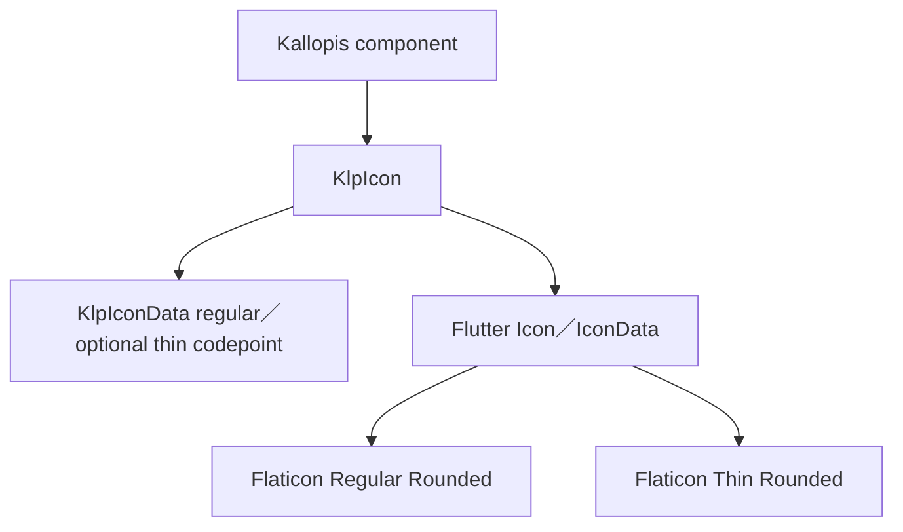

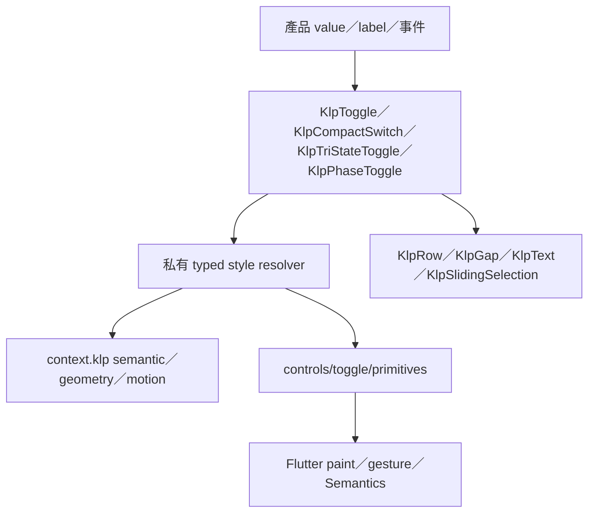

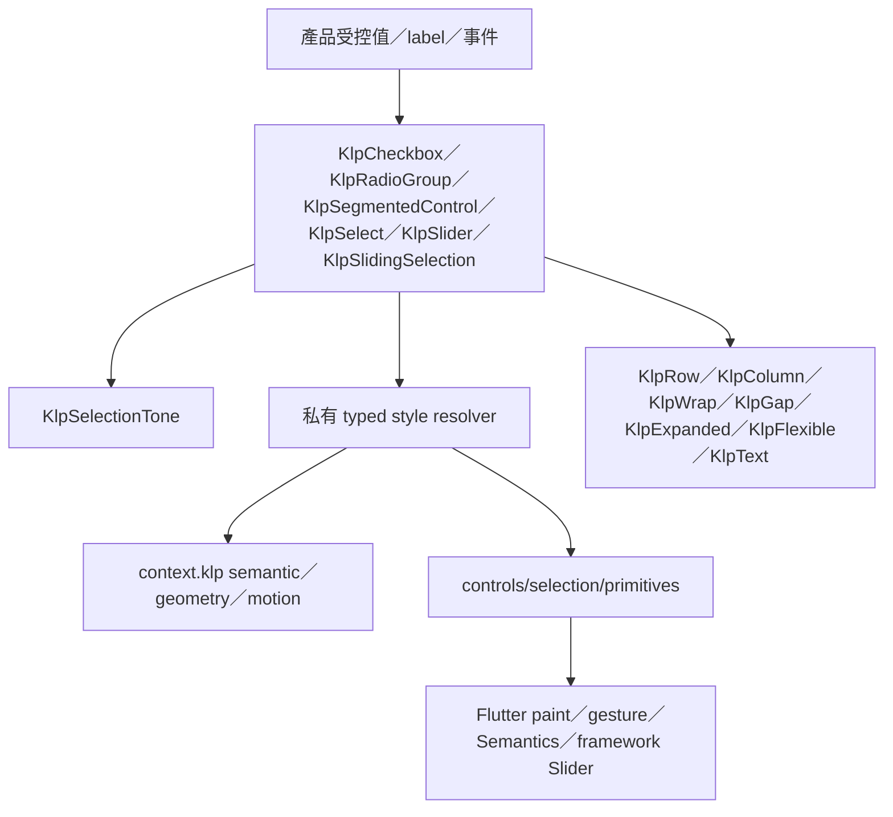

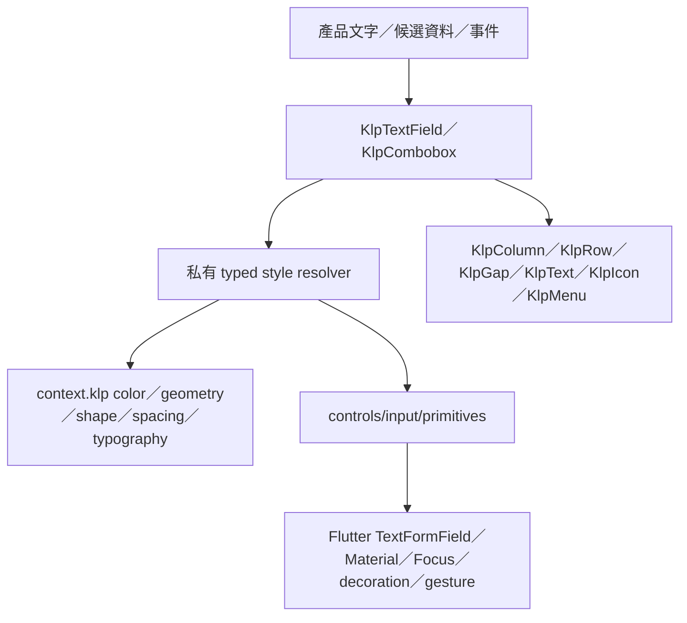

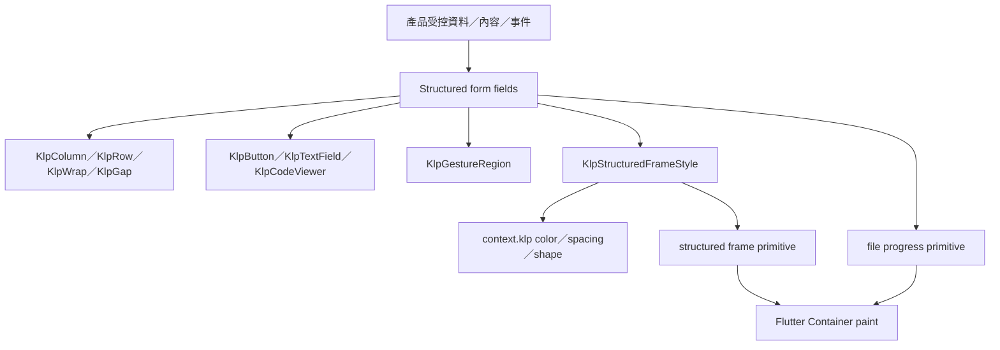

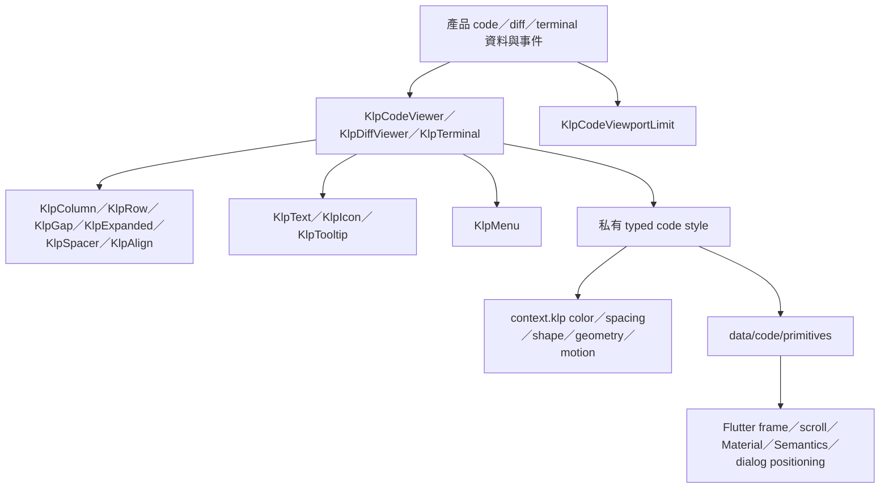

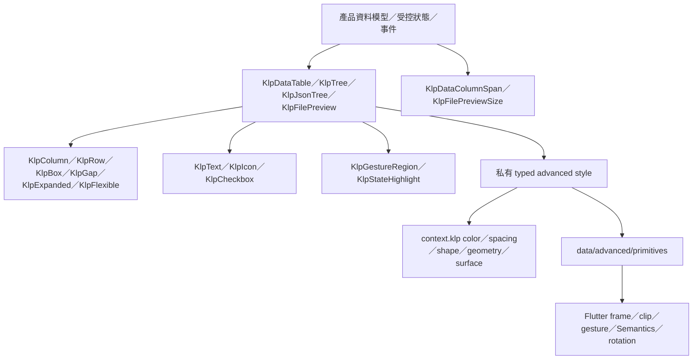

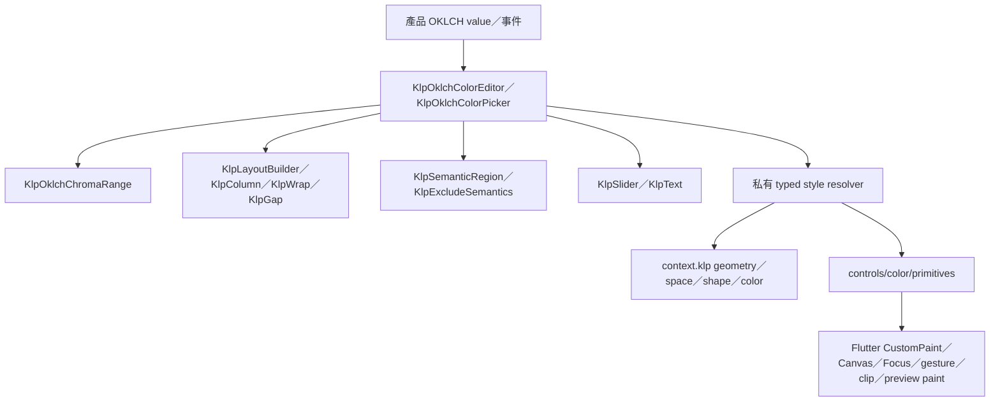

| KLP-SPLIT-LAYOUT | 以固定語意 pane 組成二欄或三欄分割版面 | leading、可選 center、trailing、KlpSplitPaneSize、KlpSpaceSize、虛線分隔開關 | 子內容事件原樣由呼叫端擁有 | 二欄／三欄；實心間距／虛線分隔；primary／secondary pane | primary 與 secondary 分別解析 geometry.layout.primaryPaneWidth／secondaryPaneWidth；間距只接受 KlpSpaceSize；高階層只使用 KlpRow 與 KlpExpanded；原生固定寬度與 divider frame 僅限 layout/primitives | SEM-SPLIT-LAYOUT-COMPOSITION | KlpRow、KlpExpanded、private split pane／divider frames | Kallopis | confirmed |

| KLP-STATUS-ROLE-SWATCHES | 呈現 Kallopis 狀態色彩角色並回傳受控選取 | label、helper、KlpStatusRole、onSelectRole | 點擊色票回傳 typed role | success／danger／warning／info；selected／unselected；interactive／static | 公開介面不接受 raw color 或字串角色；色票由 context.klp semantic colors 解析；高階層只使用 KlpColumn、KlpWrap、KlpRow、KlpGap、KlpGestureRegion、KlpText；原生色票 frame 僅限 form/selection/primitives | SEM-FORM-SELECTION-COMPOSITION | KlpColumn、KlpWrap、KlpRow、KlpGap、KlpGestureRegion、KlpText、private swatch frame | Kallopis | confirmed |

| KLP-THEME-PREVIEW-TILE | 以中性插圖預覽受控的顏色模式 | KlpThemePreviewMode、label、description、selected、enabled、onSelected | 選取事件原樣回傳 | light／dark／ultraDark／system／transparent；selected／unselected；enabled／disabled | 標準寬度解析 geometry.layout.themePreviewTileWidth，受父層約束時由 tile 自行收斂；停用透明度解析 surface.themePreviewDisabledOpacity；高階層只使用 KlpColumn、KlpGap、KlpText；原生 responsive frame、選取覆層與 painter 僅限 shell/theme/primitives | SEM-THEME-PREVIEW-COMPOSITION | KlpColumn、KlpGap、KlpText、private tile／artwork／painter primitives | Kallopis | confirmed |

| KLP-PREVIEW-TREE-COMPOSITION | 將呼叫端提供的非正式內容投影為可存取的預覽樹，並與正式導覽模型分離 | label、KlpPreviewTreeNode、enabled、onSelected、可選狀態文字與子節點；overlay 接收 child、visible、KlpWorkflowProgress | enabled 時回傳選取 ID；disabled 或 overlay visible 時封鎖指標事件；資料與流程 authority 留在呼叫端 | 空／多節點；巢狀；enabled／disabled；overlay visible／hidden | 高階層只使用 Kallopis layout、semantic、interaction 與 tree 原語；不得擁有 Proposal、Note 等產品模型；公開介面不接收 raw 外觀值；每檔一份結構定義 | SEM-PREVIEW-TREE-COMPOSITION | KlpColumn、KlpSemanticRegion、KlpExcludeSemantics、KlpPointerBlocker、KlpTreeItem、KlpStack、KlpPositioned | Kallopis | confirmed |

| KLP-PANE-COMPOSITION | 以 theme breakpoint 切換 Pane 內容，並提供具展開語意的收合控制 | wide、compact、KlpResponsivePaneBreakpoint；icon、label、collapsed、onToggle | 依可用寬度投影單一內容；控制項回傳 toggle | compact／wide；collapsed／expanded；enabled／disabled／hover／focus | standard breakpoint 解析 geometry.layout.responsivePaneBreakpoint 並保留既有 960px；公開介面不得接收 raw double；高階層只使用 KlpLayoutBuilder、KlpActionRegion 與 KlpIcon；原生正方形 frame 僅限 pane/primitives；每檔一份結構定義 | SEM-PANE-COMPOSITION | KlpLayoutBuilder、KlpActionRegion、KlpIcon、private icon frame | Kallopis | confirmed |

| KLP-APP-SCREEN-COMPOSITION | 提供應用程式最外層的 app surface、色彩作用域、可選 window header 與可伸展內容 | windowHeader、child | 子內容事件原樣由呼叫端擁有 | 有／無 window header | app 背景與前景 token 由 KlpSurfaceTone.app 解析；header 位於內容上方，內容以 KlpExpanded 取得剩餘高度；高階層只使用 Kallopis surface 與 layout 原語；透明 Material 根僅限 app_screen/primitives；每檔一份結構定義 | SEM-APP-SCREEN-COMPOSITION | KlpSurface、KlpColumn、KlpExpanded、private Material root | Kallopis | confirmed |

## Catalog 元件繼承樹

~~~mermaid
flowchart TD
	Manifest[Kallopis semantic manifest] --> Generator[Catalog registry generator]
	Generator --> Registry[generated catalog registry]
	ThemeScope[CatalogThemeScope] --> RootTheme[KlpVisualStyle／Theme]
	RootTheme --> Shell
	RootTheme --> Primary[KlpTheme.primary／onPrimary]
	Primary --> Button[KlpButton primary]
	Registry --> Group[CatalogGroup]
	Group --> Page[CatalogPageData]
	Page --> Specimen[Specimen]
	Shell[CatalogShell] --> Group
	Shell --> Page
	Specimen --> Component[Kallopis component]
	Component --> StyleGenerator[style semantics generator]
	StyleGenerator --> StyleTrace[generated CatalogStyleSemantics]
	StyleTrace --> Tooltip[KlpTooltip／KlpBadge]
	Shell --> Navigator[KlpNavigator]
	Navigator --> Category[KlpNavigatorCategory]
	Navigator --> Element[KlpNavigatorElement recursive]
	Navigator --> Component[KlpNavigatorComponent child slot]
~~~
## 元件繼承架構格式

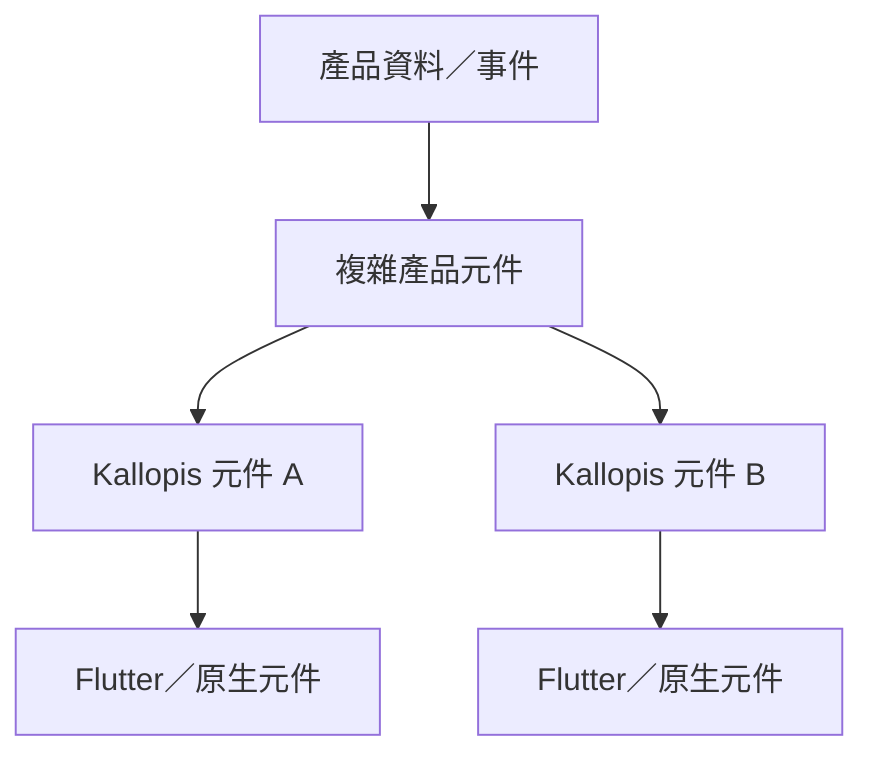

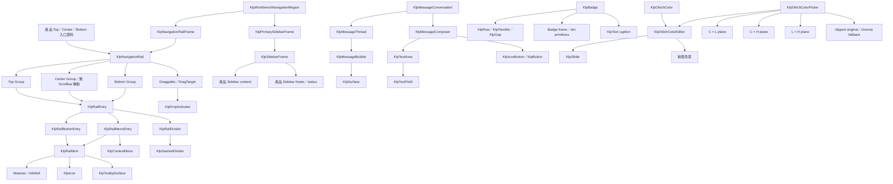

實際文件必須使用真實元件名稱，並說明每一層負責的狀態、幾何與互動。

## Layout 與事件邊界原語

本節供 Kallopis 消費端與維護者使用；讀者應能判斷產品可以注入哪些資料，以及哪些 Flutter 組裝細節必須留在 Kallopis。

| 元件 ID | 責任 | 輸入 | 輸出／事件 | 幾何 | 語意 | 底層組成 | 所有權 | 狀態 |
|---|---|---|---|---|---|---|---|---|
| KLP-ALIGN | 對齊單一 child | alignment、child | 無 | 不新增尺寸 | 沿用父層 constraints | Flutter `Align` | Kallopis | confirmed |
| KLP-WRAP | 依可用寬度排列並換行 | direction、alignment、typed spacing、children | 無 | spacing 與 run spacing 只由 `KlpSpaceSize` 解析 | `KlpSpacingTheme` | Flutter `Wrap` | Kallopis | confirmed |
| KLP-GESTURE-REGION | 將產品事件回呼接到通用手勢區域 | hit-test behavior、tap、double tap、pan callbacks、child | typed Flutter gesture callbacks | 不新增尺寸 | 無視覺狀態 | Flutter `GestureDetector` | Kallopis | confirmed |
| KLP-ADAPTIVE | 作為所有 screen 與元件唯一的平台策略入口 | 各平台 Widget builder、可選 typed 平台覆寫 | 建立單一平台分支 | 不擁有子元件幾何 | 平台由 App environment 解析 | `KlpEnvironmentScope`、平台策略 builder | Kallopis | confirmed |

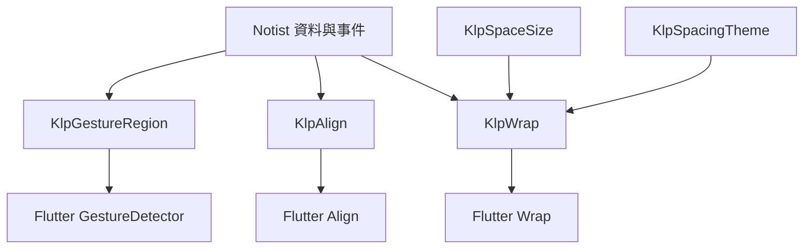

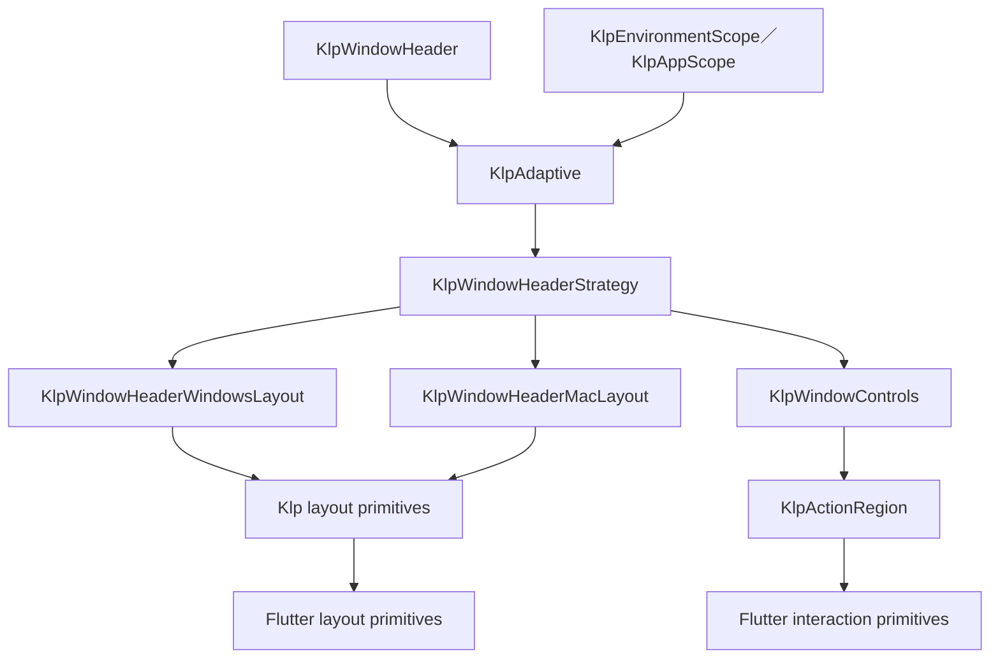

```text
composeWindowHeader(commonData, context):
	strategy = KlpWindowHeaderStrategy(commonData)
	return KlpAdaptive(
		windows = strategy.buildWindows,
		macos = strategy.buildMacOS
	)
	platform layouts compose only Klp layout and interaction primitives
```

```text
composeProductComponent(data, events, context):
	align content with KlpAlign
	resolve KlpWrap spacingSize through context.klp.space
	forward product callbacks through KlpGestureRegion
	keep Flutter layout and gesture widgets inside Kallopis
```
