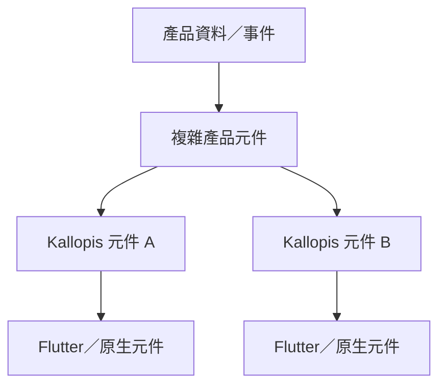
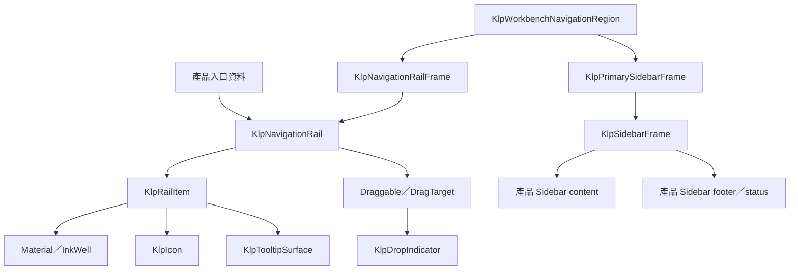

# 元件需求與繼承

所有新增或被修改的元件，實作前必須先登錄。複雜元件必須列出底層組成；「自訂 Widget」不是足夠的繼承說明。

每個 confirmed screen tree 可到達的全部元件都必須有需求列，包含未在本次修改但會參與體驗的元件。任一節點缺少需求列時，該 screen 不得定型。既有 `docs/architecture/components/` 可協助盤點現況，但不能取代本表的需求與語意。

## 元件需求表

| 元件 ID | 責任 | 輸入 | 輸出／事件 | 狀態 | 幾何 | 語意 | 底層組成 | 所有權 | 定型狀態 |
|---|---|---|---|---|---|---|---|---|---|
| KLP-APP | 提供 MaterialApp、theme、locale、router 與桌面視窗接入 | home／router、style、theme mode、window header | theme 與 window lifecycle | theme mode、brightness、maximized | KlpGeometryTheme | app root | MaterialApp、KlpWindowHeader、KlpRouterScope | Kallopis | confirmed |
| KLP-THEME-RUNTIME | 將完整 ThemeExtension 解析成元件可讀值 | BuildContext、KlpVisualStyle | context.klp／context.klpColors | 完整風格、fallback、局部色彩 override | semantic／component resolver | theme runtime | Theme、ThemeExtension、KlpTokenOverride | Kallopis | confirmed |
| KLP-WORKBENCH-SHELL | 組合 primary、stage 與 optional secondary 區域 | pane、可見性、尺寸、事件 | resize／collapse 事件 | 展開、收合、調整尺寸 | 依已確認 screen 規格 | workbench region | Kallopis layout primitives | Kallopis | confirmed |
| KLP-WORKBENCH-HEADER | 依 pane 狀態配置 identity、Stage top bar、toggle 與視窗控制 | pane width／visible、產品標題與動作 | pane toggle、window actions | primary／secondary 展開收合 | KlpGeometryTheme.layout | workbench chrome | KlpWindowHeader、KlpStageTopBar、KlpIconButton | Kallopis | confirmed |
| KLP-STAGE-FRAME | 組合 Stage surface、header、content 與 status | 產品語意文字、content、status | 內容事件由產品處理 | header／status 可選 | spacing、shape、surface semantic | stage region | KlpTokenOverride、KlpStageHeader、KlpStatusBar | Kallopis | confirmed |
| DESIGNIST-INSPECTOR-CONTENT | 呈現 Designist 檢查內容；未來可能注入左側 Sidebar | 產品或 AI 回傳資料 | 套用、拒絕或其他待確認事件 | 依未來需求確認 | 未確認 | inspector content | 既有 Inspector blocks | Designist 資料＋Kallopis 呈現 | proposed |
| KLP-NAVIGATION-RAIL | 垂直排列只有圖示的主要入口，並可將固定 leading 與可排序項目分段 | leading、item widgets、可選 reorder callback | item 自行輸出點擊；拖曳接受後回傳 old/new index | hover、focus、selected、disabled、badge、dragging、drop-before、drop-after | item 32px；內距與 item gap 使用 compact 8px；水平插入線同 item 寬且 2px | primary navigation rail | KlpNavigationRail、KlpRailItem、Draggable、DragTarget、KlpDropIndicator | Kallopis | confirmed |
| KLP-NAVIGATION-RAIL-FRAME | 為主要導覽 Rail 提供獨立 surface | child | 子元件事件 | 內容狀態由 child 擁有 | 48px width；KlpPanelFrame surface 與 radius | navigation rail surface | KlpPanelFrame | Kallopis | confirmed |
| KLP-WORKBENCH-NAVIGATION-REGION | 將獨立 Rail 與 Sidebar 並排成共同收合區域 | rail、sidebar | 子元件事件 | 由外層控制顯示與 resize | Rail 48px；兩 surface 間 compact 8px；Sidebar 填滿剩餘寬度 | workbench primary navigation region | Row、SizedBox、Expanded | Kallopis | confirmed |
| KLP-PRIMARY-SIDEBAR-FRAME | 組合上下文 Sidebar 的 header、navigation、content 與 footer | header、navigation、content、footer | 子元件事件 | 內容 destination | 使用傳入的 Sidebar 寬度；水平 padding 使用 compact 8px | context sidebar surface | KlpSidebarFrame | Kallopis | confirmed |

## 元件繼承架構格式

實際文件必須使用真實元件名稱，並說明每一層負責的狀態、幾何與互動。
