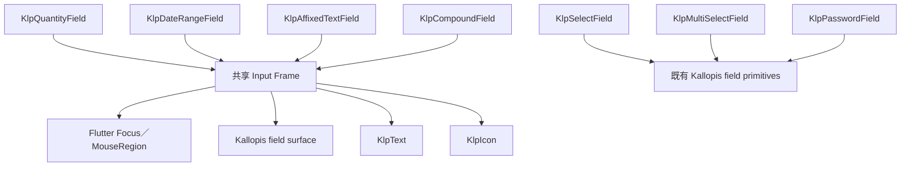
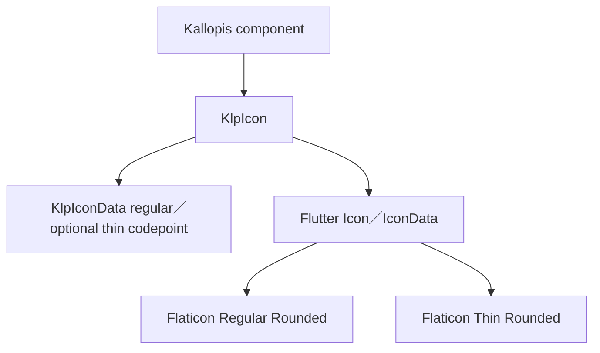
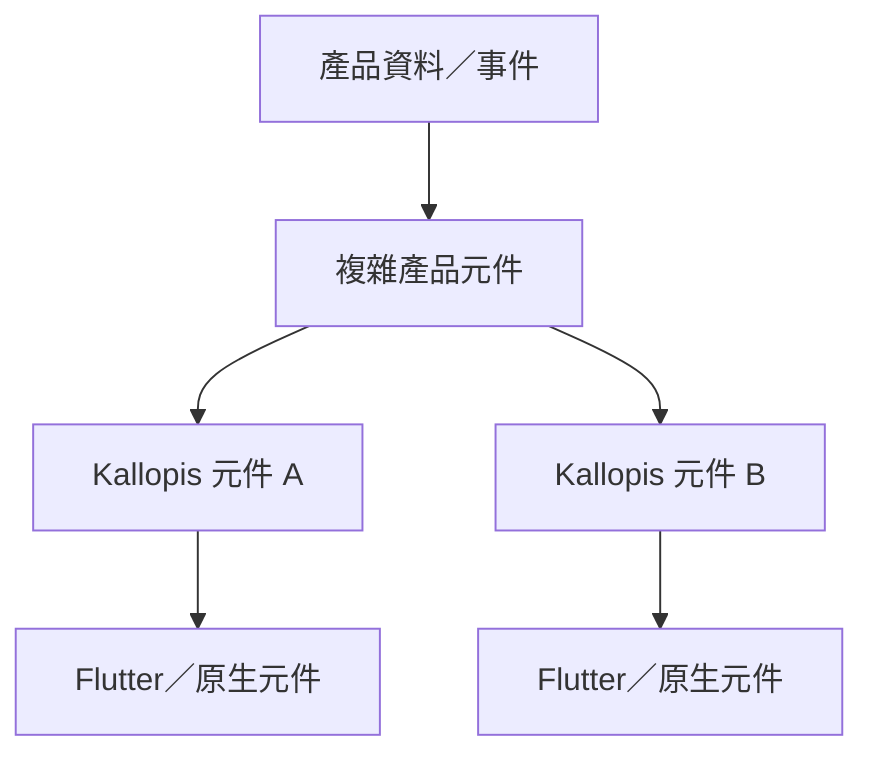
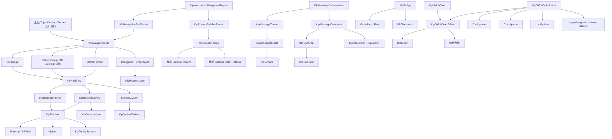

# 元件需求與繼承

所有新增或被修改的元件，實作前必須先登錄。複雜元件必須列出底層組成；「自訂 Widget」不是足夠的繼承說明。

每個 confirmed screen tree 可到達的全部元件都必須有需求列，包含未在本次修改但會參與體驗的元件。任一節點缺少需求列時，該 screen 不得定型。既有 `docs/architecture/components/` 可協助盤點現況，但不能取代本表的需求與語意。

## Form Input Types 元件登錄

| 元件 ID | 責任 | 輸入 | 輸出／事件 | 狀態 | 幾何 | 語意 | 底層組成 | 所有權 | 定型狀態 |
|---|---|---|---|---|---|---|---|---|---|
| KLP-QUANTITY-FIELD | 以減少／增加按鈕調整受界線約束的數量 | label、value、step、minimum、maximum、enabled、readOnly、error | onChanged | rest／hover／focus／filled／disabled／read-only／error | MD field 40px；兩側 action slot 與 field 等高 | SEM-FORM-INPUT-FRAME | Focus、KlpSurface、KlpIcon、KlpText | Kallopis | confirmed |
| KLP-DATE-RANGE-FIELD | 在單一欄位中編輯起訖日期 | label、start／end value、placeholder、enabled、readOnly、error | onStartChanged、onEndChanged、onCalendarPressed | 同上 | MD field 40px；兩個彈性 segment 與固定 separator／action | SEM-FORM-INPUT-FRAME | TextFormField、KlpIcon、KlpText | Kallopis | confirmed |
| KLP-AFFIXED-TEXT-FIELD | 在文字輸入旁提供不可編輯前綴與尾端動作 | label、value、prefix、suffix action、enabled、readOnly、error | onChanged、onAction | 同上 | MD field 40px；affix／action 為固定 segment | SEM-FORM-INPUT-FRAME | TextFormField、KlpIcon、KlpText | Kallopis | confirmed |
| KLP-COMPOUND-FIELD | 在同一控制框中組合主要文字與受控尾端選項 | label、value、options、selected option、enabled、readOnly、error | onChanged、onOptionSelected | 同上 | MD field 40px；主 segment 彈性、option segment 依內容 | SEM-FORM-INPUT-FRAME | TextFormField、KlpText、KlpMenu／inline option list | Kallopis | confirmed |
| KLP-SELECT-FIELD | 顯示單選值並選取一個 option | 既有公開 API | onSelected | 既有狀態並納入 Input Types 展示 | 既有 field geometry | SEM-FORM-INPUT-FRAME | KlpStrokeFrame、KlpText | Kallopis | confirmed |
| KLP-MULTI-SELECT-FIELD | 顯示並切換多個標籤值 | 既有公開 API | onChanged | 既有狀態並納入 Input Types 展示 | 既有 field／chip geometry | SEM-FORM-INPUT-FRAME | KlpTagChip、KlpText | Kallopis | confirmed |
| KLP-PASSWORD-FIELD | 輸入敏感值並切換顯示狀態 | 既有公開 API | onChanged、show／hide | 既有狀態並納入 Input Types 展示 | 既有 field geometry | SEM-FORM-INPUT-FRAME | TextFormField、KlpText | Kallopis | confirmed |

## 元件需求表

| 元件 ID | 責任 | 輸入 | 輸出／事件 | 狀態 | 幾何 | 語意 | 底層組成 | 所有權 | 定型狀態 |
|---|---|---|---|---|---|---|---|---|---|
| KLP-APP | 提供 MaterialApp、theme、locale、router 與桌面視窗接入 | home／router、style、theme mode、window header | theme 與 window lifecycle | theme mode、brightness、maximized | AppFrame 鋪 app background，以 appFrameInset 包住 Window Header 與 Panel Tree；Header 自身使用 windowHeaderMargin | SEM-SCOPED-SPACING | MaterialApp、Padding、KlpWindowHeader、KlpRouterScope | Kallopis | confirmed |
| KLP-THEME-RUNTIME | 將完整 ThemeExtension 解析成元件可讀值 | BuildContext、KlpVisualStyle | context.klp／context.klpColors | 完整風格、fallback、局部色彩 override | semantic／component resolver | theme runtime | Theme、ThemeExtension、KlpTokenOverride | Kallopis | confirmed |
| KLP-WORKBENCH-SHELL | 提供固定三欄相容模式，或以 Dock 模式組合固定 Stage 周圍的可停駐 Areas | 固定模式的 panes／寬度／事件；Dock 模式的 stage、panels、layout、Area constraints | 固定模式 resize／collapse；Dock 模式 onLayoutChanged | 固定三欄或 Dock Area／Group 狀態 | 固定模式沿用既有 pane geometry；Dock 模式完整委派 SEM-DOCK-LAYOUT | workbench region、SEM-DOCK-LAYOUT | Kallopis layout primitives、KlpDockLayout | Kallopis | confirmed |
| IST-WORKBENCH-SCREEN | 為 IST 系列子產品固定 AppScreen、Rail 與 Dock 的基礎畫面 | window header、rail leading／children／reorder、stage、panel registry、受控 layout、Area constraints | Rail item 事件、onRailReorder、onLayoutChanged | Rail 固定顯示；Dock 狀態完全由子產品控制 | workbenchContentInset 預設 4px；Rail 48px；Rail 與 Dock 間 chromeGap 預設 8px；Dock 填滿剩餘空間 | SEM-IST-WORKBENCH-SCREEN-COMPOSITION、SEM-SCOPED-SPACING | Padding、Row、KlpNavigationRailFrame、KlpNavigationRail、Expanded、KlpDockLayout | Kallopis IST 產品族配方；子產品擁有資料與狀態 | confirmed |
| KLP-NOTE-VISUAL-STYLE | 套用可共享的筆記工作台密度與視覺節奏 | 基礎 KlpVisualStyle | 完整 Note visual style | 無產品狀態 | 只覆寫 spacing 與 layout geometry | note visual recipe | KlpVisualStyle、KlpSpacingTheme、KlpGeometryTheme | Kallopis | confirmed |
| KLP-NOTE-BLOCK | 呈現筆記區塊選取底色、六點 handle 與內容插槽 | child、selected／hovered、authority 提供的 geometry、callbacks | handle anchor、selected、content pressed | rest／hover／selected | 不自行推導內容 layout | note block chrome | KlpPressable、KlpStateHighlight、Stack | Kallopis 視覺；Krepis authority | confirmed |
| KLP-NOTE-WORKBENCH | 組合筆記側欄、檔案樹與單一 Stage 的視覺節奏 | primary、stage、consumer-owned navigation／files／events | resize 與所有子元件事件原樣回傳 | primary 顯示／收合 | Note visual style 的外距、pane gap、列高與 section rhythm | note workbench chrome | KlpWorkbenchShell、KlpPrimarySidebarFrame、KlpFileExplorer | Kallopis 視覺；Notist 組合 | confirmed |
| KLP-DOCK-LAYOUT | 以固定 Stage 組合左、下、右可停駐 Area | panel registry（含 allowBottom／allowSide／actions）、layout、Area constraints | onLayoutChanged | Area 顯示／關閉／同一手勢邊界重開、雙軸 resize、active tab、合法目的區域判定、空 Area 建立、拖曳合併／拆分／排序 | Panel Frame 外距解析 dockMargin，AppFrame 解析 appFrameInset；Area resize hit target 解析 resizeHandleExtent；Area 與 Group 使用像素 extent；每個 Area 分隔線是持續掛載的 root overlay；Area 與 Group separator 皆由滑鼠絕對位置解析，min／max 截止後需追上實際分隔線才繼續；Area 越過 closeThreshold 收合後可在同一手勢反向越過門檻並以 minExtent 展開 | SEM-DOCK-LAYOUT、SEM-SCOPED-SPACING | LayoutBuilder、ColoredBox、Stack、Positioned、KlpPanelFrame、KlpDockHeader、GestureDetector、Draggable、DragTarget、Dock internal helpers | Kallopis | confirmed |
| KLP-DOCK-HEADER | 提供 Dock Group 專用的緊湊標題、tabs 與產品 actions | leading、結構化 actions、可選 drag region builder | action callback；tabs 事件由 leading 回傳 | 單標題／多 tabs、水平捲動、actions 逐個 overflow | 固定 32px；至少保留一個 32px leading slot；action 以 32px inline icon button 排列 | SEM-DOCK-HEADER | LayoutBuilder、SingleChildScrollView、Listener、KlpIconButton、KlpContextMenu | Kallopis | confirmed |
| KLP-WORKBENCH-HEADER | 依 pane 狀態配置 identity、Stage top bar、toggle 與視窗控制 | pane width／visible、產品標題與動作 | pane toggle、window actions | primary／secondary 展開收合 | KlpGeometryTheme.layout | workbench chrome | KlpWindowHeader、KlpStageTopBar、KlpIconButton | Kallopis | confirmed |
| KLP-WINDOW-HEADER | 呈現 App identity、產品動作與平台視窗控制，並提供全表面視窗拖動 | title、leading、titleTrailing、actions、trailing、window callbacks | 子元件事件、平台 drag、非互動區雙擊 maximize | Windows／Linux、macOS；一般點擊／拖動／雙擊 | 高度包含可視 windowHeaderHeight 與 Header 自身四周 windowHeaderMargin；外層由 AppFrame 的 appFrameInset 包住 | SEM-WINDOW-HEADER-DRAG、SEM-SCOPED-SPACING | GestureDetector、Padding、Material、Row／Stack、KlpWindowControls | Kallopis | confirmed |
| KLP-STAGE-FRAME | 組合 Stage surface、header、content 與 status | 產品語意文字、content、status | 內容事件由產品處理 | header／status 可選 | spacing、shape、surface semantic | stage region | KlpTokenOverride、KlpStageHeader、KlpStatusBar | Kallopis | confirmed |
| KLP-PANEL-FRAME | 組合通用 panel 的 header、content 與可選 footer | header、content、footer、height、background、padding、可選 contentScrollController | 子元件事件與內容捲動原樣回傳 | header／footer 可選；背景可覆寫；有／無受控內容捲動 | 外圓角解析 shape.card（預設 8px）；內層 clip 解析 card - stroke（預設 6px）；內容保持 panel padding，受控 Scrollbar 置中於尾側 8px padding 槽 | SEM-COMPACT-PANEL-RADIUS、SEM-PANEL-SCROLLBAR-GUTTER | DecoratedBox、ClipRRect、KlpTokenOverride、Padding、Column、ScrollbarTheme、Scrollbar、ScrollConfiguration | Kallopis | confirmed |
| KLP-STAGE-HEADER | 呈現 Stage 的專案、區域、標題、類型與可選動作 | projectName、sectionLabel、title、typeLabel、actions | 動作事件由傳入元件處理 | 標題依可用寬度自動換行；actions 可省略 | KlpSpacingTheme | stage identity | Row、Column、KlpText、actions slot | Kallopis | confirmed |
| DESIGNIST-INSPECTOR-CONTENT | 呈現 Designist 檢查內容；未來可能注入左側 Sidebar | 產品或 AI 回傳資料 | 套用、拒絕或其他待確認事件 | 依未來需求確認 | 未確認 | inspector content | 既有 Inspector blocks | Designist 資料＋Kallopis 呈現 | proposed |
| KLP-NAVIGATION-RAIL | 垂直排列只有圖示的主要入口，固定由 Top、Center、Bottom 三個 Group 組成 | topGroup、centerGroup、bottomGroup；各組 `List<KlpRailEntry>`、isReorderable 與可選 reorder callback | Button／Menu entry 輸出事件；可排序組內拖曳接受後回傳 old/new index；跨組與不可排序組拒絕 | hover、focus、selected、badge、menu-open、dragging、drop-before、drop-after、center-overflow | item 32px；內距與 item gap 使用 compact 8px；Top 貼上、Bottom 貼下；Center 取得剩餘高度且內容置頂，溢出時無 Scrollbar 捲動；Top 下方與 Bottom 上方依內容加入低對比 hairline KlpRailDivider；水平插入線同 item 寬且 2px | SEM-WORKBENCH-RAIL | KlpNavigationRail、KlpRailItemGroup、KlpRailEntry、KlpRailButtonEntry、KlpRailMenuEntry、KlpRailDivider、KlpRailItem、SingleChildScrollView、Draggable、DragTarget、KlpDropIndicator | Kallopis | confirmed |
| KLP-RAIL-ENTRY | 限制 Rail 可注入內容並分離資料與單項視覺 | 穩定 id；Button／Menu／Divider 具體型別 | 由具體 Entry 定義 | 可拖曳／固定 | 不直接擁有幾何 | primary navigation entry contract | Dart abstract base class | Kallopis | confirmed |
| KLP-RAIL-BUTTON-ENTRY | 描述一般 Rail 動作 | id、icon、label、onPressed、selected、badge | onPressed | selected／badge | 委派 KlpRailItem | SEM-WORKBENCH-RAIL | KlpRailEntry、KlpRailItem | Kallopis | confirmed |
| KLP-RAIL-MENU-ENTRY | 描述由 Rail 開啟的既有 Kallopis 選單 | id、icon、label、menu items、selected、badge | menu item callbacks | selected／badge／menu-open | item 委派 KlpRailItem；浮層委派 KlpContextMenu | SEM-WORKBENCH-RAIL | KlpRailEntry、KlpRailItem、KlpContextMenu、KlpMenuItemData | Kallopis | confirmed |
| KLP-RAIL-DIVIDER | 在 Rail 中提供不可拖曳、無事件的語意分隔 | id | 無 | 靜態 | 使用 KlpDashedDivider；粗細解析 shape.hairline，低對比色解析 color.guide＋shape.dashedOpacity | SEM-WORKBENCH-RAIL | KlpRailEntry、KlpDashedDivider | Kallopis | confirmed |
| KLP-NAVIGATION-RAIL-FRAME | 為主要導覽 Rail 提供獨立 surface | child | 子元件事件 | 內容狀態由 child 擁有 | 48px width；KlpPanelFrame surface 與 radius | navigation rail surface | KlpPanelFrame | Kallopis | confirmed |
| KLP-WORKBENCH-NAVIGATION-REGION | 將獨立 Rail 與 Sidebar 並排成共同收合區域 | rail、sidebar | 子元件事件 | 由外層控制顯示與 resize | Rail 48px；兩 surface 間 compact 8px；Sidebar 填滿剩餘寬度 | workbench primary navigation region | Row、SizedBox、Expanded | Kallopis | confirmed |
| KLP-PRIMARY-SIDEBAR-FRAME | 組合上下文 Sidebar 的 header、navigation、content 與 footer | header、navigation、content、footer | 子元件事件 | 內容 destination | 使用傳入的 Sidebar 寬度；水平 padding 使用 compact 8px | context sidebar surface | KlpSidebarFrame | Kallopis | confirmed |
| KLP-NAVIGATOR | 以單一 Sidebar 導覽表面組合分類、元素與任意元件 | `List<KlpNavigatorItem>`，具體型別只允許 Category／Element／Component；受控 expanded／selected IDs、callbacks 與可選 ScrollController | category toggle、element toggle、element selected；Component 保留自身事件；捲動由共用 controller 回傳 | Category 展開／收合；Element 展開／選取／hover；根層或分類內；空清單 | Category header 與 Element row 完整沿用 Catalog 目錄既有高度；縮排沿用 tight；Component 不套固定高度；放入 KlpPanelFrame 時共用 controller，使 Scrollbar 留在 panel padding 槽 | SEM-NAVIGATOR-COMPOSITION、SEM-PANEL-SCROLLBAR-GUTTER | KlpSurface、ListView、InheritedWidget、KlpPressable、KlpStateHighlight、KlpIcon、KlpText、任意 child slot | Kallopis | confirmed |
| KLP-MESSAGE-BUBBLE | 呈現作者、時間與貼合正文寬度的訊息 surface | author、timestamp、child、alignment、background、dense | 無 | leading／trailing；有／無背景 | dense 時 metadata gap、body gap、surface padding 皆為 compact 8px；啟用背景時使用 muted surface，確保與所在內容區可辨識；角色仍由 leading／trailing 區分 | SEM-READABLE-MESSAGE-BUBBLE | Align、Column、Row、KlpText、KlpSurface | Kallopis | confirmed |
| KLP-MESSAGE-THREAD | 依序排列訊息 | messages、load older action、dense | 載入較早訊息事件 | 一般／dense | dense 訊息間距為 compact 8px | message sequence | Column、KlpMessageBubble、KlpButton | Kallopis | confirmed |
| KLP-MESSAGE-COMPOSER | 以標籤、輸入與動作組成訊息輸入器 | tags、draft、actions、dense、inlineActions、outlined、maxLines | changed／attach／send | stacked／inline；有限／無限行；有限高度內部捲動 | dense padding 8px；muted surface；inline gap 8px | message composition | KlpSurface、KlpBadge、KlpTextArea、KlpIconButton、KlpButton | Kallopis | confirmed |
| KLP-MESSAGE-CONVERSATION | 在有限內容區組合訊息列表與 Composer | content、composer | 子元件事件 | 訊息列表剩餘空間、Composer 增長／內部捲動 | 內容上／左右 8px；Composer 上／左右 2px、狀態列前 4px；Composer 最大高度為可用內容高度 | conversation region | Padding、LayoutBuilder、Column、Expanded、ConstrainedBox | Kallopis | confirmed |
| KLP-OUTLINED-TEXT-FIELD | 以明確邊框呈現可聚焦文字輸入 | KlpTextField／KlpTextArea outlined、unboundedLines | change／submit／focus | idle／focused／disabled／error；有限／無限行 | outlined 寬度至少 shape.stroke 2px；focused 使用 interaction，其餘使用 border；radius 使用 resolved fieldRadius；unboundedLines 在有限高度內交由 TextFormField 捲動 | outlined input | Container、Focus、TextFormField | Kallopis | confirmed |
| KLP-BADGE | 以可清楚掃讀且低於操作控制項的尺寸呈現短狀態、分類或數量 | label、tone、variant、dot | 無 | filled／outline／solid；neutral／feedback tone；可選 dot | caption 12px／16px；水平內距 6px、垂直內距 2px；pill 圓角；最終高度約 20px | readable status badge | Container、Row、KlpText | Kallopis | confirmed |
| KLP-SCHEDULE-LIST | 以固定時間欄、標題與選填標籤呈現排程 | items（time、title、tag） | 無 | 空清單／有資料；有／無 tag | 時間欄最小寬度解析 space.sectionLarge；時間 maxLines = 1 且 overflow = ellipsis，不因欄寬不足換行 | SEM-SCHEDULE-TIME-COLUMN | Column、KlpSurface、Row、SizedBox、KlpText、KlpBadge | Kallopis | confirmed |
| KLP-DATE-GRID | 以固定七欄呈現日期、內容與選取狀態 | items（label、lines、selected）、onSelected | selected index | 一般日／週末／選取；空清單／多列 | 相鄰格以 shape.hairline 1px 實線分隔；只由 leading cell 畫 trailing／bottom 邊線以避免重疊；第 1、7 欄使用 muted surface，selected 使用 component surface 並優先 | SEM-DATE-GRID-WEEKEND | GridView、GestureDetector、KlpSurface、Border、KlpText | Kallopis | confirmed |
| KLP-OKLCH-COLOR-EDITOR | 以 OKLCH 四軸編輯一個色彩值 | value、onChanged、maxChroma | Lightness／Chroma／Hue／Alpha slider change | enabled／disabled；寬版橫排／窄版換行 | 控制寬度解析 control.colorPlaneExtent；間距、字體與 slider 皆取自 context.klp | color channel controls | KlpSlider | Kallopis | frozen-component |
| KLP-OKLCH-COLOR-PICKER | 以三個二維色盤、四軸控制與雙預覽編輯 OKLCH | value、onChanged、maxChroma | pointer drag、keyboard arrows、slider change | focused／unfocused；in-gamut／out-of-gamut；wide wrap／narrow stack | plane extent 解析 control.colorPlaneExtent；paint→border→cursor；clip 同時限制 paint 與 hit-test | OKLCH color picker | LayoutBuilder、Wrap、Focus、GestureDetector、CustomPaint、KlpOklchColorEditor、KlpText | Kallopis | frozen-component |

| KLP-SEMANTIC-INHERITANCE-SCOPE | 在複合元件內向子樹提供已解析的預設產品風格 | manifest recipe、ancestor Kallopis scope、brand identity | descendant dependency update | default／nearest legal scope；user recipe isolated | 不新增產品端幾何；值由 semantic resolver 決定 | Kallopis style inheritance | InheritedWidget／InheritedTheme、KlpTheme runtime | Kallopis | confirmed-requirement |
| KLP-CATALOG-MANIFEST | 宣告預設風格政策、四層分類與 Catalog page 註冊 | versioned JSON | generator input | schema v1 | 不擁有畫面幾何 | semantic taxonomy SSOT | JSON Schema | Kallopis | confirmed |
| KLP-CATALOG-THEME-SCOPE | 將 Brand 頁編輯值提升至 Catalog root 並通知整棵子樹 | KlpOklchColor、onChanged、child | descendant dependency update | default／edited | 無 | SEM-BRAND-PRIMARY | InheritedWidget、KlpVisualStyle、Theme | Kallopis Catalog | confirmed |
| KLP-BUTTON-PRIMARY | 以不透明主題色與亮度判斷前景呈現主要動作 | tone primary、selected、enabled | press／long press | idle／hover／focus／selected／disabled | XS／SM／MD／LG／XL = 28／32／36／40／48px；各尺寸由 control geometry 解析 | SEM-BRAND-PRIMARY、SEM-PRIMARY-CONTRAST-A0、SEM-COMPACT-BUTTON-GEOMETRY、SEM-PRIMARY-LABEL-WEIGHT | Container、KlpPressable、KlpText；KlpTheme.primary／primaryForegroundFor | Kallopis | confirmed |
| KLP-CATALOG-REGISTRY-GENERATOR | 驗證 manifest 並產生 Catalog registry | manifest、--check | generated Dart／stale failure | generate／check | 無 | manifest compiler | dart:convert、dart:io | Kallopis tooling | confirmed |
| KLP-CATALOG-GROUP | 以穩定 ID、顯示名稱與說明組合 pages | id、label、description、pages | navigation group data | immutable | 無 | semantic layer | CatalogPageData | Kallopis Catalog | confirmed |
| KLP-CATALOG-SHELL | 以 generated groups 與 KlpDockLayout 呈現分類導覽及既有 page | groups、pages、selected、onSelected、受控 dock layout | page selection、onLayoutChanged、目錄捲動 | selected／collapsed group／目錄左右停駐 | AppFrame 以 appFrameInset 4px 包住 Header 與 CatalogShell；Header 與 Panel Frame 各用 windowHeaderMargin／dockMargin 4px；目錄維持既有 200／260px 響應寬度，Side limits 180–360px；目錄 Scrollbar 置中於 chromePanelInset 8px 槽 | catalog navigation、SEM-SCOPED-SPACING、SEM-PANEL-SCROLLBAR-GUTTER | KlpDockLayout、KlpDockPanel、KlpPanelFrame、KlpExplorer、Catalog canvas | Kallopis Catalog | confirmed |
| KLP-CATALOG-SPECIMEN-SECTION | 在既有 Catalog page 內建立可見的局部 specimen 分組 | Specimen.sectionLabel、specimen list | 無；只建立內容階層 | label 缺席／開啟新分組 | 標題使用 Kallopis bodyStrong；與首個 specimen 間距使用 compact | Catalog page content hierarchy | CatalogShell、KlpText、Specimen | Kallopis Catalog | confirmed |
| KLP-CATALOG-STYLE-TRACE | 為每個 specimen 顯示由元件原始碼推導的風格語意 | specimen name、generated semantic references | 可見 description＋hover tooltip | 有語意／未直接宣告；generated data 過期 | description 直接列出 source 與八類實際值；標記沿用 KlpBadge，完整多行訊息沿用 KlpTooltip | SEM-CATALOG-STYLE-TRACE | CatalogStyleSemantics、KlpText、KlpBadge、KlpTooltip、source generator | Kallopis Catalog／tooling | confirmed |
| KLP-ICON | 以產品中立語意圖示呈現可選線條粗細 | KlpIconData、size、color、semanticLabel、weight | Flutter Icon | thin／regular；Thin 缺少同名 glyph 時回退 regular | size 解析 KlpSpacingTheme.icon 或呼叫端語意尺寸 | SEM-ICON-STROKE-WEIGHT | Flutter Icon、IconData、Flaticon Regular／Thin Rounded font | Kallopis | confirmed |

## Catalog 元件繼承樹

~~~mermaid
flowchart TD
	Manifest[Kallopis semantic manifest] --> Generator[Catalog registry generator]
	Generator --> Registry[generated catalog registry]
	ThemeScope[CatalogThemeScope] --> RootTheme[KlpVisualStyle／Theme]
	RootTheme --> Shell
	RootTheme --> Primary[KlpTheme.primary／onPrimary]
	Primary --> Button[KlpButton primary]
	Registry --> Group[CatalogGroup]
	Group --> Page[CatalogPageData]
	Page --> Specimen[Specimen]
	Shell[CatalogShell] --> Group
	Shell --> Page
	Specimen --> Component[Kallopis component]
	Component --> StyleGenerator[style semantics generator]
	StyleGenerator --> StyleTrace[generated CatalogStyleSemantics]
	StyleTrace --> Tooltip[KlpTooltip／KlpBadge]
	Shell --> Navigator[KlpNavigator]
	Navigator --> Category[KlpNavigatorCategory]
	Navigator --> Element[KlpNavigatorElement recursive]
	Navigator --> Component[KlpNavigatorComponent child slot]
~~~
## 元件繼承架構格式

實際文件必須使用真實元件名稱，並說明每一層負責的狀態、幾何與互動。
