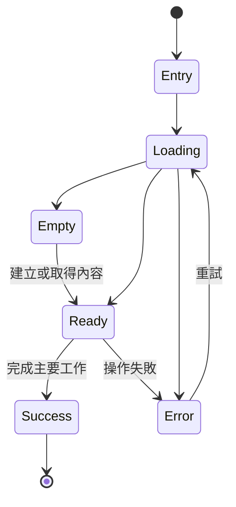
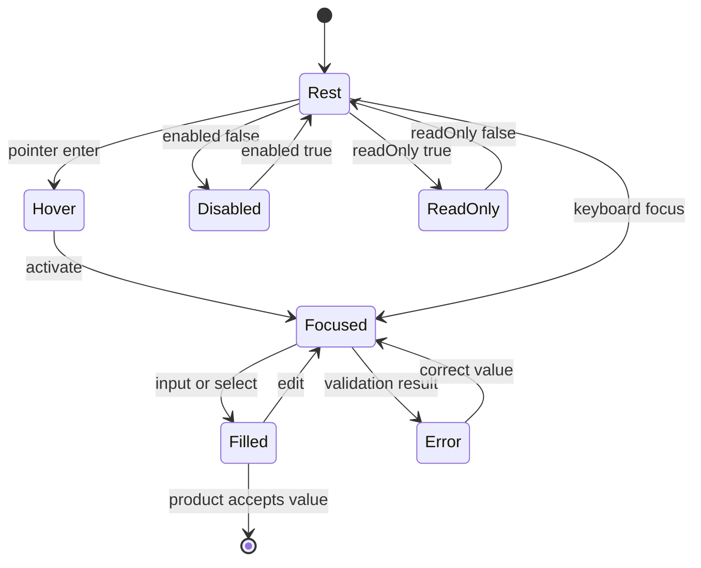

# 用戶體驗生命週期

每個可進入的產品體驗都必須有一筆流程。不要只記錄理想成功路徑；載入、空白、失敗、復原與離開都屬於完整體驗。

若流程中仍有無法命名的狀態、沒有出口的錯誤，或未定義的中止／返回行為，關聯 screen 不得定型。

## 流程登錄表

| 體驗 ID | 使用者目標 | 入口 | 主要流程 | 空白／載入 | 錯誤／復原 | 完成／離開 | 關聯 Screen | 狀態 |
|---|---|---|---|---|---|---|---|---|
| UX-CATALOG-SEMANTIC-NAVIGATION | 依語意層級尋找 Kallopis 預設風格、元件與 pattern | 開啟 Kallopis Catalog | 從 Primitive、Foundation Semantic、Component Recipe、Pattern 選擇頁面；目錄可由 panel 尾側 8px padding 槽內的 Scrollbar 拖曳；Stage 顯示既有 token view 或 specimens | Catalog registry 為本地 generated data，沒有載入態；群組不可為空 | manifest 無效或 registry 過期時由 generator／CI 阻擋建置；修正 manifest 後重新產生 | 選擇其他頁面繼續瀏覽，或關閉 Catalog 離開 | KALLOPIS-CATALOG | confirmed |
| UX-CATALOG-STYLE-TRACE | 從 Catalog 快速追蹤任一元件的實際風格語意 | 瀏覽任一 specimen | 標題下方 description 直接列出 source 與各類實際引用；游標移到標記可看多行完整 tooltip | 未直接宣告的分類顯示「未宣告」 | generated registry 過期或缺少 specimen 時由 check 阻擋；不以推測值填補 | 不需 hover 即可持續掃讀；移開游標只關閉補充 tooltip | KALLOPIS-CATALOG | confirmed |
| UX-CATALOG-DOCK-NAVIGATION | 在保留 Catalog Stage 時調整目錄所在側邊 | 開啟 Catalog，目錄預設位於 Left Area | 拖曳「目錄」header，在 Left／Right Area 間移動；Stage 維持固定 | 目錄是本地 registry，沒有載入態；空 Right 不顯示 | Bottom 因 `allowBottom: false` 不顯示落點、不變更 layout | 選擇頁面繼續檢查，或關閉 Catalog | KALLOPIS-CATALOG | confirmed |
| UX-APP-WINDOW-DRAG | 從 App Header 任意位置移動桌面視窗 | 指標位於 App Header 表面 | 拖動 Header 任意區域；超過子元件 tap 手勢門檻後由父層開始平台視窗拖動 | 無載入或空白狀態 | 平台通道不可用時保持原位且不使 App 崩潰 | 放開指標結束系統視窗拖動；子元件一般點擊仍執行自身操作 | 所有使用 KLP-WINDOW-HEADER 的 App screen | confirmed |
| UX-DESIGNIST-INSPECTOR-MERGE | 在主要工作區查看或操作檢查內容 | 待未來布局需求確認 | 待確認 | 待確認 | 待確認 | 待確認 | 待確認 | proposed |
| UX-WORKBENCH-RAIL-SIDEBAR | 在保持 Stage 工作內容時切換左側上下文 | Workbench primary region 展開 | Rail item 切換同區 Sidebar 內容；primary toggle 同時收合 Rail 與 Sidebar | 內容區自行提供 loading／empty；Rail 保持固定 | 產品內容錯誤由內容區呈現，不改變 Shell | 收合後保留 identity 與其右側展開按鈕；展開恢復內容 | DESIGNIST-WORKBENCH | confirmed |
| UX-IST-WORKBENCH-SCREEN-COMPOSITION | IST 子產品以共同基礎畫面操作主要導覽與可停駐工作區 | 子產品建立 IstWorkbenchScreen 並注入產品 Header、Rail、Stage 與 Panels | Rail item 點擊與排序事件回交子產品；Dock 的 resize、收合、展開、拖放與排序沿用 UX-DOCK-LAYOUT | Rail 沒有項目時保留其固定 surface；Dock 的空 Area 與無效 panel 依既有規則處理 | 子內容的載入與錯誤由子產品呈現；無效 Dock 操作不改變 layout | 子產品切換或離開 screen；模板不保存 destination 與 layout | IST-WORKBENCH-SCREEN-PATTERN | confirmed |
| UX-ORDERED-NAVIGATION-RAIL | 在固定三區 Rail 內重排主要導覽入口 | 在 isReorderable 為 true 且具有 onReorder 的 Top、Center 或 Bottom item 按下並超過拖曳門檻；Catalog 的 KlpNavigationRail specimen 提供直接檢查入口 | 原位保留空間但隱藏內容；feedback 顯示原 item；只在來源 Group 的候選位置顯示指標；放開回傳組內新順序；Center 溢出時可垂直捲動且不顯示 Scrollbar | 空 Group 不渲染內容；Top／Bottom 仍固定兩端；isReorderable 為 false 或沒有 callback 時維持靜態 Rail | 跨 Group、不可排序 Group、無有效落點或取消時清除提示並恢復原位 | 接受同 Group 落點或取消；產品選取狀態由呼叫端保持 | KALLOPIS-CATALOG 與任何採用 KlpNavigationRail 的產品 screen | confirmed |
| UX-DOCK-LAYOUT | 在固定 Stage 周圍調整、合併與拆分工作 panel | 呼叫端提供三個 Area、帶有 allowBottom／allowSide 能力與 actions 的 panel registry 及受控 layout | 拖曳 Area／Group 分隔線依滑鼠絕對位置調整像素尺寸；超過 min／max 時尺寸停在限制上，反向拖曳需先回到實際分隔線；單 panel 抓非 clickable header，多 panel 抓 tab；Side Group 沿既有垂直規則合併／向下拆分；Bottom Group 在 header 合併 tab、在 content 右半部只向右建立後續 Group；同 Group tab 可排序；Stage 下半部優先 Bottom，其餘區域分 Left／Right，空目的 Area 建立第一個 Group | 空 Area 不渲染；每個 Area 的同一個 8px overlay 在展開時位於間距、收合時移至 app 邊界且不占排版尺寸；空 Side 落點線跨 Stage 與展開 Bottom 全高；單 Group 自動填滿；無 header panel 不可拖曳；目的區域能力不符時不顯示落點 | 無效 panel ID 在 debug assert、release 保留空 frame；不足兩個最小 Group 尺寸、Bottom content 左半部或目的區域能力不符時拒絕 resize／split／drop | 每次接受操作回傳新 layout；Area 低於半個最小尺寸時關閉；不放開滑鼠反向越過門檻即以 minExtent 展開，追上分隔線後同一次手勢繼續 resize | KALLOPIS-CATALOG-DOCKING 與任何採用 KlpDockLayout 的產品 | confirmed |
| UX-COMPACT-MESSAGE-COMPOSE | 閱讀雙向訊息並輸入任意長度內容 | 產品提供訊息與 Composer 的有限可用高度 | 有背景的 leading／trailing 訊息以相同 muted surface 形成清楚內容邊界，使用者靠右、Assistant 靠左；Composer 標籤在上、附件／輸入／送出同列 | 無訊息由產品提供空狀態；輸入初始一行 | 送出停用與錯誤由產品狀態提供；元件不吞掉輸入 | 輸入達可用高度後在 field 內捲動；送出事件回交產品 | 採用 message components 的產品區域 | confirmed |
| UX-BRAND-COLOR-PREVIEW | 在 Catalog Brand 頁調整並預覽整體主題色 | 進入 Brand 頁；以目前 resolved brand 建立 Catalog root 值 | 以三個二維色盤、Lightness／Chroma／Hue／Alpha 控制調整；Inherited scope 即時重建 Catalog theme，所有 primary 元件跟隨 brand | 重新啟動回到 theme brand；不保存 | 超出 sRGB gamut 時保留編輯值並以 clipped sRGB 驅動畫面，同時提供 Chroma fallback 預覽 | 離開頁面後主題仍作用於 Catalog；關閉 app 結束，不改寫 accent／一般 interaction／status | KALLOPIS-CATALOG | confirmed |
| UX-COMPACT-STATUS-BADGE | 快速辨識內容旁的短狀態或數量 | 產品在內容旁組裝 KlpBadge | 以小字級與緊湊內距呈現 label；tone 與 variant 表達狀態 | 沒有 label 時由產品決定是否組裝；元件不建立空狀態 | 過長 label 以單行省略；產品可改用較完整內容呈現 | 使用者讀取狀態後繼續原流程 | 任何採用 KlpBadge 的產品 screen；Catalog Foundation specimen 作為展示入口 | confirmed |
| UX-SCHEDULE-SCAN | 逐列掃讀排程時間、標題與標籤 | 產品組裝 KlpScheduleList；Catalog Agenda specimen 為檢查入口 | 時間固定單行並與各列標題對齊；標題使用剩餘寬度；標籤位於尾側 | 空 items 顯示空清單；元件沒有載入態 | 超長時間保持單行並省略，不增加列高；完整格式由呼叫端負責 | 讀取排程後繼續產品流程或離開頁面 | KALLOPIS-CATALOG-AGENDA 與任何採用 KlpScheduleList 的 screen | confirmed |
| UX-DATE-GRID-SCAN | 依七欄網格掃讀日期並辨識週末 | 產品組裝 KlpDateGrid；Catalog Agenda specimen 為檢查入口 | 1px 實線分隔日期格；最左與最右欄以 muted surface 表示週末；點擊可回傳選取索引 | 空 items 顯示空網格；元件沒有載入態 | 不完整末列只繪製現有 cell；無 callback 時保持唯讀 | 選取日期後由呼叫端更新資料，或離開頁面 | KALLOPIS-CATALOG-AGENDA 與任何採用 KlpDateGrid 的 screen | confirmed |
| UX-NAVIGATOR-BROWSE | 在 Sidebar 中瀏覽分類、根層元素、巢狀元素與操作元件 | 產品將三種模型注入 KlpNavigator | 展開／收合 Category；展開／選取 Element；操作 Component 自身事件 | 空 items 顯示空的 Navigator surface；Component 自行擁有 loading／empty | 不合法資料由型別限制；產品事件錯誤由注入內容呈現，不改變 Navigator 結構 | 選取 Element 回傳穩定 ID，或離開 Sidebar | KALLOPIS-SIDEBAR-SHELL、KALLOPIS-CATALOG | confirmed |

## 流程樹格式

每筆實際體驗必須以具體狀態名稱替換範例，不得直接把範例視為產品規格。

## UX-FORM-INPUT-TYPES

| 體驗 ID | 使用者目標 | 入口 | 主要流程 | 空白／載入 | 錯誤／復原 | 完成／離開 | 關聯 Screen | 狀態 |
|---|---|---|---|---|---|---|---|---|
| UX-FORM-INPUT-TYPES | 以一致的 Kallopis 控制項輸入單值、範圍、多值、複合值或敏感值 | 產品組裝對應 Form recipe；Catalog Form Controls 作為檢查入口 | 欄位依類型接受文字、選擇、步進、日期、標籤、segment action 或顯示切換；hover 與 focus 由元件呈現，資料事件回交產品 | 空值顯示 placeholder；本地控制項沒有載入態，遠端選項載入由產品提供 | error 顯示 danger 語意與訊息；disabled 不接受操作；read-only 可選取／複製但不改值 | changed／selected／action 事件回交產品；離開時元件不自行保存 | KALLOPIS-CATALOG-FORM-INPUT-TYPES 與任何採用 Form recipes 的產品區域 | confirmed |

