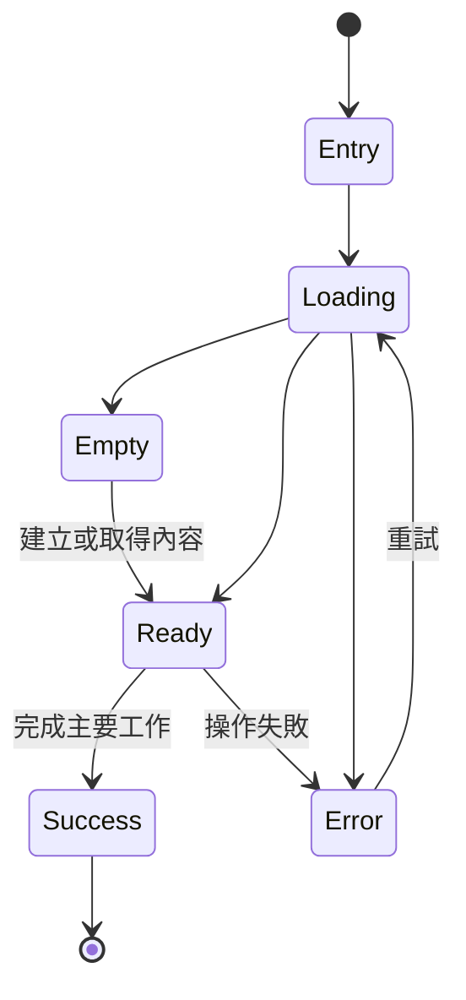

# 用戶體驗生命週期

每個可進入的產品體驗都必須有一筆流程。不要只記錄理想成功路徑；載入、空白、失敗、復原與離開都屬於完整體驗。

若流程中仍有無法命名的狀態、沒有出口的錯誤，或未定義的中止／返回行為，關聯 screen 不得定型。

## 流程登錄表

| 體驗 ID | 使用者目標 | 入口 | 主要流程 | 空白／載入 | 錯誤／復原 | 完成／離開 | 關聯 Screen | 狀態 |
|---|---|---|---|---|---|---|---|---|
| UX-DESIGNIST-INSPECTOR-MERGE | 在主要工作區查看或操作檢查內容 | 待未來布局需求確認 | 待確認 | 待確認 | 待確認 | 待確認 | 待確認 | proposed |
| UX-WORKBENCH-RAIL-SIDEBAR | 在保持 Stage 工作內容時切換左側上下文 | Workbench primary region 展開 | Rail item 切換同區 Sidebar 內容；primary toggle 同時收合 Rail 與 Sidebar | 內容區自行提供 loading／empty；Rail 保持固定 | 產品內容錯誤由內容區呈現，不改變 Shell | 收合後保留 identity 與其右側展開按鈕；展開恢復內容 | DESIGNIST-WORKBENCH | confirmed |
| UX-ORDERED-NAVIGATION-RAIL | 重排主要導覽入口 | 在可排序 Rail item 按下並超過拖曳門檻 | 原位保留空間但隱藏內容；feedback 顯示原 item；指標在候選項目上／下方移動；放開回傳新順序 | 固定 leading items 不接受拖曳；沒有可排序項目時維持靜態 Rail | 無有效落點或取消時清除提示並恢復原位 | 接受落點或取消；產品選取狀態由呼叫端保持 | 任何採用 KlpNavigationRail 的產品 screen | confirmed |

## 流程樹格式

每筆實際體驗必須以具體狀態名稱替換範例，不得直接把範例視為產品規格。
