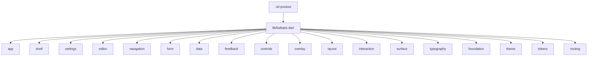
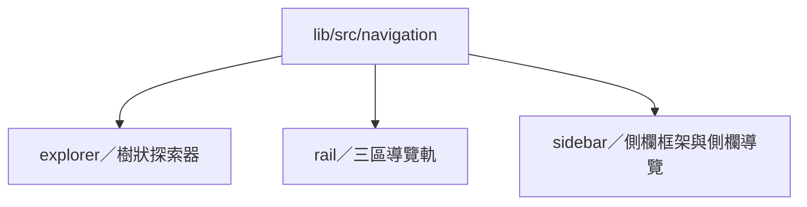
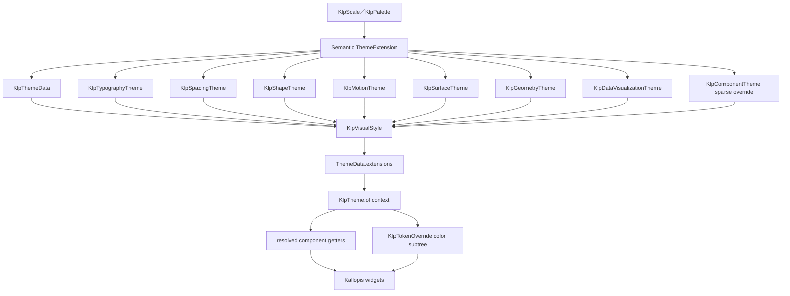
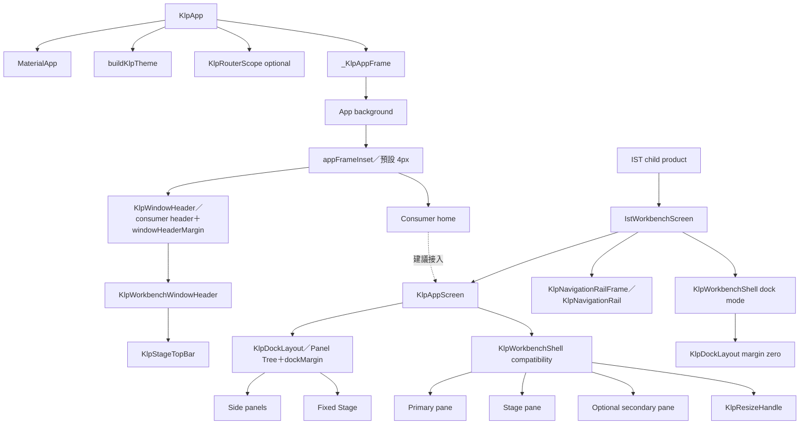
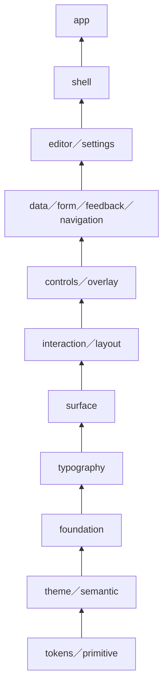
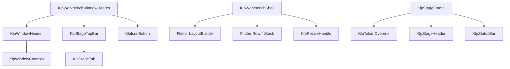
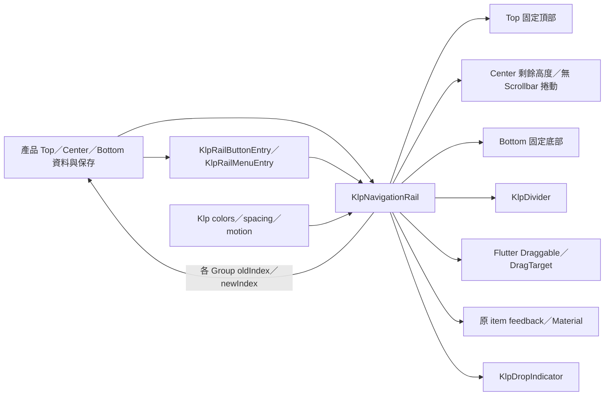
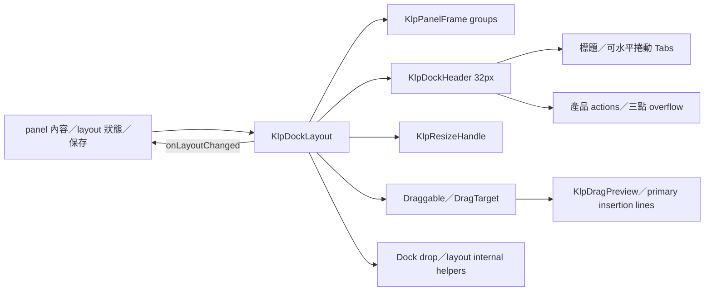
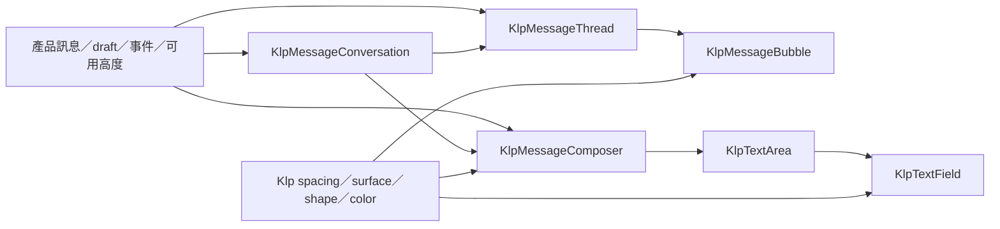
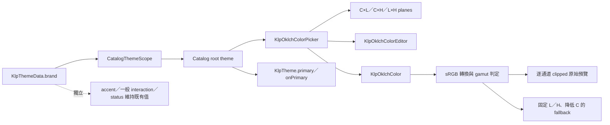

# Kallopis 前端架構現況

本文件整理 2026-09-03 原始碼、Accepted decision 與生成清單可證明的架構。它描述共用呈現層，不承載 Designist 的產品流程。

## 公開邊界

`lib/kallopis.dart` 是唯一公開入口，匯出 18 個領域的 App、theme、shell、routing 與元件 API；`lib/src/` 不對消費端直接承諾。



KLP-0001 規定 Kallopis 只接受無產品語意且至少可由兩個產品共享的視覺機制；產品的頁面、入口、資料模型與業務流程不得進入本庫。

Navigation 原始碼依主要導覽責任分為三個同層資料夾；消費端仍只透過
`lib/kallopis.dart` 使用公開型別，不直接依賴內部路徑。



筆記的 block chrome、canvas、側欄節奏與工作台配方屬於 Notist `lib/src/foundation/surface/legacy_components/note/`。Kallopis 只提供無產品語意的視覺積木；Note／Block 資料模型、內容 schema、selection、transaction、undo、layout authority 與 persistence 由 Krepis 提供。

## Semantic Manifest 與 Catalog 生成鏈

spec/semantics/kallopis.semantic-manifest.json 是分類政策的機器可讀唯一真相來源。現階段只產生 Catalog registry；runtime theme 的數值與 resolver 仍由既有 Dart API 提供，待下一階段風格細修再逐步遷移。

~~~mermaid
flowchart LR
	Manifest[Semantic Manifest v1] --> Validator[generate_catalog_registry]
	Validator --> Registry[generated catalog registry]
	Registry --> Groups[CatalogGroup]
	Groups --> Pages[CatalogPageData]
	Pages --> Shell[CatalogShell]
	Source[lib/src component source] --> StyleGenerator[style semantics generator]
	StyleGenerator --> StyleRegistry[generated style trace registry]
	StyleRegistry --> Shell
	Manifest --> Policy[brand-only consumer override]
	Policy -. excludes .-> UserDS[User Design System recipe]
~~~
## Theme 繼承架構



`KlpVisualStyle` 把九個風格維度成組提供；`KlpTheme.of(context)` 是 runtime 唯一解析入口。Component token 全部 nullable，先讀 component override，否則回退 semantic。任何 ThemeExtension 缺席會回退預設值，因此「能渲染」不能證明繼承正確。

比例 UI 與正文的預設字族由 `KlpTypographyTheme` 解析為套件內的 Noto Sans TC，
不依賴平台中文字型；code、label 與 terminal 的 mono 語意維持 IBM Plex Mono。

## App 與 Shell 構成



AppFrame 負責鋪設 app background，並以 `KlpSpacingTheme.appFrameInset` padding
同時包住 Window Header 與產品主內容，預設為 4px。Window Header 自身解析
`windowHeaderMargin`；Panel Tree 的 Frame 解析 `dockMargin`。因此 Header
與 Frame 分別和 AppFrame 的 4px 配對，形成對稱的 8px gutter；產品入口不
重複加入 padding，pane 內部 gap 仍屬另一組合層級。

新的 Sidebar＋Stage 產品布局建議採用 `KlpDockLayout`：Kallopis 擁有 Area、Group、
resize 與拖放，產品擁有 panel registry、內容、受控 layout 與保存。
IST 系列子產品使用 `IstWorkbenchScreen` 固定共同基礎畫面；它以 `KlpAppScreen`、獨立
Rail surface、compact 間距與填滿剩餘空間的 `KlpWorkbenchShell.dock` 組成產品族入口。
Rail 的 Center Group 保留在 Top／Bottom 之間並取得剩餘高度，但內容從該區域頂端排列；
溢出時維持無 Scrollbar 垂直捲動。
Shell 的 Dock 模式內部建立 `KlpDockLayout`；模板不保存 destination、panel 或 layout，
並把 Dock margin 設為零，由模板自身的 halfCompact 外距統一邊界。非 IST 消費端不使用
此產品族配方。
`KlpWorkbenchShell` 保留既有固定三欄工作區；它同時支援 individual-pane margin 與
明確指定 `paneGap` 的 legacy shared-gap 模式，並依 `KlpGeometryTheme.layout`
breakpoint 處理 pane 顯示與 resize preview。

Designist 的 confirmed primary region 使用 `KlpWorkbenchNavigationRegion` 並排 `KlpNavigationRailFrame` 與 `KlpPrimarySidebarFrame`。兩者是獨立 surface、以 compact 8px 分隔，且一起受 `primaryVisible` 控制；status 只屬於 Sidebar。沒有 secondary 的產品可省略該 slot，不建立休眠 placeholder。

Sidebar 的內容導覽由 `KlpNavigator` 統一呈現。它只接受 Category、Element、
Component 三種具體模型；Category 與 Element 使用 Catalog 目錄既有視覺與高度，
Element 可在根層或分類內遞迴，Component 保留任意 Kallopis 元件自己的幾何與事件。
`KlpExplorer` 是既有 API 的相容轉接層，會先轉成 Navigator 模型再呈現。

## 概念分層



此圖表示由基礎語彙向產品接入層提供能力，不表示 Dart import 箭頭；精確的實際引用關係以 `spec/component-inventory.md` 的生成圖為準。Routing 是無產品目的地語意的獨立機制，由 App 選擇接入。

## 元件風格解析邏輯

```text
resolveKallopisWidget(widget, context):
	style = ThemeData.extensions
	semantic = KlpTheme.of(context)
	componentValue = semantic.component.resolve(widget.role, semantic)
	colors = nearest KlpTokenOverride or semantic.color
	geometry = semantic.geometry
	return widget.render(componentValue, colors, geometry)
```

## 元件繼承範例



## 可排序 Rail 邊界



Kallopis 不保存或命名產品 destination；它固定三個 Group 的位置、Center 溢出行為與分隔線，並只允許 item 在自己的 Group 內排序。

## 可停駐布局邊界



KlpDockLayout 擁有固定 Stage 周圍 Left／Bottom／Right Area 的像素排版、
雙軸 resize、Area 關閉與邊界拖曳重開門檻、header／tab 拖曳、panel 的
allowBottom／allowSide 目的區域限制、精確落點指示、空 Area 建立、合併與拆分規則。
Drop resolver 與受控 layout 資料變換位於 Dock internal helper；主 Widget 保留
render、gesture 接線與 callback 發送。Group resize 以滑鼠絕對位置計算 separator 中心；
三個 Area separator 則以持續掛載的根層 overlay 保持同一次手勢，依 Dock local 絕對位置
完成 min／max catch-up、收合與反向展開。
KlpDockHeader 擁有固定 32px 高度、單標題／多 tab 呈現、滑鼠滾輪水平捲動與
右側 action overflow；空 Area 的恢復命中區疊在 app 邊界 8px 內，不加入排版尺寸。
產品擁有 panel 內容、能力資料、目前 layout 與持久化。

## 訊息與 Composer 邊界



產品只提供內容、角色方向與事件；Kallopis 的 `KlpMessageConversation` 擁有可用高度分配與 footer 前節奏，其餘元件擁有貼合背景、密集節奏、inline actions、outlined focus 與有限高度內的輸入捲動。

## 品牌色與 OKLCH 編輯邊界



KlpThemeData.brand 是產品主題色的獨立語意，並透過 KlpTheme.primary／onPrimary 驅動主要動作。Primary 背景固定不透明；每個互動狀態都以實際繪製背景的 8-bit sRGB luma 判斷，低於 0xA0（160）使用淺色字，0xA0 以上才使用深色字。Primary label 使用 typography semiBold；五段按鈕高度由 control geometry 解析為 28／32／36／40／48px，不改動其他控制項高度。它不覆寫 accent、一般 interaction 或 status。Catalog 由 CatalogThemeScope 將 OKLCH 編輯值提升到 app root，因此離開 Brand 頁後整個 Catalog 仍維持即時主題預覽，重新啟動才回到預設值。

## 元件資產現況

| 項目 | 現況 | 來源 | 狀態 |
|---|---|---|---|
| 公開領域 | 19 | `spec/component-inventory.md` | observed-current |
| 公開型別 | 360 | `spec/component-inventory.md` | observed-current |
| Widget | 214 | `spec/component-inventory.md` | observed-current |
| 逐元件架構文件索引 | 標示 151 個 Widget | `docs/architecture/components/README.md` | observed-current |

## 已查證架構債務

| ID | 現況 | 影響 | 狀態 |
|---|---|---|---|
| KLP-ARCH-DEBT-001 | 生成清單有 214 個 Widget，但逐元件架構文件仍標示 151 個。 | 63 個 Widget 尚未納入該文件索引，文件不能代表完整元件面。 | architecture-debt |
| KLP-ARCH-DEBT-002 | 元件文件將 `KlpWorkbenchShell` 標為 Stateless，實際原始碼是 StatefulWidget。 | 文件中的狀態所有權描述已漂移。 | architecture-debt |
| KLP-ARCH-DEBT-003 | 生成依賴圖列出 `interaction → controls`、`overlay → controls` 等三項逆向分層引用。 | 底層領域依賴上層控制項，領域邊界不再單向。 | architecture-debt |
| KLP-ARCH-DEBT-004 | `KlpWorkbenchShell.secondary` 為 required，即使產品不顯示 secondary 仍須建立並傳入 Widget。 | 無 secondary 的產品可能保留休眠組裝或填入無語意 placeholder。 | architecture-debt |
| KLP-ARCH-DEBT-005 | KLP-0004 已要求產品使用高階 Stage 語意入口，但低階 `KlpStageFrame` constructor 仍公開且被 Designist 主線直接使用。 | 共用呈現決策仍可能回流產品端。 | architecture-debt |
| KLP-ARCH-DEBT-006 | KLP-0001 仍描述 `KlpVisualStyle` 綁住七層，現行型別實際包含 color、typography、spacing、shape、motion、surface、components、dataVisualization、geometry 九個維度。 | Accepted decision 的風格架構描述已落後於 runtime。 | architecture-debt |

## 查證來源

- `lib/kallopis.dart`
- `lib/src/application/legacy/klp_app.dart`
- `lib/src/styling/legacy_theme/klp_visual_style.dart`
- `lib/src/styling/legacy_theme/klp_theme_scope.dart`
- `lib/src/styling/legacy_theme/klp_component_theme.dart`
- `lib/src/features/workspace/shell/klp_workbench_shell.dart`
- `lib/src/features/workspace/shell/klp_workbench_window_header.dart`
- `lib/src/features/workspace/shell/klp_stage_frame.dart`
- `spec/decisions/KLP-0001-scope-token-architecture-and-extraction-method.md`
- `spec/decisions/KLP-0004-presentation-decisions-owned-by-kallopis.md`
- `spec/component-inventory.md`

## 2026-09-07 Token 與按鈕風格解析整理

使用者核准 primitive／semantic 分層入口、獨立預設風格與按鈕風格表的架構優化。
本批保留既有數值、元件樹與互動狀態；不新增 screen 或將既有布局標為定型。

- `lib/src/styling/legacy_tokens/primitive_token.dart` 直接定義 KlpScale 與 KlpPalette；accent 以 tokens/internal 的 part 共用私有色值。2026-09-07 依使用者修訂移除數值舊路徑相容檔，裝飾色盤 KlpDecorativePalette 留在 foundation。
- KlpPalette 的公開顏色只以色族與色階命名；資料視覺化的系列、軸線、格線、數值、crosshair、漲跌角色及 light／dark／ultraDark 模式由 KlpDataVisualizationTheme 組合。
- `lib/kallopis_theme.dart` 明列各語意模型；`src/tokens` 只保留 primitive 定義，不建立反向轉匯桶。
- `lib/src/styling/presets/legacy/default_style.dart` 是 KlpVisualStyle 函式庫的 part，集中預設組裝而不增加第二套值。
- `lib/src/foundation/interaction/controls/klp_button_style.dart` 依目前 KlpTheme 解析每個位置和狀態；元件每次 build 重新讀取 scope。
- 可注入的 component token 保持稀疏，已解析的元件風格表可以完整；兩者責任不同。

完整解析路徑、屬性權限與三種構成關係見 `docs/architecture/token-style-resolution.md`。
