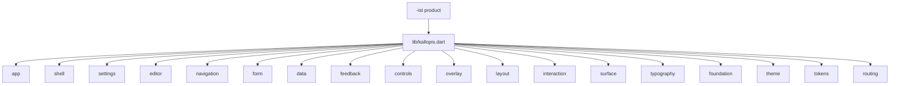
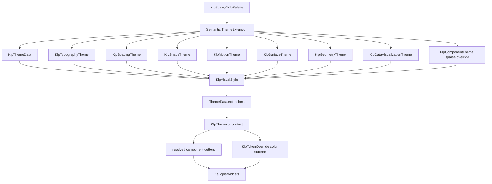
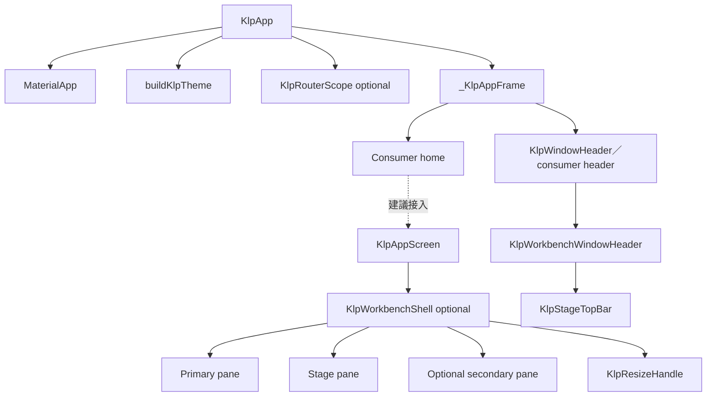
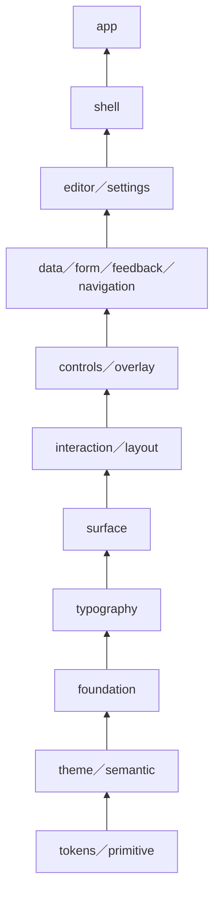
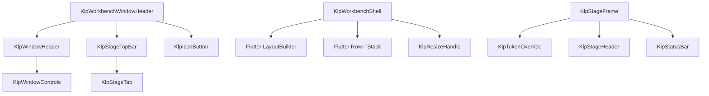
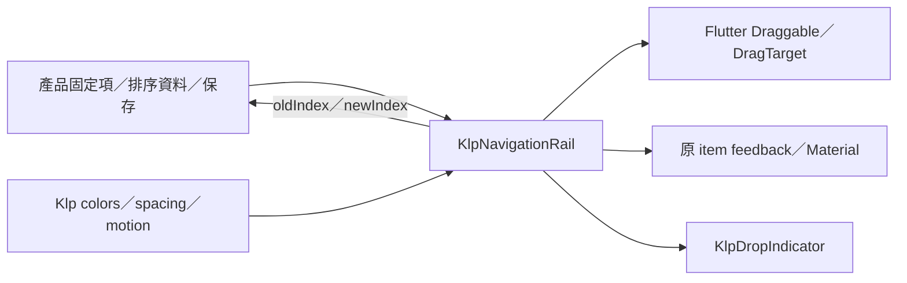

# Kallopis 前端架構現況

本文件整理 2026-09-03 原始碼、Accepted decision 與生成清單可證明的架構。它描述共用呈現層，不承載 Designist 的產品流程。

## 公開邊界

`lib/kallopis.dart` 是唯一公開入口，匯出 18 個領域的 App、theme、shell、routing 與元件 API；`lib/src/` 不對消費端直接承諾。



KLP-0001 規定 Kallopis 只接受無產品語意且至少可由兩個產品共享的視覺機制；產品的頁面、入口、資料模型與業務流程不得進入本庫。

## Theme 繼承架構



`KlpVisualStyle` 把九個風格維度成組提供；`KlpTheme.of(context)` 是 runtime 唯一解析入口。Component token 全部 nullable，先讀 component override，否則回退 semantic。任何 ThemeExtension 缺席會回退預設值，因此「能渲染」不能證明繼承正確。

## App 與 Shell 構成



`KlpWorkbenchShell` 同時支援 individual-pane margin 與明確指定 `paneGap` 的 legacy shared-gap 模式。它根據 `KlpGeometryTheme.layout` breakpoint 決定 primary content、primary pane 與 secondary pane 是否顯示，並在內部處理 resize preview。

Designist 的 confirmed primary region 使用 `KlpWorkbenchNavigationRegion` 並排 `KlpNavigationRailFrame` 與 `KlpPrimarySidebarFrame`。兩者是獨立 surface、以 compact 8px 分隔，且一起受 `primaryVisible` 控制；status 只屬於 Sidebar。沒有 secondary 的產品可省略該 slot，不建立休眠 placeholder。

## 概念分層



此圖表示由基礎語彙向產品接入層提供能力，不表示 Dart import 箭頭；精確的實際引用關係以 `spec/component-inventory.md` 的生成圖為準。Routing 是無產品目的地語意的獨立機制，由 App 選擇接入。

## 元件風格解析邏輯

```text
resolveKallopisWidget(widget, context):
	style = ThemeData.extensions
	semantic = KlpTheme.of(context)
	componentValue = semantic.component.resolve(widget.role, semantic)
	colors = nearest KlpTokenOverride or semantic.color
	geometry = semantic.geometry
	return widget.render(componentValue, colors, geometry)
```

## 元件繼承範例



## 可排序 Rail 邊界



Kallopis 不保存或命名產品 destination；它只處理 leading 不可排序、children 可排序的呈現與輸入語意。

## 元件資產現況

| 項目 | 現況 | 來源 | 狀態 |
|---|---|---|---|
| 公開領域 | 18 | `spec/component-inventory.md` | observed-current |
| 公開型別 | 360 | `spec/component-inventory.md` | observed-current |
| Widget | 214 | `spec/component-inventory.md` | observed-current |
| 逐元件架構文件索引 | 標示 151 個 Widget | `docs/architecture/components/README.md` | observed-current |

## 已查證架構債務

| ID | 現況 | 影響 | 狀態 |
|---|---|---|---|
| KLP-ARCH-DEBT-001 | 生成清單有 214 個 Widget，但逐元件架構文件仍標示 151 個。 | 63 個 Widget 尚未納入該文件索引，文件不能代表完整元件面。 | architecture-debt |
| KLP-ARCH-DEBT-002 | 元件文件將 `KlpWorkbenchShell` 標為 Stateless，實際原始碼是 StatefulWidget。 | 文件中的狀態所有權描述已漂移。 | architecture-debt |
| KLP-ARCH-DEBT-003 | 生成依賴圖列出 `interaction → controls`、`overlay → controls` 等三項逆向分層引用。 | 底層領域依賴上層控制項，領域邊界不再單向。 | architecture-debt |
| KLP-ARCH-DEBT-004 | `KlpWorkbenchShell.secondary` 為 required，即使產品不顯示 secondary 仍須建立並傳入 Widget。 | 無 secondary 的產品可能保留休眠組裝或填入無語意 placeholder。 | architecture-debt |
| KLP-ARCH-DEBT-005 | KLP-0004 已要求產品使用高階 Stage 語意入口，但低階 `KlpStageFrame` constructor 仍公開且被 Designist 主線直接使用。 | 共用呈現決策仍可能回流產品端。 | architecture-debt |
| KLP-ARCH-DEBT-006 | KLP-0001 仍描述 `KlpVisualStyle` 綁住七層，現行型別實際包含 color、typography、spacing、shape、motion、surface、components、dataVisualization、geometry 九個維度。 | Accepted decision 的風格架構描述已落後於 runtime。 | architecture-debt |

## 查證來源

- `lib/kallopis.dart`
- `lib/src/app/klp_app.dart`
- `lib/src/theme/klp_visual_style.dart`
- `lib/src/theme/klp_theme_scope.dart`
- `lib/src/theme/klp_component_theme.dart`
- `lib/src/shell/klp_workbench_shell.dart`
- `lib/src/shell/klp_workbench_window_header.dart`
- `lib/src/shell/klp_stage_frame.dart`
- `spec/decisions/KLP-0001-scope-token-architecture-and-extraction-method.md`
- `spec/decisions/KLP-0004-presentation-decisions-owned-by-kallopis.md`
- `spec/component-inventory.md`
