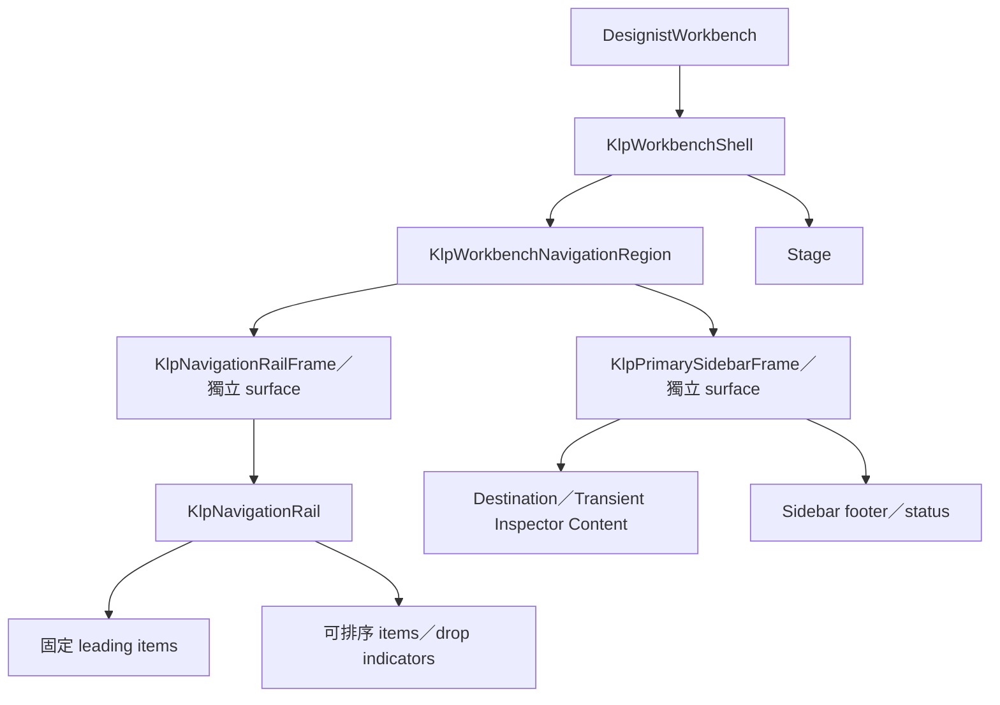

# 畫面構成架構

本檔由 screen 往內維護區域、容器、元件與內容的組合關係。未確認的節點不得因實作方便而加入。

每個節點必須能連到元件需求表，每個互動分支必須能連到體驗生命週期。存在孤立節點或未登錄元件時，screen 維持 `proposed` 或 `confirmed`，不可標記為 `frozen-screen`。

## Screen 登錄表

| Screen ID | 目的 | 根容器 | 區域順序 | 捲動所有權 | Overlay | 響應規則 | 體驗 ID | 狀態 |
|---|---|---|---|---|---|---|---|---|
| DESIGNIST-WORKBENCH | Designist 主要工作空間 | KlpWorkbenchShell | 獨立 Rail surface（固定 leading＋可排序 destinations）｜獨立 Sidebar surface｜Stage；不組裝 secondary／右側 Inspector | Rail 固定；Sidebar 與 Stage 各自管理內容 | Project pointer menu、Rail drag feedback 與個別功能 overlay | primary toggle 同時收合 Rail＋Sidebar；Sidebar 可調寬且擁有 status | UX-WORKBENCH-RAIL-SIDEBAR、UX-ORDERED-NAVIGATION-RAIL | confirmed |

## 畫面構成樹

虛線只表示候選方向，不授權實作。新增容器、scrolling owner、overlay host 或 responsive 分支前，必須先更新並確認本樹。
