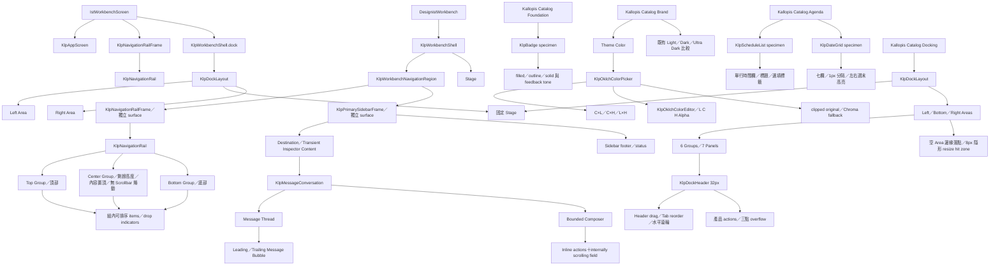
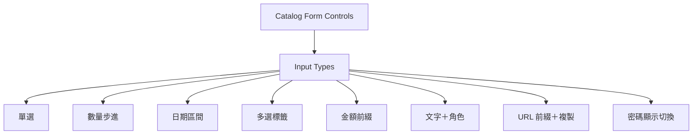

# 畫面構成架構

本檔由 screen 往內維護區域、容器、元件與內容的組合關係。未確認的節點不得因實作方便而加入。

每個節點必須能連到元件需求表，每個互動分支必須能連到體驗生命週期。存在孤立節點或未登錄元件時，screen 維持 `proposed` 或 `confirmed`，不可標記為 `frozen-screen`。

## Screen 登錄表

| Screen ID | 目的 | 根容器 | 區域順序 | 捲動所有權 | Overlay | 響應規則 | 體驗 ID | 狀態 |
|---|---|---|---|---|---|---|---|---|
| KALLOPIS-CATALOG | 依預設風格語意瀏覽全部 token、元件 recipe 與 pattern | KlpApp／AppFrame Padding／CatalogShell／KlpDockLayout | 可全表面拖動視窗的 Window Header｜Side-only 目錄 panel｜固定 Stage；目錄內為 Primitive｜Foundation Semantic｜Component Recipe｜Pattern；各群組內為既有 pages、specimens 與可見風格語意 description | Catalog Stage 擁有 page 捲動；目錄 panel 的 KlpPanelFrame 與 KlpNavigator 共用 controller，Scrollbar 位於尾側 8px padding 槽 | 每個 specimen 的 KlpTooltip 風格語意補充 | AppFrame 的 appFrameInset 4px 包住 Header 與 CatalogShell；Header 與 Panel Frame 各自解析 windowHeaderMargin／dockMargin 4px，形成對稱的 8px gutter；目錄初始 200／260px、可在左右側 180–360px 調整、不可進 Bottom | UX-CATALOG-SEMANTIC-NAVIGATION、UX-CATALOG-STYLE-TRACE、UX-CATALOG-DOCK-NAVIGATION、UX-APP-WINDOW-DRAG | confirmed |
| DESIGNIST-WORKBENCH | Designist 主要工作空間 | KlpWorkbenchShell | 獨立 Rail surface（固定 leading＋可排序 destinations）｜獨立 Sidebar surface｜Stage；不組裝 secondary／右側 Inspector | Rail 固定；Sidebar 與 Stage 各自管理內容 | Project pointer menu、Rail drag feedback 與個別功能 overlay | primary toggle 同時收合 Rail＋Sidebar；Sidebar 可調寬且擁有 status | UX-WORKBENCH-RAIL-SIDEBAR、UX-ORDERED-NAVIGATION-RAIL | confirmed |
| KALLOPIS-CATALOG-FOUNDATION | 展示並人工檢視 Foundation 元件 | Catalog canvas | Specimen 列表｜KlpBadge specimen｜各 variant 內容 | 既有 Catalog canvas | 無新增 overlay | 沿用既有 Catalog specimen wrap | UX-COMPACT-STATUS-BADGE | confirmed |
| KALLOPIS-CATALOG-AGENDA | 展示並人工檢視 Agenda 資料元件 | Catalog canvas | Specimen 列表｜KlpDateGrid｜KlpScheduleList｜日期、時間、標題與選填標籤 | 既有 Catalog canvas | 無新增 overlay | DateGrid 固定七欄、1px 實線分隔且左右週末欄使用 muted surface；Schedule 時間欄固定 sectionLarge 且只顯示一行 | UX-DATE-GRID-SCAN、UX-SCHEDULE-SCAN | confirmed |
| KALLOPIS-CATALOG-DOCKING | 人工操作可停駐布局 | Catalog canvas | Area toggle｜固定 Stage｜Left／Bottom／Right Area｜32px Dock Header｜7 個 panel | Catalog canvas 擁有頁面捲動；Dock tabs 擁有水平滾輪捲動；各 panel 內容自行管理 | Draggable feedback、Side Group 底部拆分線、Bottom Group 右側拆分線、tab 插入線、空 Side 的中央區域全高邊緣線、空 Bottom 底線與 actions 三點選單 | 固定高度 specimen；Area 與 Group 依 constraints 調整；separator 中心即時對齊滑鼠；Stage 下半部優先 Bottom，其餘區域分 Left／Right；空 Area 的 8px resize 命中區不占版面 | UX-DOCK-LAYOUT | confirmed |
| KALLOPIS-SIDEBAR-SHELL | 檢查 Primary Sidebar 與通用導覽組成 | Catalog Sidebar Shell page | Identity header｜KlpNavigator（Category／root Element／Component）｜footer | Navigator 擁有垂直捲動；注入元件自行管理內部捲動 | 無新增 overlay | Sidebar 寬高沿用既有 specimen；Category／Element 高度沿用 Catalog 目錄，Component 自行決定 | UX-NAVIGATOR-BROWSE | confirmed |
| IST-WORKBENCH-SCREEN-PATTERN | 為 IST 系列子產品提供固定基礎工作畫面 | IstWorkbenchScreen／KlpAppScreen | 產品 Window Header｜固定 Rail surface（Top／Center／Bottom）｜可伸展 KlpDockLayout；Dock 內為 Left｜Stage＋Bottom｜Right | Rail Center 內容置頂，溢出時無 Scrollbar 捲動；各 panel 內容自行管理捲動 | Rail 組內 reorder feedback 與 Dock drag／drop overlays | IstWorkbenchScreen 以 workbenchContentInset 4px 銜接 AppFrame；Rail 48px；Top／Bottom 固定兩端、Center 填滿剩餘高度且內容置頂；Rail 與 Dock 間 chromeGap 8px；Dock 填滿剩餘寬高 | UX-IST-WORKBENCH-SCREEN-COMPOSITION、UX-ORDERED-NAVIGATION-RAIL、UX-DOCK-LAYOUT | confirmed |

## Catalog 畫面構成樹

面向消費端與其他 AI 的完整組裝說明位於
[`docs/guides/catalog-screen-composition.md`](../../../../../docs/guides/catalog-screen-composition.md)；
本節保留為設計狀態與驗收權威，不建立第二套規則。

~~~mermaid
flowchart TD
	Catalog[KALLOPIS-CATALOG] --> Shell[CatalogShell]
	Catalog --> ThemeScope[CatalogThemeScope]
	ThemeScope --> RootTheme[Catalog root Theme]
	BrandPage[Brand OKLCH editor] --> ThemeScope
	RootTheme --> AppFrame[AppFrame appFrameInset]
	AppFrame --> Header[Window Header windowHeaderMargin]
	AppFrame --> Shell
	Shell --> Dock[KlpDockLayout／Panel Frame dockMargin]
	Dock --> Navigation[Side-only 目錄 panel]
	Dock --> Stage[固定 Catalog Stage]
	Navigation --> PanelScrollbar[尾側 8px padding 槽 Scrollbar]
	PanelScrollbar --> Navigator[KlpNavigator／共用 ScrollController]
	Navigation --> Primitive[Primitive]
	Navigation --> Foundation[Foundation Semantic]
	Navigation --> Component[Component Recipe]
	Navigation --> Pattern[Pattern]
	Primitive --> Pages[CatalogPageData]
	Foundation --> Pages
	Component --> Pages
	Pattern --> Pages
	Pages --> Specimens[Existing specimens／token views]
	Specimens --> RailSpecimen[KlpNavigationRail／Top＋Center scroll＋Bottom]
	Specimens --> StyleDescription[可見風格語意 description]
	Specimens --> StyleMarker[風格語意標記]
	StyleMarker --> StyleTooltip[顏色／邊框／spacing／type／geometry／motion]
	Navigator --> NavCategory[Category collapsible list]
	Navigator --> NavElement[Element recursive／root allowed]
	Navigator --> NavComponent[Component child slot]
	Pages --> ConversationPage[Conversation specimen]
	ConversationPage --> MessageBubbles[muted bubble surface／使用者靠右／Assistant 靠左]
~~~
## 畫面構成樹

Catalog Brand 的 Theme Color 區域已確認；頁面仍由既有 Catalog Canvas 擁有捲動。Picker 的三色盤順序、寬版換行與窄版堆疊、四軸控制、雙預覽已定型，整個 Brand screen 尚未定型，不建立 screen golden。

虛線只表示候選方向，不授權實作。新增容器、scrolling owner、overlay host 或 responsive 分支前，必須先更新並確認本樹。

## Catalog Form Input Types 擴充

| 欄位 | 已確認值 |
|---|---|
| 規格 ID | KALLOPIS-CATALOG-FORM-INPUT-TYPES |
| 目標 | 擴充通用 Form Input recipes，並在既有 Form Controls 頁提供互動 specimen |
| 使用者與入口 | Kallopis 消費產品；Catalog → Component recipes → Form Controls |
| Screen 邊界 | 既有 Catalog Stage 的局部內容，不新增 screen 或 overlay |
| 內容階層 | Form Controls → Input Types → 八種輸入 recipe |
| 精確幾何 | MD field 40px；其餘使用既有 field padding、control shape 與 compact gap |
| 響應規則 | 寬版 specimen 兩欄、窄版單欄；欄位填滿欄寬且不裁切操作 |
| 語意 | 顏色只由 Kallopis field／surface／interaction／status 語意解析 |
| 參考資料權限 | 圖片只授權輸入類型與 segment 關係；不採用圖片的像素、黑白配色或斜切背景 |
| 定型範圍 | 元件與 Catalog 展示仍處於視覺探索，不建立 golden |
| 狀態 | confirmed |
| 使用者確認來源與日期 | 使用者回覆「確認」，2026-09-04 |

