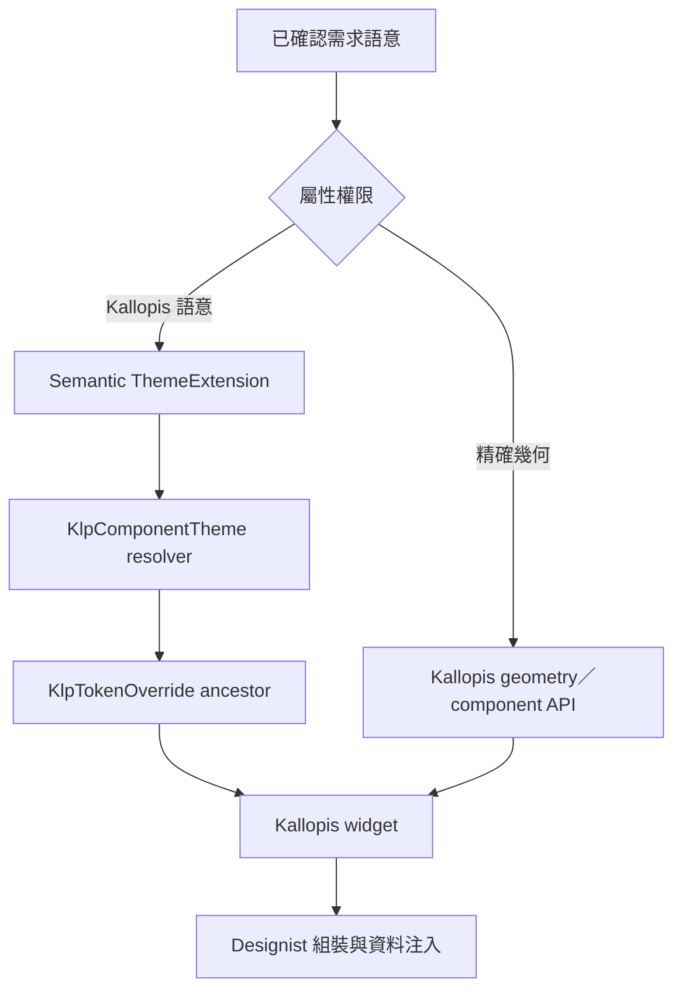

# 風格／邏輯語意繼承

語意不是元件名稱或色票別名。每個語意必須說明使用時機、排除條件、解析結果與理由。

## 語意定義表

| 語意 ID | 定義 | 適用條件 | 不適用條件 | 解析結果 | 理由 | 狀態 |
|---|---|---|---|---|---|---|
| SEM-EXACT-GEOMETRY | 使用者已指定或可可靠量測的布局尺寸、距離、位置與層級 | 參考資料被指定為精確規格 | 純風格參考或缺少可靠比例 | 解析至正確 geometry／component API 的精確值 | 防止用相近 token 改寫已指定布局 | confirmed |
| SEM-KALLOPIS-COLOR | 由 Kallopis semantic 與 component resolver 決定的顏色角色 | 使用者授權採用 Kallopis 色彩語意 | 使用者指定精確色值 | context.klp 已解析 getter，包含祖先 override | 保持跨主題一致並避免產品端自選色 | confirmed |
| SEM-SETTINGS-DEPTH | 設定頁左側導覽比右側內容更深 | 所有設定頁與主題模式 | 非設定頁 | 左側使用較深 surface role、右側使用較淺 surface role | 保持導覽與內容的穩定層級 | confirmed |
| SEM-WORKBENCH-RAIL | Workbench primary region 中固定且擁有獨立 surface 的主要入口軌 | 產品需要圖示入口與可切換上下文 Sidebar | 內容內工具列、Inspector 或 Sidebar 子區域 | KlpNavigationRailFrame 提供 48px surface；KlpRailItem 解析 railItem 32px、shape.control 8px、space.compact 8px、selection／hover color | 將入口幾何與互動狀態集中在 Kallopis，產品只提供語意資料 | confirmed |
| SEM-WORKBENCH-NAVIGATION-REGION | 將同層 Rail 與 Sidebar 組成可共同收合的左側區域 | Rail 與 Sidebar 需要共享 Workbench primary 顯示生命週期 | 將 Rail 放入 Sidebar surface 或使兩者共享 footer | KlpWorkbenchNavigationRegion 以 space.compact 分隔兩個獨立 surface | 保留共同收合能力，同時維持 Rail、Sidebar、Stage 的視覺同層關係 | confirmed |
| SEM-WORKBENCH-CONTEXT-SIDEBAR | Rail 右側、擁有獨立 surface 與 status 的上下文內容區 | Rail 與 Sidebar 同屬可收合 primary region | Stage、secondary pane 或 Rail surface | KlpSidebarFrame 只組合 Sidebar content 與 footer；水平 padding 解析 space.compact | 讓產品能切換內容而不改變 Stage，並讓 status 明確描述 Sidebar | confirmed |

## 風格／邏輯語意繼承樹



## 語意解析實作邏輯

```text
resolveDesign(property, context):
	definition = semanticTruth[property.semanticId]
	if definition.status != confirmed:
		stop and ask user

	if property.authority == exactGeometry:
		return kallopisGeometryApi.apply(definition.confirmedValue)

	if property.authority == kallopisSemantic:
		resolved = context.klp.componentResolver(property.role)
		return ancestorTokenOverride.apply(resolved)

	stop and ask user
```

```text
resolveWorkbenchRail(context):
	itemExtent = context.klp.space.railItem
	itemRadius = context.klp.shape.control
	itemGap = context.klp.space.compact
	railPadding = context.klp.space.compact
	colors = context.klp resolved selection and surface colors
	return KlpNavigationRail(itemExtent, itemRadius, itemGap, railPadding, colors)
```

```text
resolveOrderedRail(context, leading, children, onReorder):
	itemExtent = context.klp.space.railItem
	gap = context.klp.space.compact
	indicatorExtent = itemExtent
	indicatorThickness = 2px confirmed exact geometry
	indicatorColor = context.klpColors.interaction
	duration = context.klp.motion.stateTransition
	curve = context.klp.motion.standard
	leading remains fixed
	children become draggable only when onReorder exists
	return rail preserving click below drag threshold
```

## 元件注入邏輯

```text
composeScreen(node):
	if node not in confirmedScreenTree:
		stop and ask user

	component = componentRegistry[node.componentId]
	if component.status not in [confirmed, frozenComponent]:
		stop and ask user

	return component.render(productData: node.declaredInput)
```

上述程式碼區塊描述決策契約，不是可直接執行的產品程式碼。實際語意新增後，必須以真實 ID、resolver 與注入條件取代抽象名稱。
