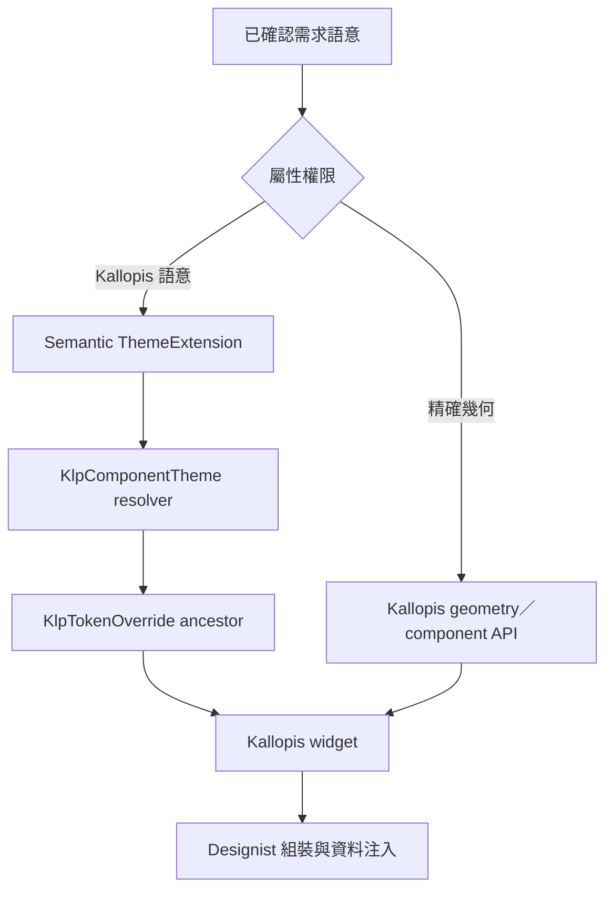
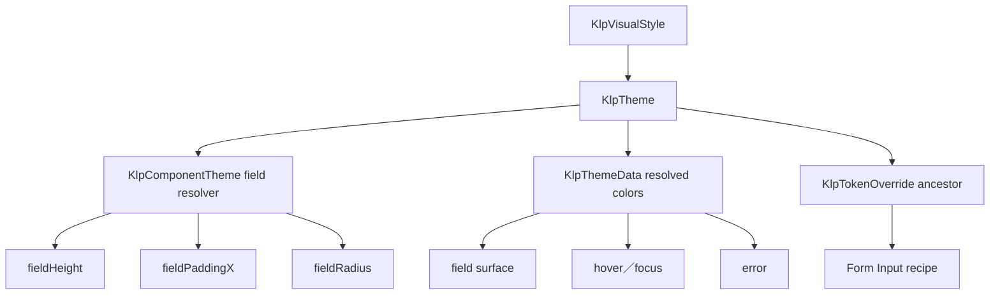

# 風格／邏輯語意繼承

語意不是元件名稱或色票別名。每個語意必須說明使用時機、排除條件、解析結果與理由。

## 語意定義表

| 語意 ID | 定義 | 適用條件 | 不適用條件 | 解析結果 | 理由 | 狀態 |
|---|---|---|---|---|---|---|
| SEM-EXACT-GEOMETRY | 使用者已指定或可可靠量測的布局尺寸、距離、位置與層級 | 參考資料被指定為精確規格 | 純風格參考或缺少可靠比例 | 解析至正確 geometry／component API 的精確值 | 防止用相近 token 改寫已指定布局 | confirmed |
| SEM-KALLOPIS-COLOR | 由 Kallopis semantic 與 component resolver 決定的顏色角色 | 使用者授權採用 Kallopis 色彩語意 | 使用者指定精確色值 | context.klp 已解析 getter，包含祖先 override | 保持跨主題一致並避免產品端自選色 | confirmed |
| SEM-KALLOPIS-CJK-TYPE | 中文 UI 與正文使用跨平台一致的比例字體 | KlpText 的 ui／body family 與 Flutter ThemeData 一般文字 | code、label、terminal 等 mono family | KlpTypographyTheme.sansFamily／uiFamily／bodyFamily 解析為 packages/kallopis/Noto Sans TC；fallback 仍保留平台字體；monoFamily 維持 packages/kallopis/IBM Plex Mono | 避免 Windows、macOS 與 Linux 因系統中文字型不同而改變字形與度量 | confirmed |
| SEM-APP-CHROME-TYPE | App chrome 的識別、區域標題與狀態使用可獨立覆寫的等寬責任角色 | App Title、Window／Panel／Stage／Sidebar Header 主標題、Status Bar 與 Status Indicator | 正文、筆記內容、一般 label 或程式碼資料 | `appTitle` 保留 label 尺寸並使用 500、`header` 保留 bodyStrong 尺寸並使用 600、`status` 保留 code 尺寸並使用 500；三者 family 解析為 mono，拉丁字元預設使用 packages/kallopis/IBM Plex Mono，中文字元 fallback 至 packages/kallopis/Noto Sans TC | 固定已確認的 App chrome 字體、保留中文可讀性，並避免用視覺近似的舊角色混淆責任 | confirmed |
| SEM-SETTINGS-DEPTH | 設定頁左側導覽比右側內容更深 | 所有設定頁與主題模式 | 非設定頁 | 左側使用較深 surface role、右側使用較淺 surface role | 保持導覽與內容的穩定層級 | confirmed |
| SEM-WORKBENCH-RAIL | Workbench primary region 中固定且擁有獨立 surface 的主要入口軌 | 產品需要圖示入口與可切換上下文 Sidebar | 內容內工具列、Inspector 或 Sidebar 子區域 | KlpNavigationRailFrame 提供 48px surface；KlpNavigationRail 固定解析 Top／Center／Bottom 三區，Center 取得剩餘高度、內容置頂並在溢出時無 Scrollbar 捲動；Rail divider 解析為 color.guide＋shape.dashedOpacity 的 shape.hairline 虛線；產品以 KlpRailButtonEntry／KlpRailMenuEntry 提供資料，KlpRailItem 解析 railItem 32px、shape.control 8px、space.compact 8px、selection／hover color | 將入口資料契約、幾何、分區與互動狀態集中在 Kallopis，避免任意 Widget 破壞 Rail 結構 | confirmed |
| SEM-WORKBENCH-NAVIGATION-REGION | 將同層 Rail 與 Sidebar 組成可共同收合的左側區域 | Rail 與 Sidebar 需要共享 Workbench primary 顯示生命週期 | 將 Rail 放入 Sidebar surface 或使兩者共享 footer | KlpWorkbenchNavigationRegion 以 space.compact 分隔兩個獨立 surface | 保留共同收合能力，同時維持 Rail、Sidebar、Stage 的視覺同層關係 | confirmed |
| SEM-WORKBENCH-CONTEXT-SIDEBAR | Rail 右側、擁有獨立 surface 與 status 的上下文內容區 | Rail 與 Sidebar 同屬可收合 primary region | Stage、secondary pane 或 Rail surface | KlpSidebarFrame 只組合 Sidebar content 與 footer；水平 padding 解析 space.compact | 讓產品能切換內容而不改變 Stage，並讓 status 明確描述 Sidebar | confirmed |
| SEM-DOCK-LAYOUT | 固定 Stage 周圍可由使用者調整與重組的中性工作 panel 布局 | 產品提供 panel registry、受控 layout 與 Area limits | 產品專屬 destination、panel 內容或持久化策略 | KlpPanelFrame 提供 Group surface；KlpResizeHandle 解析 space.compact／border；Area 與 Group 使用已確認像素 extent；drop 以 context.klp.primary 在 Group 底部或 tab 插入位置呈現線性落點；header 子樹以 DefaultTextStyle 解析 KlpTextRole.code 且不外溢至 content | 讓產品只保存資料與回應事件，並集中 header chrome、雙軸 resize、tab 與 docking 規則 | confirmed |
| SEM-NAVIGATOR-COMPOSITION | Sidebar 中統一呈現分類、可巢狀元素與任意操作元件 | Catalog 目錄、Primary Sidebar 與其他樹狀導覽 | Rail、頁面 Tab、純檔案內容或產品自行拼裝平行 row | Category 使用既有 category header 高度、caption muted 與旋轉 chevron；Element 使用既有 file explorer row 高度、code 文字、icon、badge、縮排與 state highlight；Component 原樣注入、不強制高度；私有 InheritedWidget 傳遞展開、選取與事件 | 保留使用者認可的 Catalog 視覺，並以三種模型限制產品注入面而不限制操作元件內容 | confirmed |
| SEM-FIRST-LAYER-PANEL | app background 上第一層可視 panel 各自提供外距的舊語意 | 歷史相容與 KLP-0006 查閱 | 新產品主內容、KlpDockLayout 或任何會與產品根 padding 疊加的組合 | 不再供新組合採用；由 SEM-APP-PRODUCT-PADDING 取代 | 保留歷史名稱，避免舊文件被誤當現行唯一真相 | superseded |
| SEM-APP-PRODUCT-PADDING | App 產品主內容根節點的 halfCompact padding 舊組合 | 歷史相容與 KLP-0008 查閱 | 新產品的完整 App／Dock／Header 邊界規則 | 產品根的 halfCompact padding 仍有效；Dock 零 margin 已由 SEM-COMPOSED-HALF-COMPACT-BOUNDARY 取代 | 保留歷史名稱，避免 KLP-0008 被誤當現行完整規則 | superseded |
| SEM-COMPOSED-HALF-COMPACT-BOUNDARY | App chrome 各層分別擁有 halfCompact 邊界的舊組合 | 歷史相容與 KLP-0009 查閱 | 新產品的 App padding 組合 | 已由 SEM-APP-FRAME-PADDING 取代 | 保留修訂來源，避免 Header margin 被誤當現行規則 | superseded |
| SEM-APP-FRAME-PADDING | AppFrame 單獨擁有 halfCompact、安全包住 Header 與主內容的舊組合 | 歷史相容與 KLP-0010 查閱 | 新產品的完整 App／Header／Dock 邊界 | 已由 SEM-HALF-COMPACT-BOUNDARY-PAIR 取代 | 保留修訂來源，避免 Header margin 被移除 | superseded |
| SEM-HALF-COMPACT-BOUNDARY-PAIR | 相鄰 App chrome 責任層各貢獻 halfCompact 並組成 compact gutter | 歷史相容與 KLP-0012 查閱 | 新元件與新風格覆寫 | 數值關係保留，但欄位名稱與獨立注入由 SEM-SCOPED-SPACING 取代 | 保留 4px＋4px＝8px 的布局來源，不再作為 runtime API 名稱 | superseded |
| SEM-SCOPED-SPACING | 依使用位置表達間距責任，避免單一密度名稱控制無關元件 | Kallopis 的 content、control、action、chrome、navigation、overlay 與 App 組合邊界 | primitive 階梯、元件直接取用 `space2`，或新的 `compact`／`halfCompact` 萬用別名 | 內容與互動 scope 的預設欄位各自指向 `KlpScale.space200`（8px）；`appFrameInset`、`workbenchContentInset`、`windowHeaderMargin`、`dockMargin` 各自指向 `KlpScale.space100`（4px）；每個欄位可由 ThemeExtension 與 JSON v2 獨立覆寫 | 相同預設數值不代表相同責任；scope 分離後可局部調整風格而不連動無關元件 | confirmed |
| SEM-WINDOW-HEADER-DRAG | App Header 全表面拖動平台視窗 | KlpWindowHeader 的完整占位範圍，包含自身 margin | AppFrame padding、產品 body、Dock Header 的 panel 拖放 | 最外層 GestureDetector 包住 Header margin 與可視 surface，以 translucent hit test 參與整個 Header 子樹的 pan 手勢；pan start 呼叫 KlpWindowAction.drag；子元件 tap 仍參與 gesture arena；雙擊 maximize 只包裝非互動 identity／空白區 | 將 heading 全區可拖動的操作模型套用到 App chrome，同時不以覆蓋層阻斷按鈕 | confirmed |
| SEM-COMPACT-PANEL-RADIUS | 通用工作區 panel 使用比大型容器更緊湊的邊界 | KlpPanelFrame 及由其組成的 Sidebar、Rail frame、Dock group | Dialog、overlay 或其他仍需大型 panel 圓角的容器 | 外圓角 = context.klp.shape.card，預設 8px；內層 clip = card - stroke，預設 6px | 降低工作區 panel 的圓潤量體，同時保留 panel 與大型浮層的語意層級 | confirmed |
| SEM-PANEL-SCROLLBAR-GUTTER | Panel 的捲軸占用既有尾側 content padding 槽，而不縮窄 padding 後的內容區 | KlpPanelFrame 內具有受控垂直 Scrollable 的 Navigator、Explorer 或其他 panel 內容 | 頁面級捲動、水平捲動、內容自行擁有且不與 Frame 共用 controller 的巢狀捲動 | panel content padding 預設為 compact 8px；Scrollbar 覆蓋完整 content region，thumb 以 `(endPadding - scrollbarThickness) / 2` 置中於尾側 padding 槽；實際內容仍套完整水平 padding；Frame 與 Scrollable 共用 controller，且關閉該子樹的自動 scrollbar | 保留 8px 內容安全距離，同時讓捲動控制留在 panel 邊緣且避免重複軌道 | confirmed |
| SEM-COMPACT-MESSAGE | 密集 Sidebar 對話中的訊息節奏與方向 | 歷史相容 | 新的訊息 bubble 背景呈現 | 原本 background 解析 component surface，於部分內容區與背景無法辨識 | 保留舊來源 | superseded by SEM-READABLE-MESSAGE-BUBBLE |
| SEM-READABLE-MESSAGE-BUBBLE | 讓訊息內容形成可辨識邊界並維持中性角色表達 | KlpMessageBubble 的 background／emphasized 背景分支 | 無背景訊息、Composer 或其他 component surface | dense 解析 space.compact 8px；background 解析 KlpSurfaceTone.muted；Align 使 surface 貼合 child；使用者 trailing、Assistant leading | muted 提供相對內容區可見的層級差；角色仍由位置而非不同色彩表示 | confirmed |
| SEM-COMPACT-MESSAGE-COMPOSER | 有限區域內可輸入長內容的密集訊息輸入器 | Composer 取得有限高度，且需標籤在上、輸入與動作同列 | 無高度上限的文件編輯器 | padding／gap 解析 space.compact 8px；surfaceMuted；TextArea minLines 1、maxLines null；Row 受 Flexible 約束，超高後 TextFormField 內捲動 | 保留單行起始高度，同時不讓長輸入突破父區域 | confirmed |
| SEM-MESSAGE-CONVERSATION-REGION | 在 Sidebar 可用內容高度內配置訊息列表、Composer 與 footer 前節奏 | 對話內容需要固定外距且 Composer 可增長 | 無 footer 的自由畫布 | KlpMessageConversation：內容上／左右 space.compact；Composer 上／左右 space0_5、下 space1；LayoutBuilder 將可用高度限制交給 Composer | 將跨子元件的高度與邊界節奏留在 Kallopis，產品不建立局部 wrapper | confirmed |
| SEM-OUTLINED-FIELD-FOCUS | 需要明確邊界與 focus 回饋的文字欄位 | outlined 為 true | 無框 field | borderWidth = max(resolved fieldBorderWidth, shape.stroke)；idle = color.border；focused = color.interaction；radius = resolved fieldRadius | 2px stroke 表示明確操作邊界，interaction 表示目前輸入焦點 | confirmed |
| SEM-COMPACT-STATUS-BADGE | 以 micro 文字呈現狀態 Badge 的舊語意 | 歷史查閱 | 新的 KlpBadge 預設呈現 | 由 SEM-READABLE-STATUS-BADGE 取代 | 保留 10px／12px 舊來源，避免誤認為目前規格 | superseded |
| SEM-READABLE-STATUS-BADGE | 附著於內容旁、需快速掃讀的短狀態、分類或數量標記 | KlpBadge 的 label、可選 dot 與 filled／outline／solid variant | 正文內容、操作控制項或長句 | text = KlpTextRole.caption（12px／16px）；paddingX = resolved badgePaddingX = space.tight + space.xxs（6px）；paddingY = space.xxs（2px）；radius = resolved badgeRadius = shape.pill；最終高度約 20px | 提高狀態辨識度，同時維持低於最小 28px 按鈕的資訊層級 | confirmed |
| SEM-SCHEDULE-TIME-COLUMN | 排程列中可快速掃讀且不可拆行的時間 | KlpScheduleList 的 item.time | 標題、detail 或允許自然換行的正文 | columnWidth = context.klp.space.sectionLarge；text = KlpTextRole.code＋KlpTextTone.muted；maxLines = 1；overflow = ellipsis | 時間是單一辨識單位，拆行會破壞格式與列高；固定語意寬度維持各列標題對齊 | confirmed |
| SEM-DATE-GRID-WEEKEND | 七欄日期格以明確網格與中性 surface 辨識週末 | KlpDateGrid 的第 1、7 欄 | 選取狀態、一般工作日或其他非七欄資料布局 | separator width = context.klp.shape.hairline；color = context.klpColors.border；weekend tone = KlpSurfaceTone.muted；selected tone = KlpSurfaceTone.component 並優先；cell radius = 0 | 1px 單側邊線建立可見但不加倍的網格；muted 表示固定日別分類而不冒充 accent／selection | confirmed |
| SEM-BRAND-COLOR | 產品識別的單一主題色，可由 OKLCH 編輯並轉為 sRGB | 品牌識別、品牌色展示與後續由產品明確採用的情境 | accent、interaction、status 或其他功能色 | `KlpThemeData.brand`；未指定時解析為同一套 theme 的 accent；局部 `KlpTokenOverride` 可沿 ancestor 覆寫整組 resolved colors | 保持品牌身份與操作語意解耦；既有主題在未覆寫時視覺不變 | frozen-semantic |
| SEM-BRAND-PRIMARY | 產品主要動作使用可編輯主題色 | primary tone 元件、Catalog 即時主題預覽 | accent、一般 interaction、success、warning、danger、info | KlpTheme.primary = brand(alpha: 255)；相對亮度 × 255 小於 128 時 onPrimary = onDarkBackground，否則為 onLightBackground | 以不透明品牌背景建立主要動作 | superseded by SEM-PRIMARY-CONTRAST-A0 for foreground threshold |
| SEM-PRIMARY-CONTRAST-A0 | 以 0xA0 為 primary 前景亮暗切換點 | 所有使用 KlpTheme.onPrimary 或 primaryForegroundFor 的元件 | 非 primary tone 與 status tone | 8-bit sRGB luma = 0.299R + 0.587G + 0.114B；小於 160 使用 onDarkBackground 淺色字，160 以上才使用 onLightBackground 深色字；有狀態 wash 時以實際繪製背景重新判斷 | 灰階 #999999 得 153、#A0A0A0 得 160，可精確符合指定邊界並合理處理彩色與互動狀態背景 | confirmed |
| SEM-COMPACT-BUTTON-GEOMETRY | Kallopis 預設按鈕的緊湊五段高度 | KlpButton XS／SM／MD／LG／XL | 文字欄位、選單、觸控區或其他控制項 | `context.klp.geometry.control` 依序解析 28／32／36／40／48px；KlpComponentTheme.buttonHeight 只可覆寫 MD 相容入口 | 降低按鈕垂直量體而不改動全域控制項尺度，並讓 JSON visual style 可覆寫精確幾何 | confirmed |
| SEM-PRIMARY-LABEL-WEIGHT | Primary 動作標籤需要比同尺寸一般按鈕更穩定的光學重量 | KlpButton tone = primary | secondary／ghost／dashed／danger | caption 尺寸使用 captionStrong、body 尺寸使用 bodyStrong、lead 維持既有 semiBold；皆由 KlpTypographyTheme.semiBold 解析 | 明亮實色背景會讓 regular 筆畫顯得較細；使用真實字重維持辨識，不用陰影或描邊補償 | confirmed |

| SEM-DATA-VISUALIZATION-COLOR | 資料視覺化用途與主題模式由 semantic theme 指派 | 圖表系列、wash、座標軸、格線、標籤、數值、crosshair 與漲跌狀態 | primitive 色票名稱或元件直接選色 | KlpPalette 只提供 sand／gold／ochre／terracotta／clay／umber、warmNeutral、green、red 等色族與色階；KlpDataVisualizationTheme.light／dark／ultraDark 組成用途 | 讓相同 primitive 可跨用途重用，並讓模式切換與消費端覆寫留在 ThemeExtension | confirmed |
| SEM-CATALOG-TAXONOMY | Kallopis 預設風格與 Catalog 的固定四層語意 | 所有 Kallopis 元件、Catalog 分類與消費產品預設介面 | 使用者建立的 Design System recipe | primitive → foundation → component → pattern；消費產品只可覆寫 color.identity.brand | 保持跨產品操作語意一致，並讓分類可由機器驗證 | confirmed |
| SEM-CATALOG-STYLE-TRACE | Catalog 以原始碼中的實際 resolver 與語意 enum 呈現元件風格來源 | 所有 Catalog specimen | 以設計稿、元件名稱或 agent 猜測補值，或把底層元件全部可選 variant 誤列為上層的實際值 | generator 掃描元件直接引用，分類為 color／surface／border-shape／spacing-padding／typography／geometry／motion／component，並另列組成元件；description 直接顯示所有分類，tooltip 提供多行補充；缺值明示未宣告 | 讓展示內容不需 hover 即可檢查且可追溯到實作，避免遞迴攤平造成過度宣稱 | confirmed |
| SEM-IST-WORKBENCH-SCREEN-COMPOSITION | 固定 IST 系列子產品的 AppScreen、主要導覽與可停駐工作區 | IST 子產品需要共同的 Rail＋Stage 周圍 Dock Areas | 非 IST 產品或沒有 Rail 的 Dock 畫面 | outerMargin = space.workbenchContentInset；railWidth = space.chromeRail；regionGap = space.chromeGap；Rail surface = KlpNavigationRailFrame | 由 IST 產品族配方統一基礎畫面，避免各子產品重複組裝並產生不同 gutter | confirmed |
| SEM-ICON-STROKE-WEIGHT | 元件依資訊層級選擇 Thin 或 Regular 圖示線條，不改變圖示尺寸與比例 | Kallopis 元件需要較輕或一般視覺權重 | 任意數值 stroke、水平縮放或以不同圖形冒充同一語意 | regular 使用 Regular Rounded；thin 有同名 glyph 時使用 Thin Rounded，否則回退同一圖形的 regular | 保留圖形辨識與比例，並隔離上游 Thin 字集不完整的限制 | confirmed |

```text
resolveIconWeight(icon, requestedWeight):
    if requestedWeight == thin and icon.thinCodePoint exists:
        return Thin Rounded + thinCodePoint
    return Regular Rounded + regularCodePoint
```

## 風格／邏輯語意繼承樹



### Catalog 分類解析

~~~mermaid
flowchart TD
	Manifest[Semantic Manifest v1] --> Primitive[Primitive]
	Manifest --> Foundation[Foundation Semantic]
	Foundation --> Component[Component Recipe]
	Component --> Pattern[Pattern]
	Primitive --> Foundation
	Pattern --> Registry[Generated Catalog Registry]
	Registry --> Catalog[Kallopis Catalog]
	Brand[Consumer brand identity] -. only allowed override .-> Foundation
	UserRecipe[User Design System recipe] -. isolated .- Manifest
~~~

~~~text
resolveCatalog(manifest):
	require manifest.schemaVersion == 1
	require layer order == [primitive, foundation, component, pattern]
	require consumer.overridable == [color.identity.brand]
	require user-design-system.recipe is isolated
	validate unique layer, page and symbol identifiers
	return generate registry without changing specimen content
~~~

~~~text
resolveCatalogStyleTrace(specimenName):
	component = source inventory[specimenName]
	references = scan direct component references
	composedWidgets = list constructed Kallopis widgets without flattening their variants
	classify references without resolving them to copied literal values
	for each empty category: show undeclared
	return generated trace displayed by specimen description and supplemental tooltip
~~~
## 語意解析實作邏輯

```text
resolveDesign(property, context):
	definition = semanticTruth[property.semanticId]
	if definition.status != confirmed:
		stop and ask user

	if property.authority == exactGeometry:
		return kallopisGeometryApi.apply(definition.confirmedValue)

	if property.authority == kallopisSemantic:
		resolved = context.klp.componentResolver(property.role)
		return ancestorTokenOverride.apply(resolved)

	stop and ask user
```

```text
resolveWorkbenchRail(context):
	itemExtent = context.klp.space.railItem
	itemRadius = context.klp.shape.control
	itemGap = context.klp.space.navigationRailItemGap
	railPadding = context.klp.space.navigationRailInset
	colors = context.klp resolved selection and surface colors
	return KlpNavigationRail(itemExtent, itemRadius, itemGap, railPadding, colors)
```

```text
resolveOrderedRail(context, topGroup, centerGroup, bottomGroup):
	require every group item is KlpRailEntry
	group reorder is enabled only when group.isReorderable and group.onReorder exists
	non-reorderable group renders static entries without Draggable or DragTarget
	itemExtent = context.klp.space.railItem
	gap = context.klp.space.compact
	indicatorExtent = itemExtent
	indicatorThickness = 2px confirmed exact geometry
	indicatorColor = context.klpColors.interaction
	duration = context.klp.motion.stateTransition
	curve = context.klp.motion.standard
	topGroup aligns start; if non-empty append KlpRailDivider below it
	bottomGroup aligns end; if non-empty prepend KlpRailDivider above it
	centerGroup expands between boundaries, aligns top, and scrolls vertically without Scrollbar
	each group becomes internally draggable only when its onReorder exists
	buttonEntry resolves to KlpRailItem
	menuEntry resolves to KlpRailItem + KlpContextMenu
	dividerEntry resolves to non-draggable KlpDashedDivider
	divider width = context.klp.shape.hairline
	divider color = context.klpColors.guide at context.klp.shape.dashedOpacity
	reject drag target when source slot differs from target slot
	return rail preserving click below drag threshold
```

```text
resolveDockLayout(layout, panels, constraints):
	outerMargin = explicit local override or context.klp.space.dockMargin
	require ancestor AppFrame owns context.klp.space.appFrameInset padding around header and body
	stage remains fixed
	header = KlpDockHeader fixed at 32px
	header leading = one title or multiple horizontally scrollable tabs
	header actions = visible 32px slots; overflow actions from right into more menu
	areaExtent = clamp(pixelExtent, minExtent, maxExtent)
	if rawAreaExtent < minExtent / 2:
		area becomes hidden
	if groupCount == 1:
		group fills area
	else:
		groups use pixel extents with resize handles
	sideGroupUpperHalfDrop merges tab and shows primary tab insertion line
	sideGroupLowerHalfDrop inserts group after target and shows primary bottom line
	bottomGroupHeaderDrop merges tab
	bottomGroupContentRightHalfDrop inserts group after target and shows primary right line
	bottomGroupContentLeftHalf rejects drop
	if panel.allowBottom and stage pointer is in lower half: resolve Bottom first
	otherwise split eligible stage region into Left and Right
	empty destination creates first group and shows primary edge line
	hidden non-empty destination reopens inside edge band sized minExtent / 2
	if targetArea == bottom: require panel.allowBottom
	if targetArea in [left, right]: require panel.allowSide
	invalidDestination shows no indicator and emits no layout change
	whole non-clickable header leading region is draggable
	emptySideIndicator spans the full center height including expanded Bottom
	hiddenAreaHandle overlays the existing app-edge 8px and consumes no layout extent
	if hiddenAreaRawExtent >= minExtent / 2: reopen at minExtent
	groupSeparatorCenter = pointerGlobal converted to areaLocal minus pairStart
	areaSeparator = one stable root overlay mounted while visible and hidden
	areaRawExtent = pointerGlobal converted to dockLocal relative to the matching edge
	if areaRawExtent < closeThreshold: hide without replacing the active gesture
	else areaExtent = clamp(areaRawExtent, minExtent, maxExtent)
	after close or clamp: reverse pointer must catch the rendered separator before extent changes
	sameGroupTabDrop reorders tab
	return changed layout through onLayoutChanged
```

```text
resolveIstWorkbenchScreen(context, header, rail, dock):
	outerMargin = context.klp.space.workbenchContentInset
	railWidth = context.klp.space.chromeRail
	regionGap = context.klp.space.chromeGap
	railSurface = KlpNavigationRailFrame(rail)
	workbench = KlpWorkbenchShell.dock(dockMargin: zero)
	return KlpAppScreen(header, Padding(outerMargin, Row([railWidth, regionGap, Expanded(workbench)])))
```

```text
resolveAppFrame(context, header, body):
	appPadding = context.klp.space.appFrameInset
	headerMargin = context.klp.space.windowHeaderMargin
	productRootPadding = zero
	dockMargin = context.klp.space.dockMargin
	return appBackground(Padding(appPadding, [Header(headerMargin), Body(dockMargin)]))
```

```text
resolveWindowHeaderGesture(pointer, target):
	parentHeader participates in pan across the complete visible surface
	child interactive target keeps tap and semantic actions
	if pan wins gesture arena: call KlpWindowAction.drag
	if doubleTap occurs in identity or empty region: toggle maximize
	do not place an absorbing overlay above interactive children
```

```text
resolvePanelFrame(context):
	outerRadius = context.klp.shape.card
	innerRadius = outerRadius - context.klp.shape.stroke
	return panelFrame(outerRadius, innerRadius)
```

```text
resolvePanelContentScroll(context, panelPadding, controller, content):
	endPadding = resolve physical trailing edge from panelPadding and TextDirection
	thumbThickness = context.klp.geometry.control.scrollbarThickness
	crossAxisMargin = max((endPadding - thumbThickness) / 2, 0)
	disable automatic scrollbar for the controlled content subtree
	return Scrollbar(controller, crossAxisMargin, Padding(panelPadding.horizontal, content))
```

```text
resolveNavigator(items, context):
	for item in items:
		if item is Category: render collapsible current-catalog category row
		if item is Element: render current-catalog element row recursively
		if item is Component: render child without imposed height
	Category and Element read state and callbacks from nearest navigator scope
	Element may render at root or inside Category
```

```text
resolveCompactConversation(context, message, composer):
	messageGap = context.klp.space.compact
	bubblePadding = context.klp.space.compact
	bubbleSurface = KlpSurfaceTone.muted
	composerPadding = context.klp.space.compact
	composerSurface = KlpSurfaceTone.muted
	fieldBorder = max(context.klp.fieldBorderWidth, context.klp.shape.stroke)
	fieldBorderColor = focused ? context.klpColors.interaction : context.klpColors.border
	fieldRadius = context.klp.fieldRadius
	fieldMaxLines = composer.maxLines == unbounded ? null : configuredOrDefault
	return compact message components within parent-provided height
```

```text
resolveCompactStatusBadge(context, label, tone, variant):
	textRole = caption
	paddingX = context.klp.badgePaddingX = context.klp.space.tight + context.klp.space.xxs
	paddingY = context.klp.space.xxs
	radius = context.klp.badgeRadius = context.klp.shape.pill
	colors = resolve existing tone and variant through context.klpColors
	return approximately 20px-high one-line badge preserving optional dot and ellipsis
```

```text
resolveScheduleTime(context, time):
	columnWidth = context.klp.space.sectionLarge
	textRole = code
	textTone = muted
	maxLines = 1
	overflow = ellipsis
	return fixed-width one-line time column
```

```text
resolveDateGridCell(context, index, itemCount, selected):
	column = index modulo 7
	isWeekend = column in [0, 6]
	tone = selected ? component : isWeekend ? muted : transparent
	separator = BorderSide(context.klpColors.border, context.klp.shape.hairline)
	right = column < 6 ? separator : none
	bottom = index + 7 < itemCount ? separator : none
	return square cell(tone, radius: 0, right, bottom)
```

```text
resolveBrandColor(context, editorValue):
	brand = context.klp.color.brand
	primary = context.klp.primary from brand with alpha 255
	brightness8 = 0.299 × red8 + 0.587 × green8 + 0.114 × blue8
	onPrimary = brightness8 < 160 ? onDarkBackground : onLightBackground
	accent = context.klp.color.accent
	interaction = context.klp.color.interaction
	planeExtent = context.klp.geometry.control.colorPlaneExtent
	original = editorValue.toColor(clipping: sRGB channels)
	fallback = binarySearchChroma(editorValue, preserve: [lightness, hue, alpha])
	warning = !editorValue.isInSrgbGamut
	paintOrder = [plane samples, border, cursor]
	hitTest = clipToPlaneBounds(pointerAndKeyboard)
	return inherited catalog theme(original, primary, onPrimary) without mutating accent, interaction or status
```

```text
resolvePrimaryButton(context, size, state):
	height = context.klp.geometry.control.buttonHeight[size]
	background = alphaBlend(primaryStateWash, context.klp.primary)
	foreground = context.klp.primaryForegroundFor(background)
	labelWeight = context.klp.type.semiBold
	return opaque button(background, foreground, height, labelWeight)
```

## Form Input frame 語意

| 語意 ID | 定義 | 適用 | 排除 | 解析 | 理由 | 狀態 |
|---|---|---|---|---|---|---|
| SEM-FORM-INPUT-FRAME | 單值、範圍、多值與複合輸入共用同一套欄位 surface、狀態與 segment 分隔語言 | Catalog Input Types 與公開 Form recipes | 使用者 Design System、自由畫布內容與圖片的黑白配色 | 高度 = context.klp.fieldHeight（預設 40px）；padding = context.klp.fieldPaddingX；radius = context.klp.fieldRadius；fill 依 KlpFieldStyle 的 rest／hovered／focused／disabled／error 解析；預設不以新增邊框表達 hover／focus；disabled／read-only 使用既有文字與 surface 狀態；segment divider = color.divider＋shape.hairline | 讓不同資料形狀共享同一操作語言，產品只提供資料與事件 | confirmed |



```text
resolveFormInputFrame(context, state):
	height = context.klp.fieldHeight
	paddingX = context.klp.fieldPaddingX
	radius = context.klp.fieldRadius
	fill = KlpFieldStyle.inputFill(context.klpColors, error, context.klp.surface)
	fillState = state.disabled
		? disabled
		: state.error
			? error
			: state.focused
				? focused
				: state.hovered
					? hovered
					: rest
	fill = KlpFieldStyle.colorFor(context.klpColors, fillState, context.klp.surface)
	text = state.enabled ? context.klpColors.text : context.klpColors.textFaint
	divider = context.klpColors.divider at context.klp.shape.hairline
	return frame(height, paddingX, radius, fill, no default border, text, divider)
```

```text
composeFormInput(type, productData):
	if type == select: use KlpSelectField
	if type == quantity: use KlpQuantityField
	if type == dateRange: use KlpDateRangeField
	if type == multiSelect: use KlpMultiSelectField
	if type in [amount, url]: use KlpAffixedTextField
	if type == textWithRole: use KlpCompoundField
	if type == password: use KlpPasswordField
	product owns values, validation, option loading and persistence
	Kallopis owns surface, state presentation, segment geometry and interaction feedback
```

## 元件注入邏輯

```text
composeScreen(node):
	if node not in confirmedScreenTree:
		stop and ask user

	component = componentRegistry[node.componentId]
	if component.status not in [confirmed, frozenComponent]:
		stop and ask user

	return component.render(productData: node.declaredInput)
```

上述程式碼區塊描述決策契約，不是可直接執行的產品程式碼。實際語意新增後，必須以真實 ID、resolver 與注入條件取代抽象名稱。
