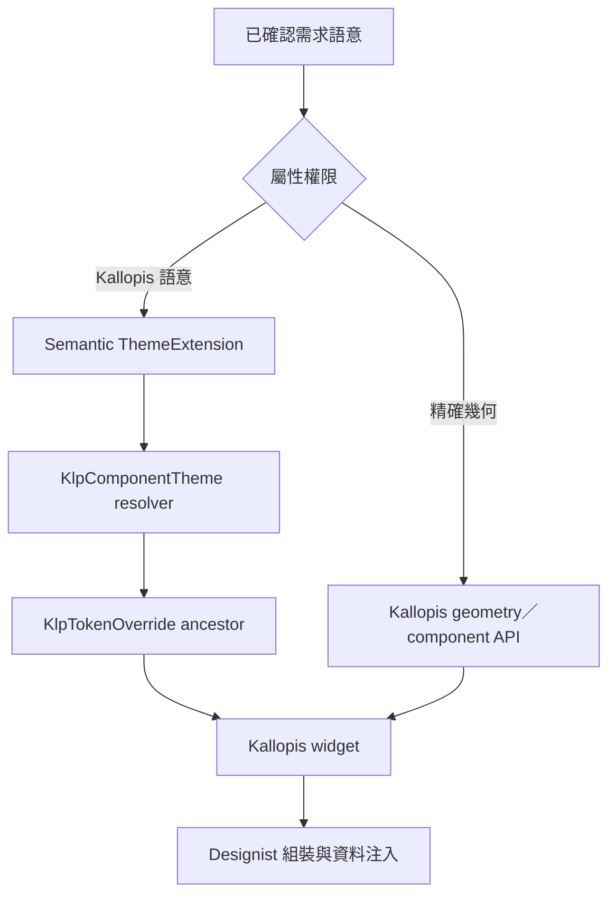
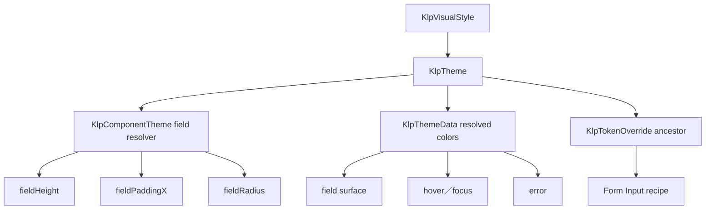
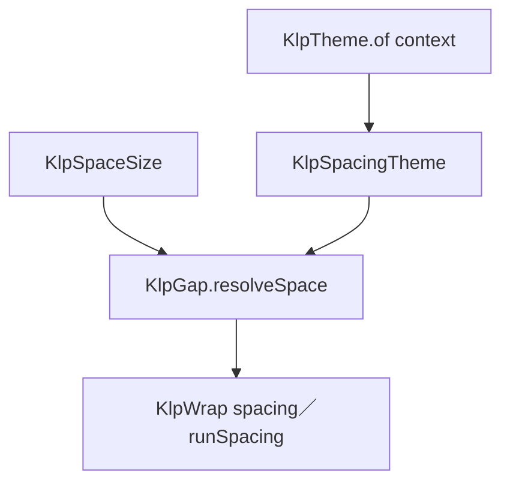

# 風格／邏輯語意繼承

語意不是元件名稱或色票別名。每個語意必須說明使用時機、排除條件、解析結果與理由。

## 語意定義表

| 語意 ID | 定義 | 適用條件 | 不適用條件 | 解析結果 | 理由 | 狀態 |
|---|---|---|---|---|---|---|
| SEM-EXACT-GEOMETRY | 使用者已指定或可可靠量測的布局尺寸、距離、位置與層級 | 參考資料被指定為精確規格 | 純風格參考或缺少可靠比例 | 解析至正確 geometry／component API 的精確值 | 防止用相近 token 改寫已指定布局 | confirmed |
| SEM-KALLOPIS-COLOR | 由 Kallopis semantic 與 component resolver 決定的顏色角色 | 使用者授權採用 Kallopis 色彩語意 | 使用者指定精確色值 | context.klp 已解析 getter，包含祖先 override | 保持跨主題一致並避免產品端自選色 | confirmed |
| SEM-FEEDBACK-COMPOSITION | Feedback 高階元件只組合 Kallopis typed layout、surface、interaction、typography 與 accessibility 原語 | loading、empty、error、permission、toast、status、workflow、progress overlay 與 region placeholder | feedback/primitives 下的 Flutter paint／clip／Semantics 實作邊界 | spacing 由 KlpSpaceSize→KlpSpacingTheme；surface／shape／geometry／文字由 context.klp 已解析值；原生 Flutter Widget 只存在 feedback/primitives 或跨領域基礎原語 | 讓產品只注入資料與事件，並以機械守門避免高階 feedback 再次繞過 Kallopis | confirmed |
| SEM-KALLOPIS-CJK-TYPE | 中文 UI 與正文使用跨平台一致的比例字體 | KlpText 的 ui／body family 與 Flutter ThemeData 一般文字 | code、label、terminal 等 mono family | KlpTypographyTheme.sansFamily／uiFamily／bodyFamily 解析為 packages/kallopis/Noto Sans TC；fallback 仍保留平台字體；monoFamily 維持 packages/kallopis/IBM Plex Mono | 避免 Windows、macOS 與 Linux 因系統中文字型不同而改變字形與度量 | confirmed |
| SEM-APP-CHROME-TYPE | App chrome 的識別、區域標題與狀態使用可獨立覆寫的等寬責任角色 | App Title、Window／Panel／Stage／Sidebar Header 主標題、Status Bar 與 Status Indicator | 正文、筆記內容、一般 label 或程式碼資料 | `appTitle` 保留 label 尺寸並使用 500、`header` 保留 bodyStrong 尺寸並使用 600、`status` 保留 code 尺寸並使用 500；三者 family 解析為 mono，拉丁字元預設使用 packages/kallopis/IBM Plex Mono，中文字元 fallback 至 packages/kallopis/Noto Sans TC | 固定已確認的 App chrome 字體、保留中文可讀性，並避免用視覺近似的舊角色混淆責任 | confirmed |
| SEM-STAGE-HEADER-COMPOSITION | 以兩行 Stage identity 投影呼叫端提供的專案、區域、標題、類型與動作 | KlpStageHeader | 導覽、標題內容、類型判定、動作行為或產品自行選擇布局數值 | 路徑列依 tight 節奏排列；標題列由 wrapTitle 決定完整換行或單行省略；類型與 actions 保持同列；外側只使用 chromePanelInset，標題與類型間距以 KlpSpaceSize.chromeToolbar 解析；組裝完整 dogfood Kallopis | 保留既有 Stage header golden 與自動換行幾何，同時禁止高階 chrome 直接使用 Flutter 排版或 raw gap | confirmed |
| SEM-SETTINGS-DEPTH | 設定頁左側導覽比右側內容更深 | 所有設定頁與主題模式 | 非設定頁 | 左側使用較深 surface role、右側使用較淺 surface role | 保持導覽與內容的穩定層級 | confirmed |
| SEM-COMMAND-MENU | Overlay 中可跨分組搜尋或選擇命令的鍵盤優先清單 | Global command palette 與通用命令選單 | Context menu、一般 navigation list 或產品專屬命令模型 | KlpCommandMenu 由 `geometry.layout.commandMenuWidth` 解析 300px 標準寬度；section heading 使用 contentInset／tight，item 使用 controlInset；selected 與 keyboard-highlighted 共用 surfaceMuted；disabled 與 danger 只改變語意前景；Focus 與可點擊 surface 限制在 command-menu primitives | 維持既有鍵盤路線與視覺尺寸，同時移除消費者 raw width 與高階 Flutter 組裝 | confirmed |
| SEM-FILTER-COMPOSITION | 將通用篩選、批次操作、presence 與 shortcut 視覺限制在 Kallopis | KlpFilterBar、KlpSelectionToolbar、KlpPresenceIndicator、KlpShortcutHint | 產品查詢模型、資料過濾、選取 authority、協作連線真相或產品直接組裝 Flutter UI | 篩選 wrap 間距解析 contentInline／contentStack；chip 幾何沿用 controlHeightSmall／controlInset／hairline／control radius；selected 前景沿用 onSelection；filter value 使用 `monoCaptionStrong` 精確保留 caption、bold、mono；toolbar、presence、shortcut 由 theme surface／shape／color 解析；原生 Widget 僅存在 `interaction/filter/primitives` | 讓產品只注入資料與事件，保留既有視覺並以遞迴閘門阻止高階 Flutter 組裝回流 | confirmed |
| SEM-WORKBENCH-RAIL | Workbench primary region 中固定且擁有獨立 surface 的主要入口軌 | 產品需要圖示入口與可切換上下文 Sidebar | 內容內工具列、Inspector 或 Sidebar 子區域 | KlpNavigationRailFrame 提供 48px surface；KlpNavigationRail 以 KlpBox／KlpColumn／KlpExpanded 固定解析 Top／Center／Bottom 三區，Center 取得剩餘高度、內容置頂並在溢出時無 Scrollbar 捲動；item gap 透過 `KlpSpaceSize.navigationRailItem` 解析，item extent 透過 `KlpSpaceSize.navigationRailControl` 解析 railItem，drop indicator 粗細解析 `shape.stroke`；KlpRailItem 委派 KlpActionRegion、KlpBox、KlpStack、KlpCenter 與 KlpTooltipSurface，selected foreground 解析 selectionForeground；原生 drag target、draggable、scroll view、anchored tooltip、badge dot 與 pointer tracking 只封裝於 `navigation/rail/primitives`；Rail divider 解析為 color.guide＋shape.dashedOpacity 的 shape.hairline 虛線；產品以 KlpRailButtonEntry／KlpRailMenuEntry 提供資料 | 將入口資料契約、幾何、分區與互動狀態集中在 Kallopis，避免任意 Widget 破壞 Rail 結構 | confirmed |
| SEM-WORKBENCH-NAVIGATION-REGION | 將同層 Rail 與 Sidebar 組成可共同收合的左側區域 | Rail 與 Sidebar 需要共享 Workbench primary 顯示生命週期 | 將 Rail 放入 Sidebar surface 或使兩者共享 footer | KlpWorkbenchNavigationRegion 以 space.compact 分隔兩個獨立 surface | 保留共同收合能力，同時維持 Rail、Sidebar、Stage 的視覺同層關係 | confirmed |
| SEM-WORKBENCH-CONTEXT-SIDEBAR | Rail 右側、擁有獨立 surface 與 status 的上下文內容區 | Rail 與 Sidebar 同屬可收合 primary region | Stage、secondary pane 或 Rail surface | KlpSidebarFrame 只組合 Sidebar content 與 footer；水平 padding 解析 space.compact | 讓產品能切換內容而不改變 Stage，並讓 status 明確描述 Sidebar | confirmed |
| SEM-PRIMARY-SIDEBAR-COMPOSITION | 以 Kallopis 排版原語固定組合 Primary Sidebar 的 header、navigation、Explorer 與 status | KlpPrimarySidebarFrame、KlpSidebarFrame | 產品傳入 EdgeInsetsGeometry／double，或在 shell 組合層直接建立 Flutter UI | KlpSidebarInset.chromePanel 解析 space.chromePanelInset；KlpSidebarInset.content 解析 space.contentInset；KlpPrimarySidebarHeaderInset.navigation 解析 space.navigationItemInset；headerNavigationGap 只接受 KlpSpaceSize；高階組合只使用 KlpColumn、KlpBox、KlpGap、KlpExpanded 與 KlpStatusIndicator | 保留既有 Sidebar 節奏與產品內容 authority，同時固定 typed style、dogfooding 與單檔單定義邊界 | confirmed |
| SEM-DOCK-LAYOUT | 固定 Stage 周圍可由使用者調整與重組的中性工作 panel 布局 | 產品提供 panel registry、受控 layout 與 Area limits | 產品專屬 destination、panel 內容或持久化策略 | KlpPanelFrame 提供 Group surface；resize primitive 解析 resizeHandleExtent／border；Area 與 Group 使用已確認像素 extent；drop primitive 以 context.klp.primary 在 Group 底部或 tab 插入位置呈現線性落點；header scope primitive 解析 KlpTextRole.code 且不外溢至 content；拖曳期間原位置解析 surface.dragSourceOpacity，預設 35% | 讓產品只保存資料與回應事件，並集中 header chrome、雙軸 resize、tab 與 docking 規則；原生 Flutter UI 僅存在 docking/primitives | confirmed |
| SEM-NAVIGATOR-COMPOSITION | Sidebar 中統一呈現分類、可巢狀元素與任意操作元件 | Catalog 目錄、Primary Sidebar 與其他樹狀導覽 | Rail、頁面 Tab、純檔案內容、raw indent 或產品自行拼裝平行 row | Category 使用既有 category header 高度、caption muted 與旋轉 chevron；Element 使用既有 file explorer row 高度、code 文字、icon、badge、space.tight 縮排與 state highlight；Component 原樣注入、不強制高度；私有 InheritedWidget 只傳遞展開、選取與事件；原生捲動、hover hit-test 與 disclosure 動畫只存在 navigator/primitives | 保留使用者認可的 Catalog 視覺，以三種模型限制產品注入面，並讓 Navigator 高階組合遵守 ARCH-006 dogfooding | confirmed |
| SEM-FILE-EXPLORER-COMPOSITION | 以固定視覺節奏呈現分類與檔案樹 | KlpFileExplorer、SectionView、FolderView、ItemView | 產品自行傳入 raw indent、padding、margin 或直接組裝 Flutter row | standard 使用 navigationItemInset 與 tight 縮排；relaxed 僅將縮排解析為 space.base；flush 在外層 panel 已擁有 gutter 時移除 section／item padding 並保留 section hairline margin；捲動、hover、tap 與 disclosure 的 Flutter 實作只存在 explorer/primitives | 讓產品選擇語意配方而非注入彈性數字，並讓 Explorer 高階組合遵守 ARCH-006 dogfooding | confirmed |
| SEM-STEPPER-COMPOSITION | 以固定三態與方向呈現流程進度 | KlpStepper 的水平或垂直排列 | 可點擊流程控制、產品自行傳入 Flutter Axis 或外觀數值 | currentIndex 唯一推導 completed／current／upcoming；方向使用 KlpStepperDirection；原 24px marker 與 60px 水平 label 寬度由 geometry.data typed 欄位解析；原生 circle、connector 與 IntrinsicHeight 只存在 stepper/primitives | 保留既有流程視覺與排列，同時讓產品只注入步驟資料與目前索引 | confirmed |
| SEM-CALENDAR-COMPOSITION | 以呼叫端提供的曆法文字與日期狀態呈現月曆 | KlpCalendar 單日／區間選取與可選 day content slot | 元件自行取得現在時間、內建語言字串、產品直接組裝日期格或注入 raw 外觀值 | 七欄與日期計算留在 Calendar；純日期格解析 controlHeightSmall，內容格解析 calendarContentCell；selected／range／today／disabled／hover 使用既有 Kallopis state、color、shape；原生日期 frame、hover hit-test 與 Semantics 只存在 calendar primitives | 保持日期與語言 authority 在呼叫端，同時固定通用月曆視覺與互動邊界 | confirmed |
| SEM-FIELD-COMPOSITION | 以一致節奏組合標籤、輔助資訊、任意控制項與回饋列 | KlpField 與委派至它的通用表單組合 | 驗證邏輯、產品文案、輸入狀態 authority 或產品直接拼裝 Flutter layout | 上方標籤列可呈現 required 與 requirement；description、child、回饋列之間解析 space.tight；error 覆蓋 status，errorCode 與 counter 保持尾端並解析 contentInlineGap；組合層只使用 Kallopis layout 與 typography 原語 | 讓產品只注入已解析資料與 child，並集中欄位周邊的視覺節奏 | confirmed |
| SEM-SELECT-FIELD-COMPOSITION | 以 field state trigger 與就地 option panel 呈現單選資料 | KlpSelectField 與需要內嵌展開的單選欄位 | 彈出式 menu、產品自行比對 value id、raw 外觀值或直接組裝 Flutter trigger | 元件只持有 expanded／hover／focus 視覺互動狀態；valueLabel 由呼叫端提供；disabled／readOnly／缺少 callback 時 trigger 不可互動；disabled option 不回報，成功選取後收合；原生 hover／focus／Semantics／Material hit-test 只存在 select field trigger primitive | 保持選取資料 authority 在呼叫端，同時集中就地單選的輸入視覺與互動邊界 | confirmed |
| SEM-CARD-COMPOSITION | 以型別化表面與固定內容節奏承載一般內容或核心指標 | KlpCard、KlpMetricCard 與中性資料摘要 | 產品專屬狀態模型、raw Color／double／EdgeInsetsGeometry 或產品直接組裝 Flutter card | 一般 Card 以 KlpCardTone 選擇 component／surface／muted／raised，selected 疊加 selectionWash；Metric Card 固定 component 表面，danger 以 danger border 與 KlpTextTone 呈現；原生 decoration、clip 與 value fit 只存在 card/primitives | 讓產品只選語意配方並注入資料／插槽，同時集中卡片表面與指標視覺 | confirmed |
| SEM-TIMELINE-COMPOSITION | 以固定 rail 與文字節奏呈現呼叫端已排序的事件序列 | KlpTimeline 與中性歷程、活動、版本事件 | 自行排序／解析時間、產品狀態語意、raw marker geometry 或產品直接組裝 Flutter rail | 首項不畫 marker 上方線，末項不畫下方線；中間項連線保持連續；預設 marker 以 highlighted 切換 text／textFaint，自訂 marker 原樣注入；首行對齊由 bodyStrong typography 與 indicatorDotLarge 推導；原生 intrinsic height、圓點與連線只存在 timeline/primitives | 保持事件與時間 authority 在呼叫端，同時集中時間軸的中性視覺語言 | confirmed |
| SEM-PROGRESS-COMPOSITION | 以固定軌道與文字節奏呈現呼叫端控制的連續進度 | KlpProgress 的 determinate／indeterminate 與 normal／warning／success／error 狀態 | 自行推導工作進度、內建產品文案、raw fill geometry、把已棄用 segments 解讀為分段軌道，或產品直接組裝 Flutter progress | value 限制在 0 到 1；軌道色依 state 解析既有 text／warning／success／danger；軌道高度解析 space.progressTrack；indeterminate 填充比例解析 geometry.data.progressIndeterminateFraction；取消文案由 cancelLabel 注入；原生 frame 與 fractional fill 只存在 progress/primitives | 保持進度資料、文案與取消行為 authority 在呼叫端，同時集中進度視覺與 Kallopis dogfooding 邊界 | confirmed |
| SEM-LIST-TILE-COMPOSITION | 以固定單列節奏呈現呼叫端提供的中性資料與動作 | KlpListTile 與設定、選單、清單等通用列項 | 產品自行組裝 Flutter tile、產品狀態模型、raw 顏色／尺寸／內距，或在 Kallopis 高階層維護 hover／focus | selected 使用 selectionBackground；feedback tone 依 listStatusOpacity／listStatusSelectedOpacity 疊色；hover／focus 以 selectionWash 混合原底色；compact 高度與所有 padding／gap 由 theme 解析；Semantics、Material、InkWell 與互動狀態只存在 list_tile/primitives | 讓呼叫端只注入中性內容與事件，同時集中列項視覺、可及性與互動邊界 | confirmed |
| SEM-FIRST-LAYER-PANEL | app background 上第一層可視 panel 各自提供外距的舊語意 | 歷史相容與 KLP-0006 查閱 | 新產品主內容、KlpDockLayout 或任何會與產品根 padding 疊加的組合 | 不再供新組合採用；由 SEM-APP-PRODUCT-PADDING 取代 | 保留歷史名稱，避免舊文件被誤當現行唯一真相 | superseded |
| SEM-APP-PRODUCT-PADDING | App 產品主內容根節點的 halfCompact padding 舊組合 | 歷史相容與 KLP-0008 查閱 | 新產品的完整 App／Dock／Header 邊界規則 | 產品根的 halfCompact padding 仍有效；Dock 零 margin 已由 SEM-COMPOSED-HALF-COMPACT-BOUNDARY 取代 | 保留歷史名稱，避免 KLP-0008 被誤當現行完整規則 | superseded |
| SEM-COMPOSED-HALF-COMPACT-BOUNDARY | App chrome 各層分別擁有 halfCompact 邊界的舊組合 | 歷史相容與 KLP-0009 查閱 | 新產品的 App padding 組合 | 已由 SEM-APP-FRAME-PADDING 取代 | 保留修訂來源，避免 Header margin 被誤當現行規則 | superseded |
| SEM-APP-FRAME-PADDING | AppFrame 單獨擁有 halfCompact、安全包住 Header 與主內容的舊組合 | 歷史相容與 KLP-0010 查閱 | 新產品的完整 App／Header／Dock 邊界 | 已由 SEM-HALF-COMPACT-BOUNDARY-PAIR 取代 | 保留修訂來源，避免 Header margin 被移除 | superseded |
| SEM-HALF-COMPACT-BOUNDARY-PAIR | 相鄰 App chrome 責任層各貢獻 halfCompact 並組成 compact gutter | 歷史相容與 KLP-0012 查閱 | 新元件與新風格覆寫 | 數值關係保留，但欄位名稱與獨立注入由 SEM-SCOPED-SPACING 取代 | 保留 4px＋4px＝8px 的布局來源，不再作為 runtime API 名稱 | superseded |
| SEM-SCOPED-SPACING | 依使用位置表達間距責任，避免單一密度名稱控制無關元件 | Kallopis 的 content、control、action、chrome、navigation、overlay 與 App 組合邊界 | primitive 階梯、元件直接取用 `space2`，或新的 `compact`／`halfCompact` 萬用別名 | 內容與互動 scope 的預設欄位各自指向 `KlpScale.space200`（8px）；`appFrameInset`、`workbenchContentInset`、`windowHeaderMargin`、`dockMargin` 各自指向 `KlpScale.space100`（4px）；每個欄位可由 ThemeExtension 與 JSON v2 獨立覆寫 | 相同預設數值不代表相同責任；scope 分離後可局部調整風格而不連動無關元件 | confirmed |
| SEM-WINDOW-HEADER-DRAG | App Header 全表面拖動平台視窗 | KlpWindowHeader 的完整占位範圍，包含自身 margin | AppFrame padding、產品 body、Dock Header 的 panel 拖放 | 最外層 KlpGestureRegion 包住 Header margin 與可視 KlpSurface，以 translucent hit test 參與整個 Header 子樹的 pan 手勢；pan start 呼叫 KlpWindowAction.drag；子元件 tap 仍參與 gesture arena；雙擊 maximize 只包裝非互動 identity／空白區 | 將 heading 全區可拖動的操作模型套用到 App chrome，並讓高階元件遵守 ARCH-006 dogfooding | confirmed |
| SEM-COMPACT-PANEL-RADIUS | 通用工作區 panel 使用比大型容器更緊湊的邊界 | KlpPanelFrame 及由其組成的 Sidebar、Rail frame、Dock group | Dialog、overlay 或其他仍需大型 panel 圓角的容器 | 外圓角 = context.klp.shape.card，預設 8px；內層 clip = card - stroke，預設 6px | 降低工作區 panel 的圓潤量體，同時保留 panel 與大型浮層的語意層級 | confirmed |
| SEM-STAGE-TOP-BAR-COMPOSITION | 讓 Workbench header 中的 Stage 分頁與動作維持固定兩端對齊 | KlpStageTopBar、KlpStageTab | Stage body、route authority、多分頁資料模型、產品直接組裝 Flutter header | tab 位於 start；actions 位於 end 且間距解析 tight；StageTab 使用 stageSurface、chromeTab、chromePanelInset、buttonRadius 與 panel connection radius；原生 directional surface frame 僅限 shell/stage/primitives；每檔一份結構定義 | 保留 Stage 與 header 的既有幾何連接，同時讓產品只注入分頁與動作內容 | confirmed |
| SEM-EDITOR-ACTION-BARS-COMPOSITION | 讓一般、批次與搜尋動作共用中性編輯器表面與事件邊界 | KlpEditorToolbar、KlpBulkActionBar、KlpSearchNavigator、KlpEditorActionData | 文件命令執行、搜尋 authority、選取資料、產品快捷鍵政策或產品直接組裝 Flutter toolbar | 所有事件原樣派送；selected／danger／disabled 只決定通用視覺；surface 與間距由 theme 解析；previous icon 使用 typed half turn；原生 Material／InkWell／padding frame 僅限 editor/action_bars/primitives；每檔一份結構定義 | 產品保有命令與搜尋真相，Kallopis 集中共用 toolbar 視覺且不允許 raw 角度或局部 Flutter wrapper | confirmed |
| SEM-NAVIGATION-CONTROLS-COMPOSITION | 讓通用動作群組、分頁與檢視切換共用 Kallopis 排版和互動邊界 | KlpActionGroup、KlpPagination、KlpViewSwitcher | 產品資料排序、頁面保存、route authority、任意 Widget icon 或產品直接組裝 Flutter 控制項 | ActionGroup 間距解析 tight；Pagination 邊界停用且間距解析 action；ViewSwitcher 使用 typed KlpIconData、inset surface、selection foreground/background 與 theme 幾何；每個 Dart 檔案只保留一份結構定義；原生 frame 僅限 primitives | 產品只注入狀態與事件，無法透過 icon slot 或局部 Flutter wrapper 繞過視覺系統 | confirmed |
| SEM-PANEL-SCROLLBAR-GUTTER | Panel 的捲軸占用既有尾側 content padding 槽，而不縮窄 padding 後的內容區 | KlpPanelFrame 內具有受控垂直 Scrollable 的 Navigator、Explorer 或其他 panel 內容 | 頁面級捲動、水平捲動、內容自行擁有且不與 Frame 共用 controller 的巢狀捲動 | panel content padding 預設為 compact 8px；Scrollbar 覆蓋完整 content region，thumb 以 `(endPadding - scrollbarThickness) / 2` 置中於尾側 padding 槽；實際內容仍套完整水平 padding；Frame 與 Scrollable 共用 controller，且關閉該子樹的自動 scrollbar | 保留 8px 內容安全距離，同時讓捲動控制留在 panel 邊緣且避免重複軌道 | confirmed |
| SEM-COMPACT-MESSAGE | 密集 Sidebar 對話中的訊息節奏與方向 | 歷史相容 | 新的訊息 bubble 背景呈現 | 原本 background 解析 component surface，於部分內容區與背景無法辨識 | 保留舊來源 | superseded by SEM-READABLE-MESSAGE-BUBBLE |
| SEM-READABLE-MESSAGE-BUBBLE | 讓訊息內容形成可辨識邊界並維持中性角色表達 | KlpMessageBubble 的 background／emphasized 背景分支 | 無背景訊息、Composer 或其他 component surface | dense padding 解析 contentInset 8px，regular 解析 base 16px；background 解析 KlpSurfaceTone.muted；KlpAlign 使 surface 貼合 child；使用者 trailing、Assistant leading；高階層不直接組裝 Flutter UI | muted 提供相對內容區可見的層級差；角色仍由位置而非不同色彩表示 | confirmed |
| SEM-MESSAGE-THREAD-COMPOSITION | 以固定訊息節奏排列呼叫端提供的訊息與載入動作 | KlpMessageThread 與 KlpMessageBubble 的通用對話呈現 | Composer 輸入狀態、產品角色模型、訊息資料保存、產品自行組裝 Flutter thread 或 raw spacing | Bubble 只投影 author／timestamp／child 與方向；Thread 保留 caller 順序；dense 間距解析 contentStack，regular 解析 comfortable；load older 使用 ghost compact KlpButton；每個 Dart 檔案只保留一份結構定義 | 讓產品保有訊息資料與事件 authority，同時集中對話呈現的 Kallopis dogfooding 邊界 | confirmed |
| SEM-PREVIEW-CARD-COMPOSITION | 以可辨識的虛線預覽區與固定資訊節奏呈現呼叫端內容 | KlpPreviewCard 與中性的素材、元件或文件預覽 | 檔案資料模型、產品事件、raw previewHeight、產品直接組裝 Flutter card | KlpPreviewCardSize compact／standard／large 分別解析 64／96／192px 的可覆寫 data geometry；預覽區維持 component surface 與 control radius；資訊區沿用 contentInset／itemGap／tight／contentInline／hairline；高階層只使用 Kallopis 元件，原生高度 frame 只存在 preview_card/primitives | 保留既有三種預覽比例，同時把幾何變成可注入 token 並建立 dogfooding 邊界 | confirmed |
| SEM-SORT-CONTROL-COMPOSITION | 以單一中性控制項顯示呼叫端控制的排序方向 | KlpSortControl 與表格、清單或資產排序入口 | 元件自行排序資料、保存排序狀態、產品手寫平行 Flutter 控制項或 raw 外觀值 | ascending 唯一決定預設 chevronUp／chevronDown，呼叫端可用 KlpIconData 覆寫；press 只回傳切換意圖；間距與 icon 尺寸由 context.klp 解析；Catalog 必須直接 dogfood KlpSortControl | 讓排序資料 authority 留在呼叫端，同時避免死欄位與展示頁繞過真實元件 | confirmed |
| SEM-COMPACT-MESSAGE-COMPOSER | 有限區域內可輸入長內容的密集訊息輸入器 | Composer 取得有限高度，且需標籤在上、輸入與動作同列 | 無高度上限的文件編輯器 | padding 解析 contentInset，非 dense 解析 base；surfaceMuted；TextArea 預設 minLines 1、maxLines 5，可由呼叫端以 null 選擇無限行；inline／stacked layout 均只使用 Kallopis 原語，有限高度時由 KlpFlexible 約束並讓輸入內捲動 | 保留單行起始高度，同時不讓長輸入突破父區域 | confirmed |
| SEM-MESSAGE-CONVERSATION-REGION | 在 Sidebar 可用內容高度內配置訊息列表、Composer 與 footer 前節奏 | 對話內容需要固定外距且 Composer 可增長 | 無 footer 的自由畫布 | KlpMessageConversation：內容上／左右解析 contentInset；Composer 上／左右解析 space0_5、下解析 space1；KlpLayoutBuilder 將可用高度以 KlpBoxConstraints 交給 Composer；組合層不直接使用 Flutter UI | 將跨子元件的高度與邊界節奏留在 Kallopis，產品不建立局部 wrapper | confirmed |
| SEM-OUTLINED-FIELD-FOCUS | 需要明確邊界與 focus 回饋的文字欄位 | outlined 為 true | 無框 field | borderWidth = max(resolved fieldBorderWidth, shape.stroke)；idle = color.border；focused = color.interaction；radius = resolved fieldRadius | 2px stroke 表示明確操作邊界，interaction 表示目前輸入焦點 | confirmed |
| SEM-COMPACT-STATUS-BADGE | 以 micro 文字呈現狀態 Badge 的舊語意 | 歷史查閱 | 新的 KlpBadge 預設呈現 | 由 SEM-READABLE-STATUS-BADGE 取代 | 保留 10px／12px 舊來源，避免誤認為目前規格 | superseded |
| SEM-READABLE-STATUS-BADGE | 附著於內容旁、需快速掃讀的短狀態、分類或數量標記 | KlpBadge 的 label、可選 dot 與 filled／outline／solid variant | 正文內容、操作控制項或長句 | text = KlpTextRole.caption（12px／16px）；paddingX = resolved badgePaddingX = space.tight + space.xxs（6px）；paddingY = space.xxs（2px）；radius = resolved badgeRadius = shape.pill；高階組裝使用 KlpRow／KlpFlexible／KlpGap／KlpText，原生 frame 與 dot 僅存在 `data/badge/primitives`；最終高度約 20px | 提高狀態辨識度，同時維持低於最小 28px 按鈕的資訊層級 | confirmed |
| SEM-TAG-COMPOSITION | 以中性表面呈現可移除的短分類標籤 | KlpTag 的 label、prefix 與 onRemove | 產品標籤模型、選取狀態、長內容或產品直接組裝 Flutter chip | surfaceInset＋divider hairline＋control radius；水平／垂直內距解析 controlInset／tight；prefix gap 以 `KlpSpaceSize.xxs` 解析 space.xxs；高階組裝只使用 KlpRow、KlpFlexible、KlpGap、KlpGestureRegion 與 KlpText，原生 surface frame 僅存在 `data/badge/primitives` | 保留既有 Tag 視覺與事件，同時讓產品只注入資料與移除 callback | confirmed |
| SEM-SCHEDULE-TIME-COLUMN | 排程列中可快速掃讀且不可拆行的時間 | KlpScheduleList 的 item.time | 標題、detail 或允許自然換行的正文 | columnWidth = context.klp.space.sectionLarge；text = KlpTextRole.code＋KlpTextTone.muted；maxLines = 1；overflow = ellipsis | 時間是單一辨識單位，拆行會破壞格式與列高；固定語意寬度維持各列標題對齊 | confirmed |
| SEM-DATE-GRID-WEEKEND | 七欄日期格以明確網格與中性 surface 辨識週末 | KlpDateGrid 的第 1、7 欄 | 選取狀態、一般工作日或其他非七欄資料布局 | separator width = context.klp.shape.hairline；color = context.klpColors.border；weekend tone = KlpSurfaceTone.muted；selected tone = KlpSurfaceTone.component 並優先；cell radius = 0；cell height = context.klp.geometry.data.dateGridCellHeight；原生 GridView／Border 僅限 primitives | selected 優先於週末分類；單側邊線建立可見但不加倍的網格；高度由 theme 契約統一解析 | confirmed |
| SEM-ACCORDION-COMPOSITION | 以受控項目資料與元件內暫存展開狀態呈現折疊內容 | KlpAccordion 與中性詳情群組 | 產品資料載入、內容 authority、raw geometry 或一般組裝檔直接使用 Flutter animation／interaction | single 模式只保留一個 id，multiple 模式獨立切換；header hover／focus 共用 selectionWash，Semantics 回報 expanded；chevron 與 body 使用 stateTransition／standard；原生互動與動畫只存在 accordion/primitives | 保持內容與 id 在呼叫端，同時集中 accordion 的展開狀態、可及性和視覺節奏 | confirmed |
| SEM-ARTIFACT-WORKSPACE-COMPOSITION | 將呼叫端提供的結構化文件、token、元件定義與可及性投影組成一致的中性工作區元件 | KlpDocument*、KlpToken*、KlpComponent*、KlpAccessibilityContractPanel | canonical artifact authority、保存狀態推導、token 驗證、元件 instance override、產品流程語意或 raw style | Kallopis 只呈現 labels、slots、rows 與 callbacks；document／token／component 資料不自行推導；排版完整 dogfood Kallopis；header／link／card 的特殊原生 semantics 只存在 artifact_workspace/primitives | 讓產品持有所有資料與事件真相，同時提供一致且可及的中性視覺組件 | confirmed |
| SEM-CANVAS-WORKSPACE-COMPOSITION | 將呼叫端提供的畫布內容、診斷與 flow 投影組成中性互動畫布 | KlpCanvas*、KlpLayoutLens、KlpFlow* | 文件座標 authority、節點模型、拖放決策、驗證計算、保存或產品流程 | viewport 只持有 Flutter transformation mechanism；selection／drop／flow frame 只解析 context.klp；diagnostics／issues／actions 原樣投影；原生 render、pointer 與 semantics 只存在 canvas_workspace/primitives | 保持畫布資料與領域決策在呼叫端，同時集中通用 viewport、selection 與診斷視覺 | confirmed |
| SEM-PAGE-CHROME-COMPOSITION | 以中性頁面 chrome 投影呼叫端已格式化的頁面與保存資訊 | KlpPageChrome、KlpSaveStatusCard、KlpPropertySummary | 保存推導、時間格式化、協作者模型、屬性 schema、產品狀態或導覽事件 | breadcrumb 只以 `/` 串接；savedAt 與所有 labels 原樣呈現；message／badge tone 只解析 Kallopis feedback color；surface、排版與節奏完整 dogfood Kallopis | 讓產品持有頁面與保存真相，同時集中編輯器周邊的中性視覺節奏 | confirmed |
| SEM-ENTITY-PICKER-COMPOSITION | 以中性搜尋與結果列投影呼叫端持有的實體候選資料 | KlpEntityPicker、KlpEntityResultData | 搜尋、篩選、排序、選取 authority、實體 schema、清除與套用後果 | initialQuery 只初始化欄位；query change、result index、clear 與 apply 原樣派送；selected 只決定 muted surface；kind、label 與 trailing 原樣投影；原生 Material／InkWell 只存在 entity_picker/primitives | 讓產品持有候選資料與決策真相，同時集中 picker 的中性排版、選取表面與互動框架 | confirmed |
| SEM-REFERENCE-PICKER-COMPOSITION | 以中性查詢、載入與結果列投影呼叫端持有的參照候選 | KlpReferencePicker、KlpReferenceOption | 搜尋、排序、選取 authority、參照 schema、產品領域型別或產品直接組裝 Flutter picker | query change 與 result id 原樣派送；disabled 不派送；loading 隱藏結果；kind／label／metadata 只負責投影；間距與列高由 theme 解析；原生 surface／constraint frame 僅限 form/picker/primitives；每檔只保留一份結構定義 | 讓產品保留資料與事件真相，同時封閉既有 ReferencePicker 的視覺微觀組裝 | confirmed |
| SEM-KEY-VALUE-COMPOSITION | 以 typed label width 與固定列節奏呈現呼叫端提供的鍵值資料 | KlpKeyValueTable、KlpKeyValueList | 產品欄位語意、資料轉換、raw width 或產品直接組裝 Flutter row | compact／standard 寬度從 geometry.data 解析；table 保留 component surface、card radius、hairline border 與 comfortable padding；list 保留 caption label、可選 mono value 與 copy event；原生 frame、label slot 與文字繼承只存在 key_value/primitives | 讓呼叫端只注入資料、內容與事件，同時集中鍵值視覺和幾何 authority | confirmed |
| SEM-BRAND-COLOR | 產品識別的單一主題色，可由 OKLCH 編輯並轉為 sRGB | 品牌識別、品牌色展示與後續由產品明確採用的情境 | accent、interaction、status 或其他功能色 | `KlpThemeData.brand`；未指定時解析為同一套 theme 的 accent；局部 `KlpTokenOverride` 可沿 ancestor 覆寫整組 resolved colors | 保持品牌身份與操作語意解耦；既有主題在未覆寫時視覺不變 | frozen-semantic |
| SEM-BRAND-PRIMARY | 產品主要動作使用可編輯主題色 | primary tone 元件、Catalog 即時主題預覽 | accent、一般 interaction、success、warning、danger、info | KlpTheme.primary = brand(alpha: 255)；相對亮度 × 255 小於 128 時 onPrimary = onDarkBackground，否則為 onLightBackground | 以不透明品牌背景建立主要動作 | superseded by SEM-PRIMARY-CONTRAST-A0 for foreground threshold |
| SEM-PRIMARY-CONTRAST-A0 | 以 0xA0 為 primary 前景亮暗切換點 | 所有使用 KlpTheme.onPrimary 或 primaryForegroundFor 的元件 | 非 primary tone 與 status tone | 8-bit sRGB luma = 0.299R + 0.587G + 0.114B；小於 160 使用 onDarkBackground 淺色字，160 以上才使用 onLightBackground 深色字；有狀態 wash 時以實際繪製背景重新判斷 | 灰階 #999999 得 153、#A0A0A0 得 160，可精確符合指定邊界並合理處理彩色與互動狀態背景 | confirmed |
| SEM-COMPACT-BUTTON-GEOMETRY | Kallopis 預設按鈕的緊湊五段高度 | KlpButton XS／SM／MD／LG／XL | 文字欄位、選單、觸控區或其他控制項 | `context.klp.geometry.control` 依序解析 28／32／36／40／48px；KlpComponentTheme.buttonHeight 只可覆寫 MD 相容入口 | 降低按鈕垂直量體而不改動全域控制項尺度，並讓 JSON visual style 可覆寫精確幾何 | confirmed |
| SEM-BUTTON-COMPOSITION | Button 高階元件只負責解析語意風格、組合內容與轉交事件 | KlpButton、KlpIconButton 的組合檔與狀態檔 | `controls/button/primitives` 內封裝 Flutter paint、Material、InkWell、Semantics 與固定框架的底層實作 | 高階內容排列使用 KlpRow／KlpFlexible／KlpGap；尺寸、顏色、圓角與狀態由 KlpButtonStyle／私有 KlpIconButtonStyle 讀取目前 context.klp 後，以單一 typed style 物件交給 frame primitive | 保留既有視覺與互動，同時讓高階控制項可由機械守門禁止直接依賴原生 Flutter UI | confirmed |
| SEM-TOGGLE-COMPOSITION | Toggle 高階元件只持有受控值、語意選項與 callback，原生繪製集中在私有 primitive | KlpToggle、KlpToggleIndicator、KlpCompactSwitch、KlpTriStateToggle、KlpPhaseToggle | `controls/toggle/primitives` 以外的 Flutter UI 直接組裝；raw Color／double 公開外觀參數 | 高階布局使用 KlpRow／KlpGap；typed style 從 context.klp 的 color、geometry、shape、spacing、surface、motion 完整解析；明暗 tone 透過 KlpTheme.byBrightness，不讀 Material Theme | 維持祖先 token override、既有幾何與互動行為，同時讓所有 Toggle 受相同 dogfood 與單檔單定義守門 | confirmed |
| SEM-SELECTION-COMPOSITION | Selection 高階元件只持有受控值、資料選項與 callback，原生框架控制及繪製集中在私有 primitive | KlpCheckbox、KlpRadioGroup、KlpSegmentedControl、KlpSelect、KlpSlider、KlpSlidingSelection | `controls/selection/primitives` 以外直接組裝 Flutter UI；以 raw Color 表達選項 tone；元件本地計算固定幾何 | 高階布局使用 KlpRow／KlpColumn／KlpWrap／KlpGap／KlpExpanded／KlpFlexible；KlpSelectionTone 解析至目前 color theme；尺寸、shape、surface 與 motion 經 typed style 從 context.klp 解析，sliding selection 尺寸由 geometry.control 獨立欄位提供 | 保留既有視覺與互動，讓產品只提供語意資料而不注入外觀值，並以機械閘門固定 primitive 邊界 | confirmed |
| SEM-INPUT-COMPOSITION | Input 高階元件只持有文字／候選資料、狀態與 callback，原生輸入框架集中在私有 primitive | KlpTextField、KlpCombobox | `controls/input/primitives` 以外直接組裝 Flutter UI；以 raw Color／double 注入外觀；在 combobox 重畫欄位或選單 | 高階布局使用 KlpColumn／KlpRow／KlpGap／KlpText／KlpIcon／KlpFocusRegion／KlpMenu；私有 typed style 從 context.klp 解析 control size、field geometry、spacing、shape、typography、surface 與 state colors；TextFormField、Material、Focus、decoration 與 suffix gesture 留在 primitive | 保留既有欄位視覺、輸入、鍵盤導覽與錯誤狀態，並讓產品只注入資料與事件 | confirmed |
| SEM-FORM-INPUT-RECIPE-COMPOSITION | Form input recipe 以共用外框、Kallopis 排版與內部 primitive 投影受控欄位資料及事件 | KlpInputFrame、KlpAffixedTextField、KlpQuantityField、KlpCompoundField、KlpDateRangeField | 驗證決策、產品資料保存、raw 外觀值，或 `form/internal/primitives`／既有 `form/input/primitives` 以外直接組裝 Flutter UI | 外框 label／error 使用 KlpColumn、KlpGap、KlpText；recipe 使用 KlpRow、KlpBox、KlpExpanded、KlpCenter；高度、圓角、填色、前綴內距與 action 尺寸解析 context.klp；MouseRegion、Focus、Semantics、Container、Material、TextFormField、InkWell 與 divider paint 留在 internal primitives | 保留原本 40px 欄位、hover／focus 填色、輸入與 action 行為，同時固定共享 primitive、dogfooding 與單檔單定義邊界 | confirmed |
| SEM-DATE-FIELD-COMPOSITION | Date Field 在文字輸入與呼叫端受控月曆間提供單一中性切換入口 | KlpDateField、KlpDateFieldCalendar | 日期格式解析、目前月份推導、停用規則、選取資料保存、產品文案或 raw 外觀值 | 沒有 calendar 時直接沿用可編輯 KlpTextField；有 calendar 時欄位唯讀並由 KlpGestureRegion 切換本地 expanded；KlpPointerBlocker 隔離子欄位指標事件；面板間距解析 KlpSpaceSize.tight；選日 callback 原樣派送後收合 | 維持日期 authority 在呼叫端，保留文字與月曆兩條既有輸入路徑，同時固定 dogfooding、pointer primitive 與單檔單定義邊界 | confirmed |
| SEM-FORM-CORE-COMPOSITION | Form Core 高階元件只投影呼叫端提供的內容、驗證文字、受控狀態與 callback | KlpForm、KlpFormSection、KlpFormErrorSummary、KlpFormActions、KlpFieldGroup、KlpFieldError、KlpConditionalFieldRegion | 驗證規則、資料保存、產品流程語意、raw 外觀值，或 `form/core/primitives` 以外直接組裝 Flutter UI | Form 排列使用 KlpColumn／KlpGap；Section 與 Error Summary 使用 KlpSurface／KlpBox／KlpGestureRegion；Actions 使用 KlpWrap／KlpButton；Field Error 使用 KlpLiveRegion；所有間距由 KlpSpaceSize 或 context.klp token 解析；原生尺寸動畫只存在 conditional primitive | 保留既有表單順序、surface、折疊、選錯與 submitting 行為，同時以遞迴機械閘門固定 dogfooding 與單檔單定義邊界 | confirmed |
| SEM-PASSWORD-FIELD-COMPOSITION | 以共用文字輸入 primitive 呈現敏感值、顯示切換與呼叫端提供的規則狀態 | KlpPasswordField 與 KlpTextField 的 obscure／trailing action 能力 | 密碼規則計算、強度推導、驗證、保存、登入或產品流程 | KlpPasswordField 只持有 obscured 本地呈現狀態；KlpTextField 接收 typed leading／trailing icon、語意 label 與 callback，原生 TextFormField／Semantics／gesture 留在 input primitives；requirements 與 error 原樣投影 | 避免 PasswordField 複製第二套輸入框、裝飾與互動，同時保留產品對敏感值及規則結果的 authority | confirmed |
| SEM-STRUCTURED-FORM-COMPOSITION | Structured form 高階元件只持有受控資料、內容 slot 與 callback，排列與控制項全面使用 Kallopis，原生固定框架集中在私有 primitive | KlpCodeField、KlpCodeEditorField、KlpFileField、KlpFileDropzoneField、KlpKeyValueEditor、KlpRepeaterField、KlpApprovalStepsField | `form/structured/primitives` 以外直接組裝 Flutter UI；公開 API 接收 raw Color／double 外觀；以 KlpSurface token override 改變既有 frame 內文字色 | 高階布局使用 KlpColumn／KlpRow／KlpWrap／KlpGap／KlpExpanded／KlpAlign；輸入、動作、文字與內容使用 KlpTextField／KlpButton／KlpCodeViewer／KlpText／KlpGestureRegion；KlpStructuredFrameStyle 從 context.klp 解析既有 frame 幾何與色彩後交給 primitive，進度 paint 留在 primitive | 在不改變既有 paint、資料所有權或 callback 的前提下固定 structured form 的 dogfood、typed style 與單檔單定義邊界 | confirmed |
| SEM-COMPOUND-FIELD-COMPOSITION | 在同一輸入框中維持主要文字與受控尾端選項的共同節奏 | KlpCompoundField | 選項產品語意、選取狀態 ownership、raw geometry 或一般組裝檔直接使用 Flutter UI | 主要輸入沿用 KlpInputFrame／KlpInputEditor；trigger 保留透明 overlay 與 button semantics；panel 使用 component 色、card radius、tight padding；option 使用 fieldHeight／controlInset，disabled 不派送事件；原生 trigger、option frame 與 panel 只存在 input/primitives | 保持 value／selection authority 在呼叫端，並讓 compound 欄位完整 dogfood Kallopis 排版與輸入原語 | confirmed |
| SEM-CODE-DATA-COMPOSITION | Code data 高階元件只持有程式碼／差異／終端資料、受控顯示狀態與 callback，原生框架、捲動及 dialog 定位集中在私有 primitive | KlpCodeViewer、KlpDiffViewer、KlpTerminal | `data/code/primitives` 以外直接組裝 Flutter UI；公開 API 以 raw double 注入 viewport 高度；同檔混合多個資料元件與私有狀態 | 高階布局與內容使用 KlpColumn／KlpRow／KlpGap／KlpExpanded／KlpSpacer／KlpAlign／KlpText／KlpIcon／KlpMenu／KlpTooltip；KlpCodeViewportLimit 表達高度限制；私有 typed style 從 context.klp 解析既有色彩、shape、spacing、geometry 與 motion 後交給 code primitives | 保留既有像素、內容狀態與事件契約，同時固定 code data 的 dogfood、typed geometry 與單檔單定義邊界 | confirmed |
| SEM-ADVANCED-DATA-COMPOSITION | Advanced data 高階元件只持有資料模型、受控狀態與 callback，固定框架、裁切、命中與旋轉集中在私有 primitive | KlpDataTable、KlpTree、KlpTreeItem、KlpJsonTree、KlpFilePreview | `data/advanced/primitives` 以外直接組裝 Flutter UI；以 raw double 注入欄寬或預覽高度；同檔混合多個資料元件、模型與狀態 | 高階布局使用 KlpColumn／KlpRow／KlpBox／KlpGap／KlpExpanded／KlpFlexible／KlpAlign／KlpCenter；內容與互動使用 KlpText／KlpIcon／KlpCheckbox／KlpGestureRegion／KlpStateHighlight；KlpDataColumnSpan 表達欄位比例，KlpFilePreviewSize 解析 geometry.data.filePreviewHeight；私有 typed style 從 context.klp 解析既有 color、spacing、shape、geometry 與 surface opacity 後交給 advanced primitives | 保留表格密度、tree 狀態色、JSON 展開與 file preview 呈現，同時固定 dogfood、typed geometry、l10n 與單檔單定義邊界 | confirmed |
| SEM-COLOR-CONTROL-COMPOSITION | OKLCH 高階控制元件只持有色彩資料、具名編輯範圍與 callback，框架繪圖與輸入命中集中在私有 primitive | KlpOklchColorEditor、KlpOklchColorPicker | `controls/color/primitives` 以外直接組裝 Flutter UI；元件以 raw double 接收 Chroma 上限；高階元件直接持有 Canvas／gesture／focus／clip | 高階布局使用 KlpLayoutBuilder／KlpColumn／KlpWrap／KlpGap／KlpText／KlpSemanticRegion／KlpExcludeSemantics／KlpSlider；Chroma 上限由 KlpOklchChromaRange 表達；私有 typed style 從 context.klp 解析 plane extent、preview height、shape、border 與 cursor；CustomPaint、Canvas、Focus、gesture、clip 與 preview paint 留在 primitive | 保留既有色彩運算、響應式排列、可及性、鍵盤與指標行為，同時固定 dogfood、typed API 與單檔單定義邊界 | confirmed |
| SEM-PRIMARY-LABEL-WEIGHT | Primary 動作標籤需要比同尺寸一般按鈕更穩定的光學重量 | KlpButton tone = primary | secondary／ghost／dashed／danger | caption 尺寸使用 captionStrong、body 尺寸使用 bodyStrong、lead 維持既有 semiBold；皆由 KlpTypographyTheme.semiBold 解析 | 明亮實色背景會讓 regular 筆畫顯得較細；使用真實字重維持辨識，不用陰影或描邊補償 | confirmed |

| SEM-DATA-VISUALIZATION-COLOR | 資料視覺化用途與主題模式由 semantic theme 指派 | 圖表系列、wash、座標軸、格線、標籤、數值、crosshair 與漲跌狀態 | primitive 色票名稱或元件直接選色 | KlpPalette 只提供 sand／gold／ochre／terracotta／clay／umber、warmNeutral、green、red 等色族與色階；KlpDataVisualizationTheme.light／dark／ultraDark 組成用途 | 讓相同 primitive 可跨用途重用，並讓模式切換與消費端覆寫留在 ThemeExtension | confirmed |
| SEM-CATALOG-TAXONOMY | Kallopis 預設風格與 Catalog 的固定四層語意 | 所有 Kallopis 元件、Catalog 分類與消費產品預設介面 | 使用者建立的 Design System recipe | primitive → foundation → component → pattern；消費產品只可覆寫 color.identity.brand | 保持跨產品操作語意一致，並讓分類可由機器驗證 | confirmed |
| SEM-CATALOG-STYLE-TRACE | Catalog 以原始碼中的實際 resolver 與語意 enum 呈現元件風格來源 | 所有 Catalog specimen | 以設計稿、元件名稱或 agent 猜測補值，或把底層元件全部可選 variant 誤列為上層的實際值 | generator 掃描元件直接引用，分類為 color／surface／border-shape／spacing-padding／typography／geometry／motion／component，並另列組成元件；description 直接顯示所有分類，tooltip 提供多行補充；缺值明示未宣告 | 讓展示內容不需 hover 即可檢查且可追溯到實作，避免遞迴攤平造成過度宣稱 | confirmed |
| SEM-IST-WORKBENCH-SCREEN-COMPOSITION | 固定 IST 系列子產品的 AppScreen、主要導覽與可停駐工作區 | IST 子產品需要共同的 Rail＋Stage 周圍 Dock Areas | 非 IST 產品或沒有 Rail 的 Dock 畫面 | outerMargin = space.workbenchContentInset；railWidth = space.chromeRail；regionGap = space.chromeGap；Rail surface = KlpNavigationRailFrame | 由 IST 產品族配方統一基礎畫面，避免各子產品重複組裝並產生不同 gutter | confirmed |
| SEM-ICON-STROKE-WEIGHT | 元件依資訊層級選擇 Thin 或 Regular 圖示線條，不改變圖示尺寸與比例 | Kallopis 元件需要較輕或一般視覺權重 | 任意數值 stroke、水平縮放或以不同圖形冒充同一語意 | regular 使用 Regular Rounded；thin 有同名 glyph 時使用 Thin Rounded，否則回退同一圖形的 regular | 保留圖形辨識與比例，並隔離上游 Thin 字集不完整的限制 | confirmed |

```text
resolveIconWeight(icon, requestedWeight):
    if requestedWeight == thin and icon.thinCodePoint exists:
        return Thin Rounded + thinCodePoint
    return Regular Rounded + regularCodePoint
```

| SEM-SPLIT-LAYOUT-COMPOSITION | 以 theme 擁有的 pane 幾何與間距組成中性的二欄或三欄版面 | KlpSplitLayout、KlpSplitPaneSize | Workspace 區域語意、pane 內容、resize／collapse 狀態、raw width／gap 或產品直接組裝 Flutter Row | primary／secondary 分別解析 layout geometry；未指定 trailingSize 時沿用 leadingSize；gap 解析 KlpSpaceSize；中心或二欄 trailing 使用 KlpExpanded；原生 SizedBox／Padding 僅存在 layout/primitives；每檔一份結構定義 | 移除公開 raw double 並保留 pane 幾何可由 theme 覆寫，使產品只能選語意尺寸而非注入任意像素 | confirmed |

| SEM-FORM-SELECTION-COMPOSITION | 以受控資料與 typed design role 組成多選欄位及狀態色票 | KlpMultiSelectField、KlpStatusRoleSwatches、KlpStatusRole | 選取資料保存、驗證決策、產品角色模型、raw color／geometry 或產品直接組裝 Flutter field／chip | Multi-select 只回傳下一個 Set 且保留 disabled／readOnly；status swatches 僅提供 success／danger／warning／info enum；間距、欄位填色、pill、色票與文字色解析 context.klp；原生 frame 僅存在 form/selection/primitives；每檔一份結構定義 | 保留產品的狀態 authority 與既有視覺，同時移除字串式設計角色及高階 Flutter UI | confirmed |

| SEM-THEME-PREVIEW-COMPOSITION | 以 Kallopis preset 投影顏色模式插圖並保留呼叫端選取 authority | KlpThemePreviewTile、KlpThemeModePicker、KlpThemePreviewMode | 實際 theme 切換、產品設定保存、raw width／opacity 或呼叫端計算 tile 寬度 | Tile 自行將可用寬度限制於 themePreviewTileWidth；disabled 解析 themePreviewDisabledOpacity；文字色由 context.klp 解析；preset skin 僅投影 KlpThemeData；繪圖與 Flutter frame 只存在 shell/theme/primitives；插圖座標不宣稱為可覆寫產品 geometry；每檔一份結構定義 | 保留既有插圖與 responsive 行為，同時移除公開 raw double、寫死停用透明度及同檔四定義 | confirmed |

| SEM-PREVIEW-TREE-COMPOSITION | 以產品中立的預覽節點、語意標籤與受控事件呈現非正式內容樹 | KlpPreviewTree、KlpPreviewTreeNode、KlpPublicationProgressOverlay | Proposal／Note 等領域模型、資料轉換、選取與長時間操作狀態 authority、raw 外觀值或產品直接組裝 Flutter tree／overlay | 節點語意由呼叫端提供並排除內層重複語意；disabled 與 visible overlay 透過 KlpPointerBlocker 封鎖事件；樹與 overlay 只組合 Kallopis layout、semantic、interaction 與 tree 原語；每檔一份結構定義 | 保留原有樹狀呈現、可存取名稱與遮罩行為，同時移除產品語意、同檔多定義及高階 Flutter UI | confirmed |

| SEM-PANE-COMPOSITION | 以 theme 擁有的 breakpoint 與通用動作語意組成 responsive Pane | KlpResponsivePaneCoordinator、KlpResponsivePaneBreakpoint、KlpPaneCollapseControl | Pane 內容、收合狀態 authority、raw breakpoint 或產品直接組裝 Flutter LayoutBuilder／gesture／surface | typed breakpoint 解析 context.klp geometry；standard 保留 960px；收合控制透過 KlpActionRegion 統一 hover／focus／enabled 並傳遞 expanded semantics；原生尺寸 frame 僅限 pane/primitives；每檔一份結構定義 | 保留原 responsive 門檻、圖示色階與操作結果，同時移除 raw double、同檔四定義及高階 Flutter UI | confirmed |

| SEM-APP-SCREEN-COMPOSITION | 以 app surface 建立應用最外層的 Kallopis 色彩與版面邊界 | KlpAppScreen | 產品 route、window header 內容、child 內容與事件 authority，或產品直接組裝 Flutter Material／background／Column | KlpSurfaceTone.app 解析背景並建立對應前景 token；KlpColumn 與 KlpExpanded 固定 header／body 關係；Material 祖先由 app_screen/primitives 提供；每檔一份結構定義 | 保留 Material consumer contract 與既有 app 背景，同時移除高階 Material、ColoredBox、Column、Expanded 組裝 | confirmed |

## 風格／邏輯語意繼承樹



### Catalog 分類解析

~~~mermaid
flowchart TD
	Manifest[Semantic Manifest v1] --> Primitive[Primitive]
	Manifest --> Foundation[Foundation Semantic]
	Foundation --> Component[Component Recipe]
	Component --> Pattern[Pattern]
	Primitive --> Foundation
	Pattern --> Registry[Generated Catalog Registry]
	Registry --> Catalog[Kallopis Catalog]
	Brand[Consumer brand identity] -. only allowed override .-> Foundation
	UserRecipe[User Design System recipe] -. isolated .- Manifest
~~~

~~~text
resolveCatalog(manifest):
	require manifest.schemaVersion == 1
	require layer order == [primitive, foundation, component, pattern]
	require consumer.overridable == [color.identity.brand]
	require user-design-system.recipe is isolated
	validate unique layer, page and symbol identifiers
	return generate registry without changing specimen content
~~~

~~~text
resolveCatalogStyleTrace(specimenName):
	component = source inventory[specimenName]
	references = scan direct component references
	composedWidgets = list constructed Kallopis widgets without flattening their variants
	classify references without resolving them to copied literal values
	for each empty category: show undeclared
	return generated trace displayed by specimen description and supplemental tooltip
~~~
## 語意解析實作邏輯

```text
resolveDesign(property, context):
	definition = semanticTruth[property.semanticId]
	if definition.status != confirmed:
		stop and ask user

	if property.authority == exactGeometry:
		return kallopisGeometryApi.apply(definition.confirmedValue)

	if property.authority == kallopisSemantic:
		resolved = context.klp.componentResolver(property.role)
		return ancestorTokenOverride.apply(resolved)

	stop and ask user
```

```text
resolveWorkbenchRail(context):
	itemExtent = context.klp.space.railItem
	itemRadius = context.klp.shape.control
	itemGap = context.klp.space.navigationRailItemGap
	railPadding = context.klp.space.navigationRailInset
	colors = context.klp resolved selection and surface colors
	return KlpNavigationRail(itemExtent, itemRadius, itemGap, railPadding, colors)
```

```text
resolveOrderedRail(context, topGroup, centerGroup, bottomGroup):
	require every group item is KlpRailEntry
	group reorder is enabled only when group.isReorderable and group.onReorder exists
	non-reorderable group renders static entries without Draggable or DragTarget
	itemExtent = context.klp.space.railItem
	gap = context.klp.space.compact
	indicatorExtent = itemExtent
	indicatorThickness = 2px confirmed exact geometry
	indicatorColor = context.klpColors.interaction
	duration = context.klp.motion.stateTransition
	curve = context.klp.motion.standard
	topGroup aligns start; if non-empty append KlpRailDivider below it
	bottomGroup aligns end; if non-empty prepend KlpRailDivider above it
	centerGroup expands between boundaries, aligns top, and scrolls vertically without Scrollbar
	each group becomes internally draggable only when its onReorder exists
	buttonEntry resolves to KlpRailItem
	menuEntry resolves to KlpRailItem + KlpContextMenu
	dividerEntry resolves to non-draggable KlpDashedDivider
	divider width = context.klp.shape.hairline
	divider color = context.klpColors.guide at context.klp.shape.dashedOpacity
	reject drag target when source slot differs from target slot
	return rail preserving click below drag threshold
```

```text
resolveDockLayout(layout, panels, constraints):
	outerMargin = explicit local override or context.klp.space.dockMargin
	require ancestor AppFrame owns context.klp.space.appFrameInset padding around header and body
	stage remains fixed
	header = KlpDockHeader fixed at 32px
	header leading = one title or multiple horizontally scrollable tabs
	header actions = visible 32px slots; overflow actions from right into more menu
	areaExtent = clamp(pixelExtent, minExtent, maxExtent)
	if rawAreaExtent < minExtent / 2:
		area becomes hidden
	if groupCount == 1:
		group fills area
	else:
		groups use pixel extents with resize handles
	sideGroupUpperHalfDrop merges tab and shows primary tab insertion line
	sideGroupLowerHalfDrop inserts group after target and shows primary bottom line
	bottomGroupHeaderDrop merges tab
	bottomGroupContentRightHalfDrop inserts group after target and shows primary right line
	bottomGroupContentLeftHalf rejects drop
	if panel.allowBottom and stage pointer is in lower half: resolve Bottom first
	otherwise split eligible stage region into Left and Right
	empty destination creates first group and shows primary edge line
	hidden non-empty destination reopens inside edge band sized minExtent / 2
	if targetArea == bottom: require panel.allowBottom
	if targetArea in [left, right]: require panel.allowSide
	invalidDestination shows no indicator and emits no layout change
	whole non-clickable header leading region is draggable
	emptySideIndicator spans the full center height including expanded Bottom
	hiddenAreaHandle overlays the existing app-edge 8px and consumes no layout extent
	if hiddenAreaRawExtent >= minExtent / 2: reopen at minExtent
	groupSeparatorCenter = pointerGlobal converted to areaLocal minus pairStart
	areaSeparator = one stable root overlay mounted while visible and hidden
	areaRawExtent = pointerGlobal converted to dockLocal relative to the matching edge
	if areaRawExtent < closeThreshold: hide without replacing the active gesture
	else areaExtent = clamp(areaRawExtent, minExtent, maxExtent)
	after close or clamp: reverse pointer must catch the rendered separator before extent changes
	sameGroupTabDrop reorders tab
	return changed layout through onLayoutChanged
```

```text
resolveIstWorkbenchScreen(context, header, rail, dock):
	outerMargin = context.klp.space.workbenchContentInset
	railWidth = context.klp.space.chromeRail
	regionGap = context.klp.space.chromeGap
	railSurface = KlpNavigationRailFrame(rail)
	workbench = KlpWorkbenchShell.dock(dockMargin: zero)
	return KlpAppScreen(header, Padding(outerMargin, Row([railWidth, regionGap, Expanded(workbench)])))
```

```text
resolveAppFrame(context, header, body):
	appPadding = context.klp.space.appFrameInset
	headerMargin = context.klp.space.windowHeaderMargin
	productRootPadding = zero
	dockMargin = context.klp.space.dockMargin
	return appBackground(Padding(appPadding, [Header(headerMargin), Body(dockMargin)]))
```

```text
resolveWindowHeaderGesture(pointer, target):
	parentHeader participates in pan across the complete visible surface
	child interactive target keeps tap and semantic actions
	if pan wins gesture arena: call KlpWindowAction.drag
	if doubleTap occurs in identity or empty region: toggle maximize
	do not place an absorbing overlay above interactive children
```

```text
resolvePanelFrame(context):
	outerRadius = context.klp.shape.card
	innerRadius = outerRadius - context.klp.shape.stroke
	return panelFrame(outerRadius, innerRadius)
```

```text
resolvePanelContentScroll(context, panelPadding, controller, content):
	endPadding = resolve physical trailing edge from panelPadding and TextDirection
	thumbThickness = context.klp.geometry.control.scrollbarThickness
	crossAxisMargin = max((endPadding - thumbThickness) / 2, 0)
	disable automatic scrollbar for the controlled content subtree
	return Scrollbar(controller, crossAxisMargin, Padding(panelPadding.horizontal, content))
```

```text
resolveNavigator(items, context):
	for item in items:
		if item is Category: render collapsible current-catalog category row
		if item is Element: render current-catalog element row recursively
		if item is Component: render child without imposed height
	Category and Element read state and callbacks from nearest navigator scope
	Element may render at root or inside Category
```

```text
resolveCompactConversation(context, message, composer):
	messageGap = context.klp.space.compact
	bubblePadding = context.klp.space.compact
	bubbleSurface = KlpSurfaceTone.muted
	composerPadding = context.klp.space.compact
	composerSurface = KlpSurfaceTone.muted
	fieldBorder = max(context.klp.fieldBorderWidth, context.klp.shape.stroke)
	fieldBorderColor = focused ? context.klpColors.interaction : context.klpColors.border
	fieldRadius = context.klp.fieldRadius
	fieldMaxLines = composer.maxLines == unbounded ? null : configuredOrDefault
	return compact message components within parent-provided height
```

```text
resolveCompactStatusBadge(context, label, tone, variant):
	textRole = caption
	paddingX = context.klp.badgePaddingX = context.klp.space.tight + context.klp.space.xxs
	paddingY = context.klp.space.xxs
	radius = context.klp.badgeRadius = context.klp.shape.pill
	colors = resolve existing tone and variant through context.klpColors
	return approximately 20px-high one-line badge preserving optional dot and ellipsis
```

```text
resolveScheduleTime(context, time):
	columnWidth = context.klp.space.sectionLarge
	textRole = code
	textTone = muted
	maxLines = 1
	overflow = ellipsis
	return fixed-width one-line time column
```

```text
resolveDateGridCell(context, index, itemCount, selected):
	column = index modulo 7
	isWeekend = column in [0, 6]
	tone = selected ? component : isWeekend ? muted : transparent
	separator = BorderSide(context.klpColors.border, context.klp.shape.hairline)
	right = column < 6 ? separator : none
	bottom = index + 7 < itemCount ? separator : none
	return square cell(tone, radius: 0, right, bottom)
```

```text
resolveBrandColor(context, editorValue):
	brand = context.klp.color.brand
	primary = context.klp.primary from brand with alpha 255
	brightness8 = 0.299 × red8 + 0.587 × green8 + 0.114 × blue8
	onPrimary = brightness8 < 160 ? onDarkBackground : onLightBackground
	accent = context.klp.color.accent
	interaction = context.klp.color.interaction
	planeExtent = context.klp.geometry.control.colorPlaneExtent
	original = editorValue.toColor(clipping: sRGB channels)
	fallback = binarySearchChroma(editorValue, preserve: [lightness, hue, alpha])
	warning = !editorValue.isInSrgbGamut
	paintOrder = [plane samples, border, cursor]
	hitTest = clipToPlaneBounds(pointerAndKeyboard)
	return inherited catalog theme(original, primary, onPrimary) without mutating accent, interaction or status
```

```text
resolvePrimaryButton(context, size, state):
	height = context.klp.geometry.control.buttonHeight[size]
	background = alphaBlend(primaryStateWash, context.klp.primary)
	foreground = context.klp.primaryForegroundFor(background)
	labelWeight = context.klp.type.semiBold
	return opaque button(background, foreground, height, labelWeight)
```

```text
resolveToggle(context, value, semanticOptions, enabled):
	style = typed style resolver(
		color: context.klp.color,
		geometry: context.klp.geometry.control,
		shape: context.klp.shape,
		spacing: context.klp.space,
		motion: context.klp.motion
	)
	if a selected option declares feedback tone:
		resolve background from context.klp.color status role
		resolve foreground through context.klp.byBrightness
	high-level layout = KlpRow + KlpGap + Kallopis content components
	primitive = private toggle frame(style, semantics, gesture)
	return primitive with product callback unchanged
```

```text
resolveSelection(context, controlledValue, options, enabled):
	style = typed style resolver(
		color: context.klp.color,
		geometry: context.klp.geometry.control,
		shape: context.klp.shape,
		spacing: context.klp.space,
		motion: context.klp.motion
	)
	if an option declares KlpSelectionTone:
		resolve tone through the current context.klp color roles
	high-level layout = Kallopis layout + typography primitives
	primitive = private selection frame(style, semantics, gesture or framework control)
	return primitive with controlled value and callback unchanged
```

```text
resolveInput(context, fieldData, inputState, callbacks):
	style = typed style resolver(
		color: context.klp.color,
		geometry: context.klp.geometry.control,
		shape: context.klp.shape,
		spacing: context.klp.space,
		typography: context.klp.type,
		surface: context.klp.surface
	)
	high-level layout = KlpColumn + KlpRow + KlpGap + KlpText + KlpIcon
	primitive = private text-field frame(style, framework input, decoration, focus, suffix gesture)
	if component is combobox:
		compose KlpTextField + KlpMenu inside KlpFocusRegion
		keep query, options and callbacks controlled by the consumer
	return Kallopis component without raw visual arguments
```

```text
resolveStructuredForm(context, controlledData, contentSlots, callbacks):
	high-level layout = KlpColumn + KlpRow + KlpWrap + KlpGap + KlpExpanded + KlpAlign
	content and controls = KlpText + KlpButton + KlpTextField + KlpCodeViewer + KlpGestureRegion
	style = KlpStructuredFrameStyle factory reading context.klp color + spacing + shape
	frame primitive = exact existing Container paint with the resolved typed style
	progress primitive = exact existing clip + fractional fill paint with controlled progress data
	return callbacks unchanged; never persist or reinterpret product data
```

```text
resolveCodeData(context, codeData, viewportLimit, controlledState, callbacks):
	require viewportLimit is null or KlpCodeViewportLimit
	style = typed code style from context.klp color + spacing + shape + geometry + motion
	high-level layout = KlpColumn + KlpRow + KlpGap + KlpExpanded + KlpSpacer + KlpAlign
	content and overlay = KlpText + KlpIcon + KlpTooltip + KlpMenu
	framework primitives = exact existing frame + action + viewport + dialog positioning
	return code, diff or terminal presentation without persisting or reinterpreting product data
```

```text
resolveAdvancedData(context, data, controlledState, callbacks):
	require column span is KlpDataColumnSpan
	require file preview size is KlpFilePreviewSize
	style = typed advanced style from context.klp color + spacing + shape + geometry + surface
	preview height = context.klp.geometry.data.filePreviewHeight
	high-level layout = KlpColumn + KlpRow + KlpBox + KlpGap + KlpExpanded + KlpFlexible
	content and interaction = KlpText + KlpIcon + KlpCheckbox + KlpGestureRegion + KlpStateHighlight
	framework primitives = exact existing frame + clip + gesture + Semantics + rotation
	return table, tree, JSON or file presentation without persisting or reinterpreting product data
```

```text
resolveOklchControl(context, value, chromaRange, callbacks):
	require chromaRange is KlpOklchChromaRange
	style = typed style resolver(
		geometry: context.klp.geometry.control,
		spacing: context.klp.space,
		shape: context.klp.shape,
		color: context.klp.color
	)
	high-level layout = Kallopis layout + semantic + typography + slider primitives
	framework primitive = private plane or preview frame(style, value, input callbacks)
	painter samples OKLCH data, then paints resolved border and cursor above the plane
	return controlled editor or picker without raw visual arguments
```

## Form Input frame 語意

| 語意 ID | 定義 | 適用 | 排除 | 解析 | 理由 | 狀態 |
|---|---|---|---|---|---|---|
| SEM-FORM-INPUT-FRAME | 單值、範圍、多值與複合輸入共用同一套欄位 surface、狀態與 segment 分隔語言 | Catalog Input Types 與公開 Form recipes | 使用者 Design System、自由畫布內容與圖片的黑白配色 | 高度 = context.klp.fieldHeight（預設 40px）；padding = context.klp.fieldPaddingX；radius = context.klp.fieldRadius；fill 依 KlpFieldStyle 的 rest／hovered／focused／disabled／error 解析；預設不以新增邊框表達 hover／focus；disabled／read-only 使用既有文字與 surface 狀態；segment divider = color.divider＋shape.hairline | 讓不同資料形狀共享同一操作語言，產品只提供資料與事件 | confirmed |



```text
resolveFormInputFrame(context, state):
	height = context.klp.fieldHeight
	paddingX = context.klp.fieldPaddingX
	radius = context.klp.fieldRadius
	fill = KlpFieldStyle.inputFill(context.klpColors, error, context.klp.surface)
	fillState = state.disabled
		? disabled
		: state.error
			? error
			: state.focused
				? focused
				: state.hovered
					? hovered
					: rest
	fill = KlpFieldStyle.colorFor(context.klpColors, fillState, context.klp.surface)
	text = state.enabled ? context.klpColors.text : context.klpColors.textFaint
	divider = context.klpColors.divider at context.klp.shape.hairline
	return frame(height, paddingX, radius, fill, no default border, text, divider)
```

```text
composeFormInput(type, productData):
	if type == select: use KlpSelectField
	if type == quantity: use KlpQuantityField
	if type == dateRange: use KlpDateRangeField
	if type == multiSelect: use KlpMultiSelectField
	if type in [amount, url]: use KlpAffixedTextField
	if type == textWithRole: use KlpCompoundField
	if type == password: use KlpPasswordField
	product owns values, validation, option loading and persistence
	Kallopis owns surface, state presentation, segment geometry and interaction feedback
```

## Typed layout spacing 解析



```text
resolveTypedLayoutSpacing(context, size):
	require size is KlpSpaceSize
	spacing = KlpGap.resolveSpace(context, size)
	return spacing
```

## 元件注入邏輯

```text
composeScreen(node):
	if node not in confirmedScreenTree:
		stop and ask user

	component = componentRegistry[node.componentId]
	if component.status not in [confirmed, frozenComponent]:
		stop and ask user

	return component.render(productData: node.declaredInput)
```

上述程式碼區塊描述決策契約，不是可直接執行的產品程式碼。實際語意新增後，必須以真實 ID、resolver 與注入條件取代抽象名稱。
