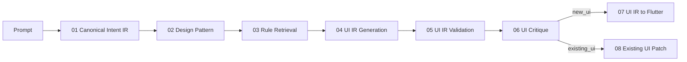

# 工作流協定

## 目的與拓撲

本協定定義八階段的唯一合法拓撲、狀態語意、版本失效、退回及接手方式。01–06 為共同流程；07 與 08 為互斥終端分支。

作用中的 07 或 08 完成其 terminal completion gate 後，工作流直接完成。分析、測試、差異審查及適用的視覺或使用者確認都屬於該分支，不新增節點。

## 工作流與階段狀態

- `pending`：尚未開始，或因上游新版而等待重做。
- `in_progress`：目前由指定 owner 執行；同一條作用中路徑最多一個階段可處於此狀態。
- `passed`：本 attempt 的產物版本已固定，所有必證 claims 皆有合格 evidence，且可移交。
- `failed`：檢查或評估已正常完成，但證據顯示內容未達 gate；必須指派 owner stage 並退回。
- `blocked`：缺少執行者無權補足的決策、輸入、權限、服務或環境；不得以內容不合格取代阻塞原因。
- `not_applicable`：僅供未選擇的 07／08 分支使用。
- `completed`：只屬於整體工作流；作用中終端分支 `passed` 後成立。
- `terminated`：使用者取消、權限撤回或任務已無合理續行方式；保留歷史但不再自動推進。

## Attempt、產物版本與歷史

- 每次開始或重做某階段都建立新的 attempt；同一階段的 attempt 依時間單調增加。
- 一次 attempt 必須綁定明確的輸入版本、輸出版本、owner、開始與結束時間及結果。尚未結束時不得宣稱產物可移交。
- `passed` 後的產物不可原地改寫。任何內容變更都建立新版本與新 attempt；舊產物、舊證據與失敗軌跡保留為歷史。
- 下游產物必須記錄所消費的直接上游版本。上游版本改變時，所有依賴舊版的下游 `passed` 結果失效並回到 `pending`。
- Evidence bundle 屬於特定 attempt 與產物版本；不得把舊版本證據移植到新版，除非重新觀察並建立新紀錄。

## 階段推進與分支

1. Owner 只執行目前 `in_progress` 階段。
2. 階段結束時依其 gate 產生 `passed`、`failed` 或 `blocked` 結果及 evidence bundle。
3. `passed` 才能把下一階段設為 `in_progress`，並完成 handoff。
4. 01–06 依序推進。01 的 Intent IR 必須確認 `work_mode`：
   - `new_ui`：06 通過後啟動 07，08 記為 `not_applicable`。
   - `existing_ui`：06 通過後啟動 08，07 記為 `not_applicable`。
5. 作用中的 07 或 08 通過其 terminal completion gate 後，整體狀態設為 `completed`；不得再創造後續階段。

若 `work_mode` 尚未解決，01 為 `blocked`，不能預先走兩條分支。若 `work_mode` 後續改變，退回 01 並重做 02–06；原作用分支的結果失效，新未選分支改為 `not_applicable`。

## Failed、blocked 與退回

- `failed` 必須列出未成立的 claim、觀察結果、問題 locator、問題 owner stage 及退回理由。若多個 owner 同時存在，先退回最上游者。
- `blocked` 必須列出缺少條件、可提供該條件的 owner、已嘗試方法及恢復條件。可以安全完成的其他檢查仍要記錄，但不得越過 gate。
- 退回 owner stage 時建立新 attempt；owner stage 之後所有依賴舊版本的階段設為 `pending`。未受影響的更上游 `passed` 階段保持有效。
- 01 的問題留在 01；02 的選型問題留在 02，若源於意圖不足則退 01；03 的規則問題留在 03，若源於模式或意圖則退 02 或 01；04 的 UI IR 問題留在 04，若源於規則、模式或意圖則退至相應 owner。
- 05 與 06 不修改 UI IR。其 findings 依 owner stage 退回 01–04；修正後必須重新執行所有受影響的下游 gate。
- 07／08 的實作瑕疵留在同一終端分支重做；若發現 UI IR、規則、模式或意圖本身錯誤，退回對應的 04、03、02 或 01。

## Handoff ownership

每個 handoff 都必須交付：來源階段與 attempt、固定的輸出版本、輸入版本鏈、結果、完整 evidence bundle、未解但不阻斷的事項、作用分支，以及下一接手者的責任。

接手者必須先驗證 handoff 完整且上游版本仍為最新，再接受 ownership。接手後只對自己的階段產物與 gate 負責；不得默默修正上游內容。Handoff 不代表使用者授權擴張，也不免除目標專案的治理要求。

## 恢復與終止

- 恢復工作流時，從歷史中找出最新的 Intent IR 與作用分支，逐階段核對輸入版本鏈、結果及 evidence。第一個缺失、失效、`failed` 或 `blocked` 的階段成為恢復點。
- 若最後有效狀態是 `blocked`，只有在恢復條件已被觀察滿足後才能建立新 attempt；否則維持阻塞並回報所需外部動作。
- 若終端分支已 `passed` 且證據仍對應目前版本，整體保持 `completed`，不得重跑來製造新結論。新需求應建立新版工作流或從受影響的最上游階段重開。
- 使用者取消、必要授權被撤回、目標消失或明確要求停止時設為 `terminated`。終止不刪除產物、attempt 或 evidence，也不得冒稱完成。
