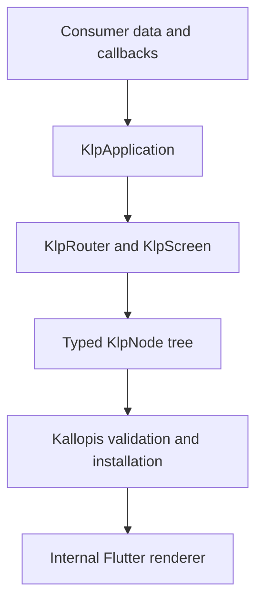

# Kallopis

Kallopis 是 -ist 產品家族共用的 Flutter 視覺與互動框架。新架構提供一條受控的宣告式組裝路徑：消費端只建立資料、callback 與 Kallopis 節點樹；Kallopis 負責驗證、狀態安裝、風格解析、平台處理與 Flutter 呈現。

目前宣告式 API 屬於 **experimental**。請只從 `package:kallopis/kallopis_declarative.dart` 匯入它；不要把它與舊公開入口混用。

## 給 AI 的工作入口

開始任何消費端實作前，依序閱讀：

1. [受控組裝規則](docs/ai/README.md)：可用資料、禁止輸入與工作流程。
2. [應用與組裝模板](docs/ai/composition-templates.md)：應用、路由、畫面與工作區動作範本。
3. [元件能力與庫內擴充](docs/ai/external-components.md)：公開節點、受限插槽與庫內能力需求。
4. [消費端畫面組裝指南](docs/ai/screen-composition.md)：自訂 ScreenBody、無預設 Workbench、Bento Grid 與自適應組裝。
5. [驗證指南](docs/ai/verification.md)：把原生 Flutter 組裝阻擋在 CI 外。
6. [系統索引與能力範例](docs/ai/systems.md)：依系統查找所有目前功能、責任與範例。

架構接手者應再讀 [目前架構總覽](docs/architecture/current-refactor-overview.md) 與 [架構圖集](docs/architecture/README.md)。[產品網站](https://miudog.github.io/Kallopis/) 提供框架介紹；完整元件、API 與教學集中於 [文件中心](https://miudog.github.io/Kallopis/docs/)。網站直接由本庫 Markdown 產生，不另存一份文件內容。

## 唯一消費端入口

```dart
import 'package:kallopis/kallopis_declarative.dart';
```

消費端以 `KlpState<KlpApplication>` 提供一棵完整應用宣告，並呼叫 `runKlpApp(source)`。每個畫面由 `KlpRouter` 的 `KlpRoute` 映射為 `KlpScreen`；每個容器以具名、型別化插槽接收合格節點。元件身分、定義與轉接器由 Kallopis 的封閉目錄掌管；消費端只能組合已公布節點、資料與事件。



## 不可違反的邊界

- 不建立 `Widget`、`BuildContext`、`runApp`、`MaterialApp` 或 `Navigator`。
- 不匯入 Flutter、`dart:ui`、`package:kallopis/src/...`，也不匯入 `kallopis.dart`、`kallopis_foundation.dart` 或 `kallopis_theme.dart` 作為新宣告式 consumer。
- 不在節點實例傳入顏色、間距、圓角、字體、動畫或 renderer callback。
- 不以任意 child list 替代容器資格，也不自訂資格子類別；命名插槽只接收庫內已公布的合格節點。
- 不建立第二套 state、controller、router 或平台環境；由 `KlpApplication` 的安裝流程持有。

`tool/verify_declarative_consumer.dart` 會以 AST 檢查這些入口與組裝規則。它是產品 CI 的必要步驟，不是一般程式碼風格檢查。

## 舊 API 的位置

`kallopis.dart`、`kallopis_foundation.dart` 與 `kallopis_theme.dart` 仍是相容入口，內含尚未遷移的 Flutter 實作。它們不是新 consumer 的教學或擴充面。新功能請以本文件的宣告式流程完成；若既有產品必須維護舊入口，保持在原有相容層，不得把其 `Widget` 或 theme 設定轉接進新樹。

## 狀態與限制

已走通的垂直流程包含：完整 primitive set、庫內語意解析、封閉元件目錄、型別化插槽、application router、screen、工作區動作、資料更新與 Kallopis 內部 renderer。顏色、padding、圓角與陰影已採用 [風格 v1.0.0](spec/style-v1.md)。表單 renderer、完整跨平台可存取性與實際瀏覽器 history 的完成度見 [目前架構總覽](docs/architecture/current-refactor-overview.md)。

選檔使用 `KlpWorkspaceBlock(action: KlpPickFileAction(...))` 交由應用宿主執行；維護舊零宿主 `KlpLocalFilePicker.pick()` 時改用專用相容入口，見[遷移說明](docs/architecture/host-ports-plan/public-migration.md)。現行 v1 已完成 50 個切片；[完整驗證](docs/architecture/host-ports-plan/verification.md)另列尚未全綠的既有 CI 與原生驗收限制。
