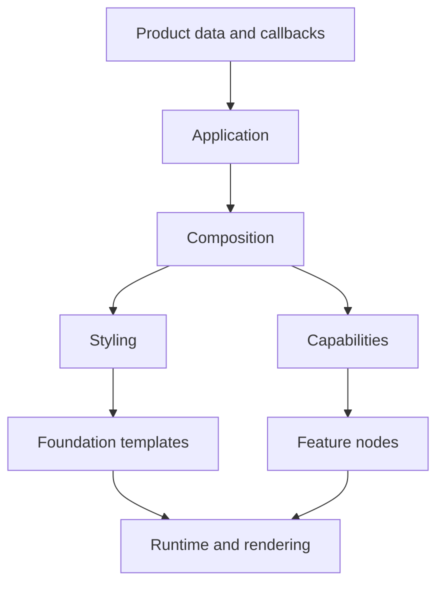

# 系統索引與能力範例

本頁把 Kallopis 的能力依「系統」而不是歷史資料夾排列。AI 選擇功能時先找系統、確認狀態，再使用對應的唯一組裝方式。新 consumer 只使用 `kallopis_declarative.dart`；本頁中的 legacy 項目僅說明目前收納位置，不提供新組裝範例。

## 系統總覽

| 系統 | 解決的問題 | 新 consumer 狀態 | 入口／詳情 |
|---|---|---|---|
| Application | app root、screen、host、無障礙名稱 | 可用 | [Application](#application-system) |
| Composition | 節點、資格、slot、定義註冊 | 可用 | [Composition](#composition-system) |
| Styling | 固定 primitive、semantic、解析 | 可用的最小流程 | [Styling](#styling-system) |
| Navigation | typed destination、route、結果、guard、還原 | 可用；部分平台能力未完成 | [Navigation](#navigation-system) |
| State and data | 唯讀來源、更新、非同步資料與 controller | 基礎契約可用 | [State and data](#state-and-data-system) |
| Foundation | 受控 text、linear、surface、children template | 可用的最小集合 | [Foundation](#foundation-system) |
| Features | rail 與未來可重用產品能力 | rail 可用；其餘遷移中 | [Features](#feature-system) |
| Runtime and rendering | tree compilation、安裝、資源生命週期、Flutter renderer | 本庫內部 | [Runtime and rendering](#runtime-and-rendering-system) |
| Legacy compatibility | 現有 Flutter 元件與 theme | 僅相容維護 | [Legacy](#legacy-compatibility-system) |



## Application system

**責任**：`KlpApplication` 是唯一 app root；`KlpRouter` 產生每個 `KlpScreen`；`runKlpApp` 建立唯一 Kallopis host。screen 必須有非空的 `accessibilityLabel`。

```dart
final source = KlpMutableState(
  KlpApplication(
    title: 'Product',
    primitives: productPrimitives(),
    router: productRouter,
    components: [productRailItemDefinition()],
  ),
);

runKlpApp(source.readOnly);
```

更新資料時建立新的 `KlpApplication` 並指定給 `source.value`。不要建立 `runApp`、`MaterialApp` 或第二個 host。完整範本見 [組裝模板](composition-templates.md#4-將資料宣告送給-kallopis)。

## Composition system

**責任**：`KlpNode` 是所有宣告節點的共同資格；`KlpCompositeNode` 持有唯一 `KlpChildren`；`KlpSlot<C>` 將容器 child 限制為 `C`；`KlpComponentDefinition<T>` 註冊實例型別和 template。

```dart
final class ProductRailItem implements KlpRailItem, KlpCompositeNode {
  static const typeId = 'product.railItem';

  @override
  final String id;
  final String label;
  @override
  final KlpAction? action;

  const ProductRailItem({
    required this.id,
    required this.label,
    required this.action,
  });

  @override
  String get definitionId => typeId;
  @override
  String get accessibilityLabel => label;
  @override
  Iterable<KlpNode> get children => const [];
}
```

一個節點可實作多個資格介面；容器仍只接受自己的介面。含 children 的精確範本見 [外部元件作者指南](external-components.md#1-實作節點與容器資格)。

## Styling system

**責任**：`KlpPrimitiveSet` 是完整、固定 schema 的中立原料；`KlpSemanticSchema` 把元件用途映射到 primitive；`KlpStyleRef` 限定引用語言；本庫解析結果並呈現。

```dart
final labelColor = KlpSemanticKey(
  ProductRailItem.typeId,
  'labelColor',
  KlpStyleKind.color,
);

final schema = KlpSemanticSchema(ProductRailItem.typeId, [
  KlpSemanticToken(
    labelColor,
    const KlpPrimitiveRef(KlpStyleKind.color, KlpPrimitiveIndex.i1),
  ),
]);
```

primitive 必須整套提供，每種剛好八個值；實例不可傳入任何 style。完整六個文字 semantic 與 template 範例見 [外部元件作者指南](external-components.md#2-在定義期建立-semantic-schema)。

## Navigation system

**責任**：`KlpDestination<P, R>` 固定參數與結果型別，`KlpRouter` 註冊 initial location 和 route，`KlpRouteInput` 建立受控 action，Kallopis session 持有 stack、取消與結果。

```dart
final details = KlpDestination<int, int>('product.details');

final route = KlpRoute<int, int>(
  details,
  screen: (input) => KlpScreen(
    id: 'product.details.screen',
    accessibilityLabel: 'Product details',
    child: productDetailsRail(
      onSave: input.finish(input.parameters + 1),
      onClose: input.back(),
    ),
  ),
);
```

可在 `KlpRoute` 加入 `beforeEnter`、`beforeLeave` guard。restoration 需要每個 destination 提供 codec；實際瀏覽器 history 和完整 stack URL 尚未交付。範本見 [組裝模板](composition-templates.md#2-建立-destinationrouter-與-screen)。

## State and data system

**責任**：`KlpState<T>` 是只讀資料來源；`KlpMutableState<T>` 是 consumer 擁有的更新端；`KlpAsyncData<T>`、`KlpDataState<T>` 與 `KlpStateController<T>` 提供資料、取消與受控 controller 基礎。

```dart
late final KlpMutableState<KlpApplication> source;
var selectedId = 'home';

void select(String id) {
  selectedId = id;
  source.value = declaration();
}
```

callback 可改產品資料並重新產生 declaration，但不可直接操作 renderer、navigator 或 installation。未來 feature 需要 state、controller 或 data 時，由 Kallopis 安裝流程建立和釋放其資源；消費端不得建立平行權威。

## Foundation system

**責任**：foundation 是外部元件可用的封閉呈現語言，不是原生 Flutter widget 集。可用模板為 `KlpTextTemplate`、`KlpLinearTemplate`、`KlpSurfaceTemplate`、`KlpChildrenTemplate`。

```dart
KlpLinearTemplate<ProductRailItem>(
  axis: KlpAxis.horizontal,
  gap: contentGap,
  children: [
    KlpTextTemplate<ProductRailItem>(
      text: (item) => item.label,
      semantics: labelTextSemantics,
    ),
  ],
);
```

template 只接受資料 selector、semantic key 與已宣告 slot。需要尚未有的圖形、互動或排版能力時，先擴充 foundation 與其 renderer，再讓 feature 使用；不可開放 Widget callback。

## Feature system

**責任**：feature 層收納可被多個產品採用的行為與視覺功能。當前新宣告式垂直流程已提供 `KlpRail`／`KlpRailItem`；其他 actions、collections、forms、feedback、infinite canvas、navigation、overlays 和 workspace 功能仍在遷移，現有 Flutter 實作位於對應 feature 子目錄。

```dart
KlpRail(
  id: 'product.rail',
  top: [ProductRailItem(id: 'open', label: 'Open', action: openAction)],
  center: const [],
  bottom: const [],
);
```

每一個新 feature 必須先定義：資料所有權、節點資格、slot、semantic、安裝資源與平台／無障礙行為。再由 application 註冊其 definition。不得以 feature 名稱在 runtime 加特判。

## Runtime and rendering system

**責任**：runtime compilation 驗證完整樹、結構與 semantic；installation 建立、重用和釋放資源；rendering/flutter 把不可變準備結果轉成 Flutter 畫面。這些目錄全是 Kallopis 內部實作。

consumer 的唯一觸發方式是：

```dart
source.value = declaration();
```

同位置與 definition 的資源由 Kallopis 管理。資料或完整 primitives 更新後，consumer 不應重裝 controller、修改 renderer 或干涉 retention。

## Legacy compatibility system

**責任**：`kallopis.dart`、`kallopis_foundation.dart`、`kallopis_theme.dart` 保留舊 Flutter API 的相容維護。其 implementation 已收納到 `application/legacy`、`styling/legacy_*`、`foundation/*` 與 `features/*` 的 legacy／widget 子目錄。

新 consumer 不得使用這些入口，也不得將它們的 Widget、ThemeData 或 context 接入 `KlpApplication`。需要既有產品修正時，維持在 legacy 路徑；需要新功能時，從本頁前述 application → composition → styling → foundation → feature 流程開始。

## 對應詳細資料

- 新 consumer API 與驗證：[AI 使用手冊](README.md)、[驗證指南](verification.md)。
- 目前完整資料夾與完成度：[架構現況](../architecture/current-refactor-overview.md)。
- 每個實作檔與依賴：[架構圖集](../architecture/README.md)。
- 遷移決策與驗收：[KLP-0019](../../spec/decisions/KLP-0019-declarative-framework-migration.md)。
