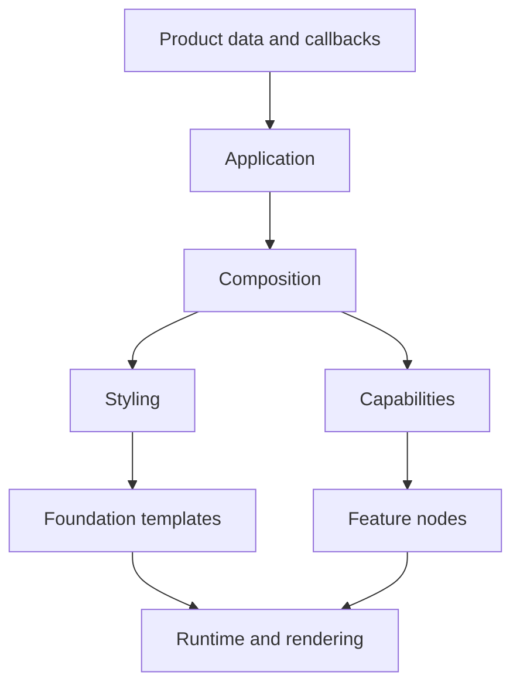

# 系統索引與能力範例

本頁把 Kallopis 的能力依「系統」而不是歷史資料夾排列。AI 選擇功能時先找系統、確認狀態，再使用對應的唯一組裝方式。新 consumer 只使用 `kallopis_declarative.dart`；本頁中的 legacy 項目僅說明目前收納位置，不提供新組裝範例。

## 系統總覽

顏色、padding、圓角與可選紙片陰影：[風格 v1.0.0](style-v1.md)。

第一版可組裝導覽、正文、搜尋、材質與視窗控制：[工作區元件](workspace-components.md)。

| 系統 | 解決的問題 | 新 consumer 狀態 | 入口／詳情 |
|---|---|---|---|
| Application | app root、screen、host、無障礙名稱 | 可用 | [Application](#application-system) |
| Composition | 節點、資格、slot、封閉 catalog 驗證 | 可用 | [Composition](#composition-system) |
| Styling | 固定 primitive 與庫內 semantic 解析 | 可用的最小流程 | [Styling](#styling-system) |
| Navigation | typed destination、route、結果、guard、還原 | 可用；部分平台能力未完成 | [Navigation](#navigation-system) |
| State and data | 唯讀來源、更新、非同步資料與 controller | 基礎契約可用 | [State and data](#state-and-data-system) |
| Foundation | 庫內受控 template 與公開組裝值 | 組裝值可用；template 僅供庫內 | [Foundation](#foundation-system) |
| Features | 工作區與可重用編輯能力 | 工作區可用；編輯能力為實驗階段 | [Features](#feature-system)、[工作區元件](workspace-components.md)、[編輯器](editor.md)、[區塊控制](block-controls.md)、[定位命令（開發中）](anchored-commands.md) |
| Runtime and rendering | tree compilation、安裝、資源生命週期、Flutter renderer | 本庫內部 | [Runtime and rendering](#runtime-and-rendering-system) |
| Legacy compatibility | 現有 Flutter 元件與 theme | 僅相容維護 | [Legacy](#legacy-compatibility-system) |



## Application system

**責任**：`KlpApplication` 是唯一 app root；`KlpRouter` 產生每個 `KlpScreen`；`runKlpApp` 建立唯一 Kallopis host。screen 必須有非空的 `accessibilityLabel`。

```dart
final source = KlpMutableState(
  KlpApplication(
    title: 'Product',
    primitives: productPrimitives(),
    router: productRouter,
  ),
);

runKlpApp(source.readOnly);
```

更新資料時建立新的 `KlpApplication` 並指定給 `source.value`。不要建立 `runApp`、`MaterialApp` 或第二個 host。完整範本見 [組裝模板](composition-templates.md#4-將資料宣告送給-kallopis)。

## Composition system

**責任**：`KlpNode` 是庫擁有宣告節點的共同資格；`KlpCompositeNode` 持有唯一 `KlpChildren`；`KlpSlot<C>` 將容器 child 限制為 `C`。Definition、registry 與 template 組裝是庫內責任，不是 consumer 擴充 API。

Consumer 只組裝 `kallopis_declarative.dart` 已公開的 node。資格介面與 `KlpSlot<C>` 用來限制庫擁有容器的 child，不是 consumer 建立新 component type 的擴充點。目錄缺少能力時，依 [元件能力與庫內擴充](external-components.md) 提交契約需求。

## Styling system

**責任**：`KlpPrimitiveSet` 是 consumer 可提供的完整、固定 schema 中立原料；Kallopis 在庫內以 semantic schema 與受限 reference 把元件用途映射到 primitive，再解析與呈現。

Primitive 必須整套提供，每種剛好八個值；實例不可傳入任何 style。Semantic schema、key 與 template 由 Kallopis 元件擁有者在庫內定義，consumer 只選擇完整 primitive set。

## Navigation system

**責任**：`KlpDestination<P, R>` 固定參數與結果型別，`KlpRouter` 註冊 initial location 和 route，`KlpRouteInput` 建立受控 action，Kallopis session 持有 stack、取消與結果。

```dart
final details = KlpDestination<int, int>('product.details');

final route = KlpRoute<int, int>(
  details,
  screen: (input) => KlpScreen(
    id: 'product.details.screen',
    accessibilityLabel: 'Product details',
    child: productDetailsRail(
      onSave: input.finish(input.parameters + 1),
      onClose: input.back(),
    ),
  ),
);
```

可在 `KlpRoute` 加入 `beforeEnter`、`beforeLeave` guard。restoration 需要每個 destination 提供 codec；實際瀏覽器 history 和完整 stack URL 尚未交付。範本見 [組裝模板](composition-templates.md#2-建立-destinationrouter-與-screen)。

## State and data system

**責任**：`KlpState<T>` 是只讀資料來源；`KlpMutableState<T>` 是 consumer 擁有的更新端；`KlpAsyncData<T>`、`KlpDataState<T>` 與 `KlpStateController<T>` 提供資料、取消與受控 controller 基礎。

```dart
late final KlpMutableState<KlpApplication> source;
var selectedId = 'home';

void select(String id) {
  selectedId = id;
  source.value = declaration();
}
```

callback 可改產品資料並重新產生 declaration，但不可直接操作 renderer、navigator 或 installation。未來 feature 需要 state、controller 或 data 時，由 Kallopis 安裝流程建立和釋放其資源；消費端不得建立平行權威。

## Foundation system

**責任**：foundation 是庫內封閉呈現語言，不是 consumer 元件 authoring API 或原生 Flutter widget 集。模板由庫擁有 adapter 使用；consumer 只取得組裝現有節點所需的平台、自適應與 axis 值，不建立模板或 definition。

template 只接受資料 selector、semantic key 與已宣告 slot。需要尚未有的圖形、互動或排版能力時，先擴充 foundation 與其 renderer，再讓 feature 使用；不可開放 Widget callback。

## Feature system

**責任**：feature 層收納可被多個產品採用的行為與視覺功能。新宣告式工作區由 `KlpAppLayout`、行列、Frame、功能群組與[工作區元件](workspace-components.md)組裝；產品保留導航及文件資料。其他 actions、collections、forms、feedback、infinite canvas、navigation、overlays 和舊 workspace 功能仍按各項能力遷移，不能以未遷移項目否定已公開的元件。

```dart
KlpWorkspaceBlock(
	id: scope / 'open',
	kind: KlpWorkspaceBlockKind.action,
	title: 'Open',
	onPressed: onOpen,
)
```

每一個新 feature 必須先定義資料所有權、節點資格、slot、semantic、安裝資源與平台／無障礙行為，再由 Kallopis application 組合根納入庫擁有 catalog。Consumer 不提供 definition，runtime 也不得靠未登錄的 feature 特判擴充。

## Runtime and rendering system

**責任**：runtime compilation 驗證完整樹、結構與 semantic；installation 建立、重用和釋放資源；rendering/flutter 把不可變準備結果轉成 Flutter 畫面。這些目錄全是 Kallopis 內部實作。

consumer 的唯一觸發方式是：

```dart
source.value = declaration();
```

同位置與 definition 的資源由 Kallopis 管理。資料或完整 primitives 更新後，consumer 不應重裝 controller、修改 renderer 或干涉 retention。

## Legacy compatibility system

**責任**：`kallopis.dart`、`kallopis_foundation.dart`、`kallopis_theme.dart` 保留舊 Flutter API 的相容維護。其 implementation 已收納到 `application/legacy`、`styling/legacy_*`、`foundation/*` 與 `features/*` 的 legacy／widget 子目錄。

### 既有能力與宣告式接入狀態

不能以「新宣告式入口尚未提供」推論「本庫沒有元件，無法製作」。以下為目前開發工作區的實作狀態，尚未提交或發布至 main。新元件已通過實際編譯／呈現的互動測試、公開入口與前端架構邊界檢查；這不代表所有舊版行為或 OS backend 已完成遷移。

| 能力 | 舊版可用來源 | 新路徑的判讀 |
|---|---|---|
| Explorer | [Workspace.Explorer / EXP-V1-r2](explorer-model.md)：KlpExplorer＋可實作 item interface＋完整森林資料 | 分類／節點、有限能力、受控選取／展開、獨立命令與受限拖放。舊 Explorer 已移除；KlpFileExplorer 是另一個 Stable 檔案瀏覽 API。 |
| 文件分頁 | 舊入口保留 [KlpTabs](../../lib/src/features/navigation/widgets/tabs/klp_tabs.dart)／[KlpStageTopBar](../../lib/src/features/workspace/shell/stage/klp_stage_top_bar.dart)；新入口提供 `KlpDocumentTabs`／`KlpDocumentTab` | 新入口已接入宣告式垂直流程，提供選取、關閉意圖、dirty 與不可關閉呈現；資料刪除、保存、重排及狀態保留仍由產品決定。 |
| 視窗控制 | 舊入口保留既有 Flutter 視窗元件；新入口提供 declarative `KlpWindowControls` 與純 Dart host callbacks | 新入口直接使用已解析 semantic 呈現三個控制，不依賴舊 theme adapter。Host 擁有原生 runner 通道與最大化狀態投影；本庫不宣稱所有 OS backend 已驗證。 |

新增 consumer 仍使用宣告式入口。既有能力的重用方式須符合目前架構契約；有舊實作不構成任意 Widget adapter 的授權。若採用庫內遷移，應說明可沿用部分與待接契約，不以整套重寫或「無法」取代具體盤點。

能力回報應包含「既有來源／目前可達入口／缺少的行為或接線／下一步」，並區分工作區、main 與已發布版本。找不到來源標為未查證；沒有執行驗證不得寫成已驗證可用。

新 consumer 不得使用上述舊版入口，也不得將舊版 Widget、ThemeData 或 context 接入 `KlpApplication`。本次新元件從 `kallopis_declarative.dart` 匯入。需要既有產品修正時，維持在 legacy 路徑；需要新功能時，從本頁前述 application → composition → styling → foundation → feature 流程開始。

## 對應詳細資料

- 新 consumer API 與驗證：[AI 使用手冊](README.md)、[驗證指南](verification.md)。
- 目前完整資料夾與完成度：[架構現況](../architecture/current-refactor-overview.md)。
- 每個實作檔與依賴：[架構圖集](../architecture/README.md)。
- 遷移決策與驗收：[KLP-0019](../../spec/decisions/KLP-0019-declarative-framework-migration.md)。
