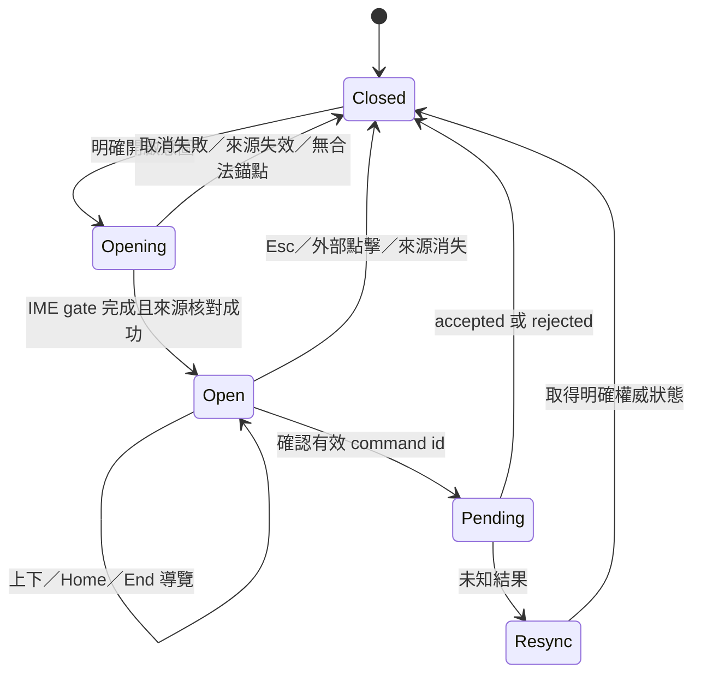
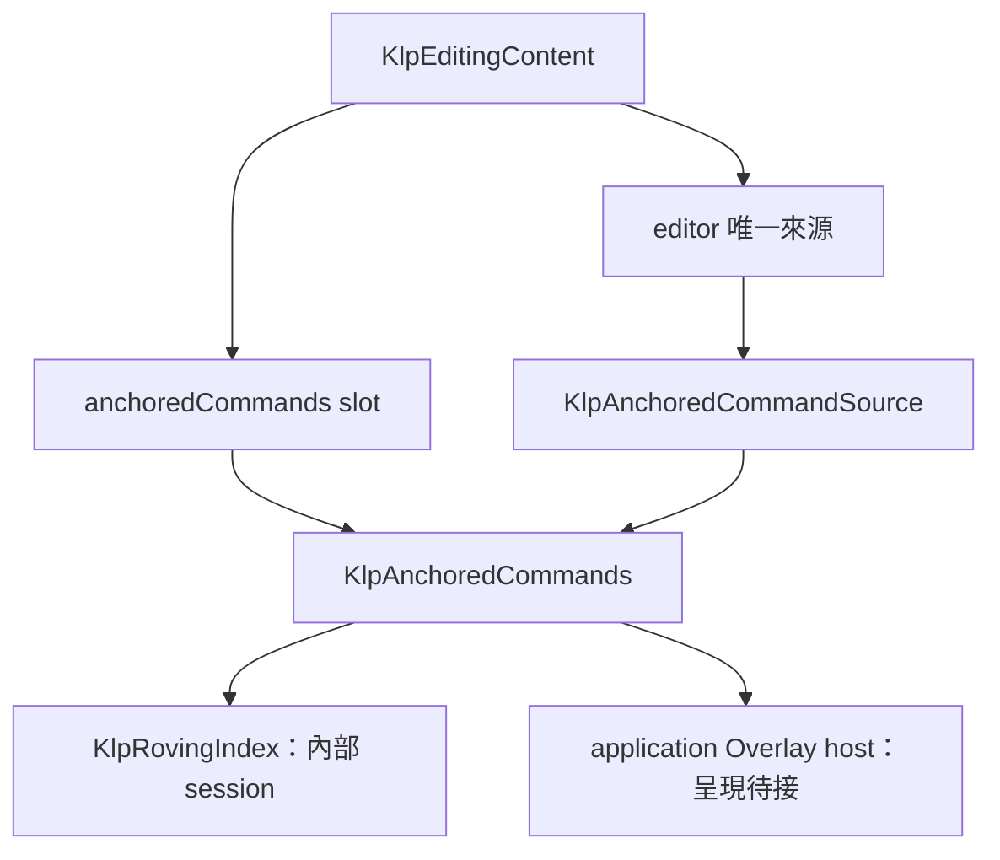

# K03：定位命令選單契約

2026-09-11。使用者已授權完整筆記能力；本頁供接續 K02 的實作者使用，沒有新增開工核准。完整範圍依 [總計畫](note-components-plan.md)，本頁不是功能範圍上限。狀態：資料契約、typed slot、操作 session 及 Krepis 命令映射已通過相關協定驗證；可見選單尚未交付／定型。

本輪獨立證據：K03 三組測試、K01／K02 回歸及架構邊界 `00:03 +203: All tests passed!`，analyze `No issues found! (ran in 5.8s)`，真實 DLL provider／CJK 檢查皆 PASS，均 exit 0。Windows debug 建置亦成功。修正項含封閉 caret／block anchor、確認前換目標拒絕、關閉後晚到未知結果保留 resync。ABI 維持 1.25，直接映射既有 checked 操作且只消耗一次共用序號。這些證據不涵蓋可見選單、Overlay 定位、鼠鍵／讀屏入口與焦點返回。

## 最小切片與權威

先完成明確開啟意圖、當前文字／區塊錨點、來源提供的候選清單、鍵盤導覽、單次執行、關閉及焦點返回。不加入 slash 字元攔截、產品快捷鍵、搜尋／篩選規則、子選單或新頁面布局；這些不因此移出完整目標，需獨立定義。

Kallopis 擁有選單呈現、定位、互動暫態、Overlay 與資源生命週期；命令 ID、內容、可用性及領域操作由 editor 唯一來源提供。涉及文件修改的命令仍由 Krepis 原子核對、交易與撤銷；不以選單 callback 建立第二份 domain authority。

## 規劃資料、typed slot 與唯一來源

目前宣告式入口已匯出 `KlpAnchoredCommands` 與 `KlpCommandSlotChild`；提供者入口已匯出 `KlpAnchoredCommandSource`、`KlpCommandProjection`、`KlpCommandRequest` 等資料契約。這些 API 屬實驗契約，不能據此推定可見選單已完成。consumer 範例見 [定位命令使用文件](../ai/anchored-commands.md)。

`KlpEditingContent` 增加單一 optional 命令 slot，只接受 `KlpCommandSlotChild`；本庫控制 `KlpAnchoredCommands` 只帶 id。命令能力從 enclosing editor 的**唯一來源繼承**，consumer 不另傳 source 或 callback 執行器；缺 editor、缺能力、重複控制或非法 child 在組裝／安裝時拒絕。consumer 不提供 Widget、style、原生焦點物件、OverlayEntry 或座標 painter。

| 資料 | 必要欄位／規則 |
|---|---|
| 候選投影 | 完整 `KlpEditingStamp`、單調候選 revision、有序 items；同 revision 重播須同一不可變內容。文字與命令清單不能只靠 label 配對。 |
| 命令項 | 非空唯一 id、非空 label、明確 enabled／disabled availability；停用理由可選。caption 與 selected 是資料，不能以 selected 表示鍵盤高亮；只允許受限語意 tone，不能傳任意顏色。 |
| 錨點 | 型別化 caret 或 stable block ID，完整 stamp、layout／viewport／transform 識別與同幀幾何。位置由來源解析目前投影，consumer 不輸入顯示座標；visual rect 可定位，不能拿它當文字命中。 |
| 開啟意圖 | 指定現有 caret／block 身分與當前世代；來源確認錨點和候選後開啟。不從斜線字串推定產品命令。 |
| 確認請求 | 命令 id、候選 revision、完整 stamp、單一事件序號；來源重新核對可用性，核心在同一原子門內核對修改前置條件。不能先 Dart 查可用再繞過核心驗證。 |
| 回覆 | accepted／rejected 與新權威投影；未知結果要求 resync、不重送。accepted 僅表示操作接受，不表示保存完成。 |

文字、區塊及命令共用 editor 的單一在途排程與取消機制。候選 ID 重複、label 空白、幾何非法、anchor 與候選 stamp 不同整份拒絕。來源只具讀取能力時不得因有候選就接受領域修改。

## 開啟、導覽、確認與返回



- 開啟前保留 editor／控制的返回身分；焦點移入選單導覽區。第一個可用項目取得高亮；清單空或全停用時高亮為空，確認不派送，Esc 仍可關閉；空態具體文案由來源提供，視覺未定型。
- Arrow Up／Down 使用共用 roving 規則跳過停用項，Home／End 選首／尾；Enter／Space 確認一次。這些只在已開啟選單內生效，不新增產品全域快捷鍵。
- 開啟會使文字輸入失焦，先沿 K01 取消尚未確認組字、保留已提交內容；等待明確取消及新 stamp，再取得錨點／候選。組字事件中的 Enter／Esc／斜線不可同時成為命令；未知在途結果阻止開啟或確認，不默認提交。
- 同 session 候選更新以 ID 保留仍可用高亮；移除或停用則選第一個可用項目，全部不可用則清空。錨點／版本改變時先禁止確認；只有來源原子發布的新一致投影可繼續定位，不用舊座標重試。
- Esc／外部點擊只關閉本地選單，不取消已接受交易。Pending 後的晚到結果仍由 editor 排程記錄；關閉不能觸發第二次執行，未知結果不得顯示成功或自動重送。
- 關閉時若原 editor／控制仍可見、同世代且可聚焦，返回該身分；若已消失或切頁則僅釋放選單焦點，不強搶新頁或另一個輸入框。來源消失、卸載、世代更換皆清除 anchor／候選／overlay 訂閱。

## 結構與呈現所有權



```text
完整 primitive → K03 semantic schema → KlpSemanticResolution.read → bound menu style
唯一來源的同幀 anchor／候選 → 本庫 placement → viewport 定位 → Overlay
候選 ID／availability → 共用 roving → typed request → editor 單一在途 → 核心原子門
```

| 屬性 | 本庫規則與未定型界線 |
|---|---|
| 密度與文字 | 沿 [A 密度](../../.agents/skills/kallopis-design-contract/references/design-knowledge/component-density-proposal.md) 的控制14／18、Noto Sans TC 與既有列／圖示比例；只由 semantic 解析，不由 item 傳尺寸。 |
| 表面與狀態 | 第一層浮 panel、內部平面 A；背景、文字、hover／focus／disabled／selected 用本庫用途鍵。舊 menu token 只能作遷移線索，不代表新選單外觀已確認。 |
| 定位與避讓 | 本庫使用同幀 anchor、實際量測選單與可用 viewport，避開 host 邊界並處理上下翻轉／可用範圍。超界時限制可用高度並捲動；寬度、間距與 anchor 重疊優先序未定，不發明數值。 |
| 繪製與命中 | Overlay 顯示及 hit-test 次序一致，選單內事件不穿透編輯器；clip 與 viewport 一致。超小視窗無可用區域時關閉且不派命令，不能用無效 clamp 造成例外。 |

## 最小依賴、驗收及未決項

1. 先補唯一來源 command capability、同版本 anchor／候選投影與 typed request；命令來源及核心修改需符合 K02 完整 stamp 原子門，沿用 K01 IME 中斷與單一在途。
2. 再補 typed slot、placement、內部 Overlay 定位與共用 roving；純資料驗重複 id、缺能力、來源失效、版本競爭、停用／空清單、未知結果及關閉後晚到回覆。
3. 最小例：同 stamp caret 的兩個候選 `movePrevious` 停用、`moveNext` 可用；開啟只高亮後者，Enter 僅派其 ID 一次；核心拒絕或 ID 消失時同步並返回仍有效焦點，不改送另一項。這是測試資料，不是新增產品命令政策。
4. 定型後才驗 viewport 邊界、縮放／捲動定位、鼠鍵等價、IME 排他、焦點返回、讀屏與來源卸載；目前不執行 UI／golden，資料與操作機制的驗證不能證明選單已可操作。

待定：明確開啟入口的產品選擇、slash／搜尋及候選分類政策、選單寬度／anchor 間距／重疊優先序、完整空態及錯誤文案；不阻擋獨立資料能力。回退只停用 K03 slot 與 overlay 資源，保留 K01／K02。視覺未定型、核心未知結果與來源版本漂移都不得靠局部 Widget 或樣式例外繞過。
