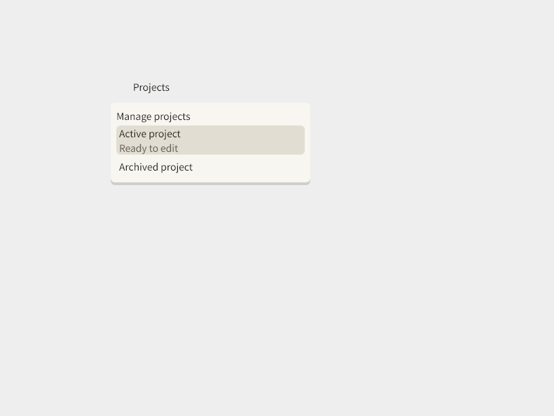

# 公開錨定 Popup 交付

更新：2026-09-15。公開契約 `POP-V1-r1`；主目錄配對 `r1b`。

## 交付位置與用途

實際公開入口在 `D:/Projects/Kallopis/lib/kallopis_declarative.dart`：`KlpAnchoredPopup`、`KlpAnchoredPopupItem`、`KlpAnchoredPopupState`、`KlpAnchoredPopupChangeReason`。Consumer 不需匯入 `lib/src`。

[使用契約與範例](../ai/anchored-popup-model.md) 說明受控 open、穩定列 ID／可重名、current／disabled、主要事件、共用 commands、四種回饋狀態。開關不改產品選取或導航；內容事件不自動關閉。

實作包括方向感知錨定、翻轉／viewport 限制、焦點進入／循環／返回、當前錨點失效及恢復、子命令視窗配對與快速關閉時序保護。Consumer 明確移除宣告時，退役 callback 不再執行。

主目錄保留後續 Menu、Explorer 與透明工具列成果；命令選單仍使用既有 KlpMenu。r1b 只在庫內 menu helper 加可選 route-context 回呼，配對 Popup 擁有的子 route；未把 Flutter context 開放給 consumer。

## 驗證證據

- 隔離實作提交：`26b1409e510cfc6d2d97b0810e28bb0d46f3568f`，工作樹 `D:/Projects/Kallopis-popup-v1`。獨立測試 47 通過、1 項按環境開啟的圖片測試略過；局部分析無問題。
- 圖片輸出另行執行成功（exit 0）：`KLP_POPUP_CAPTURE=1` 執行 layout 測試的圖片項目；未使用 golden／圖片評分。
- 主目錄由獨立 reviewer 執行六檔局部測試：exit 0，**49 通過、1 項圖片測試略過、0 失敗**；快速關閉回歸明確執行通過。11 個整合 Dart 檔案局部分析 exit 0，`No issues found`。
- 正式 Catalog 為 26 features／30 identities／88 exports；prepared coverage 為 10 generic／6 editing／11 workspace／1 overlay。既有 Menu 與本次 Popup 同時列入固定名單，整合前的三项過時 prepared 名單失敗已解除。
- 原始 source 合併紀錄及逐檔備份：`D:/Projects/Kallopis-flow-evidence/integration/manifest.json` 與同目錄 `backups/`。主目錄既有 Git index 未更動；未將他人混合變更提交。
- Test Author 對主目錄既有兩份測試先逐位元組備份，再加入精確 Popup 增量與已接受 Menu 的固定名單；保留 Menu／工具列斷言。歷史 module-boundary 測試的既有差異未混入本次修復或宣稱全量通過。

必要測試入口：`test/klp_anchored_popup_test.dart`、`test/klp_anchored_popup_layout_test.dart`、`test/klp_anchored_popup_child_lifecycle_test.dart`、`test/klp_application_catalog_contract_test.dart`、`test/klp_prepared_renderer_contract_test.dart`、`test/klp_sidebar_interactions_test.dart`。

在 Kallopis 主目錄重現：

```powershell
D:/flutter/bin/flutter.bat test --no-pub test/klp_anchored_popup_test.dart test/klp_anchored_popup_layout_test.dart test/klp_anchored_popup_child_lifecycle_test.dart test/klp_application_catalog_contract_test.dart test/klp_prepared_renderer_contract_test.dart test/klp_sidebar_interactions_test.dart --reporter expanded
```

## 實際呈現



圖片由實際 Flutter renderer 與 package 字型產生。原生 WebView、指標、鍵盤與焦點手感仍依 [人工項目](../ai/anchored-popup-model.md#手動原生檢查) 由人類接受。

## 下游交接邊界

公開錨定 Popup 能力已提供，E owner 可接專案管理、外觀、Explorer／初始目的地入口。專案立即建立、保存與切換，以及產品跨模組交易仍屬其產品流程；本次不代替 E 接線或宣稱整體產品已驗收。F2 沿用既有 owner 已完成成果，不重作。
