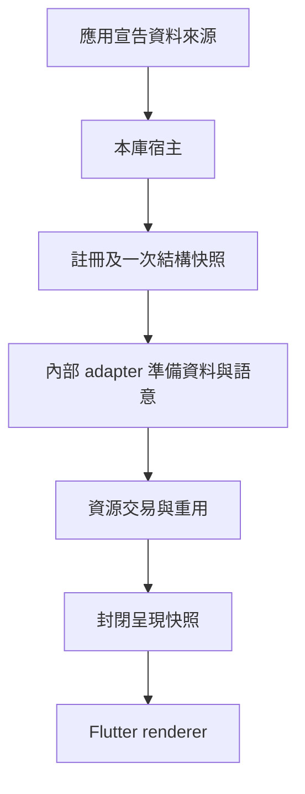
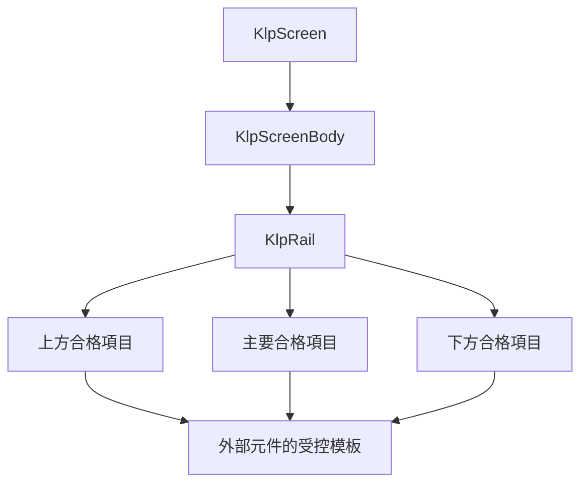
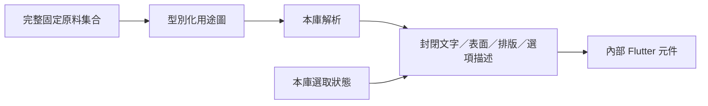

# 應用結構到呈現的首條流程

狀態：實作中。依 [遷移計畫](restructure-migration-plan.md) 接通單一應用宣告、自動安裝與受控呈現；不是全庫遷移完成或正式預設外觀定型。

消費端提供 `KlpState<KlpApplication>`，由 `runKlpApp` 啟動本庫持有的宿主。宣告包含標題、完整 primitive 集合、必填 router 與元件定義；單畫面也透過一條路由宣告。資料擁有端更新整份宣告；宿主借用來源，不取得其釋放權。外部元件定義仍只能組合受控 foundation 模板。

目前程式已接入 `KlpRouter`、`KlpRoute<P, R>` 與本庫建立的 `KlpRouteInput<P, R>`。後者只提供參數與 entry 操作；畫面 mapper 回傳 `KlpScreen`，不接收 Widget 或 Context。路由與宿主共用 application library，私有 input 建構子與 session 不為跨檔案呼叫而公開。最新驗證以 [進度紀錄](restructure-progress.md) 為準；Windows 建置成功不代表多頁實機互動已通過。







```text
runKlpApp(source)
source.value → application.router → initial guard / retained entry projection
projected screens → scoped retained root → registry snapshot
snapshot + definition templates + resolved semantics → prepared nodes
prepared nodes → installation transaction → immutable frame
source update → same id and definition retain resource
committed new frame → revoke previous frame actions
```

| 屬性 | 權限與解析路徑 | 本批界線 |
|---|---|---|
| 畫面內容資格 | Screen → KlpScreenBody → 註冊型別驗證 | 不接受 Widget |
| Rail 子項資格 | 三區 → KlpRailItem → 註冊型別驗證 | 不接受一般節點 |
| 色彩、尺寸、字體 | 完整 primitive → definition semantic → bound value → renderer | 映射為實作試作，正式預設風格未凍結 |
| 選取 | rail placement 擁有 → renderer 借用 → callback | 不複製產品資料權威 |
| 焦點 | renderer 元件生命週期 | 更新風格不應重建同一位置 |
| 內容投影 | 定義期資料 selector → 準備階段 | 不取得 Context 或 Widget |

驗收要求：準備失敗不改動原資源；相同位置與定義重用資源；移除釋放；提交後通知失敗仍保持新狀態一致；舊畫面的操作失效。元件層另檢驗選取通知、鍵盤操作、語意標籤與借用訂閱的清理。這些測試不建立新的全畫面 golden 或正式設計期待。

風格或可用空間跨越捲動門檻時，區域元件保留相同祖先階層，只改變限制，避免同一放置的焦點被重建。外部取消訂閱拋錯時，宿主仍依序釋放自有資源；來源世代隔離拒絕殘留舊通知。Flutter 更新生命週期透過框架報告錯誤並完成重建，防止已提交宿主被錯誤畫面取代；一般資料更新仍將錯誤交還資料擁有端。多個生命週期錯誤保存全部原因與堆疊。

Router 的初始 guard、entry 結果、保留畫面、平台返回、stack 還原與單頁 URI 雙向同步已接入此流程，詳細契約見 [導覽交易](navigation-transaction-prototype.md)。screen 與定義期元件 label 已由封閉 renderer 輸出為 semantics；完整平台支援矩陣、實際 browser history、完整 stack URL、動畫策略、預設風格定義及其他 features 遷移仍屬後續工作；本頁不將單一案例成功視為完整支援矩陣證據。
