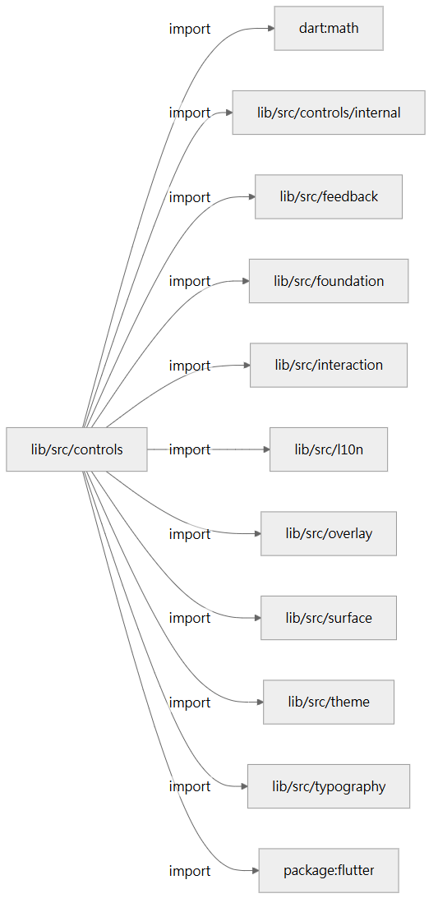

# lib/src 圖集驗證紀錄

2026-09-07，依使用者指定的 focused-architecture-diagram 技能建立。
入口：[Kallopis 架構分析](README.md)／[完整圖集](src/README.md)。

## 覆蓋與證據

| 項目 | 實際結果 |
|---|---|
| 主要目錄 | 22 |
| 巢狀子目錄 | 40；含空目錄與 internal |
| Dart 原始碼 | 229 檔 |
| 圖集頁面 | 270 Markdown：41 個目錄入口（含 lib/src 根）＋229 個來源細節頁 |
| 宣告／成員 | 660 項宣告、4,301 項成員 |
| Mermaid | 920 張；每張最多 12 個節點 |
| 人工模組摘要 | 22 份，保存在生成器 briefs 目錄 |
| 來源行號連結 | 6,813 筆通過存在性與行號範圍核對 |
| 目錄彙總依賴 | 205 條，逐條重新解析來源核對類型、數量與第一筆證據 |
| 執行期原始碼改動 | 0；逐檔 SHA-256 與任務開始時一致 |

完整 source SHA-256 與頁面對應見 [manifest.json](src/manifest.json)。
獨立核對見 [independent-validation.json](validation/2026-09-07/independent-validation.json)，
渲染彙總見 [render-summary.json](validation/2026-09-07/render-summary.json)。
獨立核對當時略過尚未建立的本報告；本報告完成後另執行連結 read-back。

## 渲染與預覽

920 張圖已使用 Mermaid CLI 與本機 Chrome 完整渲染為 SVG，exit 0。
實際 VS Code 側邊預覽發現多節點橫向展開的圖會被縮得過小，因此將超過四個節點的
依賴圖改為 LR，較大的宣告清單也採垂直排列；節點與關係保持不變。
197 張受影響的圖已重新渲染，exit 0，其餘沿用內容雜湊相同的已驗證結果。

已在 VS Code 執行 `Markdown: Open Preview to the Side` 並確認 Mermaid 可呈現。
最終 controls 目錄依賴圖另轉為 PNG，實際檢視標籤及箭頭可讀性：

全量 SVG、圖序／來源對應及渲染日誌保存在本機
`D:/Projects/Notist_AI/artifacts/kallopis-architecture-atlas-20260907/`，不作為版本化圖集的來源。
可重建的 Mermaid 原始碼已完整包含在 Markdown 中。

## 工具驗證

- `dart analyze extract.dart`：exit 0，`No issues found!`。
- 生成器 `--check`：exit 0，`Freshness check passed: 271 files match byte for byte.`
- Markdown read-back：圖集與摘要的相對連結檢查通過。
- 獨立檢查涵蓋 late 修飾詞、UML 繼承／實作箭頭、part 所屬、空目錄與直接依賴證據。

重建與過期檢查方式見 [生成器說明](../../tool/architecture_atlas/README.md)。
一般重建會先備份舊圖集；`--check` 只使用暫存副本，不修改目前圖集或 `lib/src`。

## 閱讀界線

- 這些圖記錄靜態 AST 關係，不將 import 當作呼叫順序，也不推導執行期資料擁有權或狀態轉移。
- 類別關係保留原始型別拼寫，未完成全專案型別解析；public 名稱不等於已由公開入口匯出。
- 成員表省略函式本體、欄位初始值與建構子初始化列表，必要細節循來源連結繼續閱讀。
- 人工摘要以目前原始碼為準；重新生成不會代替人類核對新的責任分工。
- 此批是文件與分析工具交付，不改變產品視覺，不以應用程式編譯或 golden 圖代替圖表驗證。
