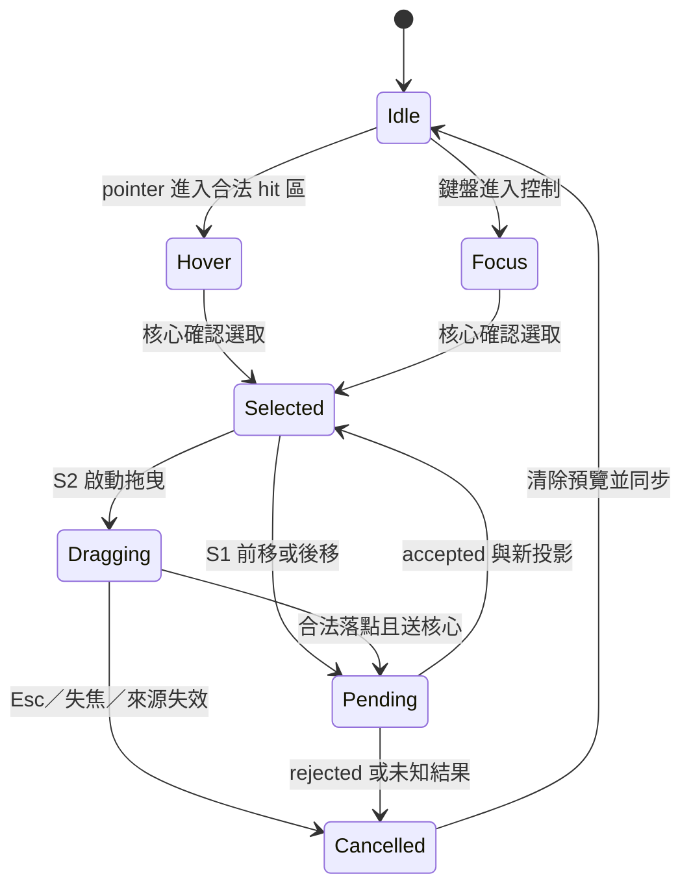
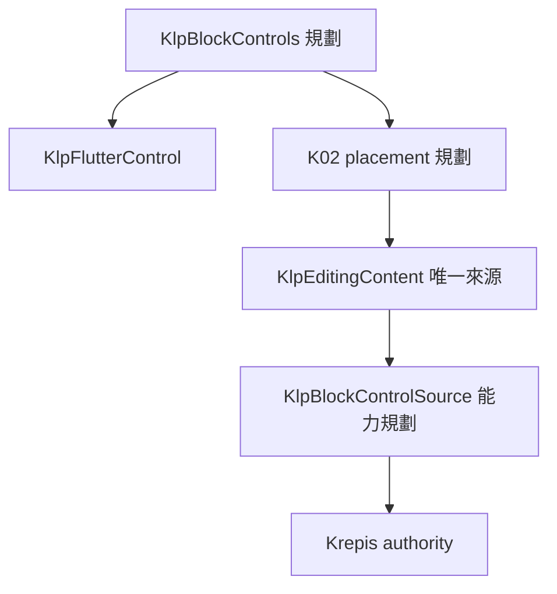
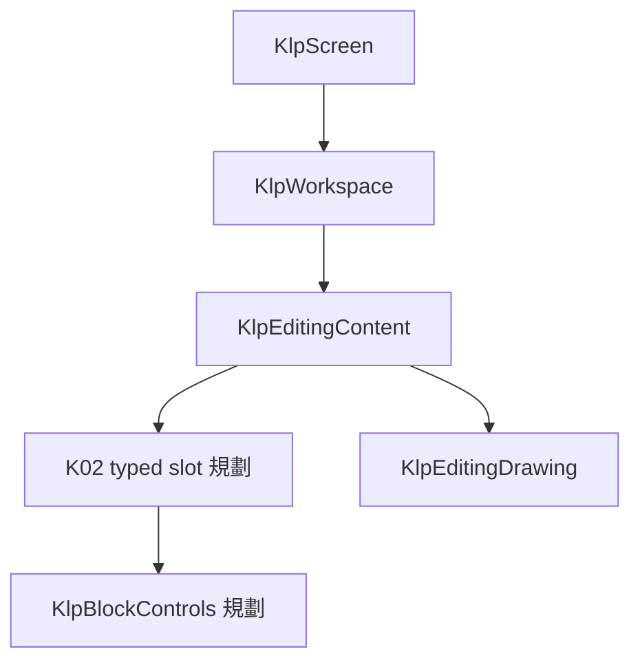
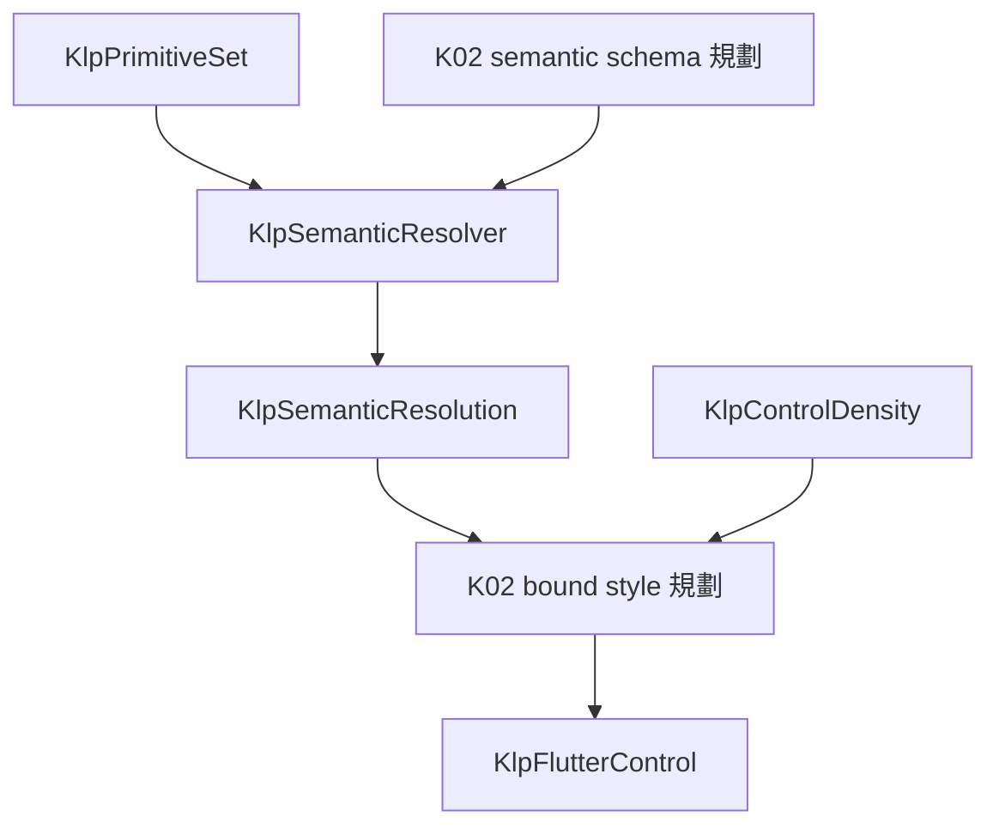

# K02：受控區塊控制契約

2026-09-11。使用者已授權完整筆記功能及 Kallopis／Krepis 實作；本頁是下一工程切片，不另設開工核准。讀者為兩庫實作者。[總範圍](note-components-plan.md) 的 N01–N68／C01–C25／M01–M24 不縮減。

## 目標與範圍

讓使用者以穩定區塊身分選取、前後移動及撤銷，由 Kallopis 管理控制與操作暫態，由 Krepis 原子核對並修改唯一文件。S1 交付單一區塊操作；S2 已接通連續 range 投影、鍵盤延伸、指標／鍵盤拖曳及邊緣捲動；S3 依蒸餾契約補轉換與其他操作。實機讀屏與視覺尚未驗收，因此不標記完整 K02 完成。

本次不新增頁面布局或任意 Widget／style／painter 入口；不複製核心 block、selection、undo 模型；不重做來源產品研究。凍結既有 Workspace、K01 輸入與已確認取消政策，新增能力沿其來源與安裝機制擴充。

## 已查證來源與缺口

| 來源 | 已有能力／重要限制 |
|---|---|
| [C ABI 標頭](D:/Projects/Krepis-m0-checked-save/include/krepis/krepis_c.h) 681–700 行 | `get_flow_block_info`、`get_flow_block_rect`、`get_flow_block_visual_rect`；694 行前明載 visual rect 不含 block_spacing、不得用於命中。 |
| 同標頭 754–779 行 | `set_block_selection` 沒有 expected stamp；`move_flow_block_range`／`convert_flow_block` 只有 expected content revision，不能稱完整 input stamp 原子閘門。 |
| [K01 來源](../../lib/src/capabilities/editing/internal/klp_editing_source.dart) | `KlpEditingSource`、`KlpEditingLayoutSource`、`KlpEditableSource` 已分離資料、layout 與編輯能力；K02 投影／命令能力尚待建立。 |
| [K01 投影](../../lib/src/capabilities/editing/internal/klp_editing_projection.dart) | 已有 stable anchor／focus、blockSelection 與 optional window；不是完整 block 清單、命中／visual 幾何或拖曳 preview。 |
| [K01 功能節點](../../lib/src/features/editing/contracts/klp_editing_content.dart) | `KlpEditingContent` 已具 WorkspaceContent 資格，目前 children 為空；K02 typed slot 尚未建立。 |

目前 ABI 基線 1.24；補核心命令需同步正式標頭、Dart binding 與版本，不在 Dart 先查 stamp 再呼叫舊修改函式假裝原子。Krepis 既有 undo／redo 沿用；完整 stamp 是否受保護須由實作者逐項核對並補缺口。

## 資料投影與來源能力

以下 API 已落盤：`KlpBlockProjection`、`KlpBlockControlSource`、`KlpBlockControls`、`KlpBlockControlSlotChild`、`KlpBlockRequest`、`KlpBlockIntent`。projection 以連續 selected membership 加唯一 anchor／focus 表示 range；request 以 `blockId`／`rangeEndId` 傳 stable endpoints，不傳 index。資料、核心、插槽、session、指標與鍵盤入口已接線；組裝格式見 [AI 使用頁](../ai/block-controls.md)。讀屏與實機視覺仍未完成。

首輪獨立審查的四項問題已修正：提供者共用 K01／K02 序號閘門、命令核對完整 frame 環境、Block ID 統一十六進位，以及核心只接受 S1 當前相鄰目標與可用操作。來源持有共用序號發送器，卸載／重裝仍續號；pending 中斷後關閉不再晚送命令，block mode 不得重新附接舊文字投影，區塊矩形端點亦要求有限值。

最終獨立機制驗證：K01 editing／text-input、新 block 測試與架構邊界集中執行，`+216: All tests passed!`；`flutter analyze` → `No issues found!`，均 exit code 0。Windows native Catalog 最終 build 通過。本批未執行 UI／golden，不代表尚未建立的控制入口已可操作。

獨立驗證：ABI 1.25 的 C ABI 測試通過，涵蓋合法移動與 undo／redo、舊 frame 及非相鄰目標拒絕且內容不變；真實 DLL provider／CJK 驗證通過，涵蓋 K01 序號 5 後 K02 序號 1 拒絕及真實核心 ID 一致性；額外 style-only 舊 frame 探針拒絕且無修改。三組均 exit code 0。尚未以這些核心證據宣稱插槽、鍵盤操作或完整 K02 驗收完成。

| 模型 | 必要資料與邊界 |
|---|---|
| block 投影 | 完整 `KlpEditingStamp`、同一 drawing／frame 身分、viewport／transform 識別、核心有序 stable block ID、區塊 kind、選取狀態、合法操作能力。位置 index 只屬此次快照，不是身分。 |
| 區塊幾何 | hit rect 與 visual rect 分欄；文件與 viewport 座標明示；非有限、負範圍、重複 ID、stamp 混用拒絕整份發布。離屏資料可無可見幾何，但不能假造 rect。 |
| 操作請求 | 沿既有 session／序號／完整 stamp；封閉 select、moveBefore／moveAfter、undo／redo。S1 source 只允許一個 block ID；target 使用鄰接 stable ID 或明確首／尾位置，不接受過期 index。 |
| 拖曳預覽（S2） | 連續 source 的 stable first／last ID、開始完整 stamp、候選 target stable ID、before／after、合法性；只有本庫暫態，不能改公開 block 順序或繪製成已提交。 |
| 權威回覆 | accepted／rejected 與最新一致 block＋drawing 投影；未知結果要求 resync，不重送；接受不表示保存完成。 |

提供者序列化讀取，前後核對核心版本、layout、font／style，整份 block＋drawing 原子發布。修改必須在**核心同一原子操作**內核對完整 stamp、stable IDs、操作可用性與目標，再沿用既有交易；取消／配置失敗／失配不得留下部分移動。純顯示來源不因存在 block 清單就得到修改能力。

## 合法 slot 與安裝

`KlpEditingContent` 規劃新增單一 optional 區塊控制 slot，僅接受 `KlpBlockControlSlotChild` 資格；首個本庫節點 `KlpBlockControls` 只注入 id，不接受 source、外部 render、樣式或位置。K02 能力只能從包住此 slot 的 `KlpEditingContent` 唯一來源取得。零個控制時保留原 K01 行為；多個、非合格 child、缺少 enclosing editor 或其來源缺少 K02 能力，在組裝／安裝時拒絕。

控制與文字沿 enclosing editor 的同一來源、engine/session 及序列排程；consumer 不重複配對兩個來源，也沒有第二種 source 注入寫法。placement 借用繼承的來源、持有 focus／hover／preview，卸載取消訂閱及 preview，不釋放 engine。文字編輯與區塊操作共用單一在途閘門，不另造第二佇列或組字權威。

## 操作狀態與鍵盤等價

hover、focus 為本庫互動旗標，可與權威 selected 同時存在；下圖表達操作階段，不強制它們互斥。



控制提供可聚焦的「選取區塊」「往前移」「往後移」語意操作，Tab 可達、Enter／Space 啟動；首／尾不可移方向停用。不新增全域捷徑。桌面指標進入區塊 hit rect 時顯示該列 grip，Shift 啟動 grip 時以核心 anchor 固定、該列為 focus 建立 range；grip 聚焦時 Shift+上／下以同一規則延伸或縮短。拖曳復用相同 move 請求，鍵盤可完成全部合法落點。移動接受後依 stable focus 恢復控制焦點；拒絕保留最後一致內容並回報原因。

### S2 單區塊指定落點純契約

`beginDrop(blockId)` 從權威 projection 擷取包含該 grip 的完整連續 selected range、stable first／last ID 與開始 stamp；`previewDrop(targetId, before／after)` 僅更新本地 preview。target 位於 range 內、移除 range 後回到原插入位置、缺失或不可移動時不建立 preview。`cancelDrop()` 與 session 關閉一律清除暫態。`commitDrop()` 在 K01 中斷確認後重新核對 stamp、range membership、target 與能力；通過才以 `blockId`／`rangeEndId`／`targetId` 送出一次 move request。Krepis checked ABI 要求目前 block selection 與 requested endpoints 為同一組，反向選取可接受，核心依文件順序正規化。

2026-09-12 機制證據：純資料與 session 測試共 8 項通過，涵蓋 `[A,B,C,D]` 的 `B → D after` 單次 request、取消、自身／缺失／不可移動目標、過期 stamp 與操作排他；限定 analyze 無問題，架構邊界 155 項通過。Krepis checked move 已解除舊 S1 相鄰限制，但仍核對同一 frame、單一已選 source、stable target 與 before／after；真 DLL provider 驗證通過非相鄰移動、undo、redo，以及既有 Unicode、組字、stale guard 與 CJK glyph 回歸。

Flutter renderer 已把選取區塊的既有 grip 接到同一四階段入口。指標位置先由 editing surface 的 `RenderBox` 轉回核心 viewport 座標，再以同幀 `hitRect` 選最近合法目標及前／後半區；相鄰原位、range 內 target 與整體不可移動的來源不建立 preview。renderer 與 session 共用同一純落點判準。離開合法落點只清除 indicator，保留拖曳來源；放開時有 preview 才提交，pointer cancel 或 Esc 只取消本地暫態。來源 drawing、actions 或 block-controls 安裝變更時也會丟棄 ghost 與 preview。落點線、ghost 背景、外框、圓角與線寬只取 editing control semantic；range ghost 使用所有可見 selected `visualRect` 的聯集，不冒充新的內容投影。

鍵盤等價入口沿用同一 grip：Shift+上／下延伸或縮短權威 selection focus；Space 提起完整 selected range，上／下巡覽每一個會改變位置的插入槽，Space 或 Enter 提交，Esc 取消。插入槽先移除完整 range 再計算 destination index，因此每個結果位置只出現一次。consumer 不註冊快捷鍵或提供目標清單。

拖曳接近上下邊緣時，renderer 依 editing semantic 的 edge、step 與 interval 啟動週期捲動。K02 使用獨立 `KlpBlockViewportRequest`，攜帶共用 sequence、完整開始 stamp、range 內 stable handle ID 與垂直 delta；它不要求切到 navigation mode。提供者只在 handle 仍屬目前連續選取且 range 可移動時調整核心 scroll，界線處回 rejected，不修改內容。每次 accepted 後 session 要求文件、組字、environment、內容與 stable range 不變，且 projection／layout frame 前進，才重綁新 stamp並重新命中。

最新限定 analyze 無問題；range drop／session 與架構邊界合跑 `+171: All tests passed!`。Krepis ABI 1.30 `krepis.c_abi` CTest 通過，涵蓋 stable range selection、membership／anchor／focus 投影、原子 range move 與 undo。真實 ABI 1.30 DLL provider 與 CJK outline 兩項驗證通過；實機拖曳手感、讀屏及視覺驗收仍未完成。額外全庫 token discipline 既有阻擋未由本切片修改或放寬。

進入區塊操作等同離開文字組字模式：先透過 K01 中斷機制取消尚未確認組字、保留已提交內容，取得確認後的新 stamp 才 select／move。已在途提交先等明確結果；未知或取消失敗就停止，不自行回滾已接受內容。Esc 只取消本地 preview，不能反向撤銷已完成移動；已完成修改使用核心 undo，redo 亦由核心確認。

## 三種繼承鏈與 semantic 所有權

圖中「規劃」節點未實作；新內部型別名稱由實作者決定。







```text
合法 slot + enclosing KlpEditingContent 唯一來源的 K02 能力 → 本庫 definition／adapter／placement → bound 控制
primitive → K02 semantic schema → resolution.read → bound style → 內部 renderer
來源版本變更 → 清除過期 hover／preview → 同幀幾何重新命中；不以舊 index 重試
```

| 屬性 | 所有權與目前依據 | 未定型界線 |
|---|---|---|
| 控制幾何／文字 | [A 密度](../../.agents/skills/kallopis-design-contract/references/design-knowledge/component-density-proposal.md)：32 控制、16 icon、14／18 文字；復用 `KlpControlDensity` 及套件 Noto | 不新增更小 handle、額外 gutter、絕對位置或 menu 寬度 |
| 正文與容器 | 延續 [編輯表面](../../.agents/skills/kallopis-design-contract/references/design-knowledge/editor-surface.md) 的正文16／24、固定三欄、浮 panel 與內部平面分層 | 不借控制 slot 改頁面內距或重排正文 |
| hover／focus／disabled | 本庫 K02 schema 宣告控制用途，解析既有控制色彩語意；禁止 consumer 覆寫 | 具體組合尚未視覺定型，現有 token 不是使用者核准新外觀 |
| selected／drop indicator | 來源決定狀態與幾何，本庫決定語意呈現；與文字 caret／selection 分別定義 | 線寬、透明度、handle 相對位置及 drag ghost 仍未定型，不新增數值 |

S1 可先完成資料、來源、slot 與鍵盤語意操作。可見控制位置與拖曳裝飾若尚無既有契約可沿用，須明示待定，不得為了完成畫面自選尺寸；視覺探索不撰寫 UI／golden。

## 範例與分步驗收

範例為規格組裝與資料：editor 注入唯一來源，在其 K02 slot 放入只帶 id 的控制節點；控制自動取得 editor 的 K02 能力，不再傳 source。同版本順序 `[A,B,C]`，選取 `B`，鍵盤啟動「往前移」→核心接受後 `[B,A,C]`；undo→`[A,B,C]`。若請求前 `B` 被刪除、stamp 改變或目標失效，整次拒絕並同步，不能移動新 index 恰巧指到的其他區塊。

1. S1 提供者：補 Dart block reader／原子 checked 命令及 Kallopis 中立能力；以真 DLL 驗 stable ID、hit／visual 分離、同幀發布、版本競爭、配置失敗無部分變更。
2. S1 本庫：補 typed slot／繼承來源安裝／鍵盤命令；純資料驗非法 child、孤立控制、editor 來源缺 K02 能力、禁止控制另傳 source、舊 session 請求、首尾停用、cancel-before-move、未知結果不重送與卸載釋放。真核心證明單次移動及 undo／redo；未做視覺驗收就只標機制完成。
3. S2：連續 range projection、指標／鍵盤延伸、單／多區塊 drag preview、合法落點、取消、捲動後幾何與鍵盤等價落點已接通；後續補實機讀屏／視覺。S3 的段落／H1–H3 轉換已接通，其餘蒸餾要求依功能切片交付。完整 K02 驗收仍須含實機拖曳、版本拒絕、IME、核心撤銷與畫面證據。

風險／回退：stamp 前查後寫、把 visual 當 hit、preview 成為第二權威；分別以核心競爭測試、矩形邊界案例、拒絕前後快照比對偵測。回退只停用 K02 slot／能力註冊，保留 K01；未定視覺不阻擋獨立資料交付。

## S3 首切片：段落與標題語意轉換

2026-09-11 已完成協定與提供者實作及驗證，尚無可見操作入口。此切片對應 Notion 盤點 N01–N04，保留完整 S2／S3 其餘工作，不代表 K02 或全部筆記元件完成。使用既有單一已選取區塊操作路徑，僅支援 paragraph／heading 1／heading 2／heading 3 互轉；四級標題及其他來源類型暫不進此封閉接口，避免替未定義容器決定降級方式。

已有交易證據：Krepis `transaction_flow_blocks.cpp` 的 `commit_flow_block_convert` 沿用 UTF-8、inline marks、ink overlay 與原 BlockId，記錄 attributes history 並 rebind selection；`FlowEditor::convert_flow_block` 拒絕活躍 composition，走既有 undo 交易。新 checked 路徑的獨立原生矩陣已驗證這些保留條件。

ABI 1.28 的 `krepis_editor_convert_flow_block_kind_checked` 接受完整 rendered input、穩定 BlockId、封閉文字類型與提交時間。核心在同一操作門核對 stamp、frame、font／style、viewport／scroll、無組字及單一選取目標，讀原 attributes，只變更 kind／level，再沿既有交易提交；相同類型為 no-op，不增加內容版本或歷史。

文字類型投影須由同幀 checked 查詢取得。若既有 `KrepisBlockControlInfo` 沒有足夠欄位，新增獨立查詢或新型別／函式；保留舊結構大小與位移，不在仍接受舊 minor 的 ABI 下直接插入 level 欄位。非四種文字類型須明確回覆不支援，提供者不能把它猜成段落。

Kallopis 沿用 `KlpBlockRequest`，新增 `KlpBlockIntent.convert` 與四值 `KlpBlockTextKind`。`conversion` 僅 convert 必填，其餘 intent 禁帶；convert 不接受 move 的 targetId。提供者轉接完整 scene frame，共用既有 issuer、在途閘門、重複請求回覆與權威回讀，不新增來源、佇列、字級或通用 style 參數。

必要驗證：四型互轉與同型 no-op；文字標記／筆跡／BlockId／選取保留；單步 undo／redo；過期各版本與環境、失效 ID、組字、H4／非文字來源整次拒絕；提供者重複命令只提交一次，提交後回讀失敗保留待同步狀態。驗證限協定、原生交易與提供者，格式工具列與新字級呈現仍未啟用。

驗證證據：Krepis `tests/checked_conversion_c_checks.c` 納入 `krepis.c_abi`，獨立執行尾行 `100% tests passed out of 1`，exit 0，涵蓋 16 組互轉及上述原生拒絕條件。轉換、undo、redo 後均以原 stroke ID 作同 owner 的錨點，經核心解析目前文件成功開始暫態 capture，再取消並釋放，補足僅檢查幾何或終態收據無法證明文件身分的缺口。Kallopis 相關測試合跑 `+164: All tests passed!`，三套分析無問題；作者使用 ABI 1.28 真 DLL 驗證提供者命令及 CJK，兩項 PASS、exit 0，獨立審閱未發現缺陷。提供者涵蓋配置失敗清理、非零記憶體初始化、重複／no-op 及提交後回讀失敗復原。這些證據不包含 Windows IME 實機、視覺或可見格式入口。

## N08／N09：Task checked 與 Toggle collapsed

ABI 1.29 新增 `krepis_editor_get_flow_block_state_checked` 與 `krepis_editor_toggle_flow_block_state_checked`。state query 必須帶同一份完整 rendered input 與 stable BlockId：task list item 僅回 `taskChecked`，toggle list item 僅回 `toggleCollapsed`，其餘 kind 明確回 `UNSUPPORTED`，Kallopis 投影為兩欄皆 null。不得用來源 markdown、kind 預設值或 renderer 暫態猜測 bool。

toggle command 只接受封閉的 task checked／toggle collapsed state kind；核心先核對 rendered input、無 active composition、stable BlockId 與 kind 匹配，再只反轉對應 bool。狀態控制可直接以同一投影中的目標區塊執行，不要求消費端先組裝「選取再切換」兩步命令。收合 toggle 若會隱藏目前選取，`FlowEditor::toggle_flow_block_state` 在同一筆交易將選取移回父 toggle；undo 恢復收合前的選取與模式，redo 再回到父項。因此 ID、內容、marks、ink、選取與 history 仍由 Krepis 唯一權威維持。

Kallopis `KlpBlockItem` 對 task 與 toggle 要求各自唯一且非 null 的狀態欄位，其他 kind 禁帶；`KlpBlockIntent` 只增加無 target／conversion 的 `toggleTaskChecked` 與 `toggleCollapsed`。session 仍使用既有 interrupt、single-flight 與 issuer，在送出前重新核對 stable target、kind 與 state；active composition 先沿使用者已確認的中斷政策取消，錯誤 kind、過期 frame／stamp 或未知結果均不重送。此切片沒有新增 Widget、style、快捷鍵或可見控制入口。

驗證證據：Kallopis 區塊安裝、drop 與 session 測試合跑 `+14: All tests passed!`；架構邊界 `+155: All tests passed!`，相關 Dart analyze 無問題。Krepis `krepis.c_abi` CTest `1/1` 通過；ABI 1.29 真 DLL 提供者驗證通過 task／toggle 狀態讀取、免選取前置的切換、過期與 active composition 拒絕，並確認選取巢狀子區塊後收合會隱藏其繪圖且把選取移回父 toggle；undo 恢復子項選取與繪圖，redo 再收合。CJK 字形輪廓檢查同時通過，兩項 PASS、exit 0。Windows Catalog Debug 建置成功。Kallopis 中斷機制另以 session 測試確認先取消未確認組字再取得最新投影；Windows 真實 IME 仍需實機驗收。N08 可見 checkbox 與 N09 可見 chevron 仍待後續切片。

## N08／N09 可見狀態控制

Flutter renderer 已加入本庫私有的 `KlpFlutterBlockStateControl`，不成為 consumer Widget 或新組裝插槽。每個可見 task／toggle 直接由同版本 `KlpBlockItem` 建立控制：命中範圍取 A 密度的 `controlExtent`，圖示取同一 density 的半高，位置以核心 `visualRect` 向文字起點前方推導；離開 viewport、零尺寸或已被收合的區塊不建立控制。所有色彩、圓角、焦點線與文字均取已解析的 editing control semantic，沒有產品端 style 參數。

Task 未完成時呈現 semantic 外框，完成時以同一 focus／background 語意呈現核取；toggle 使用 disclosure triangle，收合朝內容方向、展開旋轉向下。兩者提供 Enter／Space、hover、focus、讀屏 action 與狀態相符的本地化標籤，並直接呼叫同一 `KlpFlutterBlockControlSession`。按下後先走 K01 interruption，再使用最新權威投影送出單一狀態命令。

限定 Dart analyze 無問題；區塊安裝、drop 與 session 測試 `+14`、l10n discipline `+2`、前端架構邊界 `+155` 均通過，Windows Catalog Debug 建置成功。這證明 renderer 已進入桌面產物且維持組裝、字串與分層邊界；尚未證明實機上的圖示方向、對齊、滑鼠／鍵盤焦點與讀屏體驗。全域額外合跑的 `klp_app_contract_test.dart` 仍使用 application 重構已移除的 `showWindowHeader` 參數而無法編譯，與本切片分開追蹤，未修改該檔案。
