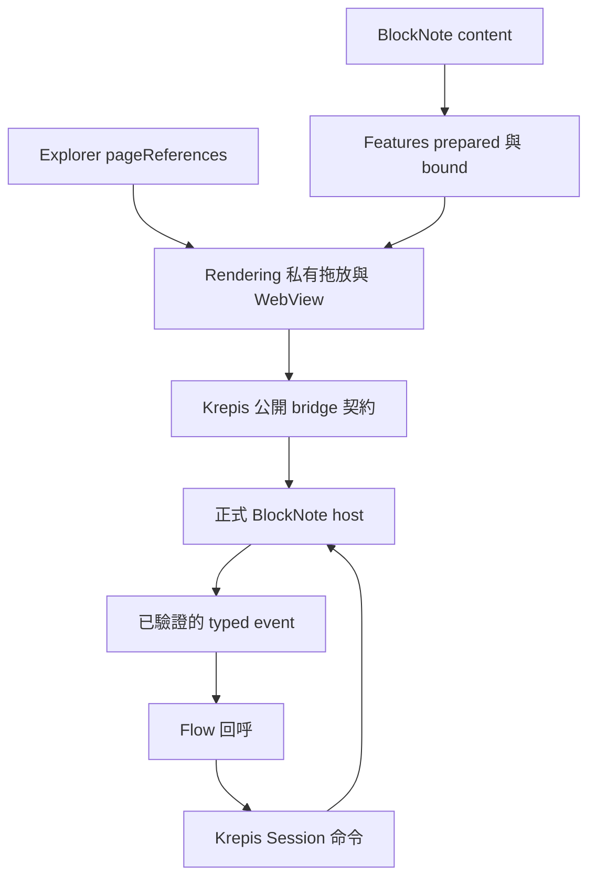

# BlockNote Flow：Kallopis／Krepis 配對

## r2c 正常退休／重新掛載配對（目前契約）

修訂 `KBF-PAIR-r2c`，2026-09-15，未發布、runtime 驗收待後續 BUILD。唯一 wire 為 [KBF-WIRE-r2c](../../../Krepis-flow-f2/bindings/block_note/contracts/flow-protocol.md#r2c-精確生命週期表示目前唯一-wire)，公開 Dart 型別為 [KBF-PLAN-r2c](../../../Krepis-flow-f2/bindings/block_note/architecture.md#r2c正常宿主退休與重新接線目前契約)。本節取代後文將所有 host replacement 一律禁止的簡寫：**只有私有 retirement proof 證明正常退休才可重新掛載**；無證據的 hostReplaced 仍 blocked。數字 protocolVersion／flowProtocolVersion 均為 1，持久 schema、既有 UI 與 plain legacy 行為不變。

### 宿主與 renderer 責任

- 正常頁面卸載由 consumer 先 await session.requestClose；Flow 協商後即使 Dart dirty=false 仍需 editor barrier → 原 persist 保存最新 snapshot → operation.retire/retired。renderer 不得因 widget dispose、controller 更換、load-error retry、canClose=true 或收到 dispose notification 自行宣告保存成功／退休。
- 同一 renderer 更新投影、callback、appearance 不更換宿主。必要銷毀/替换 WebView 前 consumer 必須有 canDetachHost；renderer 在仍可否決的 controller/loader 切換點讀同一 getter，無證據不主動重建。Flutter dispose 已不可取消，不能在 dispose 才 async close；若外層意外卸載，保留原 session/recovery 並將之視為未證明的 hostReplaced，絕不自動 open 新正文。
- 所有 mutator 共用 operation gate。retired 是永久終態，IME、paste/drop、undo/redo、asset/template async completion、資料庫 callback 完成皆不得提交；成功 unlock、reload 或重新 open 都不能復活該 host。retire ack 不解除 gate；control reconcile 必須明示 retired disposition，不以沒有 dirty/reload 推論。
- onOpened 重新接線仍沿 bridge → appearance → prepareFlowCapabilities → open 的既有順序；持有 proof 時由 Session 自己選已保存正文，renderer 不以建構時 document 快取取代。新 host 在完整 negotiated ready/readback 獲 typed receipt 前不接受輸入；Session 確認新 host 後再送最新 page projections 與 callback。舊 host 的 pending command/interaction、async continuation 或表面相同的 block ID 不能帶到新 incarnation。
- renderer 的回覆 handler 永遠同步取得 acceptFlowMessage receipt.toJson；consumer page.open callback 可正在等待 requestClose 的 save/retire，不能成為 handler/outbox 的等待條件。retirement 的普通 ack 與 reconcile 控制回覆保留原 lane 身分與重送規則，不建立第二份 wire schema。已派發 interaction 在退休後不重播；其完成結果只能忽略或報失敗，不能產生正文變更。
- 正常返回頁面保持同一 Krepis session、registry item 與 storage binding；僅 JS hostInstanceId 更新。遇到未知 replacement 或 reattach ready timeout，保留錯誤與候選 recovery，使用現有錯誤呈現，不新增 UI 或悄悄建立第二份 session。

### 本 stage BUILD 與 Test Author 邊界

| slice | 產品精確路徑（本庫相對） | Test Author 專有路徑／接受證據 |
| --- | --- | --- |
| KP-R2C-H：永久退休與 terminal replay | `tool/blocknote_editor/src/flowOperationHost.ts`、`flowProtocol.ts`、`flowMessageOutbox.ts`、`EditorApp.tsx`（後三檔同 src 目錄） | `tool/verify_blocknote_flow_retirement.mjs`、`tool/fixtures/blocknote_flow_protocol.json`；真實 gate、exact savedVersion、相符 retired ack、retire ack 遺失→control retired reconcile、重送不二次提交／永不 unlock |
| KP-R2C-A：安全宿主接線 | `lib/src/rendering/flutter/internal/klp_flutter_block_note_editing.dart`、`klp_block_note_web_session_loader.dart`、`klp_block_note_load_error.dart`（後兩檔同 internal 目錄） | `test/klp_block_note_host_retirement_test.dart`；無 proof 拒絕重建、有 proof 同 session 新 host 只開最後保存正文、ready receipt gate、callback→close 不死鎖 |

上述為派工候選精確白名單，root 依凍結 base/hashes 產生各 Packet；產品 worker 不改 test/fixture／契約。既有 flow schema/outbox/reload/undo/receipt conformance 與所有 S1/S2/S3 測試保護。KP-R2C-H 依賴 core r2c Test Author fixture checkpoint；KP-R2C-A 依賴 core r2c API 與 H。cold-start 各 5k–9k tokens／30–60 分鐘，reference_task_ids=[]；M1 合約測試凍結，M2 局部 Green，M3 兩庫配對驗證。越界、正式 editor 無法排空或驗證超時回 owner，不能放寬 gate。此處未宣稱測試通過，人工互動驗收仍 pending。

修訂 `KBF-PAIR-r2a`，2026-09-15。使用者已授權本任務提供 Kallopis 方配對；本輪同時擔任兩庫的配對 architecture owner。r2a 補足 r2 的精確技術表示，不改已接受產品語意。**兩庫技術契約已配對，正式 editor 實作與獨立驗收尚未交付**。

唯一 wire／正文 schema 來源為 [KBF-WIRE-r2a](../../../Krepis-flow-f2/bindings/block_note/contracts/flow-protocol.md)，不在本檔維護第二份 schema。Krepis 的 [公開 API](../../../Krepis-flow-f2/bindings/block_note/architecture.md) 與 [產品定義](../../../Krepis-flow-f2/spec/block-note-flow-capabilities.md) 保持權威。本檔定義 Kallopis 如何滿足該契約，不取得 E owner 的磁碟版本及跨檔交易權威。本輪僅在使用者授權的新工作樹補充契約；原樹唯讀。

## r2a 實作配對鎖定

本節與 Krepis architecture 的「r2a：可獨立實作的公開型別表示」、wire 的「r2a 精確表示」共同作為 S2／S3／KP-F1/B1/B2/R1 packet 輸入；不是完成宣告。後文 r2 簡寫若不夠精確，以這兩個權威章節為準。

| 接縫 | Kallopis 必須採用的表示與責任 |
| --- | --- |
| 共通 wire | top-level 欄位，沒有 payload wrapper；數字 protocolVersion/flowProtocolVersion 仍為 1，requestId 沿用正整數；正文 expectedVersion 是 `{epoch,revision}`，不可混入 storage expectedRevision |
| 能力 | capabilities 為三個 bool 的 object：pageLinksV1/databaseTableV1/operationGateV1；映射到公開 Capabilities 的 pageLinks/databaseTable/operationGate；不是字串 array |
| 命令 ack | command.result 用 status，不能寫 result；版本取頂層 epoch/revision；applied 的 outline 用既有 `{blockId,title,level}`，不能寫 text；成功／失敗身分欄位照唯一 wire 矩陣 |
| Typed callback | page.open 解碼為 KrepisPageOpenInteraction.request；database.drop 解碼為 KrepisDatabaseDropInteraction.request；onDatabaseDrop 回公開 sealed EditApplied/Unchanged/Rejected/Uncertain；renderer 不能把 send Future 包成 applied |
| 接收入口 | 兩種 lane 都呼叫同步 acceptFlowMessage；返回 KrepisBlockNoteDeliveryReceipt，以 toJson() 給 JS；typed interaction 不放進 JSON receipt |
| control lane | capabilities/reconcile 回覆使用獨立 callHandler，不分配普通 deliverySeq；typed receipt 以 lane/hostInstanceId/messageType/requestId 及 reconcile recoveryId 相符；同樣要 await receipt，不能 fire-and-forget |
| 觀察 | 精確 OperationState/Status/Recovery/ReconcileReceipt constructor 與 enum 以 Krepis architecture 為準；operationChanges 為 broadcast，只訂閱，不取代 onChanged，不用 observer 偽造正文／保存狀態 |
| 恢復終點 | reconcile 的 lockedWithEdits 使用原 saveLocked 保存最新快照，再 resumeSaved(lock) 等原 unlock ack；不 reload、不增加 epoch、不覆蓋新增文字 |

renderer handler 的一次責任為驗證、採納、立即回 receipt；consumer callback 是異步工作，不能把 callback Future 接成 handler 回傳值。callback 完成後使用唯一 wire 的 interaction.result 報告結果；該訊息不再變更正文、不要求額外 ack。callback 例外以 failure.code=transportFailure、detail=interactionCallbackFailed 回報，底層 Object 保留於 Dart 的錯誤處理，不序列化任意例外。無 callback 時不接受 drop；已在途 callback 因 barrier 失效時不重播、不派發第二次。

reconcile 只等待已接受的 editor transaction／mutator 收斂，取消舊 async completion 的提交資格，**不等待 consumer callback**（它可能正在等待 lock/save）。control receipt 也不等待真正 persist 完成；Krepis 的 reconcile Future 另外負責該等待。普通 outbox 被 snapshot／interaction 卡住時，control lane 仍能交付完整 barrier；採納 coveredDeliverySeq 後才清理已涵蓋正文與失效 interaction，不悄悄略過未涵蓋文字。

operation.unlock 的 ack 仍在 ordinary lane。host 可在 ack 已排入普通次序後恢復輸入，但之後 changed 必須排在該 ack 之後；若 receipt 遺失則收緊 gate，reconcile 重新鎖定並回最新快照。只有 Session 收到相符 operation.unlocked 才使 resume Future 成功，回覆傳送成功與 Dart receipt 都不等於 durable save。

hostReplaced 維持 blocked，保留舊恢復資料；新宿主只能依 wire 回 recoveryRequired/detail=hostReplaced，不能普通 open、移用舊 lock 或重播 committed。產品重建與 UI 不在 F2 底層。本輪沒有新增相關 UI 授權。

配對驗收必須加入：ordinary/control receipt identity、重送不二次派發、callback → save/lock 不死鎖、control 回覆先於 persist settle、snapshot 等待受阻的 reconcile、成功保存最新 reconcile 快照後 resumeSaved、保存失敗／舊版本保存不允許 resumeSaved、再次 unlock ack 遺失仍保留新字、hostReplaced 不自動重建。此處列的是待測接受條件，未宣告通過。

## 本輪接受的配對決定

| 項目 | Kallopis 的承諾 | 狀態 |
| --- | --- | --- |
| 頁面連結 | 正式 BlockNote schema 註冊 krepisPageLink；完整身分取最新投影、typed 開頁 | 契約接受，待實作 |
| 資料庫 | krepisDatabase table view；單一上游交易執行列命令，正式 undo/redo | 契約接受，待實作 |
| 拖放 | Explorer 提供 typed 頁面來源；renderer 換算座標、正式 editor 判定列位置；Flow 驗證後只執行一次命令 | 契約接受，待實作 |
| gate／reload | 所有正文入口受控、IME 排空、ack 可辨識、重建 editor 歷史基線 | 契約接受，待實作 |
| 不確定結果 | host incarnation、可靠事件交付與重新鎖定快照；不用舊 committed 正文覆蓋解鎖後輸入 | 契約接受，待實作 |
| E 持久版本 | E owner 在 resume 前重接 persist 的 expectedRevision | 仍待 E owner，不由本配對宣告完成 |

本輪只配對表格 view／列順序。Notion 圖片的屬性、排序、篩選、分組、AI、自動化與資料庫鎖定選單仍是參考；不新增這些產品行為。

## 公開宣告入口

以下是下一個 BUILD 使用的 API 契約，**目前 Dart 尚無這些新欄位**；既有 constructor 參數／節點 ID／插槽保持相容。

### KlpBlockNoteEditingContent

新增 optional named parameters：

| 欄位 | 型別與預設 | 語意 |
| --- | --- | --- |
| `pageProjections` | `Iterable<KrepisPageProjection>`，預設空；建構時轉不可變 List | 完整最新集合，缺項為 unknown；不持久化、不進 undo；每次宣告更新替換集合 |
| `onOpenPage` | `Future<void> Function(KrepisPageOpenRequest)?` | request 含 page、hostBlockId、可選 database/view/reference 身分；不與舊 onOpenReference 混用 |
| `onDatabaseDrop` | `Future<KrepisBlockNoteEditResult> Function(KrepisDatabaseDropRequest)?` | consumer 驗證後呼叫 session.insertDatabaseReference；缺 callback 不接受 drop，不私自插入 |

adapter → prepared → bound 全程保留 controller／callback 身分。使用 Kallopis 宣告節點時，pageProjections 是該呈現的唯一投影來源；renderer 透過 session.configurePages 更新，不要求 consumer 同時手動 configurePages。

`onOpened` 保留唯一呼叫 owner 與既有先後：bridge 建立 → appearance → 能力協商（新功能需要時）→ open 並確認 ready → 初始 pageProjections → 舊 pending commands flush → onOpened。既有 asset/reference 回呼原樣保留；onOpened 內既有插入不被重複執行。宣告重新準備只更新 projection/callback，不重開 editor。

Krepis 額外提供唯讀 `operationStatus` 與 broadcast `operationChanges`，讓 renderer 訂閱鎖定與 blocked。renderer 不覆寫 session.onChanged，不另設 registry；先訂閱再讀目前 status，依 statusVersion 去重。OperationStatus 由 Krepis 單一狀態產生，不保存另一份正文。

### Explorer 的頁面來源資料

`KlpExplorer` 新增 `Map<KlpId, KrepisPageReference> pageReferences = const {}`，建構時不可變複製；key 必須能對應本 Explorer 中的具身分、可選取且非 category 項目。未提供映射時，原 Explorer 內部移動行為維持，不能由 label/sourceId 猜 page 身分。

映射只表示來源頁面的投影身分，active／同專案／操作授權由 consumer 重驗。映射值不包含 Widget、座標、script 或 style。欄位僅讓既有列可作頁面參考來源，不新增一個視覺元件。

drag 到 database 只發 onDatabaseDrop，不呼叫 Explorer.onMove；drag 到 Explorer 維持既有 canMove/onMove。首版 typed request 是單頁：來源選取多頁時不部分取第一頁插入，不影響既有 Explorer 多選移動。需要批次 database drop 另行定義。

## 私有責任與相依方向

座標與 DOM 只在 rendering／web 內流動。Flow 只接完整 page、database/view/index/version。正常 drop 的唯一正文變更來自 Flow 驗證後送出的 Session 命令，Web 不在發出 drop event 時先插入。

| Module | 本 stage 所屬責任 |
| --- | --- |
| features/editing | 新 content 參數、bound 透傳、語意資料；不處理 wire Map 或 Flutter Widget |
| features/workspace | Explorer 頁面映射與 bound 透傳；不推定頁面 active，不把參考 drop 當 parent move |
| rendering | 私有跨表面 drag carrier、座標換算、host attachment 身分、transport receipt、typed 回呼與錯誤呈現 |
| tool/blocknote_editor | custom blocks、table 列交易、投影呈現、輸入 gate、正文快照／世代與 operation reconcile |
| Krepis | 公開值型別、wire decoder、session 狀態、保存排空及恢復快照；唯讀 observer |

Styling 仍由本庫 semantic resolver 提供；新增表格邊線、不可用狀態、drop 位置提示的值須在 features 的語意契約解析後交 bound。不得在 web/renderer 新增第二套預設 theme。新顯示字串由既有 foundation/localization 提供；操作 ID／debug error 不直接當產品文案。具體視覺接受維持 human-pending。

## 真實跨表面拖放

- 原 Explorer 的 Set<KlpId> 拖放資料由 rendering 內部 carrier 包含，追加對應的 typed page；不改 consumer 的 onMove 簽章。carrier 不外匯、不新建全域 session map。
- WebView 在有效單頁 drag 期間由 rendering 的私有接收區處理 drop；平台座標換成 WebView viewport 的正規化位置，經封閉 probe 交 web，以當下 DOM 列框判定 before/after index。consumer 不傳像素或自定 hit test。
- probe/release 綁定 dragId、hostInstanceId 與 session；放開時重新查詢實際命中與當前正文 version。empty database 的 body 命中 index 0；離開 database body 或找不到有效列即拒絕，不 fallback 到另一個 database。
- hit test 不依名稱或視覺上的第幾個資料庫定位；使用正式 custom block ID、viewId、referenceId。scroll/zoom/resize 只影響私有換算，結果仍為 typed placement。
- 平台 WebView 的 drag 接收與 overlay 行為必須由 Windows 真實宿主驗證；HTML dataTransfer 的桌面瀏覽器成功不能替代 Flutter/WebView 證據。
- 所有 probe 只讀。鎖定／blocked 期間取消 drop 預覽並拒絕 release。回呼只對一次有效 release 派發一次；過期 source、session 變更與重複 delivery 不再派發。

## 正式 editor 執行策略

1. 用本機鎖定的 0.54.2 custom schema 註冊兩個 block；頁面 title／available 從非正文投影讀取，DOM text 使用安全文字呈現，不當 HTML 執行。
2. table rows 僅有 wire 定義的頁面 occurrence 和順序。查找、insert/move/remove 的唯一演算法位於 web helper；Dart 只驗證公開型別與 envelope。
3. 完整驗證 expectedVersion、目標、索引及 payload 後，使用 `editor.transact` 提交，前後隔離 history 群組，沿既有 templateInsert.ts 的已使用模式；async 資產解析完成後再次驗證 session／epoch／gate。
4. 主入口先統一 gate；所有舊命令、toolbar、快捷鍵、paste/drop/undo/redo 與延後完成的 Promise 都不能繞過。`editor.isEditable=false` 加交易攔截是必要組合，不能只遮住 UI。
5. composing 中的 lock 先標 pending，攔新操作，等自然 compositionend 與最後 input transaction；不 blur、不合成事件、不抹除 composition。若逾時回 busy/detail=compositionPending 並維持 blocked，沒有成功 barrier，E 不得提交。
6. reload 以傳入正文建立全新 editor/history 世代，先 readonly 解析及比較持久快照，成功才原子切換 active editor。feature-enabled editor 設 trailingBlock=false，避免載入時自動追加段落；普通 legacy session 保留既有設定。舊 editor 的快照先保留，新世代不繼承其 history。不要用原 editor.replaceBlocks 當成清空 undo；React/BlockNoteView 管理 mount/unmount，舊 listener 與 async 結果按 epoch 失效。
7. host 的 protocol/runtime 維持在 editor 世代之外，持有 lock/reload receipt、hostInstanceId 與有界 outbox；只保留不可編輯快照，不另建 live 正文模型。

## 有序交付與恢復

KBF-WIRE-r2 定義 hostInstanceId（一次 JS 宿主生命週期）及 deliverySeq（每個 delivery 的序號）。正文 epoch/eventSeq 與 transport 序號分開，command.result 與 changed 可以指同一正文變更但各有 deliverySeq。

- JS 的單一 outbox 依序 await callHandler 的 typed receipt；只在 receipt 相符後移除。失敗停止後續交付，保留資料並收緊輸入 gate，不 fire-and-forget。
- Dart 收到 raw message，先由 Krepis.acceptFlowMessage 驗證／套用／去重，再回 receipt。typed page/drop 回呼在 receipt 之後非同步派發；不等待 callback 內 save 才回 receipt，避免 outbox 阻擋 snapshot 造成死鎖。
- 重複 delivery 回相同 receipt，不重複派發 typed 回呼。未知 future gap 需要 resync；不能直接略過未涵蓋的 changed。
- acquiring/reloading/releasing 不確定時，Krepis.reconcileOperation 觸發 host 重新封鎖輸入、排空已接受的有效編輯與 mutator，令舊 callback completion 失效而不等待其 Future，回完整最終快照／版本／lock與reload狀態。此控制回覆使用獨立 recovery lane，不被已失敗的普通 outbox 頭部阻擋；快照明列涵蓋的 delivery/event 界線。
- 解鎖 ack 遺失後若已新增文字，reconcile 的新快照以較新的 revision 回復到 locked/dirty；不重播 committed document，不將其設為 clean。E owner 能再 saveLocked 保存新增輸入。
- 若 hostInstanceId 改變，代表先前 JS editor 已消失。renderer 不呼叫普通 open 去覆蓋 blocked session；Krepis 保留已取得的快照並回 recoveryRequired／hostReplaced。未曾傳出的瀏覽器記憶體無法被恢復時明示不完整，不宣稱資料已安全保存。由 E owner 決定重建 session，且不得清掉舊恢復資料。

## 模組切片與獨立證據

以下只列本 stage，精確 packet 由相應 module architecture 綁定；所有新測試與共享 fixture 由獨立 Test Author 凍結，產品實作者不得改。

| Slice | Owner／產出 | 必要證據 |
| --- | --- | --- |
| KP-F1 | features/editing：content、bound、observer 與 exports | constructor 相容、完整 typed callback、projection 更新不重開、onChanged 所有權不變 |
| KP-W1 | features/workspace：pageReferences → bound | 未映射不猜頁面、category／無效 key 拒絕、原 onMove 行為保持 |
| KP-B1 | web：custom blocks、projection、database 交易 | 鎖定 0.54.2 正式 bundle schema round-trip，單步 undo/redo、更名及不可用頁、無效位置零變更 |
| KP-B2 | web：barrier/reload/reconcile/outbox | 真實 history 基線、composition、pending async、事件亂序／ack 遺失、解鎖後新字保留 |
| KP-R1 | rendering：typed transport、observer、恢復、實際跨表面 drop | WebView attachment 不重開錯 session、source/target 精確、drop 不觸發 parent move、receipt 無死鎖 |

KP-F1/W1/B1/B2/R1 均尚未實作。跨模組新依賴只使用具名公開／套件內契約，不能以 internal import 例外繞過架構閘門。正式視覺與原生 IME／drag 需人類接受，deterministic 內容／事件驗收仍由獨立測試提供。

## 已核對的可行性證據與限制

本輪只做 source/API 核對，**不是 runtime 測試**：

- 本機 `@blocknote/core/package.json` 確認 0.54.2；`types/src/schema/propTypes.d.ts` 有 string/number/boolean，`blocks/createSpec.d.ts` 有 content none 的 createBlockSpec。
- `types/src/editor/BlockNoteEditor.d.ts` 第 351–375 行有 transact、第 566–571 行有 isEditable；initialContent 與 schema 可建立新 editor。`@blocknote/react/src/hooks/useCreateBlockNote.tsx` 使用 create/options/deps，BlockNoteView 負責 mount/unmount。
- 既有 [templateInsert.ts](../../tool/blocknote_editor/src/templateInsert.ts) 已使用 transact/closeHistory 隔離前後編輯；這是實作範例，不作為新 database 已通過的證據。
- 現有 [EditorApp.tsx](../../tool/blocknote_editor/src/EditorApp.tsx) 仍 void callHandler 且 open 使用 replaceBlocks；[Flutter host](../../lib/src/rendering/flutter/internal/klp_flutter_block_note_editing.dart) 仍以 send/open Future 判斷流程，沒有本配對的新 ack／reconcile。

| 基線 | SHA-256 |
| --- | --- |
| package-lock.json | 3317661838E0B4420CC741270BD4AD53906927C6A0B02FB1C0FCB59627138285 |
| EditorApp.tsx | 6AE8392F674F20792D4A45EA6800D3842333B5340387005B479E4C6E3C4C7E86 |
| templateInsert.ts | C2E86E621D07C39BE2D42FEB70AA4FEC0776139FB4FCED81391DA43F3E00B54F |
| klp_block_note_editing_content.dart | 11F46DD8D05A3AF7E0B83DF8BDF61A053A593E470FEE2478DB743703AB2671E7 |
| klp_flutter_block_note_editing.dart | 3FCB9E91D6E8387BAD0525011D813E831643253C2EDB9D071143FFA71B5B972C |

兩庫 runtime 對照與獨立測試仍是發布閘門；不能把本輪 owner 接受契約寫成已完成 F2/E3。E owner 的 expectedRevision 重接、乾淨派工基線及正式實作證據仍未完成。

本輪文件證據：Kallopis 7 份與 Krepis 4 份文件 read-back 通過，whitespace／fence 與限定 diff 檢查 exit 0；Krepis 11 個正式來源 hash 與 Kallopis 已核對的 4 個產品碼 hash 均未變。Mermaid 未渲染；沒有產品測試、獨立 conformance 測試或原生 WebView 驗收通過的宣告。
