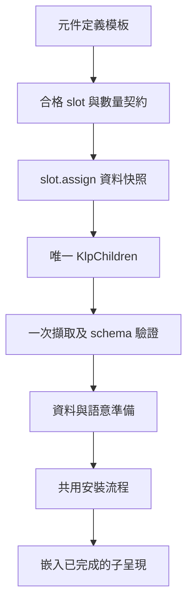
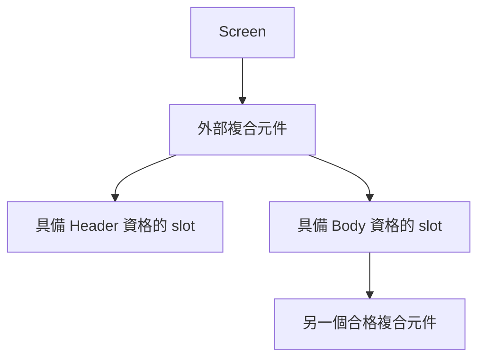
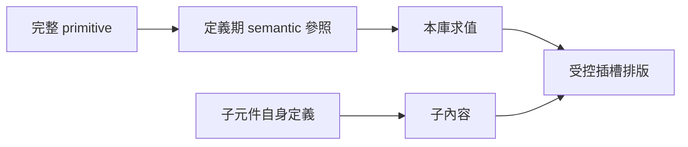

# 外部複合元件的合格子插槽

狀態：已接通首批實作並通過獨立 root 驗證；完整遷移尚未完成。延伸 [元件模板](component-template-prototype.md) 與 [應用 runtime](application-runtime-prototype.md)，讓外部元件能組合合格子項，仍由本庫掌管安裝、風格及呈現。

`KlpCompositeNode` 收窄唯一的 `children` 輸入為本庫 final `KlpChildren`。這個集合保存不可變的插槽 assignments 與展開內容，消費端不再分別提供 assignments、children 或子項 selector。擷取階段只讀取一次 children，後續編譯及安裝使用該快照。此設計不依賴 Dart 基底類別禁止 getter 覆寫；getter 可以回傳下一份合法資料，但當次取得的是不可覆寫的封閉集合。

定義期以 `KlpSlot<C>` 描述 owner、名稱、子項資格與數量限制。`slot.assign(items)` 即時快照並檢查實際資格；泛型提升不能放寬 slot 原本的 C。`KlpChildrenTemplate` 參照 slot、排列方向與 semantic gap，元件定義遍歷模板自動取得 schema，不另要求作者重複列一份 schema。







```text
definition.content → template traversal → exact slot schema
node.children → KlpChildren snapshot → slot identity / type / cardinality / order
validated child ranges → existing child compilation → internal materialization
renderer receives completed bound templates only
```

| 權限 | 所有者 | 驗收要求 |
|---|---|---|
| 子項資格與數量 | 定義期 slot | 非合格、少於下限、超過上限均拒絕 |
| 插槽組合 | 定義模板 | 每個 slot 恰好出現一次，owner 必須相符 |
| 實例內容 | 消費端資料 | 所有 schema slot 恰有一份 assignment，空項明確提供空集合 |
| 插槽識別 | slot 物件身分 | 偽造同 owner/name 不得替代原 slot |
| 子樹順序 | schema 順序 | assignment 次序不符拒絕，不隱藏重排 |
| 尺寸及外觀 | semantic → 本庫 resolver → 模板 | 實例沒有局部 style 或 Widget 輸入 |
| 建立與卸載 | 既有 runtime | 資料或資格失敗先於資源建立；同位置資源重用 |

驗收包括巢狀複合元件、跨多資格的合法子項、泛型提升、偽造 slot、遺漏／多餘／重複／錯序 assignment、全樹重複位置，以及替換資料／原料後的狀態生命週期。尚未完成的插槽佔位不能進入 Flutter renderer，子項不可以靜默漏畫或畫兩次。

Runtime 先檢查整棵樹的外部模板資格，再執行資料投影；準備樹僅供內部使用，materialize 嵌入已完成子內容。每個完成的放置都有 `KlpBoundPlacement` 識別，同一父層內的重排與換風格已驗證保留 element、焦點及選取。跨父層移動的焦點保留未查證，不由同層重排測試推論。

獨立完整驗證：`01:04 +960: All tests passed!`；`No issues found! (ran in 4.8s)`，兩者 exit 0。三個公開啟動案例驗證巢狀呈現、一次投影、重排／風格替換與錯誤更新保留原狀。更多證據及原始紀錄位置見 [進度](restructure-progress.md)。

本批不重設正式預設風格，不建立新全畫面 golden。完整路由、環境與能力支援矩陣仍依遷移計畫推進。
