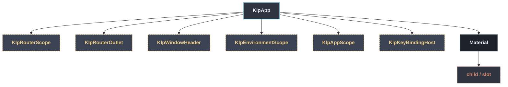

# KlpApp：元件樹架構

## 範圍

- **核心元件**：`KlpApp`
- **所屬領域**：`application`
- **核心職責**：`MaterialApp` 的接入層，收掉每個消費者都得自己組一次的樣板。  沒有它時，消費者要自己：套 `buildKlpTheme` 的亮／暗兩份 `ThemeData`、記得把 `themeAnimationDuration` 歸零（否則主題切換的動畫中途會有半數幀停在舊值上， 見 README「深淺切換不做過場」）、決定明暗狀態放哪裡並手刻切換入口、如果用了 [KlpRouter] 還要自己架 [KlpRouterScope]。這些細節不涉及任何產品語意，每個 `-ist` 產品各刻一次只會讓實作各自漂移——因此收進庫。  ## 最小用法  ```dart KlpApp(   home: KlpPanelFrame(content: const MyHomePage()), ) ```  ## 搭配 router  給了 [router] 但沒給 [home] 時，自動以 [KlpRouterOutlet] 當作首頁； 兩者都給時，[home] 仍會被包在 [KlpRouterScope] 之下，因此 [home] 的子樹 裡任何位置都能用 `context.klpRouter`（[KlpRouterOutlet] 放在哪一層由消費者 自己決定）。  ```dart KlpApp(   router: KlpRouter(     routes: [       KlpRoute(         id: 'home',         builder: (_) => KlpPanelFrame(content: const HomePage()),       ),     ],     initialId: 'home',   ), ) ```  ## 切換明暗  ```dart KlpApp.of(context).toggleBrightness(); ```  ## 換視覺風格  [style] 是向後相容的共用基底，依目前明暗換上內建色彩。需要完整控制亮／暗風格時， 改傳 [lightStyle] 與 [darkStyle]；對應模式一旦有完整風格，[KlpApp] 就不會改寫其中任一層。
- **包含範圍**：`build()` 內部建構的完整 Widget 樹（展開 Flutter 原生元件與純容器）
- **外部引用**：本專案其他非純容器元件（遇引用即停下並鏈結）

## 架構圖



## 外部元件引用

- [`KlpAppScope`](./klp_app_scope.md) — `application`
- [`KlpEnvironmentScope`](../foundation/klp_environment_scope.md) — `foundation — 圖示、色盤、度量`
- [`KlpKeyBindingHost`](../foundation/klp_key_binding_host.md) — `foundation — 圖示、色盤、度量`
- [`KlpRouterOutlet`](../features/klp_router_outlet.md) — `features`
- [`KlpRouterScope`](../features/klp_router_scope.md) — `features`
- [`KlpWindowHeader`](../features/klp_window_header.md) — `features`

## 程式碼證據

- 檔案路徑：[`lib/src/application/legacy/klp_app.dart`](../../../../lib/src/application/legacy/klp_app.dart#L78)
- 宣告型態：`StatefulWidget`

## 閱讀說明

- **實線節點**：Flutter 原生元件或本元件自身節點。
- **容器節點（圓角/綠框）**：本專案之純容器元件（如 `KlpSurface` 等），已持續向下展開其子樹。
- **虛線/引號節點（黃框/:::reference）**：本專案其他功能性元件，依規則停止展開並提供文件引用。
- **插槽節點（橘框/:::slot）**：外部傳入之 `child`、`builder` 或內容參數。
