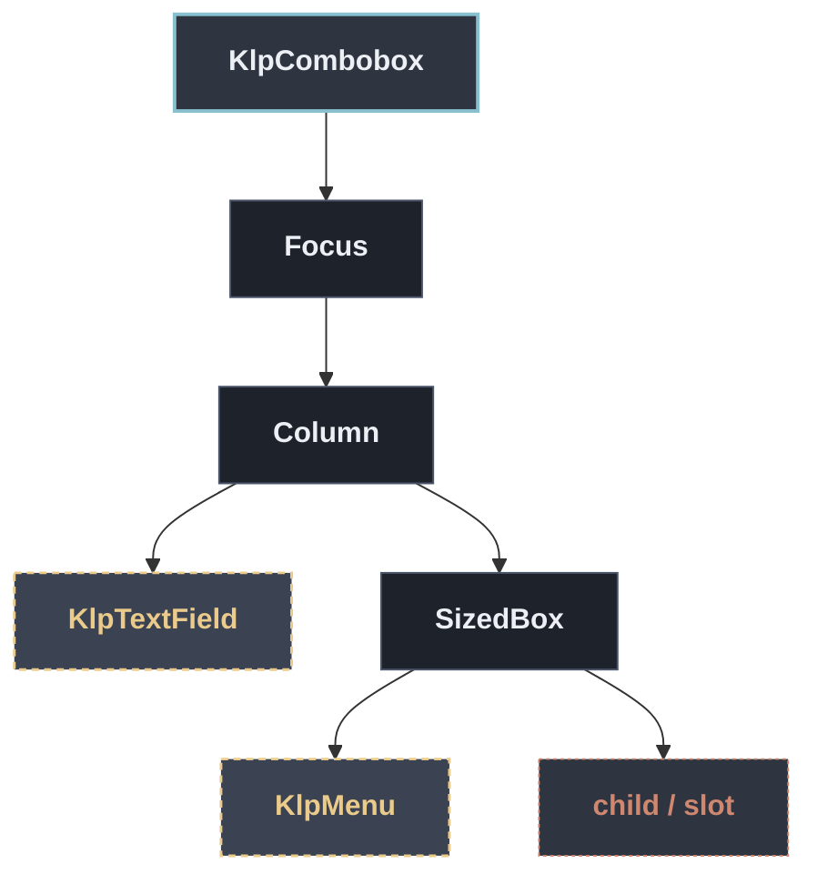

# KlpCombobox：元件樹架構

## 範圍

- **核心元件**：`KlpCombobox`
- **所屬領域**：`controls — 控制項`
- **核心職責**：可輸入的下拉選單（autocomplete）。  **輸入框重用 [KlpTextField]，下拉面板重用 [KlpMenu]**——本庫「一條規則只能有 一個實作」：欄位外觀與選單外觀已經各自只有一份，這裡不重新畫一套。  是**受控元件**：目前的輸入文字（[query]）、候選清單（[options]）都由呼叫端 持有並傳入，本元件只負責過濾顯示、鍵盤導覽與觸發 [onQueryChanged]／ [onSelected]。選出一個選項後，呼叫端通常會把 [query] 更新成該選項的 [KlpComboboxOption.label]。  鍵盤：↓／↑ 在目前過濾結果間移動，Enter 選定醒目提示的項目；[allowFreeText] 為 `true` 時，Enter 在沒有醒目提示項目但輸入框非空時改觸發 [onFreeTextSubmitted]，讓呼叫端接受清單以外的自由輸入值。Esc 收起面板。
- **包含範圍**：`build()` 內部建構的完整 Widget 樹（展開 Flutter 原生元件與純容器）
- **外部引用**：本專案其他非純容器元件（遇引用即停下並鏈結）

## 架構圖

## 外部元件引用

- [`KlpMenu`](../overlay/klp_menu.md) — `overlay — 浮層`
- [`KlpTextField`](./klp_text_field.md) — `controls — 控制項`

## 程式碼證據

- 檔案路徑：[`lib/src/controls/klp_combobox.dart`](../../../../lib/src/controls/klp_combobox.dart#L33)
- 宣告型態：`StatefulWidget`

## 閱讀說明

- **實線節點**：Flutter 原生元件或本元件自身節點。
- **容器節點（圓角/綠框）**：本專案之純容器元件（如 `KlpSurface` 等），已持續向下展開其子樹。
- **虛線/引號節點（黃框/:::reference）**：本專案其他功能性元件，依規則停止展開並提供文件引用。
- **插槽節點（橘框/:::slot）**：外部傳入之 `child`、`builder` 或內容參數。

