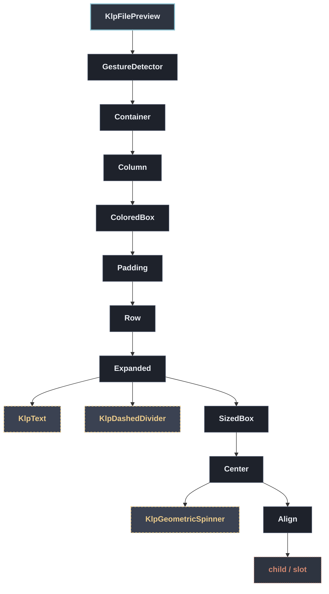

# KlpFilePreview：元件樹架構

## 範圍

- **核心元件**：`KlpFilePreview`
- **所屬領域**：`data — 資料呈現`
- **核心職責**：檔案預覽卡片：header 顯示檔名與中繼資料，中段畫預覽內容，footer 放外部 操作。  [preview] 優先於 [textContent]——兩者都給時只會用 [preview]；都不給且 [state] 為 [KlpFilePreviewState.ready] 時顯示「無可用預覽」。[state] 由 呼叫端管理，這個元件不會自己判斷載入或解析是否失敗。
- **包含範圍**：`build()` 內部建構的完整 Widget 樹（展開 Flutter 原生元件與純容器）
- **外部引用**：本專案其他非純容器元件（遇引用即停下並鏈結）

## 架構圖

## 外部元件引用

- [`KlpDashedDivider`](../surface/klp_dashed_divider.md) — `surface — 表面與描邊`
- [`KlpGeometricSpinner`](../foundation/klp_geometric_spinner.md) — `foundation — 圖示、色盤、度量`
- [`KlpText`](../typography/klp_text.md) — `typography — 文字`

## 程式碼證據

- 檔案路徑：[`lib/src/data/klp_advanced_data.dart`](../../../../lib/src/data/klp_advanced_data.dart#L736)
- 宣告型態：`StatelessWidget`

## 閱讀說明

- **實線節點**：Flutter 原生元件或本元件自身節點。
- **容器節點（圓角/綠框）**：本專案之純容器元件（如 `KlpSurface` 等），已持續向下展開其子樹。
- **虛線/引號節點（黃框/:::reference）**：本專案其他功能性元件，依規則停止展開並提供文件引用。
- **插槽節點（橘框/:::slot）**：外部傳入之 `child`、`builder` 或內容參數。

