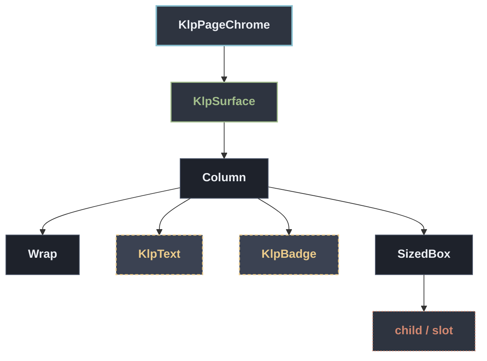

# KlpPageChrome：元件樹架構

## 範圍

- **核心元件**：`KlpPageChrome`
- **所屬領域**：`editor — 編輯器周邊`
- **核心職責**：頁面頂部的識別區塊：麵包屑導覽、選填的狀態文字與協作者標記，以及頁面 大標題。  [breadcrumb] 以 `/` 串接顯示，不提供逐段可點擊的導覽——需要可點擊麵包屑 請改用 [KlpBreadcrumb]。[status] 與 [collaborator] 都是單一文字，若要顯示 多位協作者或多筆狀態，需自行組合字串或改用其他元件。
- **包含範圍**：`build()` 內部建構的完整 Widget 樹（展開 Flutter 原生元件與純容器）
- **外部引用**：本專案其他非純容器元件（遇引用即停下並鏈結）

## 架構圖

## 外部元件引用

- [`KlpBadge`](../data/klp_badge.md) — `data — 資料呈現`
- [`KlpSurface`](../surface/klp_surface.md) — `surface — 表面與描邊` *(純容器，已繼續向下展開)*
- [`KlpText`](../typography/klp_text.md) — `typography — 文字`

## 程式碼證據

- 檔案路徑：[`lib/src/editor/klp_page_chrome.dart`](../../../../lib/src/editor/klp_page_chrome.dart#L15)
- 宣告型態：`StatelessWidget`

## 閱讀說明

- **實線節點**：Flutter 原生元件或本元件自身節點。
- **容器節點（圓角/綠框）**：本專案之純容器元件（如 `KlpSurface` 等），已持續向下展開其子樹。
- **虛線/引號節點（黃框/:::reference）**：本專案其他功能性元件，依規則停止展開並提供文件引用。
- **插槽節點（橘框/:::slot）**：外部傳入之 `child`、`builder` 或內容參數。

