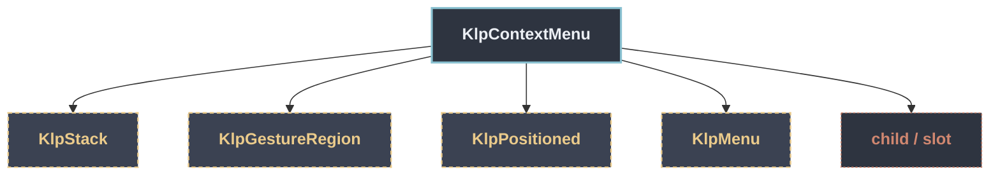

# KlpContextMenu：元件樹架構

## 範圍

- **核心元件**：`KlpContextMenu`
- **所屬領域**：`features`
- **核心職責**：右鍵選單：掛在任意子樹上，滑鼠右鍵或觸控長按於指標位置彈出。  選單本體重用既有的 [KlpMenu] 與 [KlpMenuItemData]——本元件只負責觸發時機、 指標定位與點外部關閉，**不重新實作選單外觀**（一條規則只能有一個實作）。 彈出位置沿用 [KlpMenuLayout.resolvePosition]，與 [KlpMenu] 在其他彈出場景 使用同一套定位邏輯，才不會有兩份互相分岔的擺放規則。
- **包含範圍**：`build()` 內部建構的完整 Widget 樹（展開 Flutter 原生元件與純容器）
- **外部引用**：本專案其他非純容器元件（遇引用即停下並鏈結）

## 架構圖

## 外部元件引用

- [`KlpGestureRegion`](../foundation/klp_gesture_region.md) — `foundation — 圖示、色盤、度量`
- [`KlpMenu`](./klp_menu.md) — `features`
- [`KlpPositioned`](../foundation/klp_positioned.md) — `foundation — 圖示、色盤、度量`
- [`KlpStack`](../foundation/klp_stack.md) — `foundation — 圖示、色盤、度量`

## 程式碼證據

- 檔案路徑：[`lib/src/features/overlays/context_menu/klp_context_menu_widget.dart`](../../../../lib/src/features/overlays/context_menu/klp_context_menu_widget.dart#L9)
- 宣告型態：`StatefulWidget`

## 閱讀說明

- **實線節點**：Flutter 原生元件或本元件自身節點。
- **容器節點（圓角/綠框）**：本專案之純容器元件（如 `KlpSurface` 等），已持續向下展開其子樹。
- **虛線/引號節點（黃框/:::reference）**：本專案其他功能性元件，依規則停止展開並提供文件引用。
- **插槽節點（橘框/:::slot）**：外部傳入之 `child`、`builder` 或內容參數。
