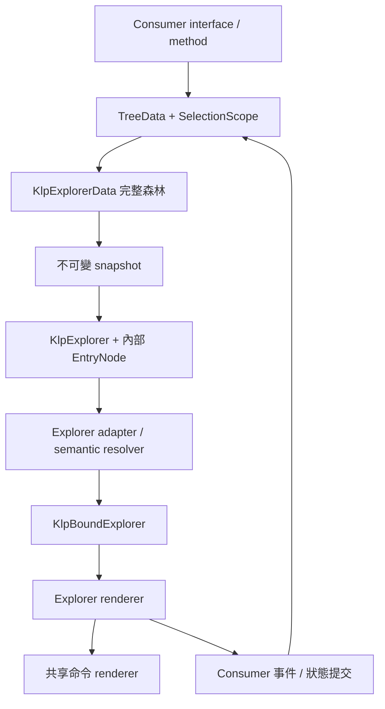

# Workspace.Explorer：實際層級

- 公開資料與結構：[explorer/](../../../../lib/src/features/workspace/explorer/klp_explorer.dart)。Consumer 不傳 Widget 或局部 style。
- 樣式用途：[adapter](../../../../lib/src/features/workspace/explorer/internal/klp_explorer_adapter.dart)。修改風格從用途對應開始，與產品組合分開。
- 列互動及呈現：[renderer](../../../../lib/src/rendering/flutter/internal/klp_flutter_explorer.dart)。不再使用舊 Widget Explorer／KlpNavigator 鏈。
- 命令：[shared renderer](../../../../lib/src/rendering/flutter/internal/klp_flutter_commands.dart)。Explorer 與 WorkspaceBlock 共用。
- 跨 agent 名稱：**Workspace.Explorer / EXP-V1-r2**；[宣告與組裝](../../../ai/explorer-model.md)，[Catalog](../../../ai/explorer-catalog.md)。
