# KlpMenuItem：元件樹架構

## 範圍

- **核心元件**：`KlpMenuItem`
- **所屬領域**：`features`
- **核心職責**：[KlpMenu] 裡單一項目的渲染；互動與狀態表面統一交由 [KlpActionRegion]。
- **包含範圍**：`build()` 內部建構的完整 Widget 樹（展開 Flutter 原生元件與純容器）
- **外部引用**：本專案其他非純容器元件（遇引用即停下並鏈結）

## 架構圖

```mermaid
flowchart TD
  classDef default fill:#1E222B,stroke:#4C566A,stroke-width:1px,color:#ECEFF4;
  classDef root fill:#2E3440,stroke:#88C0D0,stroke-width:2px,color:#ECEFF4,font-weight:bold;
  classDef reference fill:#3B4252,stroke:#EBCB8B,stroke-width:1.5px,stroke-dasharray: 4 3,color:#EBCB8B;
  classDef container fill:#2E3440,stroke:#A3BE8C,stroke-width:1.5px,color:#A3BE8C;
  classDef slot fill:#2E3440,stroke:#D08770,stroke-width:1px,stroke-dasharray: 2 2,color:#D08770;

  root["KlpMenuItem"]:::root
  n1["KlpActionRegion"]:::reference
  root --> n1
  n2["KlpBox"]:::reference
  root --> n2
  n3["KlpRow"]:::reference
  root --> n3
  n4["KlpTranslate"]:::reference
  root --> n4
  n5["KlpIcon"]:::reference
  root --> n5
  n6["KlpExpanded"]:::reference
  root --> n6
  n7["KlpText"]:::reference
  root --> n7
  n8["KlpToggleIndicator"]:::reference
  root --> n8
  n9["KlpRotate"]:::reference
  root --> n9
  n10["child / slot"]:::slot
  root --> n10
```

## 外部元件引用

- [`KlpActionRegion`](../foundation/klp_action_region.md) — `foundation — 圖示、色盤、度量`
- [`KlpBox`](../foundation/klp_box.md) — `foundation — 圖示、色盤、度量`
- [`KlpExpanded`](../foundation/klp_expanded.md) — `foundation — 圖示、色盤、度量`
- [`KlpIcon`](../foundation/klp_icon.md) — `foundation — 圖示、色盤、度量`
- [`KlpRotate`](../foundation/klp_rotate.md) — `foundation — 圖示、色盤、度量`
- [`KlpRow`](../foundation/klp_row.md) — `foundation — 圖示、色盤、度量`
- [`KlpText`](../foundation/klp_text.md) — `foundation — 圖示、色盤、度量`
- [`KlpToggleIndicator`](./klp_toggle_indicator.md) — `features`
- [`KlpTranslate`](../foundation/klp_translate.md) — `foundation — 圖示、色盤、度量`

## 程式碼證據

- 檔案路徑：[`lib/src/features/overlays/menu/klp_menu_item.dart`](../../../../lib/src/features/overlays/menu/klp_menu_item.dart#L4)
- 宣告型態：`StatelessWidget`

## 閱讀說明

- **實線節點**：Flutter 原生元件或本元件自身節點。
- **容器節點（圓角/綠框）**：本專案之純容器元件（如 `KlpSurface` 等），已持續向下展開其子樹。
- **虛線/引號節點（黃框/:::reference）**：本專案其他功能性元件，依規則停止展開並提供文件引用。
- **插槽節點（橘框/:::slot）**：外部傳入之 `child`、`builder` 或內容參數。
