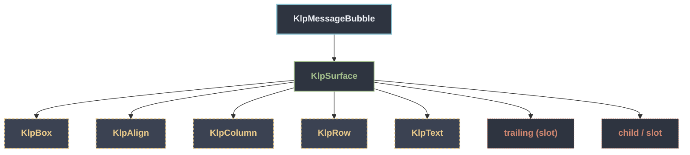

# KlpMessageBubble：元件樹架構

## 範圍

- **核心元件**：`KlpMessageBubble`
- **所屬領域**：`features`
- **核心職責**：訊息作者、時間與內容的通用呈現單元。
- **包含範圍**：`build()` 內部建構的完整 Widget 樹（展開 Flutter 原生元件與純容器）
- **外部引用**：本專案其他非純容器元件（遇引用即停下並鏈結）

## 架構圖

## 外部元件引用

- [`KlpAlign`](../foundation/klp_align.md) — `foundation — 圖示、色盤、度量`
- [`KlpBox`](../foundation/klp_box.md) — `foundation — 圖示、色盤、度量`
- [`KlpColumn`](../foundation/klp_column.md) — `foundation — 圖示、色盤、度量`
- [`KlpRow`](../foundation/klp_row.md) — `foundation — 圖示、色盤、度量`
- [`KlpSurface`](../foundation/klp_surface.md) — `foundation — 圖示、色盤、度量` *(純容器，已繼續向下展開)*
- [`KlpText`](../foundation/klp_text.md) — `foundation — 圖示、色盤、度量`

## 程式碼證據

- 檔案路徑：[`lib/src/features/collections/message_thread/internal/klp_message_bubble_widget.dart`](../../../../lib/src/features/collections/message_thread/internal/klp_message_bubble_widget.dart#L4)
- 宣告型態：`StatelessWidget`

## 閱讀說明

- **實線節點**：Flutter 原生元件或本元件自身節點。
- **容器節點（圓角/綠框）**：本專案之純容器元件（如 `KlpSurface` 等），已持續向下展開其子樹。
- **虛線/引號節點（黃框/:::reference）**：本專案其他功能性元件，依規則停止展開並提供文件引用。
- **插槽節點（橘框/:::slot）**：外部傳入之 `child`、`builder` 或內容參數。
