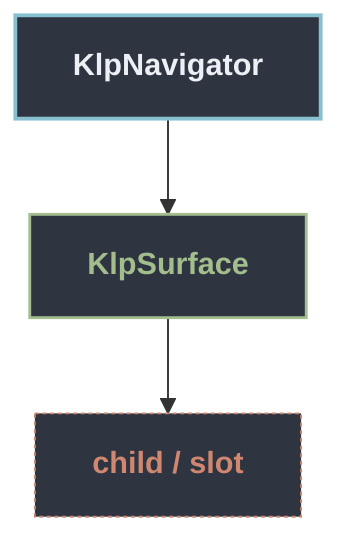

# KlpNavigator：元件樹架構

## 範圍

- **核心元件**：`KlpNavigator`
- **所屬領域**：`features`
- **核心職責**：Sidebar 的通用導覽組成。  Category 與 Element 沿用 Kallopis Catalog 目錄的視覺與高度；Component 是 不受固定列高限制的插槽。產品只提供資料、受控狀態與事件。
- **包含範圍**：`build()` 內部建構的完整 Widget 樹（展開 Flutter 原生元件與純容器）
- **外部引用**：本專案其他非純容器元件（遇引用即停下並鏈結）

## 架構圖

## 外部元件引用

- [`KlpSurface`](../foundation/klp_surface.md) — `foundation — 圖示、色盤、度量` *(純容器，已繼續向下展開)*

## 程式碼證據

- 檔案路徑：[`lib/src/features/navigation/widgets/navigator/internal/klp_navigator_widget.dart`](../../../../lib/src/features/navigation/widgets/navigator/internal/klp_navigator_widget.dart#L7)
- 宣告型態：`StatefulWidget`

## 閱讀說明

- **實線節點**：Flutter 原生元件或本元件自身節點。
- **容器節點（圓角/綠框）**：本專案之純容器元件（如 `KlpSurface` 等），已持續向下展開其子樹。
- **虛線/引號節點（黃框/:::reference）**：本專案其他功能性元件，依規則停止展開並提供文件引用。
- **插槽節點（橘框/:::slot）**：外部傳入之 `child`、`builder` 或內容參數。
