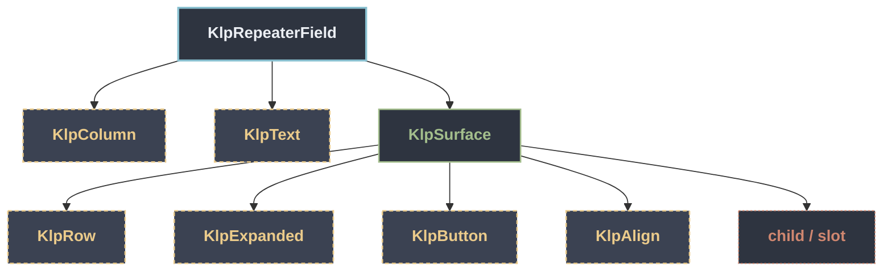

# KlpRepeaterField：元件樹架構

## 範圍

- **核心元件**：`KlpRepeaterField`
- **所屬領域**：`features`
- **核心職責**：可新增／刪除項目的重複欄位群組（例如「新增一組聯絡方式」）。  不維護項目清單的狀態——[items] 由呼叫端持有，新增／刪除都只是透過 [onAdd]／[onRemove] 回報意圖，實際要不要新增一項、刪哪一項由呼叫端決定 並重新傳入新的 [items]。
- **包含範圍**：`build()` 內部建構的完整 Widget 樹（展開 Flutter 原生元件與純容器）
- **外部引用**：本專案其他非純容器元件（遇引用即停下並鏈結）

## 架構圖

## 外部元件引用

- [`KlpAlign`](../foundation/klp_align.md) — `foundation — 圖示、色盤、度量`
- [`KlpButton`](./klp_button.md) — `features`
- [`KlpColumn`](../foundation/klp_column.md) — `foundation — 圖示、色盤、度量`
- [`KlpExpanded`](../foundation/klp_expanded.md) — `foundation — 圖示、色盤、度量`
- [`KlpRow`](../foundation/klp_row.md) — `foundation — 圖示、色盤、度量`
- [`KlpSurface`](../foundation/klp_surface.md) — `foundation — 圖示、色盤、度量` *(純容器，已繼續向下展開)*
- [`KlpText`](../foundation/klp_text.md) — `foundation — 圖示、色盤、度量`

## 程式碼證據

- 檔案路徑：[`lib/src/features/forms/structured/internal/klp_repeater_field_widget.dart`](../../../../lib/src/features/forms/structured/internal/klp_repeater_field_widget.dart#L8)
- 宣告型態：`StatelessWidget`

## 閱讀說明

- **實線節點**：Flutter 原生元件或本元件自身節點。
- **容器節點（圓角/綠框）**：本專案之純容器元件（如 `KlpSurface` 等），已持續向下展開其子樹。
- **虛線/引號節點（黃框/:::reference）**：本專案其他功能性元件，依規則停止展開並提供文件引用。
- **插槽節點（橘框/:::slot）**：外部傳入之 `child`、`builder` 或內容參數。
