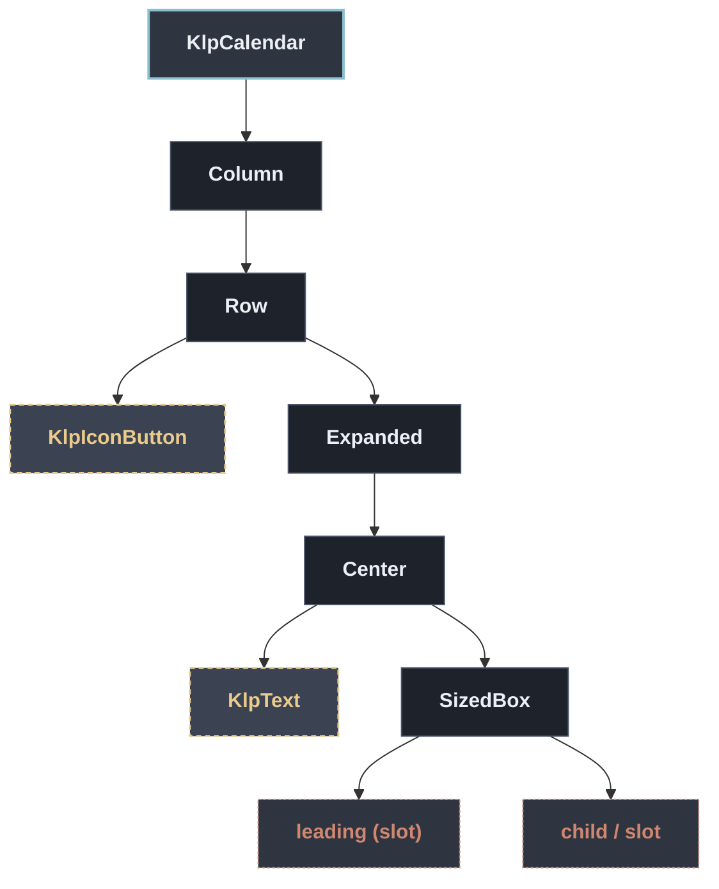

# KlpCalendar：元件樹架構

## 範圍

- **核心元件**：`KlpCalendar`
- **所屬領域**：`form — 表單`
- **核心職責**：月曆面板：月份切換、日期格、今天標記、選取狀態，並可停用特定日期。  **這是純顯示元件，不持有任何日期狀態**——目前顯示的月份、選取的日期都由呼叫端 透過 [month]、[selectedDate]／[selectedRange] 傳入，切換月份與選日期一律經 [onPreviousMonth]／[onNextMonth]／[onDateSelected] 回呼，由呼叫端決定下一步狀態。  **不內建任何語言字串。** 月份標題（[monthLabel]）與星期縮寫（[weekdayLabels]） 一律由呼叫端組出——本庫沒有 l10n 機制，不替產品決定用哪種語言、哪一天是一週的 開始（見 [firstWeekday]）。
- **包含範圍**：`build()` 內部建構的完整 Widget 樹（展開 Flutter 原生元件與純容器）
- **外部引用**：本專案其他非純容器元件（遇引用即停下並鏈結）

## 架構圖

## 外部元件引用

- [`KlpIconButton`](../controls/klp_icon_button.md) — `controls — 控制項`
- [`KlpText`](../typography/klp_text.md) — `typography — 文字`

## 程式碼證據

- 檔案路徑：[`lib/src/form/klp_calendar.dart`](../../../../lib/src/form/klp_calendar.dart#L45)
- 宣告型態：`StatelessWidget`

## 閱讀說明

- **實線節點**：Flutter 原生元件或本元件自身節點。
- **容器節點（圓角/綠框）**：本專案之純容器元件（如 `KlpSurface` 等），已持續向下展開其子樹。
- **虛線/引號節點（黃框/:::reference）**：本專案其他功能性元件，依規則停止展開並提供文件引用。
- **插槽節點（橘框/:::slot）**：外部傳入之 `child`、`builder` 或內容參數。

