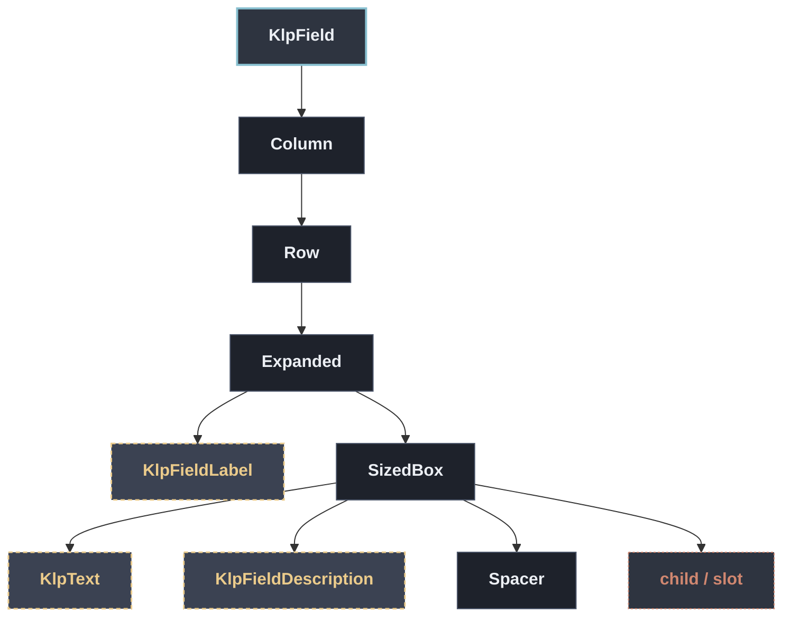

# KlpField：元件樹架構

## 範圍

- **核心元件**：`KlpField`
- **所屬領域**：`form — 表單`
- **核心職責**：單一表單欄位的完整外框：標籤、選填說明、輸入控制項（[child]），以及 底部的錯誤／狀態／字數提示列。  [error]、[status]、[counter]、[errorCode] 共用同一列版面：底部提示列只在 四者至少有一個非 null 時才出現；[error] 優先於 [status]（兩者同時給只顯示 error），[errorCode]／[counter] 則各自靠右並存，通常放系統層級的診斷代碼 （例如後端回傳的驗證錯誤碼）供支援排查用，不是給一般使用者讀的文案。 實際的驗證邏輯、何時算 required 都由呼叫端決定，這個元件只負責排版。
- **包含範圍**：`build()` 內部建構的完整 Widget 樹（展開 Flutter 原生元件與純容器）
- **外部引用**：本專案其他非純容器元件（遇引用即停下並鏈結）

## 架構圖

## 外部元件引用

- [`KlpFieldDescription`](./klp_field_description.md) — `form — 表單`
- [`KlpFieldLabel`](./klp_field_label.md) — `form — 表單`
- [`KlpText`](../typography/klp_text.md) — `typography — 文字`

## 程式碼證據

- 檔案路徑：[`lib/src/form/klp_form.dart`](../../../../lib/src/form/klp_form.dart#L128)
- 宣告型態：`StatelessWidget`

## 閱讀說明

- **實線節點**：Flutter 原生元件或本元件自身節點。
- **容器節點（圓角/綠框）**：本專案之純容器元件（如 `KlpSurface` 等），已持續向下展開其子樹。
- **虛線/引號節點（黃框/:::reference）**：本專案其他功能性元件，依規則停止展開並提供文件引用。
- **插槽節點（橘框/:::slot）**：外部傳入之 `child`、`builder` 或內容參數。

