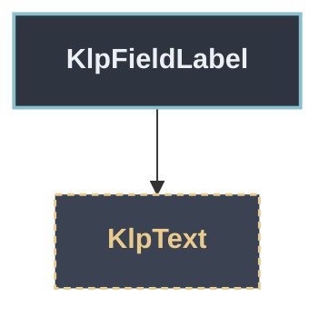

# KlpFieldLabel：元件樹架構

## 範圍

- **核心元件**：`KlpFieldLabel`
- **所屬領域**：`form — 表單`
- **核心職責**：欄位標籤文字，統一使用 [KlpTextRole.caption] 樣式。  [KlpField] 內部就是用它畫標籤——需要在 [KlpField] 版面之外單獨放一個 樣式一致的欄位標籤時（例如自訂版面）才需要直接用它。
- **包含範圍**：`build()` 內部建構的完整 Widget 樹（展開 Flutter 原生元件與純容器）
- **外部引用**：本專案其他非純容器元件（遇引用即停下並鏈結）

## 架構圖

## 外部元件引用

- [`KlpText`](../typography/klp_text.md) — `typography — 文字`

## 程式碼證據

- 檔案路徑：[`lib/src/form/klp_form.dart`](../../../../lib/src/form/klp_form.dart#L251)
- 宣告型態：`StatelessWidget`

## 閱讀說明

- **實線節點**：Flutter 原生元件或本元件自身節點。
- **容器節點（圓角/綠框）**：本專案之純容器元件（如 `KlpSurface` 等），已持續向下展開其子樹。
- **虛線/引號節點（黃框/:::reference）**：本專案其他功能性元件，依規則停止展開並提供文件引用。
- **插槽節點（橘框/:::slot）**：外部傳入之 `child`、`builder` 或內容參數。

