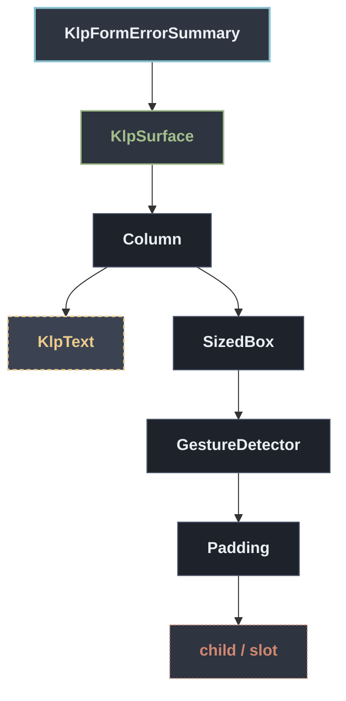

# KlpFormErrorSummary：元件樹架構

## 範圍

- **核心元件**：`KlpFormErrorSummary`
- **所屬領域**：`form — 表單`
- **核心職責**：表單頂部的錯誤總覽卡片，把所有驗證失敗的欄位集中列成清單。  [errors] 的 key 是欄位識別碼、value 是要顯示的錯誤文字；點擊某一項會透過 [onSelected] 回報該欄位的 key，呼叫端通常用它把焦點捲動或移到對應欄位。 不會反查欄位在畫面上的位置——[KlpForm] 之類的容器也不知道每個欄位的 GlobalKey，捲動與聚焦的實作留給呼叫端。
- **包含範圍**：`build()` 內部建構的完整 Widget 樹（展開 Flutter 原生元件與純容器）
- **外部引用**：本專案其他非純容器元件（遇引用即停下並鏈結）

## 架構圖

## 外部元件引用

- [`KlpSurface`](../surface/klp_surface.md) — `surface — 表面與描邊` *(純容器，已繼續向下展開)*
- [`KlpText`](../typography/klp_text.md) — `typography — 文字`

## 程式碼證據

- 檔案路徑：[`lib/src/form/klp_form.dart`](../../../../lib/src/form/klp_form.dart#L311)
- 宣告型態：`StatelessWidget`

## 閱讀說明

- **實線節點**：Flutter 原生元件或本元件自身節點。
- **容器節點（圓角/綠框）**：本專案之純容器元件（如 `KlpSurface` 等），已持續向下展開其子樹。
- **虛線/引號節點（黃框/:::reference）**：本專案其他功能性元件，依規則停止展開並提供文件引用。
- **插槽節點（橘框/:::slot）**：外部傳入之 `child`、`builder` 或內容參數。

