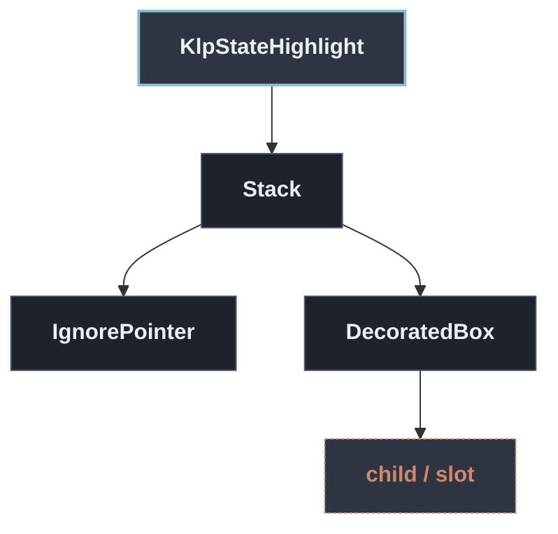

# KlpStateHighlight：元件樹架構

## 範圍

- **核心元件**：`KlpStateHighlight`
- **所屬領域**：`foundation — 圖示、色盤、度量`
- **核心職責**：疊在內容上的狀態高亮。  **hover 與 selected 一律以高亮色表達，不畫邊框。** 先前這兩個狀態在庫裡有兩套 語彙——`KlpPressable` 用高亮、表單與 explorer 用虛線框——同一件事兩種畫法， 消費者無從預期。  高亮以 [Stack] 疊在內容之上而不是換掉內容的底色：後者會逼每個元件自己知道 「我原本的底色是什麼、混上去之後該是什麼」，而那正是元件不該知道的事。
- **包含範圍**：`build()` 內部建構的完整 Widget 樹（展開 Flutter 原生元件與純容器）
- **外部引用**：本專案其他非純容器元件（遇引用即停下並鏈結）

## 架構圖

## 外部元件引用

- （無外部元件引用，皆由 Flutter 原生原語或純容器構成）

## 程式碼證據

- 檔案路徑：[`lib/src/foundation/interaction/klp_state_highlight.dart`](../../../../lib/src/foundation/interaction/klp_state_highlight.dart#L28)
- 宣告型態：`StatelessWidget`

## 閱讀說明

- **實線節點**：Flutter 原生元件或本元件自身節點。
- **容器節點（圓角/綠框）**：本專案之純容器元件（如 `KlpSurface` 等），已持續向下展開其子樹。
- **虛線/引號節點（黃框/:::reference）**：本專案其他功能性元件，依規則停止展開並提供文件引用。
- **插槽節點（橘框/:::slot）**：外部傳入之 `child`、`builder` 或內容參數。
