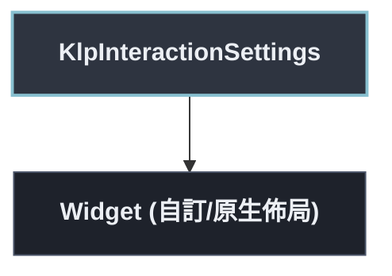

# KlpInteractionSettings：元件樹架構

## 範圍

- **核心元件**：`KlpInteractionSettings`
- **所屬領域**：`interaction — 互動`
- **核心職責**：長按門檻的區域覆寫。  門檻的**預設值來自 theme**（`KlpMotionTheme.longPressThreshold`），這個 InheritedWidget 只負責「某一小塊 UI 要用不一樣的門檻」。原本它自己持有一份 `defaultThreshold` 常數， 與 theme 構成同一條規則的兩份實作——兩份實作必然靜默分岔，改了 theme 卻沒改這裡時 不會有任何錯誤，只是門檻沒變。
- **包含範圍**：`build()` 內部建構的完整 Widget 樹（展開 Flutter 原生元件與純容器）
- **外部引用**：本專案其他非純容器元件（遇引用即停下並鏈結）

## 架構圖

## 外部元件引用

- （無外部元件引用，皆由 Flutter 原生原語或純容器構成）

## 程式碼證據

- 檔案路徑：[`lib/src/interaction/klp_interaction_settings.dart`](../../../../lib/src/interaction/klp_interaction_settings.dart#L11)
- 宣告型態：`StatelessWidget`

## 閱讀說明

- **實線節點**：Flutter 原生元件或本元件自身節點。
- **容器節點（圓角/綠框）**：本專案之純容器元件（如 `KlpSurface` 等），已持續向下展開其子樹。
- **虛線/引號節點（黃框/:::reference）**：本專案其他功能性元件，依規則停止展開並提供文件引用。
- **插槽節點（橘框/:::slot）**：外部傳入之 `child`、`builder` 或內容參數。

