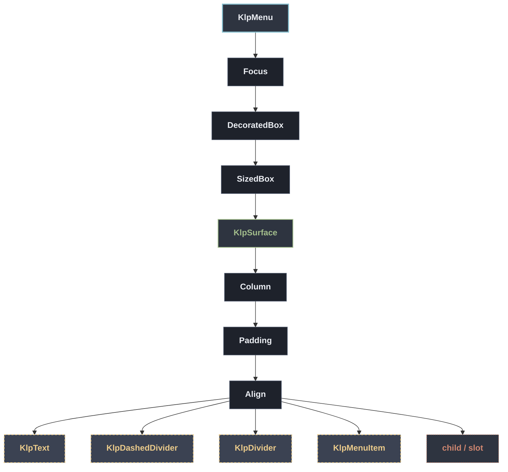

# KlpMenu：元件樹架構

## 範圍

- **核心元件**：`KlpMenu`
- **所屬領域**：`overlay — 浮層`
- **核心職責**：彈出式選單面板：標題列加上一組 [KlpMenuItemData]。  只畫面板本身（含陰影與圓角），不處理定位或觸發——插入 overlay 的位置請用 [KlpMenuLayout] 先算好，選單的顯示／關閉時機也由呼叫端（通常是 `showMenu` 或自訂 overlay）控制。  **鍵盤**：`↓`／`↑` 在項目間移動高亮（跳過 [KlpMenuItemData.enabled] 為 `false` 的項目，並在頭尾之間循環），`Home`／`End` 跳到首／尾一個可用項目， `Enter`／`Space` 觸發目前高亮的項目，`Escape` 呼叫 [onEscape]（通常用來關閉 選單，由呼叫端決定要不要提供）。索引移動的規則沿用 [KlpRovingIndex]，與 [KlpCombobox] 共用同一套實作，不是第二份重寫。  高亮的視覺沿用既有的 hover／focus 語言（[KlpMenuItem] 的 `active` 底色）， 不是新增的第三種視覺；只有 [KlpMenuItemData.selected]（真正的選取狀態）才會 用高對比的選取底色。  選單預設會在第一次 build 時自動取得鍵盤焦點（[autofocus]），因為選單通常是 剛彈出的 overlay，此時畫面上不會有其他東西持有焦點；若呼叫端要自行控制焦點 時機（例如選單嵌在一般版面裡而非彈出層），可以把 [autofocus] 設為 `false`。
- **包含範圍**：`build()` 內部建構的完整 Widget 樹（展開 Flutter 原生元件與純容器）
- **外部引用**：本專案其他非純容器元件（遇引用即停下並鏈結）

## 架構圖

## 外部元件引用

- [`KlpDashedDivider`](../surface/klp_dashed_divider.md) — `surface — 表面與描邊`
- [`KlpDivider`](../surface/klp_divider.md) — `surface — 表面與描邊`
- [`KlpMenuItem`](./klp_menu_item.md) — `overlay — 浮層`
- [`KlpSurface`](../surface/klp_surface.md) — `surface — 表面與描邊` *(純容器，已繼續向下展開)*
- [`KlpText`](../typography/klp_text.md) — `typography — 文字`

## 程式碼證據

- 檔案路徑：[`lib/src/overlay/klp_menu.dart`](../../../../lib/src/overlay/klp_menu.dart#L205)
- 宣告型態：`StatefulWidget`

## 閱讀說明

- **實線節點**：Flutter 原生元件或本元件自身節點。
- **容器節點（圓角/綠框）**：本專案之純容器元件（如 `KlpSurface` 等），已持續向下展開其子樹。
- **虛線/引號節點（黃框/:::reference）**：本專案其他功能性元件，依規則停止展開並提供文件引用。
- **插槽節點（橘框/:::slot）**：外部傳入之 `child`、`builder` 或內容參數。
