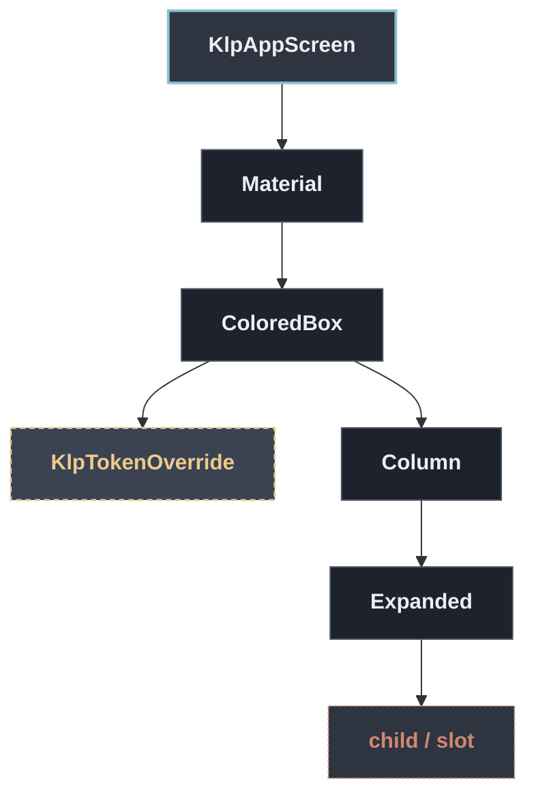

# KlpAppScreen：元件樹架構

## 範圍

- **核心元件**：`KlpAppScreen`
- **所屬領域**：`shell — 應用外殼`
- **核心職責**：應用程式最外層：鋪滿 app 底色，並在頂端保留自訂視窗標題列的位置。  它同時提供整個子樹所需的 `Material` 祖先。少了它，`MaterialApp` 會在每一段文字下方 畫黃色雙底線——那是 Flutter 對「文字沒有 Material 祖先」的除錯提示。**由庫負責提供， 因為消費者沒有理由知道 Kallopis 的哪些元件需要它。**
- **包含範圍**：`build()` 內部建構的完整 Widget 樹（展開 Flutter 原生元件與純容器）
- **外部引用**：本專案其他非純容器元件（遇引用即停下並鏈結）

## 架構圖

## 外部元件引用

- [`KlpTokenOverride`](../theme/klp_token_override.md) — `theme — semantic 與 component token`

## 程式碼證據

- 檔案路徑：[`lib/src/shell/klp_shell_extras.dart`](../../../../lib/src/shell/klp_shell_extras.dart#L15)
- 宣告型態：`StatelessWidget`

## 閱讀說明

- **實線節點**：Flutter 原生元件或本元件自身節點。
- **容器節點（圓角/綠框）**：本專案之純容器元件（如 `KlpSurface` 等），已持續向下展開其子樹。
- **虛線/引號節點（黃框/:::reference）**：本專案其他功能性元件，依規則停止展開並提供文件引用。
- **插槽節點（橘框/:::slot）**：外部傳入之 `child`、`builder` 或內容參數。

