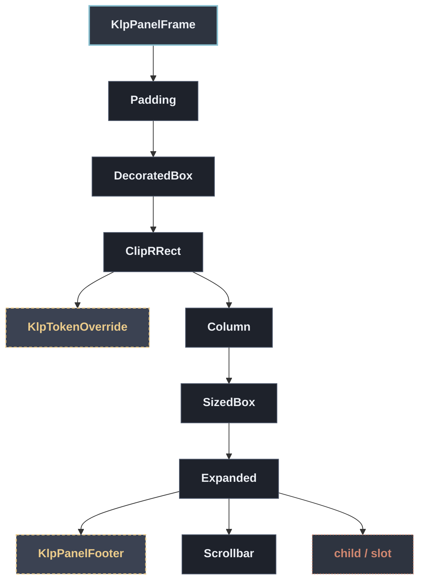

# KlpPanelFrame：元件樹架構

## 範圍

- **核心元件**：`KlpPanelFrame`
- **所屬領域**：`shell — 應用外殼`
- **核心職責**：通用面板：header 與 content，選用 footer。圓角使用較緊湊的 card 語意， 高度預設沿用 theme 的外殼密度。 文字顏色依據背景顏色階梯（500 以下為深色文字，600 以上為淺色文字）渲染。
- **包含範圍**：`build()` 內部建構的完整 Widget 樹（展開 Flutter 原生元件與純容器）
- **外部引用**：本專案其他非純容器元件（遇引用即停下並鏈結）

## 架構圖

## 外部元件引用

- [`KlpPanelFooter`](./klp_panel_footer.md) — `shell — 應用外殼`
- [`KlpTokenOverride`](../theme/klp_token_override.md) — `theme — semantic 與 component token`

## 程式碼證據

- 檔案路徑：[`lib/src/shell/panel/klp_panel_frame.dart`](../../../../lib/src/shell/panel/klp_panel_frame.dart#L10)
- 宣告型態：`StatelessWidget`

## 閱讀說明

- **實線節點**：Flutter 原生元件或本元件自身節點。
- **容器節點（圓角/綠框）**：本專案之純容器元件（如 `KlpSurface` 等），已持續向下展開其子樹。
- **虛線/引號節點（黃框/:::reference）**：本專案其他功能性元件，依規則停止展開並提供文件引用。
- **插槽節點（橘框/:::slot）**：外部傳入之 `child`、`builder` 或內容參數。
