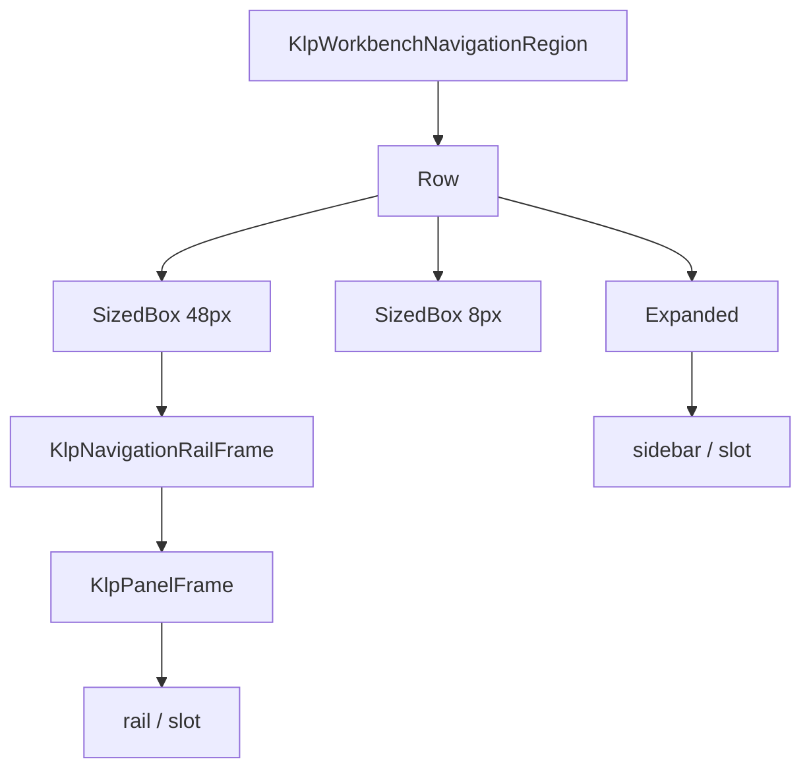

# KlpWorkbenchNavigationRegion：元件樹架構

## 範圍

- **核心元件**：`KlpWorkbenchNavigationRegion`、`KlpNavigationRailFrame`
- **所屬領域**：`shell — 應用外殼`
- **核心職責**：以 8px 間距並排獨立 Rail surface 與 Sidebar surface，讓外層能將兩者共同收合。
- **包含範圍**：`build()` 內部建構的完整 Widget 樹。

## 架構圖

## 程式碼證據

- 檔案路徑：[`lib/src/shell/klp_workbench_navigation_region.dart`](../../../../lib/src/shell/klp_workbench_navigation_region.dart)
- 宣告型態：`StatelessWidget`
