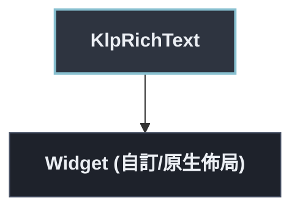

# KlpRichText：元件樹架構

## 範圍

- **核心元件**：`KlpRichText`
- **所屬領域**：`typography — 文字`
- **核心職責**：行內混排文字：連結、mention、粗斜體、行內程式碼可以出現在同一段落裡。  [spans] 與 [nodes] 是兩種不同精細度的輸入，二擇一——給了 [nodes]（非空） 就完全忽略 [spans]；只需要簡單加粗／換色時用 [spans] 即可，不需要為此 組出完整的節點樹。[onOpenLink]／[onOpenMention] 為 null 時，對應的連結與 mention 仍會照樣顯示，只是不可點擊。
- **包含範圍**：`build()` 內部建構的完整 Widget 樹（展開 Flutter 原生元件與純容器）
- **外部引用**：本專案其他非純容器元件（遇引用即停下並鏈結）

## 架構圖

## 外部元件引用

- [`KlpInlineCode`](../foundation/klp_inline_code.md) — `foundation — 圖示、色盤、度量`
- [`KlpText`](./klp_text.md) — `typography — 文字`

## 程式碼證據

- 檔案路徑：[`lib/src/typography/klp_rich_text.dart`](../../../../lib/src/typography/klp_rich_text.dart#L67)
- 宣告型態：`StatelessWidget`

## 閱讀說明

- **實線節點**：Flutter 原生元件或本元件自身節點。
- **容器節點（圓角/綠框）**：本專案之純容器元件（如 `KlpSurface` 等），已持續向下展開其子樹。
- **虛線/引號節點（黃框/:::reference）**：本專案其他功能性元件，依規則停止展開並提供文件引用。
- **插槽節點（橘框/:::slot）**：外部傳入之 `child`、`builder` 或內容參數。

