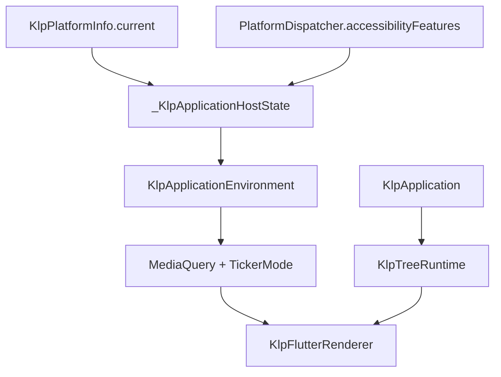

# 受控環境策略

本頁供維護宣告式應用宿主與 renderer 的開發者使用。讀完後應能判斷平台、輔助功能與動態偏好要在哪裡轉接，以及新增功能前哪些情境已有證據、哪些仍不可宣稱支援。

## 目標與資料流

消費端只能提供 `KlpApplication` 的結構、資料與 action；不能指定平台策略、輔助功能模式、動畫 controller 或 `MediaQuery`。`_KlpApplicationHostState` 是唯一把 Flutter 執行環境轉為 Kallopis 策略的地方，資料或環境更新都不重新安裝 runtime。

`KlpPlatformInfo.current` 仍是專案唯一讀取 `defaultTargetPlatform` 的來源。宿主將它轉為不含 Flutter 型別的 `KlpApplicationPlatform`。`KlpApplicationEnvironment`、`KlpAccessibilityPreferences` 與 `KlpMotionPolicy` 沒有公開建構子，且 `KlpApplication` 沒有 `environment` 參數；外部無法替換本庫的環境判定。

## 已接通策略

| 系統輸入 | Kallopis 策略 | 宿主行為 | 證據 |
|---|---|---|---|
| `disableAnimations` | `KlpMotionPolicy.immediate` | 根 `MediaQuery.disableAnimations` 為 true，並以 `TickerMode` 停止 ticker | `klp_application_host_test.dart` 驗證偏好切換與既有選取 state 身分不變 |
| `reduceMotion` | `KlpMotionPolicy.reduced` | 目前保留標準 ticker；後續具轉場能力的 foundation renderer 必須採用縮短、移除位移的單一演算法 | 宿主測試確認偏好切換後 action 與選取結果不變；尚無具轉場 foundation，不能宣稱已完成減少動態的視覺驗收 |
| `accessibleNavigation`、`boldText`、`highContrast` | `KlpAccessibilityPreferences` | 快照由宿主取得，供後續 semantic／style 演算法集中採用 | rail 的鍵盤、焦點與語意標籤已有局部驗證；全域策略尚未完成 |

偏好通知由 `WidgetsBindingObserver.didChangeAccessibilityFeatures` 處理，只呼叫宿主重建。因此已安裝的導覽 entry、資料借用、放置資源及選取 state 不會因系統偏好切換而重設。

## 支援矩陣

| 情境 | 狀態 | 目前邊界 |
|---|---|---|
| Android、iOS、Windows、macOS、Linux、Web 平台分類 | 已接通來源 | 僅分類與策略入口；各平台的元件視覺尚未逐項驗收 |
| 關閉動畫 | 已驗證 | 根 renderer 子樹立即完成；尚無一般轉場元件可驗收取消結果 |
| 減少動態 | 部分接通 | 已辨識系統偏好；尚未有縮短時長／去除位移的 foundation 演算法 |
| 輔助導覽、粗體、高對比 | 部分接通 | 偏好快照已集中，rail 局部語意已驗證；尚未定義全元件的 semantic 與 style 規則 |
| 文字縮放、locale、文字方向 | 未完成宣告式契約 | Flutter `WidgetsApp` 仍提供環境，但尚未轉為 Kallopis 唯一策略或加入 feature 驗收 |
| 視窗尺寸、輸入裝置、資料生命週期組合 | 未完成 | 尚未建立逐列測試與拒絕診斷 |

新增 renderer 或 foundation 動態能力時，應讀取這份策略的結果，不得自行讀取 `PlatformDispatcher`、`MediaQuery` 或建立 animation controller。若需要新的系統偏好，先擴充此文件、`KlpApplicationEnvironment` 與對應負向／生命週期測試，再接入元件。
