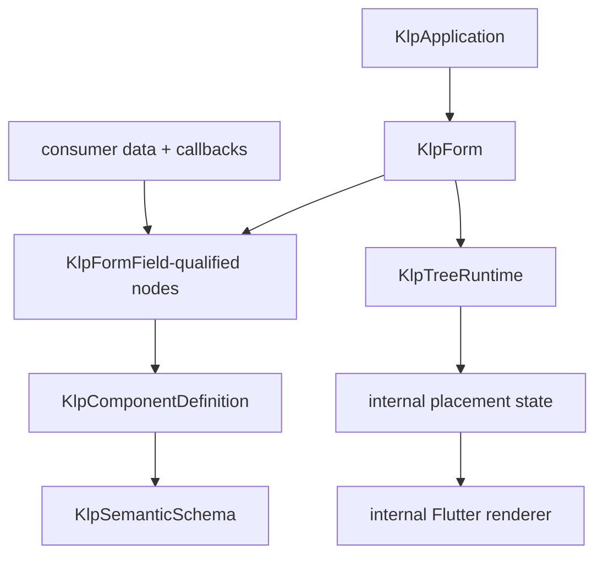

# 受控 Form 樣板

本頁供遷移第一個宣告式表單功能的維護者使用。讀完後應能建立表單的型別資格、資料與資源所有權，不必從 Flutter `Form`、`TextField` 或既有產品畫面推導新的公開 API。

本文件只固定非視覺架構。欄位幾何、欄間距、錯誤呈現與正式預設外觀尚未經使用者確認，因此不得據此直接實作 renderer 或 golden。

## 目標

Form 是可被任一產品使用的功能組合，不持有產品資料模型或保存流程。消費端組合受控 field 宣告，提供唯讀資料與 action；Kallopis 安裝欄位放置、焦點、驗證狀態與 controller，並在移除時釋放自建資源。

## 組裝與資格

| 角色 | 對外責任 | 禁止事項 |
|---|---|---|
| `KlpForm` | 唯一表單容器；只接受 `KlpFormField` 資格 | `List<Widget>`、layout builder、局部 style、手動 provider |
| `KlpFormField` | 欄位資料、可存取名稱、驗證描述與 action 資料 | 回傳 Widget、讀取 BuildContext、持有 renderer |
| 多資格欄位 | 可同時實作 `KlpFormField` 與既有 `KlpRailItem` 等資格 | 以 runtime 型別分支取得特殊呈現 |
| `KlpComponentDefinition` | 定義期選擇受控 template 與 semantic schema | 在欄位實例接受 style 或 template override |

每個欄位的位置必須使用 runtime 提供的 `KlpPlacementId`。同一欄位資料可放入不同 form，但焦點、驗證與動態狀態不可共用。

## 所有權與事件

| 資源或資料 | 權威 | 生命週期 |
|---|---|---|
| 業務值、儲存、遠端驗證 | 消費端 | Kallopis 只借用，不釋放 |
| 值變動與提交 action | 消費端注入的 `KlpAction`／callback 資料 | 只由目前有效 placement 派送 |
| 欄位焦點、觸碰、顯示中的驗證狀態 | Kallopis placement | 安裝時建立，更新不重建，移除時釋放 |
| controller | Kallopis 預設接線 | 單一附接；外部不能以第二條 mount 路徑取代 |
| 欄位視覺語意 | Kallopis definition semantic schema | 由 primitive 全套與 semantic resolver 求值，欄位實例不指定 style |

欄位 action 必須沿用既有 `KlpAction` 派送規則。提交、取消或導覽失敗時不得先改寫消費端資料；任何非同步驗證結果必須以 generation／placement 失效規則拒絕晚到結果。

## 預計驗收

1. 外部正向 fixture 可實作 `KlpFormField` 並放入 form；普通 `KlpNode` 與 `Widget` 均在編譯期拒絕。
2. 表單更新保留仍存在欄位的焦點、內建驗證 state 與 controller；移除欄位釋放自建資源。
3. 同一外部資料來源可由兩個 form 借用；移除任一 form 不 dispose 資料來源。
4. 非同步驗證的舊結果、取消後結果及移除後結果均不可覆寫新 placement。
5. 自訂欄位只能在 definition 提供 semantic schema；實例的 `style`、Widget builder 與 raw controller injection 均由外部編譯負例拒絕。
6. 必要可存取名稱缺失於安裝前以 placement path 拒絕；系統關閉／減少動態不改變提交資料與 action 結果。

## 尚待確認的呈現規格

實作 Flutter renderer 前，仍需由使用者確認：第一版包含的欄位種類、容器排列、欄位標籤與錯誤的關係、窄螢幕策略、鍵盤焦點順序，以及 validation 的觸發時機。這些是 layout／體驗決策，不可由舊 `lib/src/features/forms/` 元件或既有 token 名稱推導。
