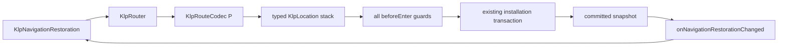

# 受控導覽還原

狀態：已接入宣告式 Router 的中立堆疊還原；瀏覽器網址與各平台持久化 adapter 尚未實作。

消費端只提供兩種資料邊界：每個 `KlpDestination<P, R>` 的 `KlpRouteCodec
`，以及先前保存的 `KlpNavigationRestoration`。codec 將 P 轉成 `Map<String, String>`，再從相同資料還原 P；它沒有 `BuildContext`、Widget、網址或平台權限。

`KlpRouter` 以 router id、已註冊 destination identity 及 codec 驗證整個 stack。任何 destination 缺失、router 不符、codec 無法解碼或解碼結果不符合 P，都會拒絕啟動，不能用同名目的地或未驗證資料冒充既有位置。還原 stack 內每個 entry 都執行 `beforeEnter`，全部成功後才走既有單一 runtime 安裝交易。

`KlpApplication.onNavigationRestorationChanged` 是選用 callback。設定它時，Router 的所有 route 必須有 codec，避免使用者走到尚不能保存的目的地後才收到部分或錯誤的資料。callback 例外會以 application 的既有非同步錯誤途徑回報，不能回滾已提交的畫面。

`KlpNavigationRestoration` 是中立資料格式，故可由產品的 repository 保存或由 platform adapter 映射為 URL／平台還原資料。Kallopis 不取得 persistence 權威，也不暴露 Flutter `Router`、`NavigatorState` 或手動導覽控制器。

`KlpRouteUri` 定義唯一的單一進入點格式：`/{routerId}/{destinationId}?{parameter=value}`。它只表達平台新送入的一頁，故宿主收到有效 URI 時會建立一份單頁 restoration，透過 Router 的同一筆交易替換目前 stack。若 URI 的 path、重複 query key、fragment、scheme 或 host 不符合格式，Kallopis 交還平台處理，不猜測產品意圖。

替換前會先跑目前頁的 `beforeLeave` 與候選 stack 每一頁的 `beforeEnter`；其中任一拒絕或失敗都保留已提交畫面。成功後才更新資料與畫面，原 stack 中由 `navigate` 建立、尚在等待結果的 ticket 會收到 `KlpNavigationCancelled('restored')`。這使網址進入不會留下永不完成的 callback 或 future。

所有已註冊 destination 都有 codec 時，宿主會在每次已提交導覽後以 `SystemNavigator.routeInformationUpdated` 回報目前頁 URI。一般導覽以新 history entry 回報；平台 URI 進入以 `replace: true` 回報，避免 browser 返回事件重複新增 history。這是 Kallopis 的宿主實作，消費端不接收 Flutter callback 或 controller。

本庫自行回報時使用 `/{routerId}?__klp_stack=<base64url-json>` 保存完整 stack；每個 entry 的 destination 與 string parameters 都在 payload 中。既有 `/{routerId}/{destinationId}?key=value` 保留作為外部單頁 deep link。完整 payload 只接受版本 1、單一保留 query key、合法非空 stack 與全部字串參數；格式錯誤交還平台，不會建立部分 stack 或跳過 Router codec／guard。

## 驗收

- 還原的多層 stack 直接顯示頂層 retained page，返回後保留並顯示前一頁。
- 初次安裝與每次提交都透過 callback 發出完整 immutable stack。
- router id 不符及任何 restored entry 的 enter guard 拒絕時，不安裝畫面、不發布還原資料。
- route mapper 仍只取得 `KlpRouteInput`，並透過 action 建立導覽要求。

app lifecycle 的實際儲存時機、實際瀏覽器／原生平台 history 行為、完整多頁 stack 的 URL 表示與跨版本遷移策略仍需以對應平台測試驗收。
