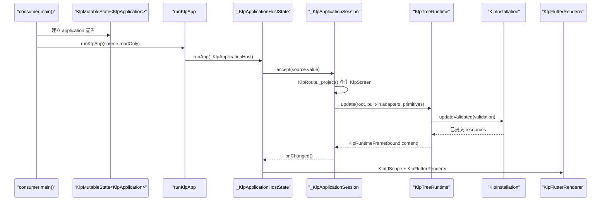
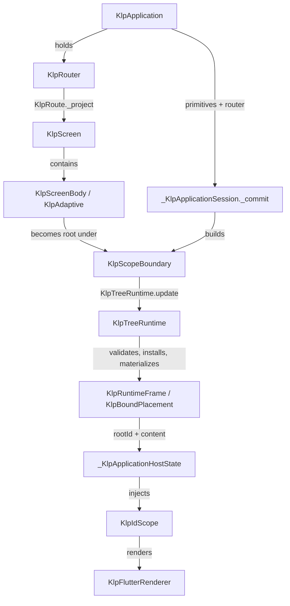

# 宣告式消費端預設架構：`main()` 到 `KlpApplication`

## 目標

這份文件說明新宣告式消費端在啟動時應宣告什麼，以及資料如何由 `main()` 經 Kallopis runtime 變成 Flutter Widget 樹。讀者完成後應能分辨：消費端負責資料／結構／行為宣告；Kallopis 負責註冊、驗證、資源生命週期、環境與封閉 Flutter 呈現。

本文件的「KlpApp」一詞指新宣告式根 `KlpApplication`，不是舊相容路徑的 `KlpApp` Widget。

## 範圍

- 納入：consumer `main()`、`KlpApplication`、路由投影、runtime 提交、Flutter host 與 `KlpIdScope`。
- 不納入：舊 Widget API、個別 feature 的內容結構、Krepis／產品資料的權威與持久化。

## 啟動呼叫鏈



來源更新時，`_KlpApplicationSession` 會再次提交同一條受控流程；consumer 只更新 `KlpState<KlpApplication>`，不直接操作 renderer、resource 或 Flutter `BuildContext`。

## 兩棵樹與責任邊界



### 1. Consumer 宣告樹

`main()` 建立以下資料：

- `KlpDestination` 與 `KlpRouter`：唯一導覽入口；每個 `KlpRoute` 以 `KlpRouteInput` 產生 `KlpScreen`。
- `KlpApplication`：持有 `title`、完整 `KlpPrimitiveSet` 與 router；完整 component catalog 由 Kallopis 組合根擁有。
- `KlpMutableState<KlpApplication>`：將整份 application 宣告交給 `runKlpApp`；後續更新也走同一來源。

產品組裝只建立受控的 Klp node。它不建立 Flutter Widget、不傳遞 `BuildContext`，也不直接建立 runtime 資源。

### 2. Kallopis 提交與 render 樹

`_KlpApplicationSession._commit()` 為目前保留的 route entries 建立 `KlpScopeBoundary` 與 `KlpRetainedScreens`，再把根節點交給 `KlpTreeRuntime.update()`。runtime 依序：完整驗證 registry 與樹、準備 semantic style、以 `KlpInstallation` 原子安裝資源，最後生成不可回指 consumer 結構的 `KlpRuntimeFrame`。

`_KlpApplicationHostState` 讀取已提交 frame，以 `frame.rootId` 注入 root `KlpIdScope`，再建立唯一的 `KlpFlutterRenderer`。renderer 在 `KlpBoundPlacement` 與 `KlpBoundAdaptive` 邊界繼續包覆 `KlpIdScope`；Widget 子樹因此可使用 `context.klpId`，而不需 consumer 層層傳遞 scope。

## 消費端最小骨架

```dart
void main() {
	final root = KlpId.root('app');
	final router = KlpIdScope.run(root, () {
		final destination = KlpDestination<Object?, Object?>(KlpId.leaf('workspace'));
		return KlpRouter(
			id: KlpId.leaf('router'),
			initial: destination.location(null),
			routes: [
				KlpRoute(destination, screen: (input) => buildScreen(input)),
			],
		);
	});
	final application = KlpApplication(
		title: 'App',
		primitives: KlpWorkspacePreset.dark(),
		router: router,
	);
	final source = KlpMutableState(application);
	runKlpApp(source.readOnly);
}
```

範例中的 `KlpIdScope.run(root, ...)` 令 `workspace` 與 `router` 分別成為 `app.workspace`、`app.router`。`KlpId.leaf(...)` 未處於該 Zone 時，才會建立根 ID。

## 證據

- `D:/Projects/planist/frontend/lib/main.dart:6`：目前 Planist consumer 的 root 宣告與 `runKlpApp` 呼叫。
- `lib/src/application/bootstrap/run_klp_app.dart:4`：公開啟動函式只接受 `KlpState<KlpApplication>`。
- `lib/src/application/bootstrap/internal/klp_application_session_commit.dart:31`：route screen 投影、`KlpScopeBoundary` 建立與 runtime update。
- `lib/src/runtime/compilation/klp_tree_runtime.dart:37`：驗證、準備、安裝與 frame materialization 的唯一更新流程。
- `lib/src/application/bootstrap/internal/klp_application_host_state.dart:166`：host 注入 root `KlpIdScope`。
- `lib/src/rendering/flutter/klp_flutter_renderer.dart:37`：placement 與 adaptive renderer scope 邊界。

## 關鍵取捨

- 不讓 consumer 回傳 Widget：避免 consumer 自行繞過 primitive、semantic style、資源交易與 scope 傳遞。
- 不讓 consumer 建立 `KlpFlutterRenderer`：render tree 只接收 runtime 已提交的 bound content，避免 render 過程再次讀 consumer 結構。
- 不用可變全域 scope：宣告期以 Dart Zone 限縮生命週期；渲染期以 `InheritedWidget` 跟隨 Flutter ancestor，兩者都不成為 theme、environment 或 l10n 的第二來源。
