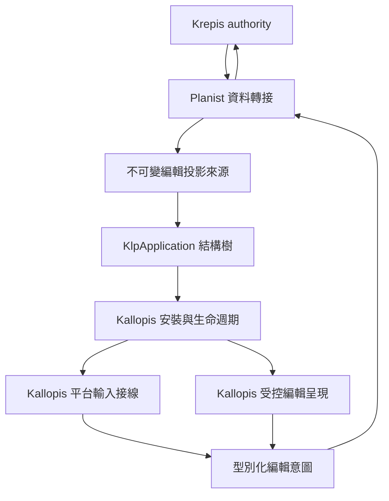
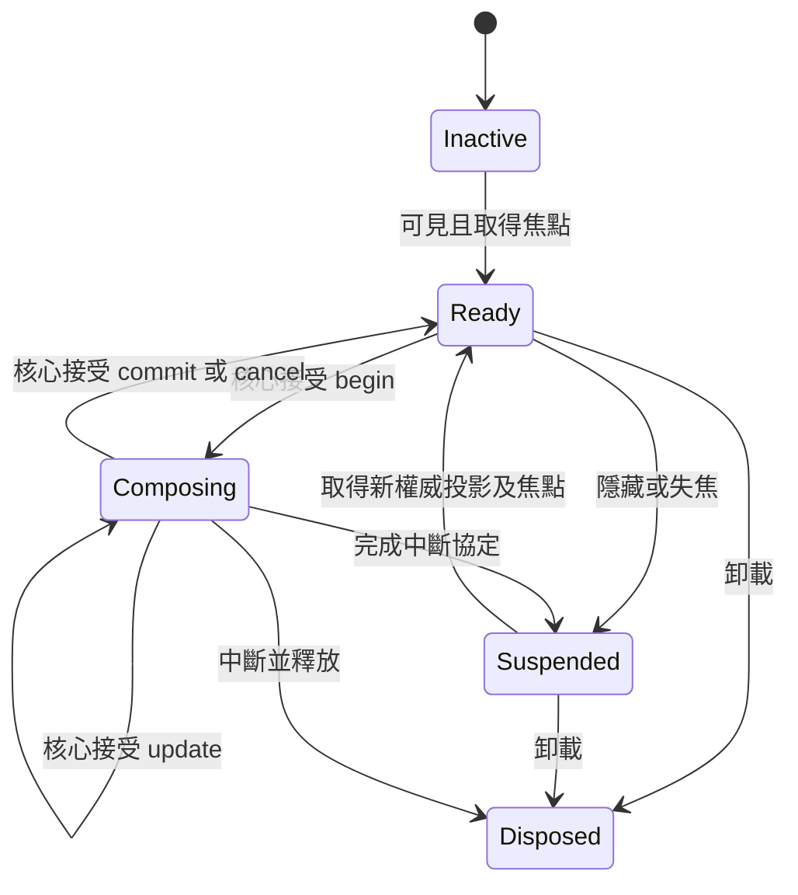
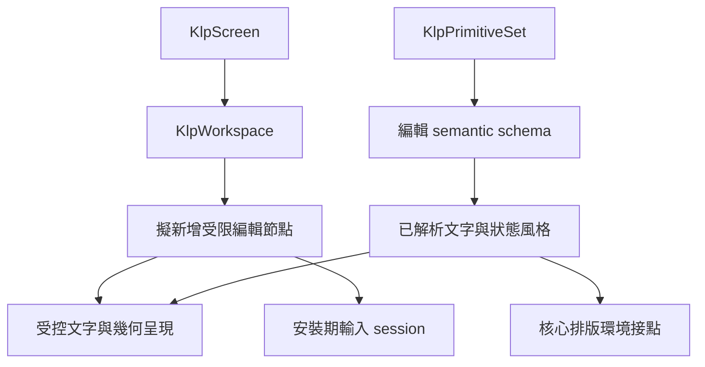

# K01：受控編輯呈現與輸入契約

日期：2026-09-11。狀態：公開實驗性 provider、呈現、來源訂閱、尺寸／風格重排及 Flutter 增量輸入接線已落盤；本批目標測試含架構邊界 178 項通過。ABI 1.24 已補核心跨行組字幾何，原生／真實 DLL 驗證與 Windows build 通過；完整平台與筆記操作尚未驗收。讀者為 Kallopis 實作者與 Planist／Krepis 接線者。完整交付追蹤見 [筆記元件總計畫](note-components-plan.md)；本文件不宣稱所有產品操作已定案。

## 目標與動機

讓 Planist 在唯一宣告式樹注入編輯資料來源與型別化操作接點，由 Kallopis 安裝編輯呈現、Windows 輸入連線與焦點資源。Krepis 仍持有文字、選取、組字、排版與交易權威。先解決輸入一致性，才能串接 K02 拖曳、K03 選單及 K05 手寫。

## 範圍

納入 Windows 鍵盤／滑鼠文字輸入、繁中組字、游標與文字選取投影、捲動、唯讀、失焦、隱藏與卸載；手繪板在 K01 僅參與輸入互斥，不在此實作筆跡。

不納入 Markdown 政策、區塊種類、手寫持久化、跨頁交易、節點连線；不新增正式視覺尺寸、不提供 Flutter Widget 或繪製 callback。K02–K10 在本文件只列依賴。

## 方案與責任

### 提供者接點補查（2026-09-11）

最新正式標頭、DLL 匯出及分支對照見 [核心提供者接入對照](krepis-editor-provider-mapping.md)。目前已驗證的核心基線為 `D:/Projects/Krepis-m0-checked-save` 的 ABI 1.24，沿用 stable selection、checked replace 與 checked-save。獨立提供者已有讀取、修改及同次 projection／drawing 發布；Flutter 尺寸、風格、輸入及核心跨行組字幾何亦已加入。完整字型支援、RTL 組字幾何與平台實機驗收仍未完成。

已查證 [Notist FFI](D:/Projects/Notist/lib/src/krepis/krepis_native.dart) 確實 lookup `krepis_editor_begin_composition`、`krepis_editor_update_composition`、`krepis_editor_commit_composition`、`krepis_editor_cancel_composition`。這次只證明 Dart 宣告可定位相應符號名稱；尚未執行 DLL，不能宣稱本機二進位已相容。

[穩定選取投影](D:/Projects/Notist/lib/src/krepis/krepis_editing.dart) 的端點使用 blockId、graphemeBoundary 與 affinity。它不是 UTF-8 byte offset；必須經核心文字位置查詢映射，禁止只把整數欄位改名。[顯示資料](D:/Projects/Notist/lib/src/krepis/krepis_display.dart) 的 frame 只有 token 與 commands，glyph run 帶 fontId／fontSize／color。不能從這些值推導完整 content／composition／layout／environment 一致性，也不能直接允許產品以 color 指定元件風格。

目前 [內部輸入視窗](../../lib/src/capabilities/editing/internal/klp_editing_text_window.dart) 接受不可變文字、相對 UTF-8 選取／組字範圍及完整 [投影識別](../../lib/src/capabilities/editing/internal/klp_editing_stamp.dart)。轉換來源座標前要求完整識別相同；組字中的来源座標只屬於該版本的預覽文字，不能直接當作已提交文件位置。這些資料已由 `lib/kallopis_editing_provider.dart` 實驗入口公開，平台安裝尚未完成。

下圖為擬議接線；模組名稱表示責任，並非已存在的新 API。



| 責任 | 唯一持有者 | 其他層可以做的事 |
|---|---|---|
| 文字、選取、組字、撤銷、交易 | Krepis | Kallopis 保存帶版本的協定鏡像與待確認事件，不能獨立提交文件。 |
| 文字 shaping、斷行、命中 | Krepis | Kallopis 提供已解析排版環境，消費核心投影；不得用 TextPainter 再建第二份編輯布局。 |
| 顏色、字體、間距、選取／游標樣式 | Kallopis | Planist 提供語意角色；元件實例不能指定外觀。 |
| 頁面、Markdown、模式切換要求 | Planist | Kallopis 執行固定互斥及生命週期機制，不從按鍵自行推定產品交易。 |
| 輸入連線、焦點、游標閃爍、捲動暫態 | Kallopis 安裝 session | Planist 可提出導覽意圖；捲動位置持久化另議。 |

核心排版與本庫風格必須雙向接線：本庫解析字體／寬度／文字縮放並產生環境識別，轉接者交核心排版，再回傳帶同一識別的投影。不能讓核心另用預設字體而本庫套 Noto Sans TC，造成文字與命中位置不一致。顏色用受限語意角色解析；不接受 consumer 任意畫布指令或帶任意顏色的 display list。

## 資料與事件格式草案

以下區分已公開 provider 資料與後續輸入範圍；正式提供者 API 以 `lib/kallopis_editing_provider.dart` 為準，不將尚未存在的導航／剪貼簿／指標意圖當作可用 API。

2026-09-11：內部 `KlpEditingProjection` 已將完整 stable anchor／focus、affinity、blockSelection 與 optional 單段 window 分開。`KlpEditingReply` 與 `KlpEditingSubmission` 改以此投影傳遞；跨區塊或區塊選取可保留方向並發布沒有 window 的結果，單段輸入命令在此狀態明確拒絕。回到單段投影可經權威重新同步。端點使用核心字素位置，不從 byte 位移推算。

投影建構會驗證 window 與主 stamp 相同、屬於同一文字區塊且非 block mode；相同 projectionRevision 不得改變端點、模式或 window。提交閘門亦拒絕內容、組字或排版版本倒退。此變更没有取得核心選取權威。其後已補中立 drawing 與內部 Flutter painter；跨區塊修改、手勢與平台安裝仍需獨立完成。

| 資料 | 必要欄位與限制 |
|---|---|
| 投影封包 | 文件／頁面身分、session 世代、單調 projectionRevision、contentRevision、compositionRevision、layoutRevision、environmentId；文字／選取／繪製／命中必須同封包發布。 |
| 輸入文字視窗 | 穩定區塊身分、文字、此視窗的邏輯來源範圍、anchor／focus、composing 範圍；首版不把整份長文件複製進平台輸入緩衝。跨區塊範圍由核心意圖處理。 |
| 位移 | 平台邊界為 UTF-16 code unit；中立編輯接點為明確 UTF-8 byte 範圍；只由本庫單一轉換器以相同版本文字換算，禁止拆開 surrogate pair 或 UTF-8 code point。字素移動與刪除由核心決定。 |
| 幾何 | 文件邏輯座標、viewport 邏輯座標、轉換識別、可見範圍、游標／選取／文字呈現；繪製與命中共用變換。DPI 轉換只在平台邊界。 |
| 意圖封套 | session 世代、事件序號、所依據 projectionRevision、文件／頁面身分、型別化 payload。提交接點必須回報 accepted／rejected／cancelled，並帶權威投影或可取得的新投影識別。 |
| 輸入意圖 | replaceText、setSelection、compositionBegin／Update／Commit／Cancel、navigation／deletion／clipboard／undo／redo；每類明確定義範圍與前置狀態，不能暴露任意命令字串。 |
| 指標意圖 | pointerId、裝置類別、phase、按鍵／修飾鍵、時間、位置、transformId；命中位置交核心，不由 consumer 自行以像素猜字元。 |

一次只允許一個修改權威的意圖等待確認；後續平台事件依序留在有界的輸入 session，確認後以最新鏡像處理。上限與背壓須在實作切片明定；不可默默丟棄文字、無界排隊或把逾時視為成功。事件去重以世代＋序號判定；不能只用 contentRevision，因游標與組字更新可能不提交文件。

目前已實作內部 `KlpEditingSubmission` 提交閘門：同時一筆 pending，同一請求物件重送回傳原 Future，只保留最後一筆結果；較舊序號或冒用相同序號的新物件拒絕提交。busy 明確拒絕，尚未有平台佇列，不能宣稱完整輸入背壓已完成。一般替換與選取先驗證同一投影的字碼邊界；組字期間拒絕這兩種一般操作，等待獨立組字協定。非同步未知錯誤要求權威重新同步，不能自動重試造成雙提交。close 只停止新提交與本地投影更新，不宣稱取消已開始的核心交易。這些機制尚未安裝到公開編輯器。

## 組字與生命週期

### Flutter delta 正規化

2026-09-11：`lib/src/rendering/flutter/internal/klp_flutter_text_delta.dart` 接受目前文字視窗及 Flutter 的 insertion／deletion／replacement／non-text delta，沿用 `KlpTextOffsets` 將 UTF-16 邊界轉為視窗局部 UTF-8。replacement 範圍相對更新前文字，選取與組字範圍相對平台要求的更新後文字；不加上 sourceStartUtf8，也不當成 committed 字素。

結果保留 `before` 與其 stamp、optional replacement、要求文字及雙端／組字範圍，不建構新的權威投影。oldText 不符會拒絕；但 oldText 相同不證明 session／版本相同，後續 host 仍須帶收到事件時的 session 與投影識別進提交閘門。未知 delta 類型、孤立 surrogate、切開字碼的範圍、半缺端點與逆序組字均拒絕。沒有選取以兩端 -1 表示；空組字仍保留 0–0 等合法範圍。

正規化層本身不提交核心。後續 `KlpFlutterTextPlan` 與 `KlpFlutterTextInputSession` 已接上本庫提交閘門，見下節；DeltaTextInputClient 尚未安裝。組字範圍消失只保留為平台資訊，不據此選擇 commit／cancel。正規化測試為純資料轉換，沒有變更或定型 UI。

### 平台事件至權威提交

`KlpFlutterTextPlan` 使用正規化 delta 建立封閉意圖序列：一般替換、原子指定範圍 begin、update，或有明確 `KlpCompositionResolution` 的 commit／cancel。沒有終止判定時拒絕建立結束計畫，不替使用者選擇失焦策略。組字開始／更新以相同前後文核對替換範圍；變更組字外文字不能偷偷擴大核心組字交易。最終候選字不同時先 update 再 commit；cancel 後核對核心還原文字。

`KlpFlutterTextInputSession` 獨占一個 submission 與操作序號來源。plan 必須引用此 session 當前發布的 window 物件，不能只靠 oldText 相等跨世代重用。單一平台事件逐步等待權威回覆，核對文字、區塊、來源範圍與組字狀態後才继续；一般文字操作後可依新 stamp 更新最後選取。組字中間回覆的範圍與相對選取不符也停止，不接著提交。

結果保留不可修改的逐步 replies、目前權威投影、是否與平台要求同步及未知錯誤。後續選取失敗不抹去已接受的替換，不宣稱整串操作原子回復；失敗或拒絕後要求重新同步，沒有自動重送。busy 拒絕第二個平台事件；close 保留晚到結果但不更新已關閉投影、不送後續步驟。平台批次佇列／背壓及實際連線仍待安裝，本接線測試使用可控權威回覆，不代表 Krepis FFI 或 Windows IME 整合已完成。

驗證：`flutter analyze` → `No issues found!`；平台 session、delta、projection、submission、composition 與前端架構邊界六份測試 → `182: All tests passed!`，exit code 0。涵蓋新 stamp 的後續選取、部分成功保留、重入／關閉、原子 begin、最後候選更新後明確 commit、cancel 還原與組字中間回覆不符時停止。

組字分段已加入資料模型：rawInput／converted／targetConverted／inputError 對應核心語意，沒有顏色參數。封包複製並凍結分段集合，拒絕重疊、逆序與非 UTF-8 邊界；沿用核心允許空範圍及未標註間隙的規則。原生提供者已映射分段 enum；平台分段擷取與各分段的實際提示呈現尚未接入。

本切片驗證：`flutter analyze` → `No issues found!`；組字分段、組字提交、一般提交、文字視窗、Unicode 位移及前端架構邊界六份測試 → `177: All tests passed!`，均 exit code 0。此證據限於純資料與現有架構檢查，不表示原生 IME 或畫面驗收完成。

內部協定續作：已新增組字 begin／update／commit／cancel 的封閉意圖與前置狀態驗證。組字範圍允許空範圍；兩端為 null 才表示沒有組字，不能以空字串判定提交。accepted begin／update 必須仍有組字投影且不提交內容；accepted commit／cancel 必須結束組字，cancel 不得增加內容版本。一般替換與選取不可代替組字操作。這是提交端協定檢查，平台事件正規化與提供者 FFI 讀寫其後已完成；正式平台連線與實際 IME 尚未完成。失焦策略已由使用者確認為取消未提交組字。



1. 組字期間 Enter／Esc／斜線不得同時觸發產品操作。以平台文字協定結果與核心確認判定完成，不把 composing 範圍消失直接等同提交；需驗證最終文字有無額外替換。
2. 提交與取消各最多一次；取消不修改已提交內容。平台重送、文字更新與 performAction 重疊，不得插入兩次換行。
3. 捲動只更新 viewport 與候選字窗定位，不終止組字。候選字窗使用同一 transform 的游標矩形。
4. 2026-09-11 使用者已確認：失焦／切頁／切模式取消尚未確認的組字，保留已提交內容。若已存在在途操作，先辨明核心接受結果，再取消仍有效的組字；不重送未知結果。卸載的資源釋放沿用同一世代隔離，但不能擴大成丟棄已提交內容。
5. 中斷先封鎖新輸入、通知權威終止 session、關閉平台連線，再釋放資源。晚到結果不得作用於新頁；原 session 的取消仍需有獨立完成或失敗紀錄，不能因 widget disposed 而省略。
6. 外部資料更新只接受同世代較新的完整投影。失配時停止依賴舊位移的操作，取得新投影；組字能否 rebase 由核心決定，不由視覺層猜測。
7. readonly、hidden、disposed 不接受修改；唯讀仍允許可用的選取／複製。錯誤保留最後一致投影並顯示真實狀態，編輯 accepted 不代表保存成功。

## 結構與風格繼承

目前編輯表面的三種 Mermaid 鏈、屬性權限及可用 semantic 鍵統一見 [編輯表面設計知識](../../.agents/skills/kallopis-design-contract/references/design-knowledge/editor-surface.md)。下圖只保留工程接線摘要；內部 `KlpBoundEditing`／`KlpFlutterEditingPainter` 已實作，唯讀功能節點與四色繫結已落盤；完整排版風格及平台輸入仍待完成。



```text
實例：身分 + 編輯來源 + 型別化操作接點 + 合格子項
定義：semantic 參照 + 本庫受控 foundation 能力
安裝：依 placement 建立／重用 session，頁面隱藏停止輸入，卸載釋放
幾何：核心排版投影；樣式：Kallopis 解析；產品：資料與操作政策
```

首版編輯節點應實作 Workspace 內容資格；工具列、區塊裝飾與選單需各自受限 slot。不得先開放任意 Widget child 再等後續封閉。尚未確認的視覺尺寸不在本文件補值。

## 分步實作清單

下表是工程切片；資料契約與內部 painter 已存在，其餘具體新增檔名尚屬規劃。每步先核對現行架構，避免建立第二個同責任模組。

只讀安裝續作：`KlpEditingSource` 已公開目前 drawing 與非同步 broadcast；`KrepisKallopisSession` 已實作此来源。`KlpEditingContent`／`KlpEditingAdapter`／`KlpEditingPlacement` 與 `KlpFlutterEditing` 已落盤並由新入口匯出及預設 adapter 註冊，借用來源、監看同世代單調投影並在卸載取消訂閱。這補足步驟 3、5 的唯讀機制，不等於步驟 4 的輸入／焦點／IME 安裝；測試驗收由整合紀錄補入。

中斷協定續作：內部 `KlpFlutterTextInputSession.interrupt()` 立即封鎖新平台事件，等待已在途命令確認，再只取消權威仍標示的組字；同次中斷重用同一 Future。若在途是最後候選更新，停止其後 commit 並取消預覽；已被核心接受的 commit 保留。未知結果先要求 `resynchronize`，不自動重送；中斷成功後由 `resume()` 明確重新啟用。一般 `close()` 仍是強制關閉，不可替代正常的 `await interrupt()` → 平台斷線 → close 流程。Focus／切頁／模式與平台連線的實際呼叫點仍待接入。

獨立驗證：中斷／既有平台 session 與架構邊界合跑 `168: All tests passed!`；`flutter analyze` → `No issues found!`，均 exit code 0。涵蓋在途候選改為取消、保留已接受提交、重複中斷、未知結果同步與拒絕不重送；未跑 UI／golden，不表示 Focus／Windows IME 已驗收。

平台接線續作：`KlpEditingLayoutSource` 與 `KlpEditableSource` 分離，唯讀內容也可接收本庫解析的排版風格；`KlpFlutterEditing` 已持有 DeltaTextInputClient、焦點、連線與中斷流程。批次 delta 逐筆等待新權威投影，來源切換中斷失敗時不接上新連線；正常退出先等待 owner 中斷，再釋放 engine。幾何隨 retained layer 的實際組合位置更新，caret 與 composing 範圍各自傳遞。

本批驗證：`flutter analyze` → `No issues found!`；目標測試與 `frontend_architecture_boundary_test.dart` 合跑 `+178: All tests passed!`，均 exit code 0。真實 DLL owner 檢查包含重排、不支援度量拒絕後仍可繼續使用、點擊定位、單一 host 與等待關閉。獨立回讀確認上述 Flutter 生命週期修正；仍發現 ABI 1.23 缺少跨行組字範圍幾何，不得以單列底線或 caret 近似宣稱 IME 幾何完成。此缺口正由核心接點補足，Windows 實機驗收仍未完成。

| 步驟 | 預定修改範圍 | 完成證據 |
|---|---|---|
| 1. 核心轉接對照 | 本文件補完 provider mapping；Krepis `bindings/kallopis` 讀寫與同次發布 | 原生 API、FFI 可達性、穩定身分、版本與排版環境逐項對照，不把 C++ 存在視為 Dart 已可呼叫。 |
| 2. 純資料契約 | `lib/src/capabilities/editing/`；`test/` | 位移、版本、狀態機、去重、背壓、取消純邏輯測試；契約不得含 Flutter 型別。 |
| 3. 受控呈現 | `lib/src/foundation/`；`lib/src/rendering/flutter/internal/` | 封閉幾何／文字投影及 semantic 解析；環境不一致時拒絕混幀。 |
| 4. 安裝與 Windows adapter | `lib/src/runtime/installation/`；`lib/src/rendering/flutter/internal/` | 輸入連線與焦點資源單一擁有者；確認中斷政策後驗證隱藏／卸載。 |
| 5. 編輯功能節點 | `lib/src/features/editing/`；`lib/kallopis_declarative.dart` | 合格 slot、definition 與受控資源接線，不以 feature 名稱在 runtime 加特判。 |
| 6. Consumer 指南及 Catalog | `docs/ai/editor.md`、`docs/ai/README.md`、`example/lib/catalog_declarative/` | 新入口可組裝範例、限制、錯誤與 Windows 手動驗收紀錄；驗收後才標為可用。 |

凍結區：不修改既有 Router／Workspace 視覺、不回退 Overlay 修正、不擴大舊新混用、Krepis 缺口依使用者授權在其權威層補足，不複製交易到 Kallopis、不擅改 Planist 頁面政策。

## 驗收條件

| 檢查者／方式 | 通過条件 |
|---|---|
| 實作者，純資料測試 | 中英混合、emoji、組合字的合法 UTF-16／UTF-8 邊界可往返；非法邊界明確拒絕，不能截斷或猜值。 |
| 實作者，協定測試 | 同序號重送只提交一次；舊世代／舊投影意圖不得修改新頁；權威拒絕後平台鏡像回到一致投影。 |
| 實作者，狀態機測試 | begin→多次 update→commit 只提交一次；cancel 不變更已提交文字；readonly／hidden／disposed 拒絕修改。 |
| 實作者，排版資料檢查 | 文字、選取與游標的 environmentId／layoutRevision 一致；縮放或字型更新時不混用旧命中幾何。 |
| 使用者與實作者，Windows 實機 | 記錄 Windows／IME 版本；繁中選字、Enter、Esc、換行、貼上、撤銷、滑鼠選字、捲動時候選字窗均正確，且不誤開選單／切頁。 |
| 使用者與實作者，生命週期 | 依確認政策在組字中切頁、失焦、切模式與關閉；沒有卡住輸入、雙提交或晚到修改新頁。 |
| 實作者，公開邊界 | consumer 不含 Widget／BuildContext／TextInputClient／任意繪製 callback；架構邊界測試與 analyze 通過。 |

目前只有上文逐批記錄的純資料／協定及提供者驗證已執行；上表平台、功能節點與完整生命週期驗收未完成。依視覺定型階段安排 component／UI 驗證；不新增完整畫面 golden，不以純邏輯測試宣稱 Windows 輸入驗收完成。

## 風險與回退

1. 核心已有 C++ 能力但 Dart FFI 缺口：對照找不到版本／組字／glyph 投影欄位即記 provider 缺口，不以 Flutter 重建核心替代。
2. 輸入延遲與過期位移：量測待確認數量與延遲，監測版本拒絕；使用有界佇列與同步投影恢復，具體容量／逾時先定義再實作。
3. 風格與核心布局漂移：檢查字型身分、字級、寬度與文字縮放的環境識別；先完成排版環境閉環，再開放編輯功能。

回退：維持新功能未匯出／未註冊，保留目前 Catalog；不得讓 Planist 退用舊 Widget 接口當臨時完成品。

## 待裁決與待查證

- 已裁決：失焦、切頁、切模式取消尚未確認組字，保留已提交內容。內部在途等待、取消、回覆及 Flutter 中斷呼叫點已有實作；完整路由／模式與實機流程仍待驗收。
- 提供者剩餘工作：版本、穩定端點、glyph drawing、production owner、可變 viewport、跨行組字幾何與目前支援風格的接線已加入。Windows 正常退出已確認會收到請求、等待 owner 完成並以 exit code 0 結束；仍需補完整字型、RTL 組字幾何、組字中的關閉及實機輸入驗收，不可由窄範圍測試推定全部完成。
- 規格補完：佇列上限、失敗回覆、輸入文字視窗跨區塊規則及無障礙文字導覽需在各切片動工前具體定義，不能只用空 callback 佔位。

## 後續缺口目錄

```text
K01 編輯呈現／輸入契約
├─ K02 區塊控制：復用版本、命中、取消
├─ K03 定位選單：復用游標定位、焦點與組字排他
├─ K04 模式工具列：復用 session 中斷與操作可用性
├─ K05 手寫：復用座標與輸入互斥，筆跡另訂契約
├─ K06 分頁：復用頁面身分與可見性生命週期
├─ K09 狀態回饋：區分操作成功與保存成功
└─ K07 畫布／K08 節點：後續獨立設計；K10 連線待定
```
